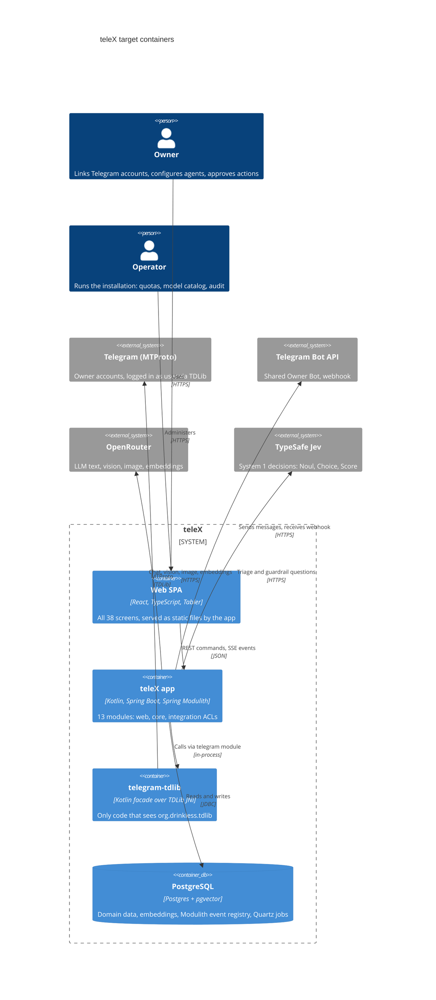

# Architecture map — teleX

> **Target foundation** (greenfield-bootstrap): the baseline `/sdd:scaffold` materializes, then every
> feature builds into. Produced by `survey` from the decisions in `docs/docs/01-tech-spec.md` plus the
> foundation session of 2026-09-30. At `reflects_commit` the repo holds only `README.md`; the staged
> `build-logic/` convention plugins and `gradle/libs.versions.toml` are the build foundation this map
> builds on. After scaffold, re-run `survey` to flip this map to `mode: current`.

## Stack

- Language / runtime: Kotlin 2.4.10 on JDK 25 (`gradle/libs.versions.toml` `[versions] java`, `kotlin`) — virtual threads for TDLib callbacks and LLM calls.
- Frameworks: Spring Boot 4.1 (Web + SSE, Security, Data JDBC), Spring Modulith 2.1, Spring AI 2.0 (`ChatClient`, tools, advisors, `VectorStore`), TypeSafe Jev via `spring-ai-starter-typesafe` 0.1.0, TDLib Java interface (JNI), Telegram Bot API (webhook), OpenRouter (OpenAI-compatible endpoint), Quartz (JDBC job store) — see [ADR-0001](adr/0001-kotlin-spring-modulith-postgres-react-stack.md), [ADR-0004](adr/0004-quartz-jdbc-scheduler.md).
- Frontend: React + TypeScript, Vite, TanStack Query, `@tabler/core` 1.6 + `@tabler/icons-react`, pnpm.
- Build: Gradle Kotlin DSL + version catalog; convention plugins in `build-logic/src/main/kotlin/` (configuration cache, build cache, parallel — `gradle.properties`).
- Build / test / lint:
  - `./gradlew build` — everything (backend compile + tests + lint, frontend `pnpm run build` + `pnpm run check` via `pnpm.conventions`).
  - `./gradlew test` — backend unit tests (no Docker, no Spring context except `ApplicationModules.verify()`).
  - `./gradlew integrationTest` — `@ApplicationModuleTest`, Testcontainers (Postgres + pgvector), WireMock (OpenRouter, Jev, Bot API fakes). Needs Docker.
  - `./gradlew spotlessCheck detekt` — ktlint + detekt; `./gradlew spotlessApply` to auto-format.
  - Frontend (inside `frontend/`): `pnpm run check` (tsc `--noEmit` + ESLint + Prettier check + Vitest), `pnpm run e2e` (Playwright, phone + desktop viewports — added with the first UI feature; not in the skeleton).

## C4 — system as it is

Target baseline (context + containers). Integration modules are the only place external systems are touched.

## Module inventory

Spring Modulith modules are direct sub-packages of `telex` in `backend/app` ([ADR-0002](adr/0002-single-app-with-isolated-tdlib-subproject.md)). Nothing exists yet — "Wired at" names the file scaffold creates.

| Module | Path | Layers | Wired at | Responsibility |
|---|---|---|---|---|
| web | `backend/app/src/main/kotlin/telex/web/` | api (REST, SSE), problem handler | `telex/web/package-info.java` | REST controllers, SSE stream, SPA hosting, RFC 9457 errors |
| identity | `backend/app/src/main/kotlin/telex/identity/` | domain / app / infra | `telex/identity/package-info.java` | Owner, passkeys, magic link, quotas, BYOK keys, consent |
| messaging | `backend/app/src/main/kotlin/telex/messaging/` | domain / app / infra | `telex/messaging/package-info.java` | Channel, Channel Set, message history, pgvector search |
| triage | `backend/app/src/main/kotlin/telex/triage/` | domain / app | `telex/triage/package-info.java` | System 1: local prefilter + Jev decision per event |
| agents | `backend/app/src/main/kotlin/telex/agents/` | domain / app / infra | `telex/agents/package-info.java` | Agent, Run, templates, `ChatClient`, memory |
| tools | `backend/app/src/main/kotlin/telex/tools/` | domain / app | `telex/tools/package-info.java` | Tool registry, Scope checks in code |
| tasks | `backend/app/src/main/kotlin/telex/tasks/` | domain / app / infra | `telex/tasks/package-info.java` | User Task, Approval (TTL), undo window, reminders |
| scheduling | `backend/app/src/main/kotlin/telex/scheduling/` | app / infra | `telex/scheduling/package-info.java` | Per-Owner cron on Quartz, `ScheduleFired` |
| audit | `backend/app/src/main/kotlin/telex/audit/` | domain / infra | `telex/audit/package-info.java` | Append-only log of agent and Owner actions |
| telegram | `backend/app/src/main/kotlin/telex/telegram/` | port + adapter | `telex/telegram/package-info.java` | ACL: Linked Account login, read/send, events from TDLib |
| llm | `backend/app/src/main/kotlin/telex/llm/` | port + adapter | `telex/llm/package-info.java` | ACL: OpenRouter, Model Profiles, cost, Budget |
| decision | `backend/app/src/main/kotlin/telex/decision/` | port + adapter | `telex/decision/package-info.java` | ACL: Jev decisions, guardrails, judge |
| bot | `backend/app/src/main/kotlin/telex/bot/` | port + adapter | `telex/bot/package-info.java` | ACL: shared Owner Bot, buttons, `/ai`, counter |
| shared (kernel, not a domain module) | `backend/app/src/main/kotlin/telex/shared/` | types only | `telex/shared/package-info.java` (`type = OPEN`) | `Uuid7` ids, problem codes, `Money` — no Spring beans |
| telegram-tdlib (Gradle subproject) | `backend/telegram-tdlib/` | facade | `backend/telegram-tdlib/build.gradle.kts` | Kotlin facade over TDLib; TDLib binding is an `implementation` dep, so `org.drinkless.tdlib.*` never reaches `backend/app`'s compile classpath |
| frontend (Gradle subproject) | `frontend/` | pages / components / api | `frontend/build.gradle.kts` (`pnpm.conventions`) | React SPA; build output copied into the app's `static/` |

Allowed dependencies (declared in each `package-info.java` via `@ApplicationModule(allowedDependencies = …)`): `web` → core modules; core modules → each other only through events or published APIs, and → integration modules' ports; integration modules → nothing in core (they publish events). Everything may use `shared`.

## Conventions (cited — the rules a new feature must match)

Greenfield: no code yet, so each line cites the file where scaffold (or the first feature) establishes the precedent.

- **Module wiring / registration:** a module = direct sub-package of `telex`; `package-info.java` with `@ApplicationModule(displayName, allowedDependencies)`; public API at the package root, everything else in `internal` sub-packages. Boundaries are enforced by `ApplicationModules.of(TelexApplication::class.java).verify()` — `backend/app/src/test/kotlin/telex/ModularityTest.kt`.
- **Build conventions:** subprojects apply a convention plugin, never raw plugins: `spring.kotlin.service.conventions` + `spring.modulith.conventions` + `spring.ai.conventions` + `kotlin.detekt.conventions` (app), `spring.kotlin.module.conventions` (telegram-tdlib), `pnpm.conventions` (frontend) — `build-logic/src/main/kotlin/`. Versions only in `gradle/libs.versions.toml`.
- **Error handling:** RFC 9457 Problem Details (`application/problem+json`) with extensions `code` (stable machine code, keys the UI message catalog) and `errors[]` (field errors); `type = urn:telex:error:<code>`. Domain errors are exceptions extending `ErrorResponseException`; one `@RestControllerAdvice` in `web` — `backend/app/src/main/kotlin/telex/web/ProblemHandler.kt`.
- **IDs:** app-generated UUIDv7 (`uuid` column), assigned before insert; typed per aggregate as `@JvmInline value class <Name>Id(val value: UUID)` — `backend/app/src/main/kotlin/telex/shared/Ids.kt`. See [ADR-0003](adr/0003-postgres-jdbc-flyway-uuidv7-persistence.md).
- **Persistence / DB access:** Spring Data JDBC repositories per aggregate inside the owning module's `internal` package; no cross-module table access or joins; pgvector in the same database. Each Owner-owned row carries `owner_id`, and every query filters on it — `backend/app/src/main/kotlin/telex/<module>/internal/`.
- **Migrations:** Flyway forward scripts `backend/app/src/main/resources/db/migration/V<yyyyMMddHHmm>__<snake_name>.sql`, each paired with a rollback `backend/app/src/main/resources/db/rollback/U<same-version>__<snake_name>.sql`; `MigrationRollbackIT` applies up → down → up on Testcontainers — `backend/app/src/integrationTest/kotlin/telex/MigrationRollbackIT.kt`. Baseline `V202609300000__baseline.sql` enables `vector` and creates the Modulith `event_publication` table.
- **Tests:** JUnit 5 + Kotlin. `src/test/kotlin` = unit tests (no Docker) + `ModularityTest`; `src/integrationTest/kotlin` = Gradle JVM Test Suite for `@ApplicationModuleTest`, Testcontainers, WireMock fakes (OpenRouter, Jev, Bot API); TDLib replaced by an in-memory fake of the `telegram` port. Test names in English. Frontend: Vitest next to the component, Playwright in `frontend/e2e/` at 360px and 1280px.
- **Inter-module communication:** Spring Modulith application events (`@ApplicationModuleListener`, JDBC event publication registry) — the event catalog lives in `docs/docs/01-tech-spec.md` §Architecture. Synchronous calls only to another module's public API — `backend/app/src/main/kotlin/telex/<module>/<Event>.kt`.
- **Security invariants (in code, never in prompts):** Scope checks in `tools`; consent + private-zone checks before any external AI call; every Run has an Owner, a Budget and an `audit` entry. Counterpart text is untrusted input, passed through guardrails.
- **CI:** one GitHub Actions workflow `.github/workflows/ci.yml` running `./gradlew build integrationTest` on JDK 25 + pnpm; any failure blocks merge.
- **UI / styling:** Tabler CSS classes + teleX design tokens, thin React wrappers per component C-01…C-41; no Bootstrap JS; English copy from one message catalog — `frontend/src/` (detail in §Frontend / UI foundation below).

## Datastores

| Store | Engine | Accessed via | Notes |
|---|---|---|---|
| Main DB | PostgreSQL + pgvector | Spring Data JDBC, Spring AI `VectorStore`, Flyway | One engine for domain data, embeddings, the Modulith event registry and Quartz `QRTZ_*` tables; `compose.yaml` at repo root runs it locally |
| TDLib session DBs | TDLib local files (SQLite inside) | `telegram-tdlib` facade only | One directory per Linked Account; encrypted with a per-Owner key (envelope encryption, AES-GCM) |

## Frontend / UI foundation

- **Component library / design system:** Tabler 1.6.1 (`@tabler/core`) with teleX components C-01…C-41; the reference implementation (46 React components exported on `window.TeleX`, one README + preview per component) is in `docs/docs/design-system/components/` — port each into `frontend/src/components/` as it is first used.
- **Design tokens:** light + dark themes in `docs/docs/design-system/tokens.json`; always tokens, never raw hex (`docs/docs/design-system/README.md` §Color).
- **Styling approach:** Tabler's CSS classes and CSS variables; no Tailwind, no CSS-in-JS — `docs/docs/design-system/README.md`.
- **Shared primitives:** AppShell, Button, Badge, Chip, Avatar, Icon, EmptyState, LoadState, SidePanel, StatusBanner, ConfirmDialog, DataTable — `docs/docs/design-system/components/<Name>/README.md`.
- **State / data-fetching:** TanStack Query for REST; one SSE client feeding query invalidation — `frontend/src/api/`.
- **Closest UI precedent:** screen mockups in `docs/teleX-screens/*.html` (Inbox, Chat, Builder, RunDetails, onboarding) and the Overview design in `docs/designs/scr-80-overview/`; screen and component inventory in `docs/docs/03-product-spec.md` §Screen inventory / §Components.

## Where things live / closest precedents

- A new backend feature → inside its owning module `backend/app/src/main/kotlin/telex/<module>/`, public API + events at the module root, the rest in `internal/`; modelled on the first module E01 builds (`identity`).
- A new external integration → behind a port in one of the four integration modules (`telegram`, `llm`, `decision`, `bot`), with a WireMock or in-memory fake in `src/integrationTest`.
- A new schema change → staged by `/sdd:data-model` under `docs/features/<slug>/migrations/`, promoted by `implement` into `db/migration` + `db/rollback`.
- A new screen / UI component → composed from the design system (§Frontend), under `frontend/src/pages/` and `frontend/src/components/`, modelled on the matching `docs/teleX-screens/<Screen>.html` mockup.

## Constraints & known tech-debt

- **Scaffold vs E01 boundary:** scaffold delivers the 13 empty modules + `verify()`, CI, `compose.yaml` with Postgres + pgvector, Flyway baseline, React build served by Spring (E01 features 1–4 as infrastructure). E01 still owns sign-up and sign-in (AC-34, AC-35), the one-command README (AC-33) and its DoD checks (CI fails on a deliberate lint violation, passkeys in Chrome + Safari).
- **TDLib JNI for JDK 25 is unproven** — tech-spec risk; the binding + native `libtdjni` Docker build is a spike at the start of E02. Until then `telegram-tdlib` holds only the facade interface.
- **Jev is early access** — the `decision` port must keep a fallback adapter (cheap LLM with structured output).
- **Pre-release tooling:** detekt `2.0.0-alpha.6` (API or rule changes possible).
- **`pnpm.conventions` depends on the root `:pnpmInstall` task** — added by scaffold in the root `build.gradle.kts`, with `pnpm-workspace.yaml` + root `package.json` (`packageManager` pins pnpm).
- **TypeScript pinned to 6.x** — typescript-eslint does not support TypeScript 7 yet.
- **Telegram ToS / ban risk:** default Autonomy Level is `draft`; send paths honour `FLOOD_WAIT` and rate limits.
- **Scheduler tables:** Quartz `QRTZ_*` tables come in with E20 as a Flyway migration (`spring.quartz.jdbc.initialize-schema=never`).

## Reconciliation with the authored architecture doc

No `docs/architecture.md`. The authored sources are `docs/docs/01-tech-spec.md` (stack, 13 modules, events, three architectural rules) and root `CLAUDE.md`. This map follows them without change, with these additions from the foundation session: the `telegram-tdlib` Gradle subproject (ADR-0002), the `shared` kernel package (not counted among the 13 modules), UUIDv7 ids + Flyway rollback files (ADR-0003), Quartz picked over JobRunr (ADR-0004), RFC 9457 errors, and the `integrationTest` source set. The root package is `telex`.
