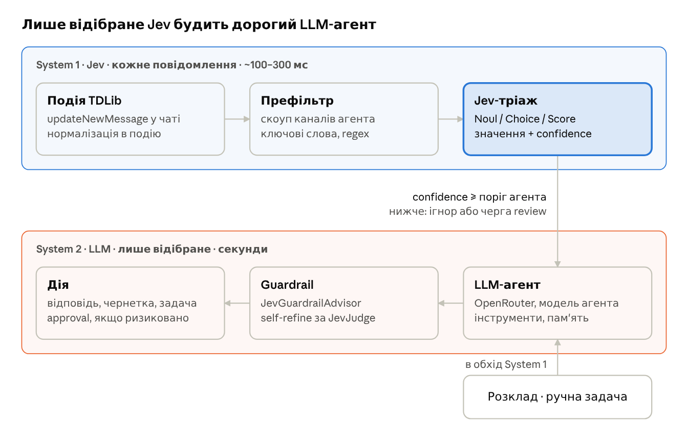
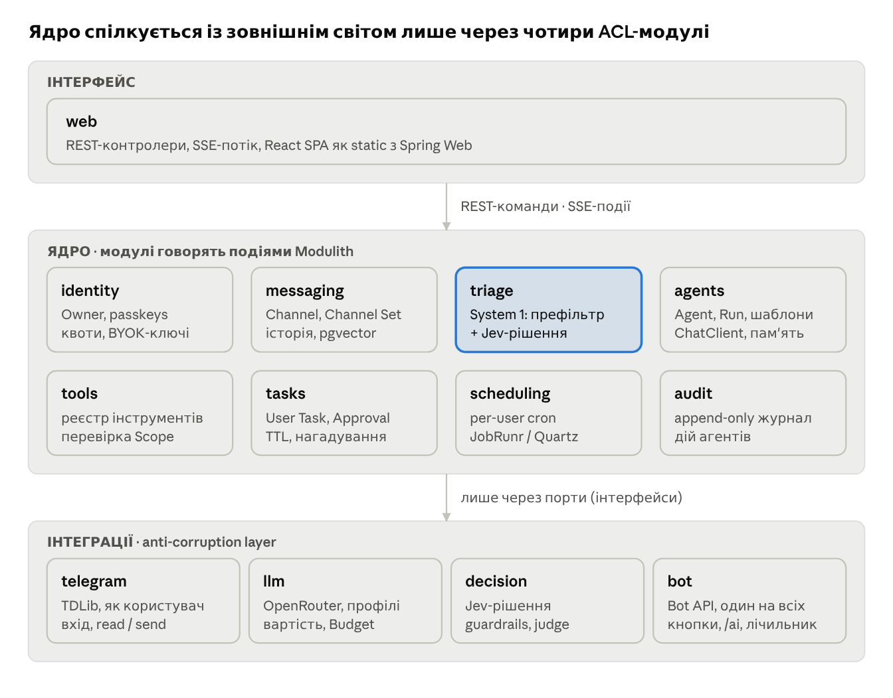
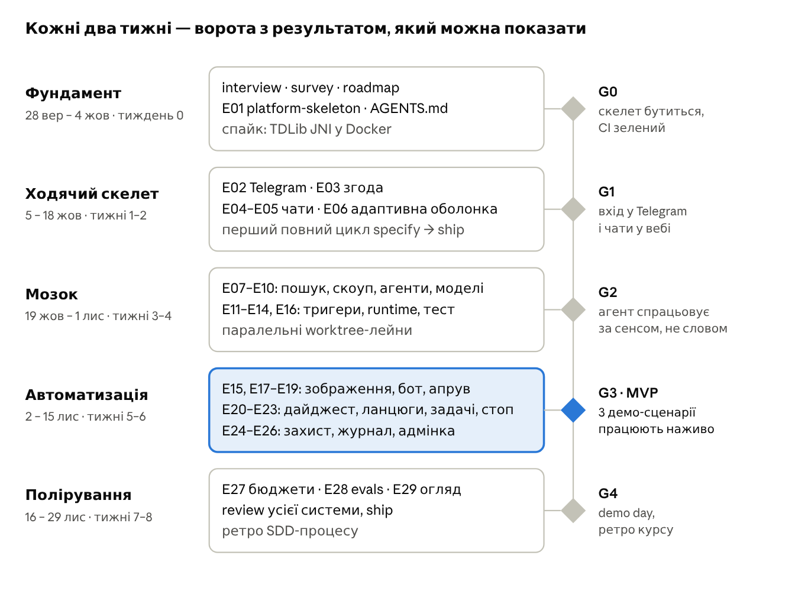

# teleX — AI-агенти всередині Telegram

Sep 28, 2026 · @Anton Husiev

## TL;DR

**teleX** — мультикористувацький веб-клієнт Telegram, у якому кожен користувач має власну «команду» AI-агентів, що працюють від його імені всередині його акаунта. Агент — це конфігурація: *модель* + *інструменти* + *скоуп каналів* + *тригери* + *бюджет*. Він прокидається від ключового слова, змісту повідомлення, розкладу або ручної задачі й робить корисне: підсумовує, відповідає, пересилає, витягує задачі, генерує картинки.

Серцевина — архітектура **System 1 / System 2**: кожне вхідне повідомлення спершу за \~100–300 мс і частки цента проходить через Jev (TypeSafe Decision API) — класифікація, маршрутизація, guardrails. Лише те, що пройшло цей «швидкий мозок», будить дорогий LLM-агент через OpenRouter.

Мета навчальна: за 8 тижнів пройти повний Spec-Driven Development цикл (idea → spec → design → tasks → TDD → review → ship) курсу [genkovich/sdd](https://github.com/genkovich/sdd), використовуючи Claude Max і Codex як виконавців, а специфікації — як єдине джерело правди.

**Три демо-сценарії, заради яких усе будується:**

1. *Ранковий дайджест* — о 08:00 агент збирає 40 непрочитаних каналів у 1 повідомлення з топ-5 тем і посиланнями на першоджерела.
2. *Вартовий* — у робочих чатах агент ловить «терміново / прод впав / @anton» за змістом, а не лише за словом, і пише власнику в чат із ботом teleX.
3. *Секретар* — «нагадай / зробимо до п'ятниці» у будь-якому діалозі перетворюється на задачу з дедлайном і апрувом від користувача.

## Idea brief

Цей розділ — чернетка для `docs/idea-brief.md` (крок `/sdd:interview`), у тій самій восьмисекційній структурі.

**Проблема.** Активний користувач Telegram сидить у 50–300 чатах і каналах. Важливе (згадка, дедлайн, інцидент, промокод) тоне в шумі. Telegram має лише ботів, які не бачать особисті діалоги і не можуть читати канали без адмін-прав.

**Користувачі.**

- *Owner* — власник Telegram-акаунта, підключає його до teleX і конфігурує агентів.
- *Operator* — адміністратор інсталяції: квоти, каталог моделей, аудит, блокування.
- *Counterpart* — будь-хто в Telegram, хто пише Owner'у; не користувач teleX, але його дані проходять через систему.

**Why now.** TypeSafe Jev (вересень 2026) робить фундаментально дешевим тріаж кожного повідомлення: $0.042 за 1M вхідних токенів, вихід безкоштовний, 70–500 мс. Раніше «читати все моделлю» коштувало б долари на день на користувача. Плюс `spring-ai-typesafe` 0.1.0 дає готові `JevGuardrailAdvisor`, `JevSelfRefineAdvisor`, `JevToolIndex`.

**Цінність.** Агент бачить те саме, що й людина (вхід як user через TDLib), але діє лише в межах явно дозволеного скоупу й бюджету.

**Out of scope (MVP).**

- Нативні мобільні застосунки — лише адаптивний веб.
- Дзвінки, секретні чати, сторіс — TDLib їх підтримує, але це шум для курсу.
- Масові розсилки та будь-який «гроус-хакінг» — прямий шлях до бану акаунта.
- Маркетплейс агентів між користувачами — лише персональні та системні шаблони.

**Ризики верхнього рівня.** ToS Telegram щодо user-автоматизації; безпека чужих сесій; вартість LLM; Jev у early access. Детально — у розділі NFR і ризики.

**Рекомендація.** Будувати як модульний моноліт з одним вертикальним зрізом у тиждень 2 (логін → список чатів → один агент на ключове слово), далі нарощувати типи тригерів і інструментів.

## Концепція: System 1 / System 2

Ідея з «Thinking, Fast and Slow» стає архітектурним принципом: **Jev вирішує, LLM генерує.** Jev ніколи не пише текст — лише типізовані відповіді з каліброваною впевненістю. LLM ніколи не вирішує, чи його запускати.



Подія з Telegram проходить дешевий локальний префільтр і Jev-тріаж; лише впевнене «так» будить LLM-агента, а його відповідь ще раз перевіряє Jev перед дією.

**Де саме Jev працює в teleX:**

| Місце | Примітив / компонент | Приклад питання |
| --- | --- | --- |
| Семантичний тригер | `Noul` | «Це прохання до власника щось зробити до дедлайну?» |
| Маршрутизація між агентами | `Choice` + `Noul` «жоден» | «Який агент має обробити?» |
| Пріоритет / терміновість | `Score` | «Наскільки терміново: спокійно → пожежа» |
| Вибір інструментів агента | `JevToolIndex` | динамічне виявлення tools замість усіх 30 у промпті |
| Вхід / вихід агента | `JevGuardrailAdvisor` | prompt injection з чужого повідомлення, витік даних |
| Якість підсумку | `JevJudge` + `JevSelfRefineAdvisor` | «Кожне твердження має джерело в каналі?» |
| RAG по історії чатів | `JevDocumentFilter` / `Reranker` | відсіяти нерелевантне перед контекстом |

Ключове правило з [блогу Spring](https://spring.io/blog/2026/09/21/spring-ai-typesafe-structured-judgment): **confidence — це не якість, а рішення про маршрут.** Низька впевненість = «не діяти без людини», тому в teleX вона веде до черги review, а не до відмови.

## Глосарій

Заготовка для `CONTEXT.md` (`/sdd:glossary`). Шаблон спеки курсу вимагає, щоб ролі в user stories бралися лише звідси — жодних абстрактних `user`/`admin`.

| Термін | Визначення |
| --- | --- |
| **Owner** | Роль. Людина з акаунтом teleX, що підключила один або кілька Telegram-акаунтів. |
| **Operator** | Роль. Адмініструє інсталяцію: квоти, каталог моделей, аудит. Не бачить вміст чужих чатів. |
| **Counterpart** | Роль. Співрозмовник Owner'а в Telegram; не користувач teleX. |
| **Linked Account** | Telegram-акаунт, прив'язаний до Owner'а; має власний TDLib-клієнт і зашифровану базу сесії. |
| **Channel** | Узагальнене джерело: приватний чат, група, супергрупа, канал, топік форуму. |
| **Channel Set** | Іменований набір Channel'ів («Робота», «Новини AI»); може бути статичним або за правилом (папка Telegram, тип, тег). |
| **Agent** | Збережена конфігурація: інструкція + Model Profile + Tools + Scope + Triggers + Budget + Autonomy Level. |
| **Agent Template** | Готовий шаблон агента (Дайджест, Вартовий, Секретар, Перекладач). |
| **Scope** | Межа доступу агента: які Channel'и він може читати і в які може писати (окремо). |
| **Trigger** | Умова запуску Run: Keyword, Semantic, Schedule, Event, Manual, Chain. |
| **Run** | Одне виконання агента: вхід, кроки, виклики інструментів, вартість, результат. |
| **Triage** | Рішення System 1 (Jev) про подію: варто запускати Run чи ні, з confidence. |
| **Tool** | Дія, яку агент може викликати: читати історію, надіслати, переслати, створити задачу, згенерувати зображення. |
| **Autonomy Level** | `observe` (лише нотатки) · `draft` (чернетки на апрув) · `act` (діє сам у межах Scope). |
| **Approval** | Запит на підтвердження дії Owner'ом; має TTL і стани pending → approved / rejected / expired. |
| **User Task** | Задача Owner'а (витягнута агентом або створена вручну) з дедлайном і посиланням на джерело. |
| **Model Profile** | Іменований вибір моделей OpenRouter для text / vision / image з fallback-ланцюжком і лімітом ціни. |
| **Budget** | Ліміт витрат у USD на Run / день / місяць на рівні Agent і Owner. |
| **Digest** | Підсумок набору Channel'ів за період з посиланнями на першоджерела. |
| **Delivery Target** | Куди агент віддає результат: чат власника з ботом teleX (за замовчуванням), визначений чат, веб-інбокс teleX. |

**Owner Bot** — один спільний Telegram-бот інсталяції. Служить каналом сповіщень і команд для Owner'а (апруви кнопками, `/ai`, лічильник Інбоксу). Прив'язується до Owner'а через Start із одноразовим токеном; стороннім користувачам не відповідає. **Undo Window** — 10 секунд після «Відправити», протягом яких відправку можна скасувати. **Consent** — згода Owner'а на передачу текстів чатів зовнішнім AI-сервісам; без неї жоден Agent не вмикається.

## Технологічний стек

Зафіксоване вами — жирним; решта — мої пропозиції, кандидати в ADR на етапі `/sdd:design`.

| Шар | Вибір | Навіщо / примітка |
| --- | --- | --- |
| Рантайм | **JDK 25+** | virtual threads для сотень TDLib-колбеків і LLM-викликів, scoped values для контексту Owner'а |
| Мова | **Kotlin 2.4.10+** | coroutines-містки над callback-API TDLib |
| Фреймворк | **Spring Boot 4.1+** | Spring Web (REST + SSE), Security, Data JDBC |
| Модульність | **Spring Modulith** | межі модулів, `@ApplicationModuleListener`, event publication registry, документація C4 |
| AI-абстракція | **Spring AI** | `ChatClient`, tools, advisors, chat memory, `VectorStore` |
| LLM-доступ | **OpenRouter** | OpenAI-сумісний endpoint; один ключ — text, vision, image, embeddings; вибір моделі пер агент |
| Рішення | **TypeSafe Jev** через `spring-ai-starter-typesafe` 0.1.0 | Noul / Choice / Score, готові advisors |
| Telegram | **TDLib Java Interface** (JNI `tdjni`) | вхід як user; збирати нативну бібліотеку в Docker-образі; `api_id` / `api_hash` з my.telegram.org |
| Фронтенд | **React + TypeScript** | Vite, TanStack Query, Tailwind; збирається Gradle-таскою й роздається як static з Spring Web |
| Реалтайм | SSE | нові повідомлення, статус Run, апруви; команди — REST |
| Сховище | PostgreSQL + pgvector, Flyway | один двигун для даних, подій Modulith і ембедінгів |
| Планувальник | JobRunr або Quartz (JDBC) | per-user cron, що переживає рестарт; `@Scheduled` не підходить |
| Автентифікація | Spring Security: passkeys (WebAuthn) + email magic link | без паролів |
| Секрети | envelope encryption (AES-GCM, ключ на Owner'а) | ключ бази TDLib, OpenRouter-ключі BYOK |
| Якість коду | **detekt, ktlint**; ESLint + Prettier, `tsc --noEmit` | у per-task gate двигуна `implement` (`gate_lint`, `gate_vet`) |
| Тести | JUnit, `@ApplicationModuleTest`, Testcontainers, WireMock, Vitest, Playwright | WireMock — фейки OpenRouter і Jev; TDLib — за портом з in-memory фейком |
| Спостережуваність | Micrometer + OpenTelemetry, Spring AI observations | токени, вартість і latency на кожен Run |
| Збірка / CI | Gradle Kotlin DSL + version catalog, GitHub Actions, Docker Compose | один `docker compose up` для демо |

**Бот власника (додано 29 вересня):** Telegram Bot API через webhook — один спільний бот на інсталяцію; апруви інлайн-кнопками, закріплене повідомлення-лічильник, команди `/ai`. Веб — повністю адаптивний (mobile-first брейкпойнти для всіх 38 екранів з інвентаря продуктової спеки; Playwright-тести в двох розмірах вікна).

**UI-кит і мова (додано 30 вересня):** візуальна основа — [Tabler](https://github.com/tabler/tabler) (MIT, Bootstrap всередині): `@tabler/core` для CSS і тем, `@tabler/icons-react` для іконок. Офіційних React-компонентів у Tabler немає, тому C-01…C-37 — власні тонкі React-обгортки над класами Tabler (без Bootstrap JS). Мова вебу й бота — англійська; усі рядки в одному каталозі повідомлень. Дизайн робить Claude Design, посилання на макети входять у `screens.md` кожного епіка.

## Архітектура

Модульний моноліт на Spring Modulith: 13 модулів, які спілкуються подіями, а зовнішні системи (Telegram як користувач, Telegram Bot API, OpenRouter, Jev) сховані за чотирма ACL-модулями. `ApplicationModules.verify()` у тестах робить межі машинно перевірюваним контрактом — ідеальний гейт для агентів-виконавців, які люблять «срізати кути».



Кожен модуль ядра залежить лише від портів інтеграцій, тому TDLib, OpenRouter і Jev підміняються фейками в `@ApplicationModuleTest`.

**Ключові доменні події** (передумова для `events.md` у `/sdd:api`):

| Подія | Публікує | Слухає |
| --- | --- | --- |
| `AccountLinked` / `AccountUnlinked` | telegram | messaging, agents, audit |
| `ConsentGranted` / `ConsentRevoked` | identity | agents (вмикання / зупинка), audit |
| `OwnerBotLinked` / `OwnerBotBlocked` | bot | identity, web |
| `MessageReceived` | telegram | messaging, triage, web (SSE) |
| `MessageEdited` / `MessageDeleted` | telegram | messaging |
| `TriageDecided` (accepted / review / ignored) | triage | agents, web, bot (сумніви), audit |
| `ScheduleFired` | scheduling | agents |
| `RunStarted` / `RunCompleted` / `RunFailed` | agents | web, audit, llm (бюджет), bot (результати) |
| `ToolInvoked` | tools | audit |
| `ApprovalRequested` | tasks | web, bot |
| `ApprovalResolved` (канал: web / bot) | tasks | agents, web, bot (синхронізація кнопок) |
| `SendScheduled` / `SendCancelled` (undo 10 с) | tasks | telegram, web, bot |
| `OwnerCommandReceived` (`/ai`, stop, resume, inbox) | bot | agents, tasks |
| `UserTaskCreated` / `UserTaskDue` | tasks | web, bot (нагадування) |
| `BudgetExceeded` | llm | agents (зупинка), web, bot |

**Три архітектурні правила (кандидати в constitution):**

1. Жоден модуль, окрім `telegram`, не імпортує `org.drinkless.tdlib.*`.
2. Кожен виклик інструменту проходить перевірку Scope у `tools`, а не в промпті.
3. Кожен Run має Owner, бюджет і запис у `audit` — без винятків.

## Модель агента

Агент — декларативна конфігурація, яку Owner створює в UI (або імпортує як YAML). Вся «розумність» живе в трьох місцях: тригер вирішує *коли*, інструкція вирішує *що*, Scope і Autonomy Level вирішують *де і наскільки самостійно*.

```yaml
agent: deadline-secretary
template: secretary
instruction: >
  Коли хтось просить мене щось зробити з терміном — створи задачу
  з дедлайном і посиланням на повідомлення. Не відповідай за мене.
model_profile: cheap-fast          # text: дешева модель, fallback — середня
scope:
  read:  [set:work, set:family]
  write: [owner-bot]     
triggers:
  - type: semantic
    question: "Це прохання до власника щось зробити до певного часу?"
    when_true: "Є прохання і явний або неявний термін"
    when_false: "Просто інформація або без терміну"
    threshold: 0.75
    review_band: [0.4, 0.75]
  - type: schedule
    cron: "0 18 * * FRI"            # п'ятничний підсумок задач
tools: [read_history, create_user_task, send_message]
autonomy: draft                     # observe | draft | act
budget: { per_run_usd: 0.02, per_day_usd: 0.50 }
guardrails: [default, no-pii-forwarding]
```

**Типи тригерів:**

| Тип | Що перевіряє | Ціна | Приклад |
| --- | --- | --- | --- |
| Keyword | слова / regex, локально | 0 | «промокод», `#urgent` |
| Semantic | Jev `Noul` / `Choice` по змісту | частки цента | «хтось злиться на мене» |
| Hybrid | keyword як префільтр → Jev як підтвердження | мінімальна | «прод» + «це справжній інцидент?» |
| Schedule | cron у таймзоні Owner'а | — | дайджест о 08:00 |
| Event | системна подія | — | `UserTaskDue`, новий учасник у групі |
| Manual | кнопка в UI або команда `/ai` у чаті з ботом | — | «підсумуй цей чат за тиждень» |
| Chain | `RunCompleted` іншого агента | — | дайджест → перекладач |

**Каталог інструментів (Spring AI `@Tool`):**

| Інструмент | Ризик | Мінімальний Autonomy для дії без апруву |
| --- | --- | --- |
| `list_channels`, `read_history`, `search_messages` (повнотекст + семантика) | читання | observe |
| `describe_image` (vision) | читання | observe |
| `create_user_task`, `add_note` | внутрішній запис | draft |
| `send_message` власнику через бота | запис собі | draft |
| `send_message` / `reply` у чужий чат | видимий Counterpart'у | act |
| `forward_message`, `pin_message`, `mark_read` | видимий іншим | act |
| `generate_image` (OpenRouter image model) | вартість | draft + бюджет |
| `ask_owner` (запитати уточнення) | — | observe |

**Вибір моделі.** Model Profile задає три слоти — `text`, `vision`, `image` — кожен зі списком fallback і стелею ціни. Каталог моделей тягнеться з OpenRouter `/models` і кешується. Додатково — «каскад»: спершу дешева модель, `JevJudge` оцінює відповідь, і лише на провал — дорожча.

**Захист від чужих повідомлень.** Текст Counterpart'а — це недовірені дані: його обгортають маркерами, перевіряють вхідною батареєю `JevGuardrailAdvisor` (jailbreak), а будь-яка дія на рівні `act` перевіряється системою ще раз — поза LLM.

## Епіки та user stories

**29 епіків (19 × S, 10 × M), 44 історії, 83 AC** — у вкладці Епіки. У кожного епіка — цінність, список фіч, AC і власний DoD. Головне правило спільного DoD: **епік закривається лише тоді, коли всі заявлені в ньому фічі реалізовані повністю**; винести фічу можна лише через явну зміну спеки й новий епік.

| Фаза | Епіки | Ворота |
| --- | --- | --- |
| Фундамент | E01 platform-skeleton | G0 |
| Ходячий скелет | E02 telegram-link · E03 ai-consent · E04 chat-reading · E05 chat-sending · E06 app-shell-responsive | G1 |
| Мозок | E07 semantic-search · E08 channel-scope · E09 agent-builder · E10 model-profiles · E11 keyword-triggers · E12 semantic-triggers · E13 review-queue-and-why · E14 agent-runtime · E16 backtest | G2 |
| Автоматизація | E15 multimodal · E17 owner-bot · E18 approvals-undo · E19 bot-commands · E20 schedules-digest · E21 agent-chains · E22 user-tasks · E23 kill-switch · E24 guardrails · E25 audit-log · E26 operator-console | G3 · MVP |
| Полірування (stretch) | E27 cost-control · E28 trigger-evals · E29 metrics-overview | G4 |

## Roadmap на 8 тижнів

MVP (три демо-сценарії наживо) — до Nov 15, 2026; останні два тижні — буфер, stretch-епіки та ретро. Дати — орієнтир для вас; у `docs/roadmap.md` курсу дат немає, лише порядок і хвилі.



За кожні два тижні — ворота з видимим результатом; якщо G1 зсувається, першим скорочується E10–E11, а не тести чи спеки.

**Як епік проходить флоу курсу** (на прикладі E12):

```text
/sdd:classify-size semantic-triggers  # M → route: standard
/sdd:specify       semantic-triggers  # spec.md: US-17, AC-11, AC-13..15; фічі 1–6 з картки E12
/sdd:clarify       semantic-triggers  # devils-advocate: що таке «поріг», «смуга сумніву»?
/sdd:ux-flows      semantic-triggers  # флоу редактора умови в конструкторі
/sdd:design        semantic-triggers  # SAD + ADR: «один Jev-виклик на подію для всіх агентів»
/sdd:sequences     semantic-triggers
/sdd:data-model    semantic-triggers  # trigger_question, triage_decision
/sdd:api           semantic-triggers  # openapi + events.md (TriageDecided)
/sdd:screens       semantic-triggers
/sdd:tasks         semantic-triggers  # tasks.json DAG
/sdd:plan-tests    semantic-triggers  # WireMock-фейк Jev, контрактні тести
/sdd:implement     semantic-triggers  # TDD: test-author → implementer → gate (ktlint, detekt)
/sdd:review        semantic-triggers  # перевірка спільного DoD + DoD епіка
/sdd:ship          semantic-triggers
```

**Розподіл ролей між агентами-виконавцями:**

| Роль у флоу | Claude Max | Codex | Чому |
| --- | --- | --- | --- |
| specify / clarify / design (Socratic) | ✓ |  | нативний плагін, `AskUserQuestion`, субагенти critic / devils-advocate |
| implement (test-author + implementer) | ✓ | ✓ | паралельні worktree-лейни з `tasks.json`; Codex — на ізольовані задачі (фронтенд, адаптери) |
| review |  | ✓ | незалежна модель рев'юїть код іншої — чесний clean-context |
| fix / рефакторинг | ✓ | ✓ | за завантаженістю лімітів |

**Пропозиції для `.claude/sdd.local.md`:** `artifact_language: uk`, `gate_lint: true` (ktlint + ESLint), `gate_vet: true` (detekt + `tsc`), `require_integration: auto` (Testcontainers), `isolation: worktree`, `max_parallel_agents: 2`.

## NFR, ризики, невизначене

**Нефункціональні вимоги** (чернетка для §6 спек):

| Код | Вимога | Ціль |
| --- | --- | --- |
| NFR-01 | Затримка тріажу (від події TDLib до рішення) | p95 ≤ 800 мс |
| NFR-02 | Нове повідомлення з'являється у вебі | p95 ≤ 2 с |
| NFR-03 | Вартість System 1 на активного Owner'а (\~3 000 повідомлень / день) | ≤ $0.05 / день |
| NFR-04 | Одночасні Linked Account на інстанс (4 vCPU / 8 GB) | ≥ 50 |
| NFR-05 | Сесії TDLib і секрети в спокої | зашифровані ключем на Owner'а |
| NFR-06 | Повторна доставка подій після рестарту | без втрат (event publication registry) |
| NFR-07 | Покриття AC тестами | 100% AC → ≥ 1 тест (`plan-tests`) |
| NFR-08 | Статичний аналіз | 0 попереджень detekt / ktlint у main |

**Ризики:**

| Ризик | Ймовірність | Вплив | Пом'якшення |
| --- | --- | --- | --- |
| Telegram обмежує або банить акаунт за автоматизацію | середня | високий | тестові акаунти; rate-limit на відправку; повага до FLOOD\_WAIT; дефолтний Autonomy `draft` |
| Збірка TDLib JNI для JDK 25 з'їдає тиждень | середня | середній | спайк у тиждень 0; готовий Docker-образ з `libtdjni`; TDLib схований за портом |
| Jev у early access: доступ, ліміти, зміни API | середня | середній | порт `DecisionService` із fallback-адаптером на дешевій LLM (структурований вивід) |
| Сервіс Jev у США → додаткова затримка з Європи | висока | низький | батчінг питань усіх агентів в один виклик (AC-14) |
| Prompt injection через чужі повідомлення | висока | високий | вхідна й вихідна батареї guardrails; Scope у коді, не в промпті; `act` лише за явним вибором |
| Дані Counterpart'ів йдуть у зовнішні моделі | висока | середній | приватна зона (E3), прозорий список провайдерів, вибір моделей з zero-retention в OpenRouter |
| Агенти-виконавці «дрейфують» від спек | середня | середній | `ApplicationModules.verify()`, detekt-правила заборон імпортів, drift-check у `/sdd:api`, незалежний review |
| Витрати на LLM під час розробки | середня | низький | WireMock-фейки в тестах; бюджет на dev-ключ OpenRouter |

**Not yet specified** (туман — стане кроками roadmap після розвідки):

| Область | Що треба дізнатися | Як загострити |
| --- | --- | --- |
| Пам'ять агента між Run | чи потрібна довга пам'ять про Counterpart'ів і як її обмежити | спайк з Spring AI chat memory у фазі «Мозок» |
| Голосові повідомлення | чи транскрибувати через OpenRouter, чи вистачить Telegram Premium-транскрипції | один експеримент, потім рішення |
| MCP-інструменти | чи давати агентам зовнішні MCP-сервери (календар, Notion) | після G3, якщо залишиться час |
| Тарифікація для multi-user | хто платить за LLM: Operator чи кожен Owner (BYOK) | розмова з автором курсу про рамки проєкту |

**Джерела**

- [Spring AI and TypeSafe Jev: Fast, Cheap, Structured Decisions](https://spring.io/blog/2026/09/21/spring-ai-typesafe-structured-judgment) — Spring blog, 21 вересня 2026
- [Introducing System One Models & Jev](https://typesafe.ai/blog/introducing-system-one-models-and-jev) — TypeSafe AI, 15 вересня 2026
- [genkovich/sdd](https://github.com/genkovich/sdd) — SDD-плагін курсу: агенти, скіли, шаблони spec / roadmap / epic
- [TDLib Java Interface](https://core.telegram.org/tdlib/Java_Interface) — Telegram
