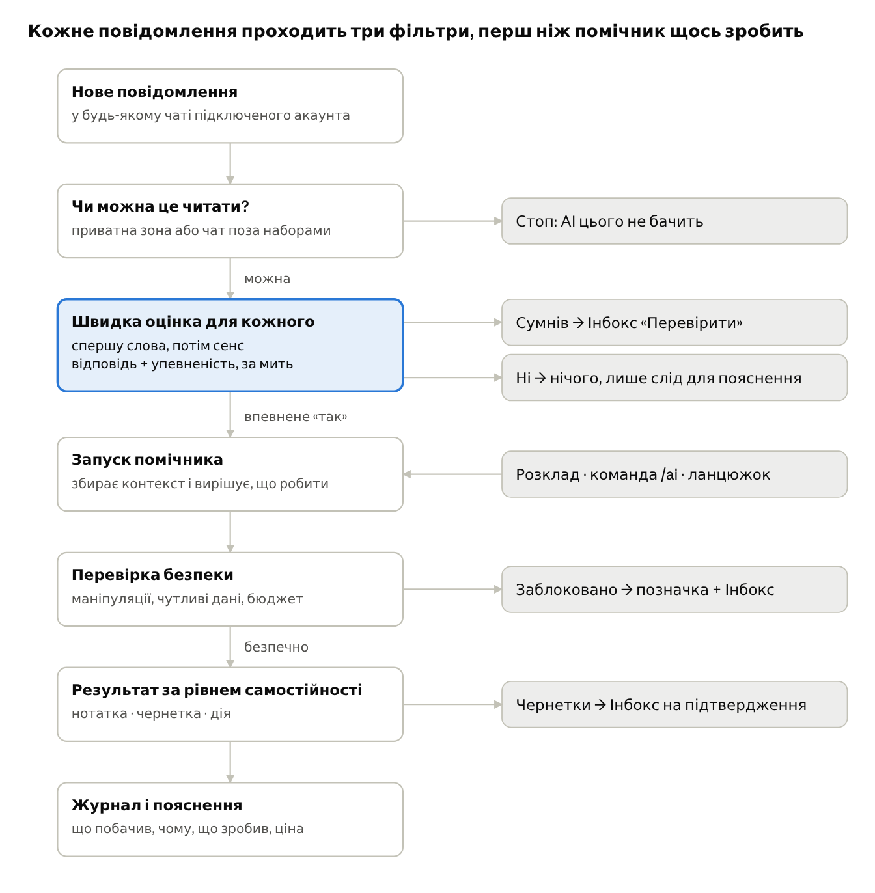
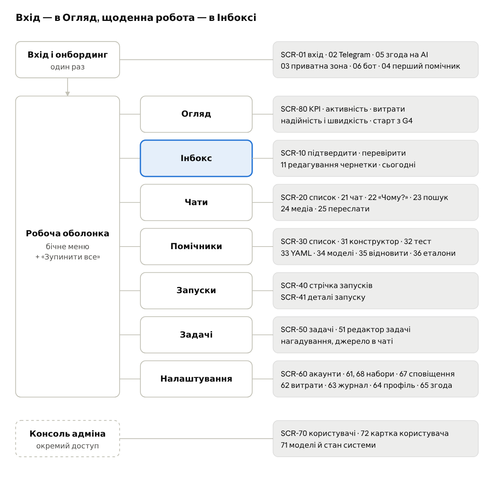
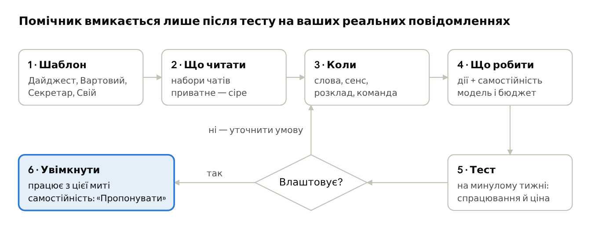
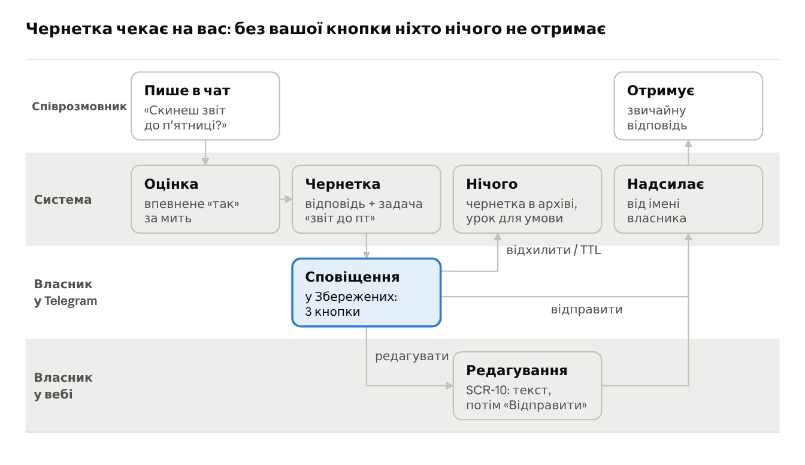

# teleX — продуктова специфікація: UX і флоу

Sep 29, 2026 · @Anton Husiev

## Продукт і принципи

**teleX — це Telegram, у якому працює ваша власна команда AI-помічників.** Людина підключає свій звичайний Telegram-акаунт, бачить у вебі ті самі чати і задає помічників: що їм читати, коли прокидатися, що робити і чи питати дозволу. Помічники підсумовують, стежать, витягують задачі, готують чернетки відповідей і звітують туди, де людина вже є, — у Telegram.

Документ описує поведінку без технологій: що бачить людина, що вона робить і що в цей час відбувається в системі. Технічний дизайн — в окремому документі.

**UX-принципи** (кожне рішення в UI перевіряється на них):

1. **Тиша за замовчуванням.** Помічник пише людині лише тоді, коли це варто уваги. Краще одне зведення, ніж десять сповіщень.
2. **Нічого від вашого імені без вашого відома.** Будь-яка дія, яку побачать інші люди, за замовчуванням йде на підтвердження. Самостійність вмикається явно, по одному помічнику.
3. **Кожне рішення пояснюване.** На будь-яке «чому він це зробив?» або «чому мовчав?» є відповідь у два кліки.
4. **Сумнів — спитай.** Якщо система не впевнена, чи ситуація варта реакції, вона не вгадує, а кладе випадок у чергу «перевірити».
5. **Приватне залишається приватним.** Чати, позначені як приватні, не бачить жоден помічник — незалежно від будь-яких інших налаштувань.
6. **Витрати видимі та обмежені.** Людина завжди знає, скільки коштує кожен помічник, і жоден не може вийти за бюджет.
7. **Telegram — перший екран, веб — пульт керування.** Щоденні дії (зведення, підтвердження, команди) мають працювати без відкриття вебу; веб — для налаштувань і розслідувань.

## Персони

Три ролі та чотири типові власники. Саме власники визначають, які екрани потрібні.

| Роль | Хто це | Що бачить |
| --- | --- | --- |
| **Власник** | людина, яка підключила свій Telegram | усе своє: чати, помічників, запуски, витрати |
| **Адміністратор** | веде інсталяцію | користувачів, квоти, сумарні витрати, стан системи; **жодного вмісту чатів** |
| **Співрозмовник** | будь-хто в Telegram, хто пише власнику | teleX не бачить; бачить лише відповіді власника (які могли бути написані помічником) |

**Типові власники:**

- **Олена, техлід.** 40 робочих чатів, згадки губляться. Хоче «вартового», який ловить інциденти та прохання до неї, і п'ятничне зведення обіцяного. Самостійні відповіді — ніколи.
- **Андрій, читач каналів.** 150 каналів про AI, крипту, новини. Хоче ранковий дайджест без дублів і з посиланнями на першоджерела.
- **Марія, малий бізнес.** Приймає замовлення в особистих повідомленнях. Хоче чернетки відповідей на типові питання і задачу на кожне замовлення. Готова дозволити самостійні відповіді на «який графік роботи».
- **Сергій, адмін спільноти.** Велика група і канал. Хоче щотижневий пост-підсумок обговорень із згенерованою обкладинкою — після свого підтвердження.

**Контексти використання:** телефон у дорозі (бот у Telegram: зведення, кнопки, команди; увесь веб також адаптивний) · ноутбук зранку (веб: інбокс, перегляд запусків) · рідкі сесії налаштувань (веб: конструктор помічників, набори чатів).

## Ментальна модель

Користувачу достатньо тримати в голові вісім понять. Вся навігація UI будується навколо них, і ті самі слова використовуються в текстах інтерфейсу.

| Поняття в UI | Що це для людини | Приклад |
| --- | --- | --- |
| **Акаунт** | підключений Telegram; їх може бути кілька | «Особистий +380…», «Робочий» |
| **Чат** | будь-яка розмова: людина, група, канал, тема форуму | «Бекенд-команда» |
| **Набір чатів** | іменована група чатів, яку можна дати помічнику | «Робота», «Новини AI» |
| **Приватна зона** | чати, яких AI не торкається ніколи | «Сім'я», лікар |
| **Помічник** | налаштований AI-агент: що читати, коли діяти, що робити, наскільки самостійно | «Вартовий», «Ранковий дайджест» |
| **Умова** | коли помічник прокидається: слова, сенс, розклад, подія, команда | «хтось просить мене про щось термінове» |
| **Запуск** | один раз, коли помічник працював: що побачив, що зробив, скільки коштувало | «Вартовий · 14:02 · $0.004» |
| **Інбокс** | одне місце для всього, що чекає людину: підтвердити, перевірити, задачі | 3 чернетки, 2 «сумнівні», 5 задач |

**Самостійність помічника — три рівні**, як перемикач у його картці:

- **Спостерігати** — лише нотатки та зведення для власника, нічого назовні.
- **Пропонувати** (за замовчуванням) — готує чернетки, власник натискає «Відправити».
- **Діяти** — сам надсилає в межах дозволених чатів. Відкривається лише після 20 підтверджених чернеток без правок, має денний ліміт відправок і 10 секунд на скасування; чутливі випадки все одно йдуть на підтвердження.

## Під капотом

Система бачить кожне повідомлення, але до «розумної» (дорогої й повільної) частини доходить мала доля. Інші зупиняються на дешевих фільтрах — і це видно в UI.



Запуск може початися й без повідомлення — за розкладом чи командою; усі гілки сходяться в Інбоксі та Журналі.

**Що це означає для UI:**

- У кожного повідомлення є маленький індикатор «бачили помічники»; клік відкриває панель «Чому?» з оцінками усіх помічників.
- Рівень впевненості показується словами («точно так», «сумніваюсь», «точно ні»), а число — лише в деталях.
- Одне повідомлення може запустити кількох помічників, але кожного лише один раз.
- Запуск має стани, які видно в реальному часі: *чекає → думає → чекає на вас → готово / заблоковано / помилка*.

## Юзкейси

27 юзкейсів у шести групах. Колонка «Де» показує, де людина це робить: **W** — веб, **T** — Telegram.

**А. Початок роботи**

| UC | Що робить людина | Результат | Де |
| --- | --- | --- | --- |
| UC-01 | створює акаунт teleX без пароля | увійшла, бачить майстер підключення | W |
| UC-02 | підключає Telegram: номер → код → пароль | чати з'являються протягом хвилини | W |
| UC-03 | позначає приватну зону під час онбордингу | ці чати виключені до першого запуску будь-якого помічника | W |
| UC-04 | створює першого помічника з шаблону | працюючий помічник за 5 хвилин | W |
| UC-05 | відключає акаунт і видаляє дані | помічники на паузі, сесія знищена | W |

**Б. Звичайний месенджер**

| UC | Що робить людина | Результат | Де |
| --- | --- | --- | --- |
| UC-06 | читає й пише в чатах | повноцінний клієнт з папками Telegram | W |
| UC-07 | шукає «де ми домовлялись про ціну» | знаходить за сенсом, а не лише за словами | W |
| UC-08 | бачить біля повідомлення слід помічника і відкриває «Чому?» | розуміє, хто й наскільки впевнено оцінив | W |
| UC-09 | одним кліком просить «підсумуй цей чат за тиждень» | зведення в панелі біля чату | W |

**В. Помічники**

| UC | Що робить людина | Результат | Де |
| --- | --- | --- | --- |
| UC-10 | описує умову звичайним реченням | система перетворює її на питання й показує приклади спрацьовувань | W |
| UC-11 | тестує помічника на реальних повідомленнях за минулий тиждень | «спрацював би 12 разів, коштувало б $0.08» з прикладами | W |
| UC-12 | обирає модель і бюджет | бачить очікувану ціну на місяць | W |
| UC-13 | налаштовує розклад (щодня о 08:00, щоп'ятниці) | помічник працює за графіком у її таймзоні | W |
| UC-14 | з'єднує помічників у ланцюжок (дайджест → переклад → пост) | результат одного стає входом для наступного | W |
| UC-15 | ставить помічника на паузу, клонує, видаляє | безпечні експерименти | W |

**Г. Щоденна робота з результатами**

| UC | Що робить людина | Результат | Де |
| --- | --- | --- | --- |
| UC-16 | читає ранковий дайджест і переходить до першоджерела | за 2 хвилини в курсі | T |
| UC-17 | підтверджує, редагує або відхиляє чернетку | відповідь пішла або ні | T + W |
| UC-18 | вирішує сумнівний випадок «так / ні» | помічник запускається або ні; приклад вчить умову | T + W |
| UC-19 | веде задачі, витягнуті з чатів, і отримує нагадування | обіцянки не губляться | T + W |
| UC-20 | пише команду `/ai …` у чаті з ботом | разовий запуск без вебу | T |
| UC-21 | розглядає запуск крок за кроком | бачить, що помічник читав, що вирішив і ціну | W |

**Ґ. Контроль і безпека**

| UC | Що робить людина | Результат | Де |
| --- | --- | --- | --- |
| UC-22 | тисне «Зупинити все» або пише `/ai stop` | усі помічники миттєво на паузі | T + W |
| UC-23 | бачить попередження «заблоковано: спроба маніпуляції» | знає, що хтось намагався керувати помічником | W |
| UC-24 | стежить за витратами та бюджетами; підключає власний ключ | немає сюрпризів у рахунку | W |
| UC-25 | переглядає журнал усіх дій від свого імені | повна підзвітність | W |
| UC-27 | відкриває Огляд: активність помічників, витрати, надійність і швидкість за період | бачить усе, чим керує, і помічає аномалії рано | W |

**Д. Адміністратор**

| UC | Що робить людина | Результат | Де |
| --- | --- | --- | --- |
| UC-26 | керує користувачами, квотами й доступними моделями, бачить сумарні витрати | інсталяція стабільна; вміст чатів йому недоступний | W |

## Карта застосунку

Сім розділів у бічному меню та окрема консоль адміністратора. Після онбордингу стартовий екран — Огляд (SCR-80) з блоком «Потребує вас», що веде в Інбокс. До фази «Полірування» стартовим є Інбокс; список чатів не стартовий ніколи.



Інбокс — єдиний розділ з лічильником у меню; кнопка «Зупинити все» завжди видна в шапці на будь-якому екрані. Поза картою — SCR-90 системні сторінки (404, немає доступу, сесія завершилась, помилка) і 14 шаблонів бота TG-01..14.

## Ключові флоу

Шість флоу покривають усі 26 юзкейсів. Два з розгалуженнями намальовані, лінійні — кроками.

### F1 · Онбординг (UC-01…04)

Мета: від входу до першого корисного зведення — менше ніж за 10 хвилин.

1. **Вхід** (SCR-01). Людина вводить email і підтверджує вхід без пароля. *Під капотом:* створюється порожній простір власника.
2. **Підключення Telegram** (SCR-02). Номер → код з Telegram → пароль, якщо ввімкнено. Помилки: невірний код (повторити), забагато спроб (таймер очікування), номер уже підключений іншим власником (стоп). *Під капотом:* сесія шифрується, починається синхронізація чатів у фоні з індикатором прогресу. Одразу після цього — кнопка «Відкрити бота teleX»: людина натискає Start, і бот стає каналом сповіщень.
3. **Приватна зона** (SCR-03). Спершу — екран згоди: які дані й куди йдуть до AI-сервісів. Потім система показує 20 найактивніших особистих чатів і пропонує позначити приватні. Крок можна пропустити, але він стоїть *до* першого помічника свідомо.
4. **Перший помічник** (SCR-04). Вибір із трьох карток (Дайджест / Вартовий / Секретар) → скорочений F2 → Інбокс з підказкою «перші результати з'являться тут і в чаті з ботом».

### F2 · Створення помічника (UC-04, 10…13)



Конструктор (SCR-31) — це один екран із чотирма блоками, а не майстер; тест (SCR-32) відкривається як бічна панель, тож петля «змінив умову → побачив результат» займає секунди.

*Під капотом на кроці 3:* умова звичайною мовою перетворюється на формальне питання з описом «коли так» і «коли ні»; людина бачить його і може виправити. Якщо умова складена («терміново і від керівника»), система пропонує розбити її на окремі питання.

*Під капотом на кроці 5:* умова проганяється по історії обраних чатів, без жодних дій; людина бачить три списки — «спрацював би», «сумнівно», «пропустив би» — і оцінку вартості на місяць. Помічені вручну приклади стають першими еталонами умови.

### F3 · Чернетка на підтвердження (UC-17, 19)



Чернетка живе в двох місцях одночасно — у чаті з ботом і в Інбоксі; рішення в одному місці миттєво оновлює інше (кнопки в Telegram змінюються на «Відправлено з вебу о 14:05»).

*Правила під капотом:*

- Чернетка має термін дії (особисті чати — 2 години, групи — 30 хвилин; налаштовується в помічнику). Після нього вона стає «простроченою» і ніколи не відправляється сама.
- Якщо співрозмовник тим часом написав ще раз або власник сам відповів у чаті, чернетка позначається «застаріла» — кнопка «Відправити» питає підтвердження.
- Відхилення й редагування зберігаються як приклади: з часом помічник може запропонувати змінити тон або умову.
- Задача «звіт до пт» створюється незалежно від долі чернетки, з посиланням на повідомлення-джерело.

### F4 · Сумнівний випадок (UC-18)

1. Повідомлення отримало оцінку «сумніваюсь» для помічника «Вартовий».
2. *Під капотом:* запуск не стартує; випадок потрапляє в Інбокс «Перевірити». Якщо помічник позначений як терміновий, власник також отримує повідомлення від бота з цитатою й кнопками **Так, запустити** / **Ні**.
3. «Так» → запуск стартує як звичайно. «Ні» → нічого. В обох випадках обране стає еталоном для умови, і в картці помічника росте лічильник «ви навчили 12 прикладів».
4. Якщо сумнівів забагато (понад 5 на день), система пропонує уточнити формулювання умови — посилання веде в конструктор на крок 3.

### F5 · Ранковий дайджест (UC-13, 16)

1. О 08:00 за часом власника стартує запуск. *Під капотом:* беруться повідомлення з набору чатів з моменту минулого дайджесту, дублі з різних каналів склеюються, обираються до 5 тем (налаштовується від 3 до 10).
2. У чат із ботом приходить **одне** повідомлення: тема → 2–3 речення → посилання на першоджерела.
3. Під ним — кнопки **Детальніше про тему N** та **Менше такого** (сигнал, що тема нецікава).
4. Якщо важливого немає, помічник пише одне речення «За ніч нічого важливого» — або мовчить, якщо так налаштовано.

### F6 · Зупинити все (UC-22)

1. Власник тисне «Зупинити все» у шапці або пише `/ai stop` у чаті з ботом. Дія без діалогу підтвердження — це аварійна кнопка.
2. *Під капотом:* поточні запуски завершуються без жодної видимої дії, заплановані не стартують, чернетки залишаються в Інбоксі.
3. Всюди з'являється жовта смуга «Усі помічники на паузі · Відновити». Відновлення — з вибором: усі чи по одному.

## Інвентар екранів

**38 веб-екранів і 14 шаблонів повідомлень бота.** Інвентар звірено з усіма 29 епіками (див. «Покриття епіків»); 17 екранів додано після звірки, вони позначені **нов.** У кожного екрана є базові стани *завантаження* і *помилка*, і кожен малюється для телефона й десктопа.

**Типи:** сторінка · панель (на десктопі — справа, на телефоні — на весь екран) · модалка · крок онбордингу.

### Веб-екрани

| SCR | Екран | Тип | Навіщо | Специфічні стани | Епік |
| --- | --- | --- | --- | --- | --- |
| SCR-01 | Вхід і реєстрація | сторінка | email → посилання → створення passkey | лист надіслано; посилання прострочене; passkey не підтримується | E01 |
| SCR-02 | Підключення Telegram | крок онбордингу | номер → код → пароль 2FA | чекає код; невірний код; таймер очікування; номер зайнятий; синхронізація % | E02 |
| SCR-05 | Згода на AI **нов.** | крок онбордингу | що й куди йде, прийняти або «пізніше» | нова версія тексту; відкладено | E03 |
| SCR-03 | Приватна зона | крок онбордингу | 20 найактивніших особистих чатів → позначити приватні | немає особистих чатів; пропущено | E08 |
| SCR-06 | Підключення бота **нов.** | крок онбордингу | «Відкрити бота» (посилання + QR для десктопа) → очікування Start | чекає Start; підключено; токен прострочений; пропущено | E17 |
| SCR-04 | Галерея шаблонів | крок онбордингу / модалка | 4 шаблони + «Свій»; в онбордингу і за кнопкою «Новий помічник» | згоду не дано (веде на SCR-05); пропущено | E09 |
| SCR-10 | Інбокс | сторінка | вкладки «Підтвердити», «Перевірити», «Заблоковано», «Сьогодні» | усе розібрано; усі на паузі; перший вхід (підказка) | E11, E13, E15, E18, E24 |
| SCR-11 | Редагування чернетки **нов.** | панель | оригінал, текст чернетки, чат, термін дії, «Відправити» з undo | застаріла; прострочена; вже відправлено з бота; undo-відлік | E18 |
| SCR-20 | Список чатів | сторінка | папки, непрочитані, слід помічників, мітка акаунта | синхронізація триває; акаунт відключено | E04 |
| SCR-21 | Чат | сторінка | історія, поле вводу, «Підсумувати», контекстне меню повідомлення | приватний чат; канал без права писати; повідомлення заблоковане | E04, E05, E16, E24 |
| SCR-22 | Панель «Чому?» | панель | оцінки всіх помічників, питання умов, посилання на запуск | жоден не дивився (і чому); оцінку відкладено | E13 |
| SCR-23 | Пошук | сторінка | за словами і за сенсом, фільтри | нічого не знайдено; без згоди — лише за словами | E07 |
| SCR-24 | Перегляд медіа **нов.** | повноекранний | фото, відео, файли; гортання, завантаження | файл недоступний | E04 |
| SCR-25 | Переслати **нов.** | модалка | вибір чату з пошуком | немає права писати; нічого не знайдено | E05 |
| SCR-30 | Помічники | сторінка | картки помічників | жодного; на паузі; бюджет вичерпано; модель недоступна | E09 |
| SCR-31 | Конструктор помічника | сторінка | блоки «що читати» · «коли» · «що робити» · «межі» | незбережені зміни; умову варто розбити; цикл у ланцюжку; «Діяти» заблоковано | E09–E12, E18, E20, E21, E27 |
| SCR-32 | Тест на історії | панель | спрацював би / сумнів / пропустив би + ціна; режим dry run на одному повідомленні | рахується; замало історії; застарів | E16 |
| SCR-33 | Імпорт і експорт YAML **нов.** | модалка | вставити / завантажити файл, скопіювати експорт | помилка в полі; чужі чи приватні чати відкинуто | E09 |
| SCR-34 | Профіль моделей **нов.** | модалка | власний профіль: слоти text / vision / image, fallback, ціни | модель зникла; ціна невідома | E10 |
| SCR-35 | Відновлення помічників **нов.** | модалка | кого відновити після «Зупинити все» | частина не може стартувати (бюджет, немає згоди) | E23 |
| SCR-36 | Еталони умови **нов.** | сторінка | список еталонів, точність і повнота, порівняння формулювань | замало еталонів; перерахунок | E28 |
| SCR-40 | Запуски | сторінка | стрічка з фільтрами | запуск триває (живий статус); порожньо | E14 |
| SCR-41 | Деталі запуску | сторінка / панель | хронологія кроків, ціна, ланцюжок (батьківський і дочірні запуски) | заблоковано; помилка моделі; обірвано; dry run | E14, E15, E21, E24 |
| SCR-50 | Задачі | сторінка | прострочені, на сьогодні, усі, виконані | порожньо | E22 |
| SCR-51 | Задача **нов.** | модалка | створити / редагувати: назва, дедлайн, нагадування, джерело | джерело видалене в Telegram | E22 |
| SCR-60 | Акаунти | сторінка | Telegram-акаунти: додати, відключити | сесію втрачено; ліміт акаунтів | E02 |
| SCR-61 | Набори чатів і приватна зона | сторінка | список наборів і приватних чатів | чат у наборі й у приватній зоні (попередження) | E08 |
| SCR-68 | Редактор набору **нов.** | модалка | вручну (вибір чатів) або з папки Telegram | папку видалено в Telegram; приватні чати недоступні | E08 |
| SCR-62 | Витрати й бюджети | сторінка | графіки витрат, економія від тріажу, бюджет Owner'а, власний ключ | бюджет майже вичерпано; ключ недійсний | E27 |
| SCR-63 | Журнал дій | сторінка | таблиця з фільтрами, експорт CSV | жодних дій ще | E25 |
| SCR-64 | Профіль і безпека **нов.** | сторінка | email, passkeys, активні сесії, тема (світла / темна / системна), таймзона, вихід | останній passkey (не можна видалити) | E01, E06 |
| SCR-65 | Приватність і згода **нов.** | сторінка | статус згоди, версія, сервіси, відкликати | згоду відкликано; потрібна нова версія | E03 |
| SCR-67 | Сповіщення й бот **нов.** | сторінка | статус бота, перепідключити, тихі години, термінові помічники | бот заблоковано; бот не підключено | E17, E19 |
| SCR-69 | Налаштування **нов.** | сторінка | список розділів налаштувань із реєстру; в E06 — один рядок «Профіль і безпека» → SCR-64 | — | E06 |
| SCR-94 | Скоро буде **нов.** | сторінка | заглушка недобудованого розділу (Огляд, Чати, Помічники, Запуски, Задачі) на його власній адресі: назва, позначка «Coming soon», одне речення, «Go to Inbox»; епік-власник замінює її справжньою сторінкою | — | E06 |
| SCR-95 | Більше (лише телефон) **нов.** | лист знизу | розділи, яких немає в нижній панелі (Огляд, Запуски, Налаштування), перемикач теми, вихід | ширина ≥ 768 px — лист закривається; тему не збережено | E06 |
| SCR-70 | Адмін: користувачі й квоти | сторінка | таблиця власників, глобальні квоти | без вмісту чатів за дизайном | E26 |
| SCR-72 | Адмін: картка користувача **нов.** | сторінка | кількісні дані, зміна квот, блокування | заблокований користувач | E26 |
| SCR-71 | Адмін: моделі й стан системи | сторінка | доступні моделі, сумарні витрати, стан Telegram, OpenRouter, Jev | сервіс оцінки недоступний | E26 |
| SCR-90 | Системні сторінки **нов.** | сторінка | 404, немає доступу, сесія завершилась, технічні роботи | — | E01 |
| SCR-80 | Огляд (дашборд) **нов.** | сторінка | стартовий екран: «Потребує вас», плитки KPI, графіки активності, витрат, надійності й швидкості; розподіл за помічниками й моделями | мало даних (перша доба) · витрати близько до бюджету · сплеск помилок або витрат · усі помічники на паузі · фільтр за акаунтом | E29 |

### Повідомлення бота

Дизайнер малює їх у контексті чату Telegram: текст, форматування, розкладка кнопок і стан після дії. Обмеження Telegram — у компоненті C-37.

| TG | Повідомлення | Кнопки → стан після дії | Епік |
| --- | --- | --- | --- |
| TG-01 | Привітання після Start | «Відкрити teleX» | E17 |
| TG-02 | Відмова сторонньому користувачу | — | E17 |
| TG-03 | Сигнал або нотатка помічника | «Відкрити чат» · «Не важливо» → стиснено | E11, E17 |
| TG-04 | Чернетка відповіді (цитата + пропозиція + термін) | «Відправити» · «Редагувати» · «Відхилити» | E18 |
| TG-05 | Відлік undo 10 с | «Скасувати (7)» | E18 |
| TG-06 | Підсумок після дії: відправлено · відхилено · вже з вебу · прострочено · застаріла | кнопок немає | E18 |
| TG-07 | Сумнів помічника (цитата + питання умови) | «Так, запустити» · «Ні» | E13, E18 |
| TG-08 | Дайджест (до 10 тем) і варіант «нічого важливого» | «Детальніше про N» · «Менше такого» | E20 |
| TG-09 | Нагадування про задачу | «Зроблено» · «На завтра» | E22 |
| TG-10 | Закріплений лічильник Інбоксу | «Відкрити Інбокс»; редагується, а не створюється | E19 |
| TG-11 | Відповідь на `/ai`: «думаю…» → результат; невідома команда | «Деталі запуску» | E19 |
| TG-12 | `/ai inbox` — короткий стан | «Відкрити Інбокс» | E19 |
| TG-13 | `/ai stop` — підтвердження; `/ai resume` — вибір помічників | по кнопці на помічника + «Усіх» | E23 |
| TG-14 | Службові: бюджет вичерпано · сесію Telegram втрачено · заблоковано маніпуляцію · потрібна нова згода | «Відкрити в teleX» | E02, E03, E24, E27 |

## Покриття епіків

Кожен із 28 епіків має свої екрани або повідомлення бота. Колонка «Знайдені прогалини» — що було в епіку, але не в інвентарі до звірки; усе це вже додано.

| Епік | Екрани | Бот | Знайдені прогалини |
| --- | --- | --- | --- |
| E01 platform-skeleton | SCR-01, SCR-64, SCR-90 | — | профіль і вихід; системні сторінки |
| E02 telegram-link | SCR-02, SCR-60 | TG-14 | — |
| E03 ai-consent | SCR-05, SCR-65 | TG-14 | екран згоди; керування згодою; банер «потрібна згода» |
| E04 chat-reading | SCR-20, SCR-21, SCR-24 | — | перегляд медіа |
| E05 chat-sending | SCR-21, SCR-25 | — | діалог «Переслати» |
| E06 app-shell-responsive | оболонка (C-01…C-05), SCR-64, SCR-69, SCR-94, SCR-95 | — | перемикач теми |
| E07 semantic-search | SCR-23 | — | — |
| E08 channel-scope | SCR-03, SCR-61, SCR-68 | — | редактор набору |
| E09 agent-builder | SCR-04, SCR-30, SCR-31, SCR-33 | — | імпорт і експорт YAML; галерея шаблонів поза онбордингом |
| E10 model-profiles | SCR-31, SCR-34 | — | редактор власного профілю |
| E11 keyword-triggers | SCR-31, SCR-10 | TG-03 | — |
| E12 semantic-triggers | SCR-31 (C-19, C-20) | — | — |
| E13 review-queue-and-why | SCR-10, SCR-22 | TG-07 | — |
| E14 agent-runtime | SCR-40, SCR-41 | — | — |
| E15 multimodal | SCR-10, SCR-41 | — | прев'ю згенерованого зображення в картці Інбоксу |
| E16 backtest | SCR-32, SCR-21 | — | дія «перевірити помічника на цьому повідомленні»; режим dry run |
| E17 owner-bot | SCR-06, SCR-67 | TG-01, TG-02, TG-03, TG-14 | крок підключення бота; налаштування сповіщень; банер «бот заблоковано» |
| E18 approvals-undo | SCR-10, SCR-11, SCR-31 | TG-04…TG-07 | редагування чернетки; undo; відлік терміну; заблокований «Діяти» |
| E19 bot-commands | SCR-67 | TG-10…TG-12 | тихі години |
| E20 schedules-digest | SCR-31 (C-21) | TG-08 | — |
| E21 agent-chains | SCR-31, SCR-41 | — | ланцюжок у деталях запуску |
| E22 user-tasks | SCR-50, SCR-51 | TG-09 | редактор задачі |
| E23 kill-switch | оболонка (C-03, C-04), SCR-35 | TG-13 | вибір помічників для відновлення |
| E24 guardrails | SCR-10, SCR-21, SCR-41 | TG-14 | — |
| E25 audit-log | SCR-63 | — | — |
| E26 operator-console | SCR-70, SCR-71, SCR-72 | — | картка користувача з квотами |
| E27 cost-control | SCR-62, SCR-31 | TG-14 | — |
| E28 trigger-evals | SCR-36 | — | екран еталонів |
| E29 metrics-overview | SCR-80 | — | новий епік (запит 30 вересня): дашборд метрик, графічні компоненти C-38…C-41 |

## Компоненти

**41 перевикористовуваний компонент у 8 групах.** Компонент потрапив сюди, якщо він трапляється на двох і більше екранах або має власну поведінку (стани, таймери, синхронізацію). У бібліотеці дизайнера кожен компонент має всі перелічені варіанти в світлій і темній темах, на телефоні й десктопі.

### Каркас

| ID | Компонент | Де | Варіанти та стани | Поведінка |
| --- | --- | --- | --- | --- |
| C-01 | Оболонка застосунку | усі екрани після онбордингу | десктоп: бічне меню; телефон: нижня навігація + шапка | лічильник Інбоксу оновлюється живцем; активний розділ; слот для банерів C-04 |
| C-02 | Перемикач акаунтів | шапка, фільтри | один акаунт (прихований) · кілька · «Усі акаунти» | перемикає контекст чатів; Інбокс і запуски за замовчуванням — усі акаунти |
| C-03 | «Зупинити все» | шапка | активна · «Відновити» | без діалогу підтвердження; зупиняє все ≤ 2 с; «Відновити» відкриває SCR-35 |
| C-04 | Банер стану | під шапкою | усі на паузі · бюджет вичерпано · акаунт відключено · бот заблоковано · потрібна згода · тріаж відкладено | кілька одночасно → найважливіший + «ще N»; кожен із дією; не закривається, поки причина є |
| C-05 | Адаптивна панель | SCR-11, SCR-22, SCR-32, SCR-41 | десктоп: бічна панель; телефон: повноекранний лист | Esc або свайп закриває; стан зберігається при переході; має власне посилання |

### Чати й повідомлення

| ID | Компонент | Де | Варіанти та стани | Поведінка |
| --- | --- | --- | --- | --- |
| C-06 | Рядок чату | SCR-20, C-30 | звичайний · непрочитані · приватний 🔒 · зі слідом AI · мітка акаунта · вимкнений (у пікері) | порядок і лічильники оновлюються живцем |
| C-07 | Повідомлення | SCR-21, C-11, SCR-41 | текст · медіа · відповідь · переслане · редаговане · видалене · написане помічником ✎ · заблоковане ⛔ · цитата (стиснене) | контекстне меню: відповісти, переслати, «Чому?», «Перевірити помічника на цьому»; на телефоні — довгий тап |
| C-08 | Слід AI ◉N | C-07, C-06 | немає · N помічників · оцінку відкладено | клік відкриває SCR-22; ніколи не показується в приватних чатах |
| C-09 | Поле вводу | SCR-21, SCR-11 | порожнє · з відповіддю · відправка · помилка з таймером · немає права писати | Enter — відправити, Shift+Enter — рядок; текст не губиться при помилці |
| C-10 | Медіа-мініатюра | C-07, C-11 | фото · відео · файл · згенероване · недоступне | відкриває SCR-24; завантажується ліниво |

### Рішення й дії

| ID | Компонент | Де | Варіанти та стани | Поведінка |
| --- | --- | --- | --- | --- |
| C-11 | Картка Інбоксу | SCR-10 | чернетка · сумнів · заблоковано · нотатка · задача на сьогодні · зі згенерованим зображенням | шапка: помічник · чат · час · C-13; тіло: оригінал + пропозиція; дії; клавіші J/K/Enter/E/X; після рішення зникає з анімацією; рішення в боті оновлює картку живцем |
| C-12 | Вердикт | SCR-22, C-11, SCR-32 | точно так · скоріше так · сумніваюсь · точно ні | за замовчуванням — слова; число впевненості — у підказці |
| C-13 | Відлік терміну | C-11, SCR-11 | більше 15 хв · менше 15 хв (попередження) · застаріла · прострочена | живий відлік; застаріла → «Відправити» питає підтвердження |
| C-14 | Панель undo | веб після «Відправити» | відлік 10 → 0 · скасовано · відправлено | «Скасувати» повертає чернетку; синхронізована з TG-05; кілька одночасно → стосом |
| C-15 | Кнопки-позначки ✓ / ✗ | SCR-10, SCR-32, SCR-36 | не позначено · так · ні | позначка стає еталоном; можна змінити; лічильник «навчено N» зростає |

### Помічники

| ID | Компонент | Де | Варіанти та стани | Поведінка |
| --- | --- | --- | --- | --- |
| C-16 | Картка помічника | SCR-30, SCR-35 | працює · пауза · пауза власником · бюджет вичерпано · помилка моделі · немає акаунта · немає згоди | статистика за 7 днів, «навчено N», сумніви; швидка пауза; в SCR-35 — режим вибору |
| C-17 | Вибір самостійності | SCR-31, SCR-04 | 3 рівні; «Діяти» заблоковано з прогресом «12 / 20» | кожен рівень пояснює наслідки; дії, що йдуть на підтвердження, позначені |
| C-18 | Вибір скоупу | SCR-31 | чипи наборів · приватні чати сірі · кілька акаунтів | «+ набір» відкриває SCR-68; попередження про чати в приватній зоні |
| C-19 | Редактор умови | SCR-31 | слова · сенс · гібрид · розклад · після іншого помічника · команда `/ai` | звичайна мова → формальні питання «коли так / коли ні»; пропозиція «розбити»; блокування циклів; зміна перераховує SCR-32 |
| C-20 | Повзунок чутливості | C-19 | частіше ↔ рідше | під капотом — поріг і смуга сумніву; числа не показуються |
| C-21 | Редактор розкладу | C-19 | щодня · будні · щотижня; час | показує таймзону й наступний запуск |
| C-22 | Вибір профілю моделей | SCR-31, SCR-34 | системні · власні · попередження про fallback | оцінка ціни за 100 запусків; «Створити власний» відкриває SCR-34 |
| C-23 | Поле бюджету | SCR-31, SCR-62 | на запуск · на день · на місяць | попередження при 80%; поруч — поточні витрати |

### Запуски й дані

| ID | Компонент | Де | Варіанти та стани | Поведінка |
| --- | --- | --- | --- | --- |
| C-24 | Статус запуску | SCR-40, SCR-41, C-16 | чекає · думає · чекає на вас · готово · заблоковано · помилка · перервано · dry run | оновлюється живцем; колір не єдиний носій змісту (є іконка й текст) |
| C-25 | Хронологія запуску | SCR-41 | кроки: причина → читав → вирішив → безпека → зробив; батьківський і дочірні запуски | кроки згорнуті, деталі (модель, токени) за кліком; заблокований крок — з цитатою |
| C-26 | Результати тесту | SCR-32, SCR-36 | рахується · готово · застарів · замало даних | 3 списки + ціна; C-15 на кожному прикладі; в SCR-36 — порівняння «було / стало» |
| C-27 | Вартість | усюди | $ до цента · «< $0.01» · оцінка (≈) | точна сума в підказці |
| C-28 | Панель фільтрів | SCR-23, SCR-40, SCR-50, SCR-62, SCR-63 | чат · акаунт · помічник · тип · дата | стан фільтрів у посиланні; на телефоні — у листі; «скинути все» |
| C-29 | Таблиця даних | SCR-63, SCR-70, SCR-71 | сортування · пагінація · порожня | експорт CSV; на телефоні рядки стають картками |
| C-30 | Вибір чатів | SCR-25, SCR-68, C-28 | один · кілька; папки; приватні вимкнені | пошук; лічильник обраних; пояснення, чому чат вимкнений |

### Метрики

| ID | Компонент | Де | Варіанти та стани | Поведінка |
| --- | --- | --- | --- | --- |
| C-38 | Плитка KPI | SCR-80, SCR-62 | запуски · витрати · помилки · час до чернетки; краще · гірше · без змін · немає даних | значення, зміна до попереднього періоду (стрілка + слово, не лише колір), спарклайн; клік веде у відфільтровані Запуски |
| C-39 | Графік у часі | SCR-80, SCR-62, SCR-30 | лінія · стовпці зі стеком за помічниками; години · дні; лінія бюджету; порожній | підказка з точними значеннями; легенда вмикає серії; перемикач «графік / таблиця» для доступності |
| C-40 | Розподіл | SCR-80, SCR-62 | за помічниками · моделями · типами дій; топ-5 + «інші» | горизонтальні смуги з підписами й сумами; клік фільтрує решту Огляду |
| C-41 | Вибір періоду | SCR-80, SCR-62, SCR-40 | 24 год · 7 днів · 30 днів · власний | порівняння з попереднім періодом; стан у посиланні; завжди показує таймзону |

### Форми й зворотний зв'язок

| ID | Компонент | Де | Варіанти та стани | Поведінка |
| --- | --- | --- | --- | --- |
| C-31 | Кроки онбордингу | SCR-01…SCR-06 | прогрес · назад · пропустити (лише де дозволено) | прогрес зберігається; пропущені кроки → підказки в Інбоксі |
| C-32 | Поле коду | SCR-02 | введення · невірний · таймер повторної відправки · обмеження Telegram | автоперехід між цифрами; вставка з буфера; автозаповнення з SMS на телефоні |
| C-33 | Діалог підтвердження | видалення помічника, відключення акаунта, відкликання згоди | звичайний · руйнівний (підтвердження введенням назви) | називає наслідки («3 помічники зупиняться»); «Зупинити все» ним не користується |
| C-34 | Порожній стан | \~15 екранів | перший вхід · усе зроблено · нічого не знайдено · заблоковано причиною | ілюстрація + текст + одна дія |
| C-35 | Завантаження й помилка | усі екрани | скелетон · помилка · немає зв'язку | «Спробувати ще»; скелетон повторює форму контенту |
| C-36 | Спливаюче сповіщення | усі екрани | інфо · успіх · помилка · нова чернетка | з дією «Відкрити»; зникає саме, крім помилок |

### Telegram

| ID | Компонент | Де | Варіанти та стани | Поведінка |
| --- | --- | --- | --- | --- |
| C-37 | Повідомлення бота | TG-01…TG-14 | з кнопками · без кнопок · після дії (підсумок) · закріплене | структура: підпис помічника і акаунта → тіло → посилання → «Чому?» → кнопки; до 3 кнопок у ряд, текст кнопки ≈ до 20 символів; базове форматування Telegram (жирний, курсив, цитата, посилання) |

## Wireframe-описи

П'ять екранів, на яких тримається продукт. Схеми — це розкладка блоків, а не дизайн.

### SCR-10 · Інбокс

```text
┌─ Шапка: [Акаунт ▾]                          [⏸ Зупинити все] ─┐
│ Меню │ Підтвердити (3) · Перевірити (2) · Заблоковано (1) · Сьогодні │
│ Інбокс│ ┌───────────────────────────────────────────────────┐ │
│ Чати  │ │ Секретар · чат «Бекенд» · 12 хв тому · залишилось 1 г 48 хв │ │
│ Поміч│ │ → Ігор: «Скинеш звіт до п'ятниці?»                   │ │
│ Запус│ │ Чернетка: «Так, скину до п'ятниці вечора 👍»     │ │
│ Задач│ │ + задача «Звіт для Ігоря» · пт 18:00                   │ │
│ Налаш│ │ [Відправити] [Редагувати] [Відхилити]   Чому? ↗     │ │
│      │ └───────────────────────────────────────────────────┘ │
│      │ … наступні картки                                     │
└──────┴───────────────────────────────────────────────────┘
```

- Картка = одне рішення. Вгорі — хто, де, коли і скільки часу лишилось; посередині — оригінал і пропозиція; внизу — дії.
- Для «Перевірити» кнопки інші: **Так, запустити** / **Ні** + цитата умови, яку перевіряли.
- Клавіатура: J/K — навігація, Enter — відправити, E — редагувати, X — відхилити. Інбокс має розбиратися за хвилину.

### SCR-21 + SCR-22 · Чат і панель «Чому?»

```text
┌─ Список чатів ─┬─ Чат «Бекенд» ────────── [✨ Підсумувати] ─┬─ Чому? ─────────┐
│ ▸ Робота (папка)│ Ігор 14:02                                │ Секретар         │
│   Бекенд  3 ●  │ «Скинеш звіт до п'ятниці?»   ◉ 2      │  точно так →   │
│   Інциденти   │                                          │  чернетка      │
│ ▸ Особисте    │ Ви 14:10                                  │ Вартовий        │
│   Мама 🔒      │ «Так, скину…»  ✎ написано Секретарем   │  точно ні       │
│                │ [поле вводу .......................] │ Дайджест: —    │
└────────────────┴───────────────────────────────────────────┴──────────────────┘
```

- `◉ 2` — слід: два помічники оцінили повідомлення. Клік відкриває панель «Чому?» справа; там — вердикт словами, питання умови та посилання на запуск.
- Повідомлення, написані помічником, позначені `✎` — тільки для власника; співрозмовник бачить звичайне повідомлення.
- Приватні чати мають 🔒, у них немає кнопки «Підсумувати» і слідів.

### SCR-31 + SCR-32 · Конструктор і тест

```text
┌─ Вартовий  [На паузі ▾]  [Зберегти]  [Увімкнути] ──┬─ Тест: минулий тиждень ──┐
│ 1 ЩО ЧИТАТИ   [Робота ×] [Інциденти ×] [+ набір]  │ Спрацював би: 12          │
│ 2 КОЛИ  «Справжній інцидент або хтось   │   «прод лежить з 14:00» ✓ ✗│
│          кличе мене терміново»               │ Сумнівно: 4             │
│          Система зрозуміла: 2 питання ▾       │ Пропустив би: 310        │
│          [+ розклад] [+ ключові слова]           │ ≈ $0.09 / місяць        │
│ 3 ЩО РОБИТИ  ☑ сповістити через бота                │                          │
│               ☐ закріпити  ☐ відповісти           │ ✓/✗ на прикладі = еталон  │
│               Самостійність: ○Спост. ●Проп. ○Діяти │                          │
│ 4 МЕЖІ  Модель: Збалансована ▾  Бюджет: $0.50/день │                          │
└───────────────────────────────────────────────────┴──────────────────────────┘
```

- Один екран, чотири блоки у порядку флоу F2. Тест перераховується після кожної зміни умови.
- «Система зрозуміла» розгортає формальні питання з описом «коли так / коли ні» і повзунком чутливості («частіше ↔ рідше») замість числа порогу.
- Дії, доступні лише на рівні «Діяти», видно, але вони позначені «піде на підтвердження».

### SCR-41 · Деталі запуску

```text
Вартовий · 29 вер 14:02 · готово · $0.004 · 3.1 с
├─ ПРИЧИНА   «прод лежить з 14:00» у «Інциденти» → точно так
├─ ЧИТАВ     останні 30 повідомлень чату · 2 схожі інциденти за місяць
├─ ВИРІШИВ   сповістити власника; відповідати не потрібно
├─ БЕЗПЕКА  ✓ маніпуляцій немає · ✓ чутливих даних немає
└─ ЗРОБИВ     повідомлення від бота ↗
```

- Це головний екран довіри: людина бачить ланцюжок рішень простими словами. Технічні деталі (модель, токени) — згорнуті в елементі «Деталі».
- Для заблокованих запусків крок «Безпека» червоний, з цитатою того, що виглядало маніпуляцією.

### SCR-30 · Картка помічника

```text
┌─ Вартовий ──────────────────── ● працює ─┐
│ Робота, Інциденти · «інцидент або терміново» │
│ Пропонувати · 7 днів: 14 запусків, $0.06   │
│ Ви навчили 12 прикладів · 2 сумніви чекають  │
│ [⏸] [Редагувати] [Запуски] [⋯]               │
└───────────────────────────────────────────────┘
```

## Telegram-поверхня

У Telegram teleX говорить з людиною лише в одному місці — у чаті зі спільним **ботом teleX** цієї інсталяції. Власник натискає Start один раз на онбордингу; бот знає, чиї це сповіщення, і не відповідає нікому іншому. «Збережені» лишаються особистими. У чужих чатах немає жодних службових слідів — лише звичайні повідомлення від власника.

**Типи повідомлень від teleX:**

| Тип | Вигляд | Кнопки |
| --- | --- | --- |
| Дайджест | заголовок + до 5 тем, у кожній 2–3 речення й посилання | Детальніше про N · Менше такого |
| Чернетка | цитата оригіналу + запропонована відповідь + таймер | Відправити · Редагувати · Відхилити |
| Сумнів | цитата + «Вартовий сумнівається: це інцидент?» | Так, запустити · Ні |
| Сигнал | «⚠ Інцидент у Бекенд: прод лежить з 14:00» + посилання | Відкрити чат · Не важливо |
| Нагадування | «Сьогодні дедлайн: звіт для Ігоря» + джерело | Зроблено · Відкласти на завтра |
| Службове | бюджет вичерпано · сесію втрачено · заблокована маніпуляція | Відкрити в вебі |

**Команди в чаті з ботом:**

| Команда | Що робить |
| --- | --- |
| `/ai <запит>` | разовий запуск: «/ai підсумуй Бекенд за тиждень», «/ai що я обіцяв Олегу?» |
| `/ai stop` | зупинити всіх помічників |
| `/ai resume` | відновити (з вибором помічників кнопками) |
| `/ai inbox` | короткий стан: скільки чернеток, сумнівів, задач на сьогодні |
| переслати повідомлення боту + `/ai …` | запуск про конкретне повідомлення: «/ai створи задачу», «/ai переклади» |

**Правила поведінки в Telegram:**

- Після дії кнопки замінюються на підсумок («✓ Відправлено о 14:05»), щоб історія чату з ботом була чистою.
- **Скасування:** після «Відправити» 10 секунд видно кнопку **Скасувати** з відліком; лише потім повідомлення йде співрозмовнику. Те саме — у вебі.
- **Без спаму:** термінове (сигнали, чернетки в особистих чатах) приходить окремими повідомленнями; решта оновлює одне закріплене повідомлення «У Інбоксі: 3 чернетки · 2 сумніви», а не створює нові.
- **Тихі години** за замовчуванням вимкнені; власник може увімкнути їх у налаштуваннях (тоді вночі — лише сигнали термінових помічників).
- Кожне повідомлення має підпис помічника («— Вартовий»), акаунта, якщо їх кілька, і посилання «Чому?», що відкриває SCR-41.

## Обсяг робіт дизайнера

**Дизайнер здає шість блоків робіт чотирма хвилями.** Кожна хвиля має бути готова до початку фази розробки, яку вона обслуговує, бо крок `/sdd:screens` у кожному епіку спирається на готові макети.

**Блоки робіт:**

| # | Блок | Що саме | Обсяг |
| --- | --- | --- | --- |
| D1 | Основи дизайн-системи | токени Tabler (колір, типографіка, відступи, радіуси) з акцентом teleX; світла й темна теми; брейкпоінти 360 / 768 / 1280; Tabler Icons; рух (таймери, поява й зникнення карток) | 1 дизайн-система, \~40 іконок (вибрати з Tabler Icons, не малювати) |
| D2 | Бібліотека компонентів | C-01…C-41 з усіма варіантами й станами з розділу «Компоненти» | 41 компонент |
| D3 | Веб-екрани | 38 екранів з інвентаря, кожен у двох розмірах (телефон, десктоп), усі специфічні стани з таблиці | 76 базових фреймів + стани |
| D4 | Повідомлення бота | TG-01…TG-14 у вигляді чату Telegram, стан до і після дії, тексти повідомлень | 14 шаблонів |
| D5 | Прототипи флоу | клікабельні F1…F6, один із них (F3) — у зв'язці веб + бот | 6 прототипів |
| D6 | Передача в розробку | відповідність SCR / TG / C → фрейми; англійські тексти кнопок, порожніх станів і помилок; відповідність токенів змінним Tabler | 1 таблиця відповідності |

**Хвилі (готовність — до початку фази):**

| Хвиля | До | Для фази | Екрани й повідомлення | Компоненти |
| --- | --- | --- | --- | --- |
| W1 | 5 жовтня | Ходячий скелет (E01–E06) | SCR-01, 02, 03, 05, 20, 21, 24, 25, 60, 64, 90 | D1 + C-01…C-10, C-31…C-36 |
| W2 | 19 жовтня | Мозок (E07–E14, E16) | SCR-04, 10, 22, 23, 30, 31, 32, 33, 34, 40, 41, 61, 65, 68 | C-11…C-13, C-15…C-30 |
| W3 | 2 листопада | Автоматизація (E15, E17–E26) | SCR-06, 11, 35, 50, 51, 63, 67, 70, 71, 72; TG-01…TG-14 | C-14, C-37 |
| W4 | 16 листопада | Полірування (E27–E29, stretch) | SCR-36, 62, 80 | C-38…C-41 |

Прототипи D5 йдуть разом з хвилею своїх екранів: F1 — W1; F2, F4 — W2; F3, F5, F6 — W3.

**Ризик:** у W1 лише 5 днів і найбільший обсяг (основи + 17 компонентів + 11 екранів). Якщо не встигаємо, розробка E01–E02 та спайк TDLib можуть стартувати на базових компонентах, а SCR-20/21/24/25 — дойти до 9 жовтня, коли починається E04. Tabler помітно знижує цей ризик: основи й більшість компонентів форм і каркаса вже існують, тому в W1 лишається налаштувати їх і намалювати компоненти чатів.

**Вхідні дані для D1 (усе вирішено):**

- [x] Візуальний напрям — Tabler (D-15). Логотип і кольори — D-19.
- [x] Мова інтерфейсу — англійська (D-14).
- [x] Тон — привітний, стриманий (D-17).
- [x] Доступність — WCAG 2.2 AA (D-18).
- [x] Інструмент — Claude Design (D-16): дизайн-система + дизайни екранів як артефакти з посиланнями в `/sdd:screens`.

## Рішення

Усі відкриті та сумнівні питання закрито 29 вересня 2026; текст специфікації вище вже оновлено. Кандидати в ADR на етапі `/sdd:design`.

| # | Питання | Рішення |
| --- | --- | --- |
| D-01 | Як підтверджувати чернетки в Telegram | через допоміжного бота з інлайн-кнопками |
| D-02 | Чий бот | один спільний бот інсталяції; власник натискає Start на онбордингу |
| D-03 | Куди йдуть сповіщення | у чат із ботом; «Збережені» не чіпаємо |
| D-04 | Мобільний веб | усі 38 екранів повністю адаптивні |
| D-05 | Скасування відправки | 10 секунд undo у Telegram і вебі |
| D-06 | Кілька акаунтів | помічник читає чати з усіх акаунтів, але відповідає завжди з того, куди прийшло повідомлення |
| D-07 | Термін життя чернетки | особисті чати — 2 год, групи — 30 хв; налаштовується в помічнику |
| D-08 | Тихі години | за замовчуванням вимкнені, вмикаються в налаштуваннях |
| D-09 | Рівень «Діяти» | доступний після 20 підтверджених чернеток без правок; денний ліміт + undo |
| D-10 | Шум від бота | термінове — окремо; решта — одне закріплене повідомлення-лічильник |
| D-11 | Згода на обробку AI | явний екран згоди на онбордингу, перед приватною зоною |
| D-12 | Тем у дайджесті | 5 за замовчуванням, налаштовується від 3 до 10 |
| D-13 | Доступ адміністратора | жорстка ізоляція: жодного вмісту чатів, режиму підтримки немає |
| D-14 | Мова інтерфейсу | англійська — веб і повідомлення бота; назви кнопок у цій специфікації робочі, фінальні англійські тексти фіксуються в D6 |
| D-15 | Візуальна основа | Tabler (github.com/tabler/tabler): його токени, компоненти, світла й темна теми, Tabler Icons; власний дизайн лише там, де Tabler нічого не має (бульбашки чату, картка підтвердження, таймер, undo, превʼю повідомлення бота) |
| D-16 | Хто робить дизайн | Claude Design: спершу дизайн-система на основі Tabler, далі екрани хвилями W1–W4 ; дизайн-система: [teleX Design System](https://claude.ai/artifact/294iF2F7j2pGFWYtxNA7ux) |
| D-17 | Тон текстів | привітний, стриманий: коротко, по суті, без жартів і емодзі в помилках; те саме для бота |
| D-18 | Доступність | WCAG 2.2 AA в обох темах: контраст тексту ≥ 4.5:1, елементів ≥ 3:1, цілі ≥ 24×24, видимий фокус, таймери можна зупинити або подовжити |
| D-19 | Логотип і кольори | логотип «tele-X» (чат-персонаж із орбітою) — лише як зображення; кольори інтерфейсу — дефолтна палітра Tabler (primary синій #066FD1, 5.0:1 на білому); AI-акцент — фіолетовий Tabler #AE3EC9 (4.9:1) |
| D-20 | Стартовий екран і метрики | Огляд (SCR-80) з фази «Полірування», до того — Інбокс; метрики: активність, витрати, надійність і швидкість; якість лишається на картці помічника (C-16) ; макет: [SCR-80 Overview](https://claude.ai/artifact/Kp4tYTg4MWNMvEU9WYS79t) |
