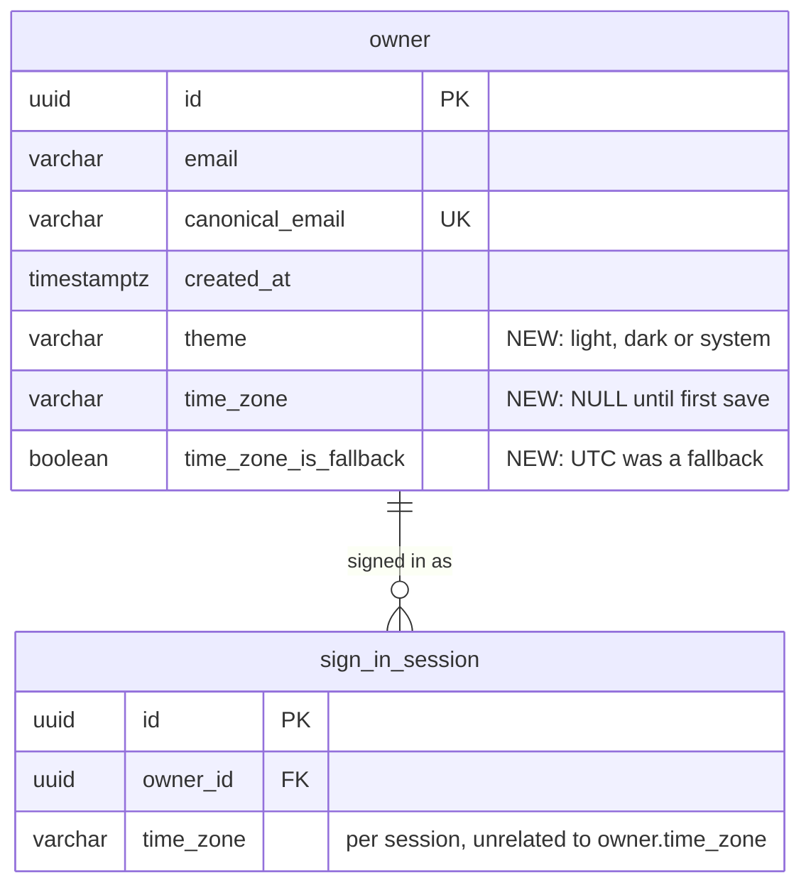

# Data model — app-shell

> **Sources:** spec.md §5 (AC-179…AC-186) and §6.1 · sad.md §5 (`identity` owns the preferences; `inbox` and `web` own no tables), §6 persist notes (seed flow 3, Flows 4–8), §8 (Time and timezone, Known timezone list) · ADR-0005 (typed columns on `owner`) · platform-skeleton `data-model.md` (conventions).
> **Staged migrations:** `migrations/01_add_owner_preferences.up.sql` + `.down.sql`. `implement` promotes them into `db/migration/V<yyyyMMddHHmm>__add_owner_preferences.sql` + `db/rollback/U<same>__add_owner_preferences.sql`.

The only schema change is three columns on the existing `owner` table, owned by `identity`. No table is created.

**Conventions applied** (from platform-skeleton, unchanged):
- Light named `CHECK`s on enum-like values (`<table>_<column>_ck`). The rules are also enforced and tested in Kotlin.
- No generic `updated_at`. Preferences carry no timestamp, because no AC reads when they changed.
- `IF NOT EXISTS` / `IF EXISTS` so a partly applied file re-runs cleanly.
- Constant `DEFAULT`s are used only where they make a `NOT NULL` addition to an existing table safe. On Postgres 17 they are metadata-only, so no expand, backfill and contract sequence is needed.

**Not stored (confirmed):**
- *Inbox count:* summed live from `InboxSource` implementations in producer modules (ADR-0003). E06 adds no Inbox table, and each producer epic owns its own rows and its index by `owner_id`.
- *Status Banner conditions:* computed by `StatusConditionSource` implementations (ADR-0006). `offline` and `not-responding` exist only in the browser.
- *Fixture sources for the `e2e` profile:* held in memory by `@Profile("e2e")` beans (sad §5). No table.
- *Known timezone list:* derived from `java.time.ZoneId` at runtime (sad §8). No lookup table, no seed.
- *Theme last used on this device / remembered destination:* browser `localStorage` (`telex.theme`, `telex.destination`), not the database.
- *Existing Owners' timezone:* not backfilled from `sign_in_session.time_zone` (user decision, 2026-10-03). It stays `NULL` until AC-183's first open saves it from the device, because a session's zone may itself be a silent UTC fallback.

## ER diagram

## Entities

### `owner` (changed)

Only the new columns are listed. `id`, `email`, `canonical_email` and `created_at` are unchanged (platform-skeleton `data-model.md`).

| Column | Type | Constraints | Notes |
|---|---|---|---|
| `theme` | VARCHAR(6) | NOT NULL DEFAULT `'system'`, CHECK `owner_theme_ck` in (`light`, `dark`, `system`) | Existing and new Owners start on System. Changed by `PATCH /api/v1/me/preferences` (AC-179). A value outside the list is a `validation-failed` field error before it reaches the DB |
| `time_zone` | VARCHAR(64) | NULL | An IANA `Area/City` id or `UTC`, from the server's known list (`identity.TimeZones`). 64 matches `sign_in_session.time_zone`. `NULL` means "not saved yet" (AC-183). Once set, `identity` never writes `NULL` again (AC-186, `time-zone-required`) |
| `time_zone_is_fallback` | BOOLEAN | NOT NULL DEFAULT `false`, CHECK `owner_time_zone_fallback_ck`: `NOT time_zone_is_fallback OR time_zone = 'UTC'` | `true` only when the first save had to use UTC because the device zone was unreadable or off the list. Drives the "pick your own" hint on SCR-64 on every device. Cleared by any pick from the list (AC-183, AC-184) |

**Aggregate root:** `owner` (root, `identity`). The preferences are attributes of the Owner, read and written only through `identity.OwnerPreferences`. Other modules (E19, E20) read the timezone through `OwnerPreferences.timeZoneOf(ownerId)`, never the table.

**Access patterns (all by primary key, from sad §6):**
- Load the Owner's account with theme and timezone (Flows 4, 6, 7): `SELECT … FROM owner WHERE id = ?`, served by `owner_pkey`.
- Change theme (seed flow 3): `UPDATE owner SET theme = ? WHERE id = ?`, served by `owner_pkey`.
- First timezone save, only if unset (Flow 7): `UPDATE owner SET time_zone = ?, time_zone_is_fallback = ? WHERE id = ? AND time_zone IS NULL`, served by `owner_pkey` with a filter (checked with `EXPLAIN`). Zero rows updated means another device saved first, and the service then reads the saved value.
- Change timezone (Flow 8): `UPDATE owner SET time_zone = ?, time_zone_is_fallback = false WHERE id = ?`, served by `owner_pkey`.

**Constraints:** `owner_theme_ck`, `owner_time_zone_fallback_ck`. "Never cleared once set" (AC-186) is a state transition that a `CHECK` can't express, and the repo uses no triggers. It's enforced in `identity` code and covered by an integration test.

## Indexes

No new index. Every query above filters on `owner.id` and is served by the existing primary key.

| Index | Columns | Query it serves |
|---|---|---|
| `owner_pkey` (existing) | `id` | Every preference read and write in seed flow 3 and Flows 4, 6, 7 and 8 |

## Test fixtures

Kotlin builders under `backend/app/src/integrationTest/kotlin/telex/identity/` (not in `db/migration`). Addresses use `example.test` only.

- `anOwner(...)` (existing) gains `theme = "system"`, `timeZone: String? = null` and `timeZoneIsFallback = false`. The defaults match a freshly migrated row, so "no timezone saved yet" is the default state (AC-183).
- `anOwnerWithTimeZone(timeZone = "Europe/Kyiv")` builds an Owner past the first save, for AC-184…AC-186.
- `anOwnerOnUtcFallback()` builds `time_zone = 'UTC'` with `time_zone_is_fallback = true`, for the hint on SCR-64.
- Inbox and Status Banner fixtures are the in-memory `@Profile("e2e")` sources plus their fixture endpoint (sad §5), not rows.

No bootstrap or lookup seeds.
