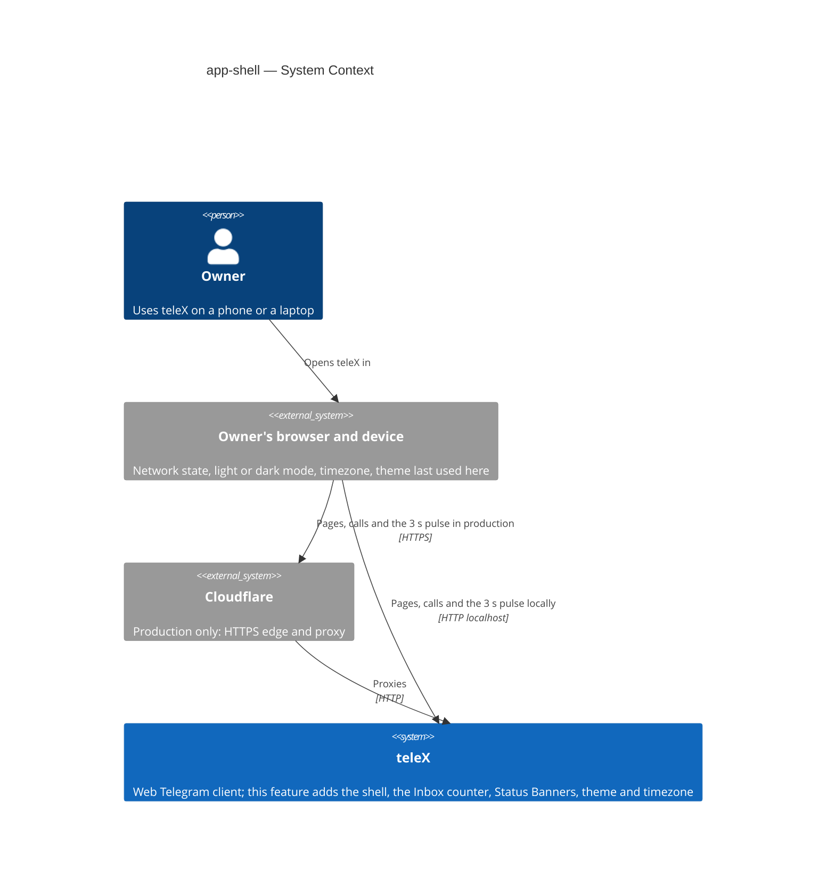
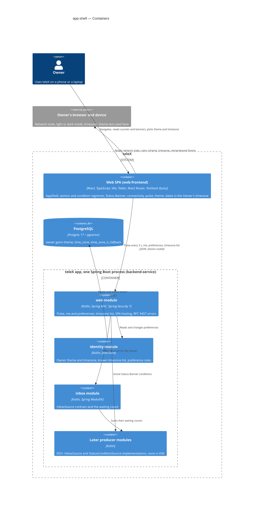
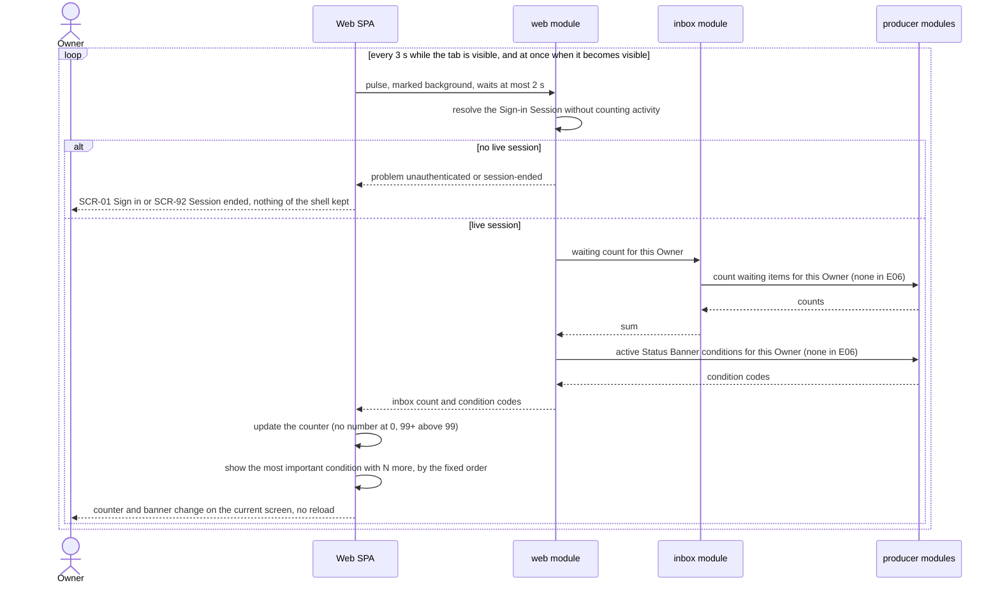
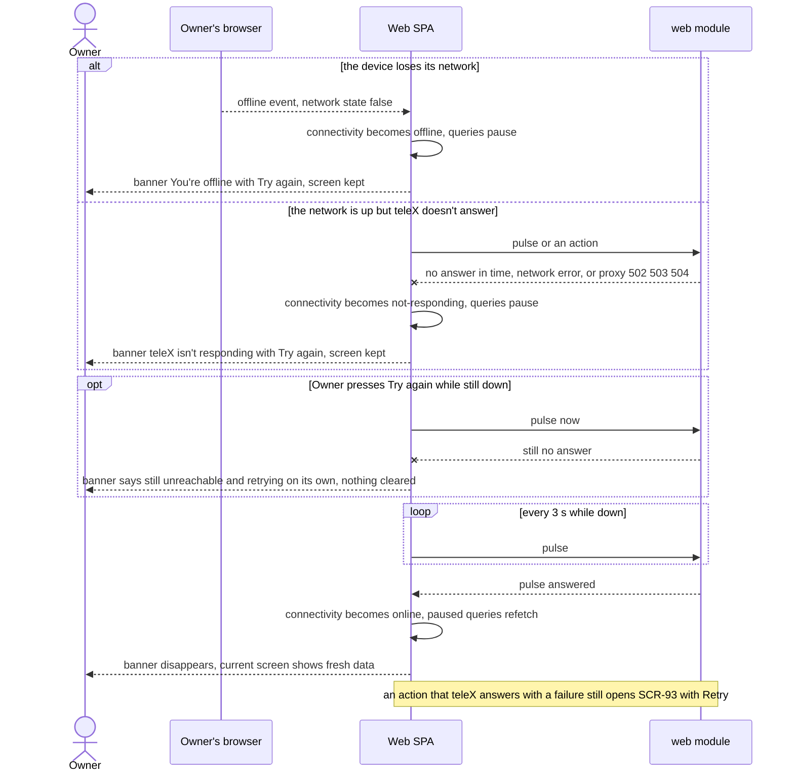
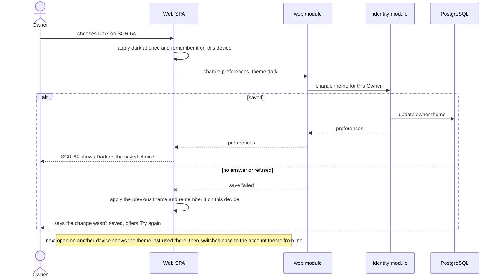

# Software Architecture Document — app-shell

<!-- 12 Arc42 sections. Empty section → <!-- N/A: <one-line reason> -->. -->
<!-- C4 Context (L1) lives inline in §3. C4 Container (L2) lives inline in §5. -->
<!-- Numbers in §10 come VERBATIM from spec.md §6 NFR — no inventing, no rounding. -->

## 1. Introduction and goals

**Intent.** teleX gets one shell around every signed-in screen, and every later UI epic builds inside it. On a desktop-width screen the Owner sees a side menu with all seven sections of the app map. On a phone-width screen they see a bottom bar of at most five items, with the rest under "More". The Inbox counter is always in view and changes live. Sections that later epics haven't built yet open a "Coming soon" page. A Status Banner strip under the header reports conditions that stop teleX from working for the Owner, starting with "You're offline" and "teleX isn't responding". The Owner's theme (light, dark or system) and timezone are saved on their account and follow them to every device. The shell also creates the two extension points later epics use without changing it: a place for each section's page and a place for each Status Banner condition.

**Top-3 quality goals (1-liners; full scenarios in §10):**

1. **Live awareness.** The Inbox counter and the offline Status Banner reflect reality within 5 s, without a reload and without the Owner losing their screen.
2. **Works fully on a phone.** Every shell screen fits 360 px without sideways scrolling, in both themes. It has no serious or critical accessibility findings, and the first signed-in screen is usable within 2.5 s p75 on fast 4G.
3. **Extensible without shell changes.** A later UI epic adds its section page, its Inbox items or its Status Banner condition without editing the shell (spec §7 KPI "Shell changes needed by later epics").

**Stakeholders.**

| Role | Interest | Sign-off owner? |
|---|---|---|
| Owner | Reaches every section on any width, sees the Inbox counter, learns when teleX can't serve them, picks theme and timezone (US-43, US-70…US-74) | No |
| Tech Lead | SAD approval. The live channel, the Inbox count contract and the shell extension points that every later UI epic builds on | Yes |
| Security Lead | Confirms the spec §6.1 "no new authorization boundary" verdict holds for the pulse and the preference endpoints, through the regular `/sdd:review` | No |
| Later UI epics (E02, E04, E09, E11, E14, E19, E22, E29) | Plug into the section, Inbox and Status Banner extension points without changing the shell | No |

<!-- Decision overrides (¶4) — populated by the critic resolution loop, empty otherwise. -->

## 2. Constraints

**Technical.**
- Kotlin 2.4.10 on JDK 25, virtual threads on. Foundation [ADR-0001](../../adr/0001-kotlin-spring-modulith-postgres-react-stack.md).
- Spring Boot 4.1.1 (Web MVC, Security 7, Data JDBC via `JdbcClient`, Flyway) and Spring Modulith 2.1.1 with the JDBC event publication registry. Versions only in `gradle/libs.versions.toml`.
- PostgreSQL 17 + pgvector through Flyway, with a paired rollback script per migration. Foundation [ADR-0003](../../adr/0003-postgres-jdbc-flyway-uuidv7-persistence.md).
- Frontend: React 19, TypeScript 6, Vite 8, React Router, TanStack Query, `@tabler/core` 1.6.1 + `@tabler/icons-react`, pnpm. Playwright runs at 360 px and 1280 px (`e2e/playwright.config.ts`). **Added by this feature:** an axe accessibility scan in e2e (spec §6). No other new dependency is planned.
- Architecture convention: a Spring Modulith modular monolith, 14 modules, each a direct sub-package of `telex` with its public API at the root and the rest in `internal`. `ApplicationModules.verify()` runs in `ModularityTest`. `web` may depend on the core modules and `shared`, but not on integration modules.
- One app process serves everything (foundation ADR-0002). No second replica exists. The pulse is stateless request and response, so nothing has to be shared between processes (§7).

**Organisational.**
- One developer (Anton Husiev) on the course's 8-week timeline (foundation ADR-0001). Neither the spec nor the roadmap sets a per-epic deadline.
- Roadmap wave 3: E06 runs in parallel with E02 (telegram-link) and E10 (model-profiles). E02 adds the "Telegram account disconnected" Status Banner on top of this feature's mechanism, so the mechanism has to land in a shape E02 can extend (spec §8).
- Implementation runs through the SDD `implement` engine (TDD, per-task gate).

**Conventions.**
- `CLAUDE.md` (layout, IDs, errors, migrations, tests, quality gates) and `docs/architecture-map.md` §Conventions. The map reflects the pre-scaffold commit and is stale (§11).
- Errors: RFC 9457 `application/problem+json`, `type = urn:telex:error:<code>`, rendered by `telex.web.ProblemHandler`; domain errors extend `telex.shared.DomainProblem`.
- Every Owner-owned row carries `owner_id`, and every query filters on it.
- Background requests carry `X-Telex-Background: 1` and don't count as session activity (platform-skeleton ADR-0005).
- UI: `docs/design-system.md` (posture responsive-both, breakpoint 768 px, component inventory) and `docs/docs/design-system/README.md`. Tokens only, both themes, status never by color alone, sentence-case English copy from `frontend/src/messages.ts`, no emoji. AppShell (C-01) and StatusBanner (C-04) are ported from `docs/docs/design-system/components/` and replace the temporary `PageFrame`.

**Regulatory / external.**
- Data is classified internal (spec §6.1). New personal data: theme (no sensitivity) and timezone (low sensitivity, hints at where the Owner lives). Both are shown to the Owner only, never to the Operator.
- No new authorization boundary. Every section, page, counter, pulse and preference call needs a live Sign-in Session and touches only the current Owner's data (spec §6.1). Security review: N/A per spec.
- Browsers: the latest two versions of Chrome and Safari, including Safari on iOS (spec §6).

## 3. Context and scope

teleX is a self-hosted web Telegram client. This feature adds no new external system. It changes how the Owner's browser and the teleX app talk: every open, visible tab now asks teleX for a small "pulse" every 3 seconds, and the shell treats a pulse that gets no answer, or a browser that reports no network, as a condition to report. The trust boundary stays the browser. Anything it sends is unauthenticated until it carries a live Sign-in Session, and theme and timezone values are checked by the app, not trusted from the client.

<!-- brownfield: E01 platform-skeleton implemented at 39d112c — 14 Modulith modules (identity, web and mail populated), owner table without preferences, GET /api/v1/me, cookie session with session-ended vs unauthenticated problems, X-Telex-Background marker, fetch client with a 10 s timeout routing failures to SCR-93, remembered destination in localStorage, temporary PageFrame, no SSE endpoint, no Inbox store, Playwright phone + desktop projects without axe. docs/architecture-map.md is stale (reflects ce5eabf). -->

**External systems (in / out):**

| Actor or system | Type | Interaction |
|---|---|---|
| Owner | Person | Moves between sections, reads the Inbox counter and Status Banners, picks theme and timezone, on a phone or a laptop |
| Owner's browser and device | System (external) | Reports network state, the device's light or dark mode and the device's timezone. Keeps the theme last used on this device. Sends the pulse to teleX every 3 s while the tab is visible |
| Cloudflare | System (external, production only) | Terminates HTTPS and proxies to the app. When the app is down it answers 502/503/504 itself, which the shell reads as "teleX isn't responding" |
| Telegram, OpenRouter, Jev, Bot API, mail server | System (external) | Not touched by this feature |

**C4 Context (L1):**



## 4. Solution strategy

**Target surfaces: `[backend-service, web-frontend]`.** The Owner reaches teleX only through a browser (spec §1, §4). `ux-flows.md` lists ten screens, three of them new (SCR-69, SCR-94, SCR-95). The backend gains the pulse, preferences and timezone-list contract, and the SPA consumes it. Foundation [ADR-0001](../../adr/0001-kotlin-spring-modulith-postgres-react-stack.md) already fixed "React SPA served by Spring Web", so this split is recorded inline, not as a new ADR.

**UI architecture (web-frontend): the existing client-side SPA, unchanged in kind.** Foundation ADR-0001 fixed it, and E01 added React Router, TanStack Query and the one fetch client. This feature adds:
- **AppShell (C-01)** as the layout of every signed-in route, replacing `PageFrame`. Above 768 px it shows a side menu, and below 768 px a bottom bar of five items plus a "More" sheet. Both are generated from the section registry (ADR-0006).
- **Sections as routes** (`/overview`, `/inbox`, `/chats`, `/assistants`, `/runs`, `/tasks`, `/settings`, and the existing `/profile`), each lazy-loaded so the first signed-in screen stays within 2.5 s p75 on fast 4G. Unbuilt sections render SCR-94 at their own address. "More" is a sheet inside the shell, not an address.
- **No global state library.** Server state stays in TanStack Query: `me` (now with `theme` and `timeZone`) and `pulse`. The connectivity state is one small module the fetch client, the pulse and the banner share, and it drives TanStack's `onlineManager`. The pulse itself runs with `networkMode: 'always'`, so it keeps polling every 3 s while every other query is paused, and its first success brings the state back to online (ADR-0004).
- **Theme on first paint:** an inline script in `index.html` applies the theme last used on this device before React mounts (§8).

**Top strategic choices (the seeds for ADRs):**

1. **One background pulse every 3 s is the live channel.** Each visible tab asks `GET /api/v1/pulse` (marked background, so it doesn't extend the session). The answer carries the Inbox count and the active Status Banner conditions, and later epics add fields to it instead of opening new channels. It meets the 5 s targets with plain requests through any proxy and doubles as the heartbeat (quality goal 1). → [ADR-0002](adr/0002-poll-one-background-pulse-every-3-seconds-for-live-signals.md)
2. **The Inbox count is summed from sources the item owners provide.** A new core module `inbox` defines `InboxSource.countWaiting(ownerId)` and sums the implementations. Each later epic implements a source in its own module, so the "waiting" state is never duplicated and the shell never changes (quality goal 3). → [ADR-0003](adr/0003-aggregate-the-inbox-count-from-sources-in-a-new-inbox-module.md)
3. **Connectivity is one client-side state fed by the pulse and the browser.** "You're offline" comes from the browser's network state, and "teleX isn't responding" from a pulse or call with no answer (2 s for the pulse, 10 s for calls), a network error, or a 502/503/504 from the proxy. Only an action teleX answers with a failure still opens SCR-93, which narrows E01's AC-102 (quality goal 1). → [ADR-0004](adr/0004-detect-offline-from-pulse-failures-and-browser-network-state.md)
4. **Theme and timezone are typed columns on the Owner.** `identity` owns them, `me` returns them, one preferences call changes them, and other modules read the timezone through `identity`'s public API. → [ADR-0005](adr/0005-store-theme-and-timezone-as-columns-on-the-owner-row.md)
5. **Two extension points keep the shell closed to change.** Sections come from a client registry. Status Banner conditions come from `StatusConditionSource` implementations reported through the pulse, and a client catalog maps each code to its text, action and fixed importance (quality goal 3). → [ADR-0006](adr/0006-extend-the-shell-through-client-section-and-server-condition-registries.md)

Tactical choices in §5–§8 trace to these five.

## 5. Building block view

The repo's Spring Modulith modular monolith is followed as-is. The feature touches three backend modules and adds one:
- **`identity`** (core) gains three preference columns (theme, timezone, and whether the timezone is the UTC fallback), the preference rules (known timezone list, never empty, first save only while unset) and a typed read for other modules.
- **`inbox`** (new core module, 15th) holds only the `InboxSource` contract and the sum. It depends on `shared` only, and producer modules depend on it (ADR-0003).
- **`shared`** (kernel) gains the `StatusConditionSource` interface, a type with no beans (ADR-0006).
- **`web`** (interface) adds the pulse, preferences and timezone-list endpoints. Its `allowedDependencies` gain `inbox`.

The SPA is the second container. Most of the feature lives there: the shell, the registries, connectivity, theme and dates.

**Internal decomposition:**

```
backend/app/src/main/kotlin/telex/
├── inbox/                         NEW core module (package-info: allowedDependencies = shared)
│   ├── InboxSource                interface: countWaiting(ownerId): Int — implemented by producer modules (E11+)
│   └── Inbox                      countWaiting(ownerId) = sum over all InboxSource beans
├── identity/
│   ├── Theme                      enum light | dark | system
│   ├── OwnerPreferences           read (theme, time zone), change theme, change time zone,
│   │                              set time zone if not yet saved, timeZoneOf(ownerId) for other modules
│   ├── TimeZones                  the known list (ZoneId ids in Area/City form + UTC), isKnown(id)
│   ├── OwnerProfiles              existing; Me gains theme + timeZone
│   └── internal/owner/            Owners repository gains the two columns (JdbcClient)
├── shared/
│   └── StatusConditionSource      interface: activeConditions(ownerId): Set<String> (condition codes), no beans
└── web/api/
    ├── MeController               existing; body gains theme, timeZone; PATCH /api/v1/me/preferences
    ├── TimeZonesController        GET /api/v1/time-zones
    └── PulseController            GET /api/v1/pulse → { inboxCount, conditions[] } (Inbox + all StatusConditionSource beans)

backend/app/src/main/resources/db/migration/   V…__add_owner_preferences.sql (+ db/rollback/U…) — staged by /sdd:data-model

frontend/
├── index.html                     inline script: apply the theme last used on this device before first paint
└── src/
    ├── shell/                     NEW
    │   ├── AppShell/              C-01 ported: side menu ≥ 768 px, bottom bar + header < 768 px, More sheet, Sign out
    │   ├── StatusBanner/          C-04 ported: most important condition + "N more", no close control
    │   ├── sections.ts            section registry: id, path, label, icon, phone placement (bar | more), page | Coming soon
    │   ├── conditions.ts          condition catalog: code → text, action, importance (offline and not-responding first)
    │   ├── connectivity.ts        state online | offline | not-responding; browser events; drives onlineManager
    │   ├── pulse.ts               usePulse: background query every 3 s while visible, 2 s timeout, networkMode always
    │   │                          (never paused by onlineManager — it is what detects recovery)
    │   ├── theme.ts               apply, follow the device for System, remember on this device, sync other tabs
    │   └── time.ts                device time zone, formatInstant(instant, timeZone)
    ├── pages/coming-soon/         SCR-94 (one page, named per section)
    ├── pages/settings/            SCR-69
    ├── pages/profile-security/    SCR-64 gains Theme and Time zone
    ├── api/client.ts              existing; no-answer and network errors feed connectivity instead of SCR-93
    └── components/PageFrame/      deleted

e2e/tests/                         shell, counter, offline, theme, timezone specs; axe scan on both profiles and themes
```

A Spring profile `e2e` (off by default, never set in `compose.yaml`) registers a fixture `InboxSource` and a fixture `StatusConditionSource`, plus a fixture endpoint that prepares their values. This is the only way to test AC-174 and AC-178 before a real producer exists (§11).

**C4 Container (L2):**



## 6. Runtime view

These are seed flows. `/sdd:sequences` adds one flow per critical user story and covers every §5 AC with a flow or a branch. Messages are semantic. Endpoints and status codes arrive at `/sdd:api`.

**Critical flow 1: the pulse keeps the counter and banners live (AC-173, AC-174, AC-175, AC-178)**



**Critical flow 2: the connection drops and comes back (AC-176, AC-177)**



**Critical flow 3: change the theme, with a failed save (AC-179, AC-181, AC-182)**



## 7. Deployment view

No new deployment unit. The feature ships inside the existing app image: one Spring Boot process that serves the SPA's static files and the API, plus PostgreSQL, behind Cloudflare in production (`compose.yaml`, platform-skeleton sad §7). The only infrastructure-visible change is the pulse traffic: one small background request every 3 s per visible tab, about 20 a minute. At the course installation's scale (a handful of Owners, a few tabs each) that is well under 10 requests a second, and the app needs no tuning.

**Monitoring:**
- Metrics: Spring Boot Actuator's `http.server.requests`, already on, filtered by `uri=/api/v1/pulse`. Its rate shows how many tabs are open, and its p95 shows the pulse staying well under its 2 s client timeout.
- Alerts: none new. The course installation has no paging. A pulse p95 above 1 s is the signal to look at the Inbox and condition sources (§11).
- Tracing: none added.

**Scaling thresholds:**
- Comfortable as is up to about 50 visible tabs (≈ 17 pulses a second), each pulse running one count query per Inbox source.
- Above that, or once Inbox sources multiply, cache the per-Owner pulse answer for ~1 s in-process, or move live signals to a push channel (ADR-0002 Neutral).

**Configuration:** the `e2e` Spring profile, which enables the fixture sources (§5), is set only by the e2e run, never in `compose.yaml` or production.

## 8. Crosscutting concepts

Repo conventions are inherited unchanged unless the row says otherwise.

| Concept | Convention | Where defined |
|---|---|---|
| Logging | Spring Boot defaults. The pulse is not logged per request. An unknown Status Banner condition code is logged once by the SPA console and ignored | `application.yaml`; ADR-0006 |
| Authentication | Every new endpoint (`pulse`, `me/preferences`, `time-zones`) needs a live Sign-in Session through the existing cookie filter. The pulse is sent with `X-Telex-Background: 1`, so it never extends a session | platform-skeleton ADR-0001, ADR-0005 |
| Authorization | Only the current Owner: preferences are read and written for the session's Owner, and every Inbox and condition source is called with that Owner's id and filters on `owner_id` (AC-175) | `CLAUDE.md`; spec §6.1 |
| Error handling | RFC 9457 problems. New codes: `unknown-time-zone` (a timezone not on the list) and `time-zone-required` (an empty timezone, AC-186), both field errors on `timeZone`. A theme outside light, dark or system is a `validation-failed` field error | `telex.web.ProblemHandler`; `/sdd:api` |
| Failure routing in the SPA | Narrowed from E01: no answer within 10 s, a network error, or a 502/503/504 from the proxy feed the connectivity state and the Status Banner, and the screen stays. `unauthenticated` → SCR-01, `session-ended` → SCR-92, other answered failures → SCR-93 with Retry. A pulse failure routes the same way | `frontend/src/api/client.ts`; ADR-0004 |
| Return after sign-in | Kept from E01: a refused page is remembered in localStorage `telex.destination` of the browser that is refused, first refusal wins, never an auth page, single-slash paths only. **Changed:** for a brand-new account the sign-in no longer takes the destination; SCR-09 takes it after the passkey is created or skipped, so the Owner lands on the linked section (AC-173, ux-flows ledger item 2). A Sign-in Link opened in another browser finds no destination and lands on the Inbox | `frontend/src/app/landing.ts`, `frontend/src/api/destination.ts`, SCR-09 |
| Connectivity | One client state, `online`, `offline` or `not-responding`, fed by browser `online`/`offline` events, the pulse and every call. It drives TanStack Query's `onlineManager`, so paused queries refetch on recovery. The pulse is exempt (`networkMode: 'always'`): it keeps running every 3 s while down, and it is what detects recovery | `frontend/src/shell/connectivity.ts`; ADR-0004 |
| Status Banner | Conditions come from the client (offline, not-responding) and from `StatusConditionSource` codes in the pulse. The SPA's condition catalog holds each code's text, single action and importance. The most important condition shows, the rest are listed under "N more", and none can be closed | `frontend/src/shell/conditions.ts`; ADR-0006 |
| Theme | `data-bs-theme` on `<html>` (Tabler's attribute, tokens from `styles.css` for both themes). An inline script applies the theme last used on this device (localStorage `telex.theme`, System resolved through `matchMedia`) before first paint. After `me` arrives the shell switches once if the account differs. System follows `prefers-color-scheme` changes live, and other tabs in the same browser follow through the `storage` event. A change applies before it saves and reverts if the save fails | `frontend/index.html`, `frontend/src/shell/theme.ts`; AC-179…AC-182 |
| Time and timezone | The server sends instants in UTC (ISO 8601). Every date shown goes through `formatInstant(instant, timeZone)` (`Intl.DateTimeFormat` with the Owner's saved zone). The device zone comes from `Intl.DateTimeFormat().resolvedOptions().timeZone`, and is saved only while none is saved, through a server-side "only if unset" write. A zone off the list, or one that can't be read, saves UTC with `time_zone_is_fallback = true`. The "pick your own" hint on SCR-64 shows only while that flag is set, on any device, and picking a zone clears it (AC-183) | `frontend/src/shell/time.ts`, `identity.OwnerPreferences`; ADR-0005 |
| Known timezone list | `ZoneId.getAvailableZoneIds()` limited to `Area/City` names plus `UTC`, served by `GET /api/v1/time-zones`. The SPA searches it by city or region, and the server rejects anything else | `identity.TimeZones` |
| ID strategy | No new aggregate, so no new id | `telex.shared.Ids` |
| Responsive layout | One breakpoint, 768 px (`docs/design-system.md` `bp-tablet`): side menu at 768 px and wider, bottom bar of five items plus "More" below it. Bottom-bar targets are at least 44 × 44 px. Every shell screen fits 360 px with no sideways scroll | `docs/design-system.md`; AC-43, AC-07b |
| Internationalisation | English only, all strings in `frontend/src/messages.ts`, sentence case, no emoji. Section names, condition texts and "Coming soon" descriptions live there too | `docs/docs/design-system/README.md` §Content |
| Accessibility | WCAG 2.2 AA in both themes (D-18). The current section and every banner are marked by icon and words, never by color alone. Axe runs in e2e on every shell screen at both widths and in both themes | spec §6; `e2e/` |
| Events | No new Modulith event. Live signals travel by pulse (ADR-0002). A producer that needs to tell other modules about Inbox changes (E19's bot counter) adds its event then | ADR-0002, ADR-0003 |
| Observability | Actuator `http.server.requests` covers the new endpoints (§7) | — |

## 9. Architecture decisions

| # | Title | Status | Section |
|---|---|---|---|
| 0001 | Show "Coming soon" sections, ship "offline" as the first Status Banner, and move the adaptive panel to E14 (from `specify`) | Accepted | §1 (scope) |
| 0002 | Poll one background pulse every 3 seconds for live signals | Accepted | §4 |
| 0003 | Aggregate the Inbox count from sources in a new `inbox` module | Accepted | §4, §5 |
| 0004 | Detect offline from pulse failures and the browser's network state | Accepted | §4, §8 |
| 0005 | Store theme and timezone as columns on the `owner` row | Accepted | §4, §5 |
| 0006 | Extend the shell through a client section registry and server-reported Status Banner conditions | Accepted | §4, §5 |

ADR files live under `docs/features/app-shell/adr/NNNN-<title>.md`. Foundation decisions this feature relies on: [ADR-0001](../../adr/0001-kotlin-spring-modulith-postgres-react-stack.md) (SPA served by Spring) and [ADR-0002](../../adr/0002-single-app-with-isolated-tdlib-subproject.md) (one app process), plus platform-skeleton [ADR-0005](../platform-skeleton/adr/0005-count-session-activity-only-from-requests-the-spa-does-not-mark-as-background.md) (background marker).

## 10. Quality requirements

Each top-3 goal from §1 expanded into scenarios. Numbers are quoted from spec §6.

**QG-1. Live awareness**
- **QG-1a. When:** the device loses its network, or teleX stops answering, on any shell screen. **Then:** the offline Status Banner appears "≤ 5 s after the device loses its network or teleX stops answering", and the screen stays. **How verify:** Playwright e2e on both profiles. It cuts the network with `context.setOffline(true)`, and separately stops answers by routing `/api/**` to abort, then measures the time until the banner is visible.
- **QG-1b. When:** the connection returns. **Then:** the banner clears "≤ 5 s after the connection returns", and the current screen shows fresh data. **How verify:** the same e2e restores the network or the route and measures the time until the banner is gone and a fresh pulse has landed.
- **QG-1c. When:** an Inbox item lands or is resolved for the Owner. **Then:** the counter shows the new number "≤ 5 s from an item landing or being resolved to the new number on screen". **How verify:** e2e under the `e2e` profile, with items prepared through the fixture `InboxSource`. It changes the count and measures until the number on screen matches, on both profiles, including the 0 (no number) and "99+" cases.

**QG-2. Works fully on a phone**
- **QG-2a. When:** any shell screen is open at 360 px or 1280 px, in either theme. **Then:** "0 shell screens wider than the viewport at 360 px and 1280 px, both themes". **How verify:** e2e checks that `document.documentElement.scrollWidth <= innerWidth` on every shell screen (each section, More, Settings, Profile and security, Coming soon, with a banner showing).
- **QG-2b. When:** the same screens are scanned. **Then:** "0 serious or critical axe findings on every shell screen, both widths, both themes", with "bottom-bar targets ≥ 44 × 44 px" and "WCAG 2.2 AA contrast per D-18". **How verify:** an axe scan in e2e per screen × width × theme, plus a bounding-box check of every bottom-bar item on the phone profile (extends `e2e/tests/touch-targets.spec.ts`).
- **QG-2c. When:** a signed-in Owner opens teleX on the phone profile. **Then:** "first signed-in screen usable ≤ 2.5 s p75 on the phone profile with a simulated fast-4G network". **How verify:** a Playwright performance trace in CI on the phone profile with fast-4G throttling, measuring until the Inbox screen and its counter are interactive. Sections are lazy-loaded to stay inside the budget.
- **QG-2d. When:** the Owner chooses another theme. **Then:** it is "applied ≤ 200 ms after the choice, no reload". On a device used before, "the first frame shows the theme last used there and at most one switch follows (only when the account's theme changed elsewhere)". **How verify:** an e2e trace from the click to the change of the `data-bs-theme` attribute. The attribute is read at first paint with a remembered theme, and switch events are counted after `me` returns.

**QG-3. Extensible without shell changes**
- **QG-3a. When:** a later UI epic adds its section page, an Inbox source or a Status Banner condition. **Then:** "0 UI epics through G3 need to change the shell beyond adding their section, replacing their 'Coming soon' page or adding their Status Banner" (spec §7). **How verify:** at each UI epic's `/sdd:review`, its diff under `frontend/src/shell/` may touch only `sections.ts` and `conditions.ts` entries. In E06, the fixture sources under the `e2e` profile prove a new source shows up without shell code changes (AC-174, AC-178).
- **QG-3b. When:** any UI e2e scenario runs in CI. **Then:** "100 % of UI e2e scenarios run in both the phone (360 px) and desktop (1280 px) profiles, from E06 on". **How verify:** the CI report lists every scenario under both Playwright projects. A scenario marked for one project fails the check.

**Browsers.** The "latest two versions of Chrome and Safari, including Safari on iOS" get a manual pass before `/sdd:ship`, recorded in the PR (spec §6). It checks the theme on first paint, `prefers-color-scheme` following, pulse pause and resume when a tab is hidden on iOS, and the offline banner.

## 11. Risks and technical debt

| Risk / debt | Severity | Mitigation | Owner |
|---|---|---|---|
| The 5 s offline budget is tight: a 3 s pulse interval plus a 2 s timeout leaves no slack, and a slow but working teleX (answering after 2 s) briefly shows "teleX isn't responding" | Medium | The browser `offline` event usually fires at once. The e2e measures the worst case on both profiles. If it's flaky, shorten the interval to 2 s (one config value) before `/sdd:ship` | Anton Husiev |
| iOS Safari freezes background tabs. A tab returning to the foreground may show a stale counter or miss a drop until the next pulse | Low | The pulse fires immediately when the tab becomes visible. Covered by the manual Safari iOS pass before `/sdd:ship` | Anton Husiev |
| The `e2e` Spring profile adds fixture sources and a fixture endpoint to the production jar. Enabled by mistake, it would let anyone signed in fake Inbox counts and banners for themselves | Medium | Off by default and never set in `compose.yaml`. Its beans are `@Profile("e2e")`, and the fixture endpoint only changes the calling Owner's fixture values. `/sdd:review` checks that no production config sets it | Anton Husiev |
| Every pulse runs every Inbox and condition source. As E11–E24 add sources, a slow source slows every tab's pulse and can trip the 2 s timeout, which shows a false "teleX isn't responding" | Medium | Each source must be one indexed count by `owner_id`, checked at each producer epic's `/sdd:review`. Watch pulse p95 (§7). A ~1 s per-Owner cache is the fallback | Anton Husiev |
| E01's AC-102 behavior changes: an action with no answer in 10 s no longer opens SCR-93. E01 e2e tests asserting the old behavior will fail | Low | Update `e2e/tests/system-pages.spec.ts` and `client.test.ts` in the same task that changes the fetch client (the spec §1 deviation already records the change) | Anton Husiev |
| Ending the tab on a failed pulse (SCR-01 or SCR-92 straight away) is stricter than AC-173's "next action". An Owner reading a page whose session just expired loses the page sooner | Low | Intentional: no shell content after the session stops (spec §6.1 abuse case). `/sdd:sequences` and `/sdd:plan-tests` treat it as the expected behavior | Anton Husiev |
| The return-after-sign-in change touches E01 code: `landAfterSignIn` stops taking the destination for a new account, and SCR-09 takes it instead. E01 tests that expect a new account to land on the Inbox will fail | Low | Change `landing.ts`, the passkey page and `landing.test.ts` in one task. Add an e2e for "open a Runs link signed out → sign up → passkey offer → Runs" | Anton Husiev |
| `docs/architecture-map.md` is stale (reflects `ce5eabf`, before scaffold and E01) and still lists 13 modules. This feature adds a 15th (`inbox`) | Low | Run `/sdd:survey` after E06 merges to flip the map to `mode: current` | Anton Husiev |
| `shared` gains its first interface meant to be implemented across modules (`StatusConditionSource`), stretching its "typed ids and problems" role | Low | Interface only, no Spring annotations, so `ModularityTest` keeps `shared` bean-free (ADR-0006) | Anton Husiev |
| Spec §8 open questions still affect this design: the phone bar's four sections and the Status Banner importance order (both due before `/sdd:screens app-shell`), and E11 counting its Notes | Low | The defaults are encoded as data in `sections.ts` and `conditions.ts`, so changing them is an entry change, not a design change | Anton Husiev |

**Accepted debt (acceptable in v1, plan to fix later):**
- Polling instead of push (ADR-0002): up to 3 s latency and constant background requests. Revisit when E04 (chat messages) or E14 (run progress) needs faster updates.
- Only the existing light and dark tokens. No high-contrast theme.
- A theme or timezone changed on one device reaches other open devices only on their next open or reload (AC-181, AC-184 accept this).

## 12. Glossary

Canonical definitions live in [CONTEXT.md](../../../CONTEXT.md). Terms marked *new* aren't there yet. Run `/sdd:glossary app-shell` to add them.

| Term | Meaning |
|---|---|
| Owner | A person with a teleX account. The only actor of this feature (CONTEXT) |
| Inbox | The one place where everything that waits for the Owner lands. The number of waiting items is the Inbox counter, the only counter in the navigation (CONTEXT) |
| Status Banner | A strip under the header that reports a condition affecting the Owner's whole teleX and offers one action. It stays until its cause is gone, and when several apply the most important shows with "N more" (CONTEXT) |
| Sign-in Session | The signed-in state of one Owner in one browser. The pulse never extends it (CONTEXT; platform-skeleton ADR-0005) |
| Section | *new* — one of the seven top-level parts of teleX in the app-map order: Overview, Inbox, Chats, Assistants, Runs, Tasks, Settings. Each has its own address |
| Coming soon page | *new* — the visible stand-in page for a section whose epic hasn't shipped. It names the section, says what it will hold, and links to the Inbox (ADR-0001) |
| Theme | *new* — the Owner's choice of light, dark or system, saved on their account. System follows the device |
| Timezone | *new* — the one named region (for example Europe/Kyiv) the Owner's dates and times are shown in. Once saved it can't be empty, only replaced by another from the known list |
| Pulse | *technical* — the small background request each visible tab sends every 3 s. Its answer carries the Inbox count and the active Status Banner conditions, and it doubles as the connectivity heartbeat (ADR-0002) |
| Inbox source | *technical* — a module's contribution to the Inbox count: how many of its items wait for a given Owner (ADR-0003) |
| Status Banner condition | *technical* — a code for one cause of a Status Banner (for example `offline`, `account-disconnected`), with fixed text, action and importance in the SPA catalog (ADR-0006) |
| "A banner lives exactly as long as its cause" | Domain invariant (AC-178): no Status Banner can be dismissed while its condition holds |
| "An Owner always has exactly one timezone" | Domain invariant (AC-186): once saved, the timezone can be changed to another on the list but never cleared |
