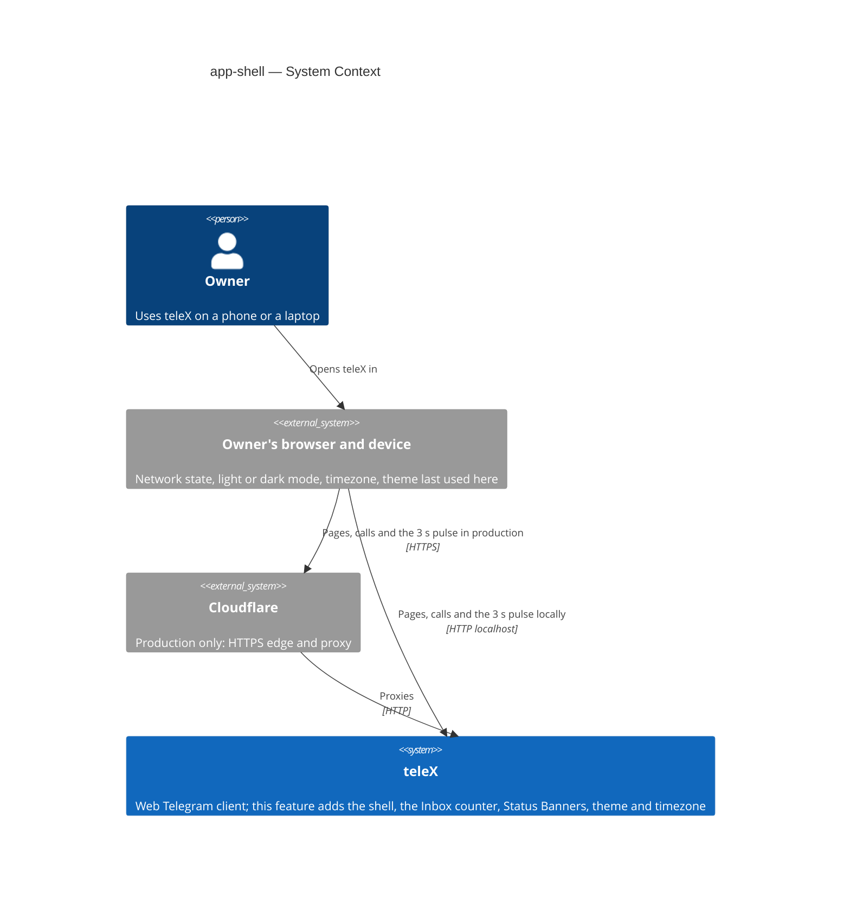
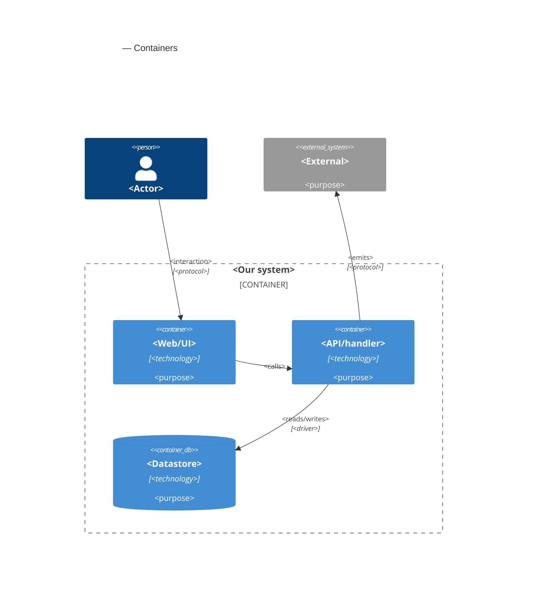

# Software Architecture Document — app-shell

<!-- 12 Arc42 sections. Empty section → <!-- N/A: <one-line reason> -->. -->
<!-- C4 Context (L1) lives inline in §3. C4 Container (L2) lives inline in §5. -->
<!-- Numbers in §10 come VERBATIM from spec.md §6 NFR — no inventing, no rounding. -->

## 1. Introduction and goals

**Intent.** teleX gets one shell around every signed-in screen, and every later UI epic builds inside it. On a desktop-width screen the Owner sees a side menu with all seven sections of the app map. On a phone-width screen they see a bottom bar of at most five items, with the rest under "More". The Inbox counter is always in view and changes live. Sections that later epics haven't built yet open a "Coming soon" page. A Status Banner strip under the header reports conditions that stop teleX from working for the Owner, starting with "You're offline" and "teleX isn't responding". The Owner's theme (light, dark or system) and timezone are saved on their account and follow them to every device. The shell also creates the two extension points later epics use without changing it: a place for each section's page and a place for each Status Banner condition.

**Top-3 quality goals (1-liners; full scenarios in §10):**

1. **Live awareness.** The Inbox counter and the offline Status Banner reflect reality within 5 s, without a reload and without the Owner losing their screen.
2. **Works fully on a phone.** Every shell screen fits 360 px without sideways scrolling, in both themes. It has no serious or critical accessibility findings, and the first signed-in screen is usable within 2.5 s p75 on fast 4G.
3. **Extensible without shell changes.** A later UI epic adds its section page, its Inbox items or its Status Banner condition without editing the shell (spec §7 KPI "Shell changes needed by later epics").

**Stakeholders.**

| Role | Interest | Sign-off owner? |
|---|---|---|
| Owner | Reaches every section on any width, sees the Inbox counter, learns when teleX can't serve them, picks theme and timezone (US-43, US-70…US-74) | No |
| Tech Lead | SAD approval. The live channel, the Inbox count contract and the shell extension points that every later UI epic builds on | Yes |
| Security Lead | Confirms the spec §6.1 "no new authorization boundary" verdict holds for the live stream and the preference endpoints, through the regular `/sdd:review` | No |
| Later UI epics (E02, E04, E09, E11, E14, E19, E22, E29) | Plug into the section, Inbox and Status Banner extension points without changing the shell | No |

<!-- Decision overrides (¶4) — populated by the critic resolution loop, empty otherwise. -->

## 2. Constraints

**Technical.**
- Kotlin 2.4.10 on JDK 25, virtual threads on. Foundation [ADR-0001](../../adr/0001-kotlin-spring-modulith-postgres-react-stack.md).
- Spring Boot 4.1.1 (Web MVC, Security 7, Data JDBC via `JdbcClient`, Flyway) and Spring Modulith 2.1.1 with the JDBC event publication registry. Web MVC already supports server-sent events (`SseEmitter`), so the live stream adds no dependency. Versions only in `gradle/libs.versions.toml`.
- PostgreSQL 17 + pgvector through Flyway, with a paired rollback script per migration. Foundation [ADR-0003](../../adr/0003-postgres-jdbc-flyway-uuidv7-persistence.md).
- Frontend: React 19, TypeScript 6, Vite 8, React Router, TanStack Query, `@tabler/core` 1.6.1 + `@tabler/icons-react`, pnpm. Playwright runs at 360 px and 1280 px (`e2e/playwright.config.ts`). **Added by this feature:** an axe accessibility scan in e2e (spec §6). No other new dependency is planned.
- Architecture convention: a Spring Modulith modular monolith, 14 modules, each a direct sub-package of `telex` with its public API at the root and the rest in `internal`. `ApplicationModules.verify()` runs in `ModularityTest`. `web` may depend on the core modules and `shared`, but not on integration modules.
- One app process serves everything (foundation ADR-0002). No second replica exists, so in-process state such as open live streams is acceptable (§7).

**Organisational.**
- One developer (Anton Husiev) on the course's 8-week timeline (foundation ADR-0001). Neither the spec nor the roadmap sets a per-epic deadline.
- Roadmap wave 3: E06 runs in parallel with E02 (telegram-link) and E10 (model-profiles). E02 adds the "Telegram account disconnected" Status Banner on top of this feature's mechanism, so the mechanism has to land in a shape E02 can extend (spec §8).
- Implementation runs through the SDD `implement` engine (TDD, per-task gate).

**Conventions.**
- `CLAUDE.md` (layout, IDs, errors, migrations, tests, quality gates) and `docs/architecture-map.md` §Conventions. The map reflects the pre-scaffold commit and is stale (§11).
- Errors: RFC 9457 `application/problem+json`, `type = urn:telex:error:<code>`, rendered by `telex.web.ProblemHandler`; domain errors extend `telex.shared.DomainProblem`.
- Every Owner-owned row carries `owner_id`, and every query filters on it.
- Background requests carry `X-Telex-Background: 1` and don't count as session activity (platform-skeleton ADR-0005).
- UI: `docs/design-system.md` (posture responsive-both, breakpoint 768 px, component inventory) and `docs/docs/design-system/README.md`. Tokens only, both themes, status never by color alone, sentence-case English copy from `frontend/src/messages.ts`, no emoji. AppShell (C-01) and StatusBanner (C-04) are ported from `docs/docs/design-system/components/` and replace the temporary `PageFrame`.

**Regulatory / external.**
- Data is classified internal (spec §6.1). New personal data: theme (no sensitivity) and timezone (low sensitivity, hints at where the Owner lives). Both are shown to the Owner only, never to the Operator.
- No new authorization boundary. Every section, page, counter, stream and preference call needs a live Sign-in Session and touches only the current Owner's data (spec §6.1). Security review: N/A per spec.
- Browsers: the latest two versions of Chrome and Safari, including Safari on iOS (spec §6).

## 3. Context and scope

teleX is a self-hosted web Telegram client. This feature adds no new external system. It changes how the Owner's browser and the teleX app talk: every open, visible tab now asks teleX for a small "pulse" every 3 seconds, and the shell treats a pulse that gets no answer, or a browser that reports no network, as a condition to report. The trust boundary stays the browser. Anything it sends is unauthenticated until it carries a live Sign-in Session, and theme and timezone values are checked by the app, not trusted from the client.

<!-- brownfield: E01 platform-skeleton implemented at 39d112c — 14 Modulith modules (identity, web and mail populated), owner table without preferences, GET /api/v1/me, cookie session with session-ended vs unauthenticated problems, X-Telex-Background marker, fetch client with a 10 s timeout routing failures to SCR-93, remembered destination in localStorage, temporary PageFrame, no SSE endpoint, no Inbox store, Playwright phone + desktop projects without axe. docs/architecture-map.md is stale (reflects ce5eabf). -->

**External systems (in / out):**

| Actor or system | Type | Interaction |
|---|---|---|
| Owner | Person | Moves between sections, reads the Inbox counter and Status Banners, picks theme and timezone, on a phone or a laptop |
| Owner's browser and device | System (external) | Reports network state, the device's light or dark mode and the device's timezone. Keeps the theme last used on this device. Sends the pulse to teleX every 3 s while the tab is visible |
| Cloudflare | System (external, production only) | Terminates HTTPS and proxies to the app. When the app is down it answers 502/503/504 itself, which the shell reads as "teleX isn't responding" |
| Telegram, OpenRouter, Jev, Bot API, mail server | System (external) | Not touched by this feature |

**C4 Context (L1):**



## 4. Solution strategy

**Target surfaces: `[backend-service, web-frontend]`.** The Owner reaches teleX only through a browser (spec §1, §4). `ux-flows.md` lists ten screens, three of them new (SCR-69, SCR-94, SCR-95). The backend gains the pulse, preferences and timezone-list contract, and the SPA consumes it. Foundation [ADR-0001](../../adr/0001-kotlin-spring-modulith-postgres-react-stack.md) already fixed "React SPA served by Spring Web", so this split is recorded inline, not as a new ADR.

**UI architecture (web-frontend): the existing client-side SPA, unchanged in kind.** Foundation ADR-0001 fixed it, and E01 added React Router, TanStack Query and the one fetch client. This feature adds:
- **AppShell (C-01)** as the layout of every signed-in route, replacing `PageFrame`. Above 768 px it shows a side menu, and below 768 px a bottom bar of five items plus a "More" sheet. Both are generated from the section registry (ADR-0006).
- **Sections as routes** (`/overview`, `/inbox`, `/chats`, `/assistants`, `/runs`, `/tasks`, `/settings`, and the existing `/profile`), each lazy-loaded so the first signed-in screen stays within 2.5 s p75 on fast 4G. Unbuilt sections render SCR-94 at their own address. "More" is a sheet inside the shell, not an address.
- **No global state library.** Server state stays in TanStack Query: `me` (now with `theme` and `timeZone`) and `pulse`. The connectivity state is one small module the fetch client, the pulse and the banner share, and it drives TanStack's `onlineManager`.
- **Theme on first paint:** an inline script in `index.html` applies the theme last used on this device before React mounts (§8).

**Top strategic choices (the seeds for ADRs):**

1. **One background pulse every 3 s is the live channel.** Each visible tab asks `GET /api/v1/pulse` (marked background, so it doesn't extend the session). The answer carries the Inbox count and the active Status Banner conditions, and later epics add fields to it instead of opening new channels. It meets the 5 s targets with plain requests through any proxy and doubles as the heartbeat (quality goal 1). → [ADR-0002](adr/0002-poll-one-background-pulse-every-3-seconds-for-live-signals.md)
2. **The Inbox count is summed from sources the item owners provide.** A new core module `inbox` defines `InboxSource.countWaiting(ownerId)` and sums the implementations. Each later epic implements a source in its own module, so the "waiting" state is never duplicated and the shell never changes (quality goal 3). → [ADR-0003](adr/0003-aggregate-the-inbox-count-from-sources-in-a-new-inbox-module.md)
3. **Connectivity is one client-side state fed by the pulse and the browser.** "You're offline" comes from the browser's network state, and "teleX isn't responding" from a pulse or call with no answer (2 s for the pulse, 10 s for calls), a network error, or a 502/503/504 from the proxy. Only an action teleX answers with a failure still opens SCR-93, which narrows E01's AC-102 (quality goal 1). → [ADR-0004](adr/0004-detect-offline-from-pulse-failures-and-browser-network-state.md)
4. **Theme and timezone are typed columns on the Owner.** `identity` owns them, `me` returns them, one preferences call changes them, and other modules read the timezone through `identity`'s public API. → [ADR-0005](adr/0005-store-theme-and-timezone-as-columns-on-the-owner-row.md)
5. **Two extension points keep the shell closed to change.** Sections come from a client registry. Status Banner conditions come from `StatusConditionSource` implementations reported through the pulse, and a client catalog maps each code to its text, action and fixed importance (quality goal 3). → [ADR-0006](adr/0006-extend-the-shell-through-client-section-and-server-condition-registries.md)

Tactical choices in §5–§8 trace to these five.

## 5. Building block view

<!-- 🎯 Why: INTERNAL DECOMPOSITION — modules, containers, datastores. The static topology: who
     may talk to whom. Without §5, §6 (the flows) has no vocabulary of participants.
     📋 Write: 1 ¶ on the style (layered / hexagonal / clean / event-driven) + a folder tree + a
     C4Container block.
     📌 Draw ONE Container per declared `target_surface` (frontmatter): a fullstack
     [backend-service, web-frontend] = a backend-API container + a web/SPA container; a
     [backend-service, mobile-app] = the API + the mobile app. The Container(web, …) line below is
     just one surface's container — swap/add per what was declared in §4. → _shared/surfaces.md
     📌 e.g. «web app, content API, media worker, datastore, object store, CDN». -->

<One paragraph: layered / hexagonal / clean / event-driven, and why.>

**Internal decomposition:**

```
<e.g. modules/<feature>/>
├── domain/       <entities + sentinel errors>
├── app/          <use cases / services>
├── infra/        <repository + integration impl>
├── ports/        <handlers, DTOs, error mapping>
└── wiring        <self-wiring entry point>
```

**C4 Container (L2):** <!-- syntax → references/c4-mermaid-syntax.md. Real names, no <placeholder> stubs. ONE Container per declared target_surface (frontmatter); the web container below is one example surface. -->



## 6. Runtime view

<!-- 🎯 Why: the RUNTIME FLOW of 1–2 critical scenarios — who talks to whom, when, in what order.
     Without §6, §5 is just boxes with no life.
     📋 Write: a Mermaid sequenceDiagram. Participants are names from §5 (don't invent new ones).
     Messages are semantic («saves a draft»), NO HTTP verbs / paths / status codes — endpoint-level
     sequences arrive at the `api` stage.
     📌 e.g. «author → web: composes draft → web → content API: save». Seed the primary flow(s) here;
     the `sequences` stage then covers every §5 AC (no cap). Never N/A for M+; XS/S keeps ≥1 happy-path flow. -->

**Critical flow 1: <flow name>**

```mermaid
sequenceDiagram
    actor Actor
    participant Web
    participant Service
    participant Store
    Actor->>Web: <action>
    Web->>Service: <call>
    Service->>Store: <write>
    Store-->>Service: ok
    Service-->>Web: result
    Web-->>Actor: confirmation
```

**Critical flow 2: <e.g. async event propagation>** — <if applicable, otherwise N/A>.

## 7. Deployment view

<!-- 🎯 Why: the TOPOLOGY DevOps must know without reading the deploy charts — how many replicas,
     where the background worker lives, AT WHAT NUMBERS we scale.
     📋 Write: 2–3 sentences on topology + monitoring + concrete threshold numbers.
     📌 e.g. «500 authors → partition by quarter» (not «we'll think about scale later»).
     🎯 N/A allowed for XS/S that reuses an existing deployment unit with no change.
     Deployment-diagram scaffold → templates/deployment.md. -->

<Topology in 2–3 sentences. Where it runs, replicas, scaling thresholds.>

**Monitoring:**
- <Metrics — e.g. `<metric_name>`>
- <Alerts — e.g. «worker lag > 10 min → page on-call»>
- <Tracing — e.g. spans on the request boundary>

**Scaling thresholds:**
- <e.g. comfortable in one table up to N rows/year>
- <e.g. partition by quarter above N rows/year>

<!-- For XS/S with no deployment change: <!-- N/A: reuses existing deployment unit, no infra change --> -->

## 8. Crosscutting concepts

<!-- 🎯 Why: CROSS-CUTTING PATTERNS spanning several modules: logging, errors, authorization, ID
     strategy, events, caching. ⭐ The second-densest section. A pattern inside one module is NOT
     here; a project-wide convention belongs in the convention file.
     📋 Write: a table — concept / convention / where defined. One row per concept.
     📌 e.g. «sortable time-based IDs generated in the app layer» as a default from the convention file. -->

| Concept | Convention | Where defined |
|---|---|---|
| Logging | <e.g. structured, fields `module=<name>`> | <convention file §X or here> |
| Authentication | <e.g. token-based via middleware> | <convention file §X> |
| Error handling | <e.g. domain sentinel → ports error mapping → JSON> | <convention file §X> |
| ID strategy | <e.g. sortable time-based ID in the app layer> | <convention file §X> |
| Internationalisation | <e.g. N/A, single language> | — |
| Observability | <e.g. tracing on the request boundary> | — |
| Events | <module-specific patterns, if any> | <here> |

## 9. Architecture decisions

<!-- 🎯 Why: the REVERSE INDEX onto the adr/ folder. `ls adr/` gives the files; §9 gives the
     semantics — why they exist, which SAD section they attach to, what status.
     📋 Write: a 4-column table, one row per ADR. Mixed status is fine.
     📌 e.g. «0001 | Store content as a table of typed blocks | Accepted | §4». -->

| # | Title | Status | Section |
|---|---|---|---|
| <NNNN> | <imperative — e.g. "Use a sliding-window counter for rate limiting"> | Accepted | §<N> |
| <NNNN> | <imperative — e.g. "Co-locate the worker in the API process"> | Accepted | §<N> |

ADR files live under `docs/features/<slug>/adr/NNNN-<title>.md`.

## 10. Quality requirements

<!-- 🎯 Why: the QUALITY TREE — take a goal from §1 and break it into concrete leaves: tests,
     metrics, configs, drills. ⭐ Without §10, §1 is a manifesto. With §10 each declaration maps
     to something PROVABLE.
     📋 Write: per §1 goal — When / Then / How-verify. Numbers from spec §6 NFR VERBATIM (don't
     round ≤250ms to ≤300ms — that's a critic F6 hit).
     📌 e.g. «p95 ≤ 500 ms on a block update, verified by a 100 req/s load test». -->

Each top-3 goal from §1 expanded into a full scenario:

**QG-1. <quality attribute>**
- **When:** <trigger condition>
- **Then:** <expected behaviour with numbers from spec §6 NFR>
- **How verify:** <test / chaos drill / load test / metric>

**QG-2. <quality attribute>**
- **When:** <trigger>
- **Then:** <expected>
- **How verify:** <how>

**QG-3. <quality attribute>**
- **When:** <trigger>
- **Then:** <expected>
- **How verify:** <how>

## 11. Risks and technical debt

<!-- 🎯 Why: ⭐ collects EVERYTHING that can break — not only the technical. Without §11 risks get
     discussed at standups and lost; debt lives only in the head of whoever accepted it.
     📋 Write: a risk/debt table — severity — mitigation — owner. Accepted debt in its own block.
     📌 The first risk is often a product risk, not a technical one. That's normal. -->

<!-- Severity literals: Low / Medium / High for regular risks; "Open question" for rows created by
     a Save-as-OQ resolution during the Socratic walk (see references/socratic.md). -->

| Risk / debt | Severity | Mitigation | Owner |
|---|---|---|---|
| <e.g. Worker lag may reach hours during a downstream outage> | Medium | <alert >10 min, on-call playbook, retry backoff> | <DevOps> |
| <e.g. No event-schema versioning in v1> | Medium | <ADR-NNNN planned for v2, tolerate unknown fields> | <Backend> |
| Open architectural decision: <decision-headline> | Open question | Resolve before <stage trigger or YYYY-MM-DD>; <inline rationale from the Save-as-OQ> | <owner> |

**Accepted debt (acceptable in v1, plan to fix later):**
- <e.g. the entity is immutable / unversioned — OK for v1, may need audit versioning in v2>

## 12. Glossary

<!-- 🎯 Why: ⭐ the DOMAIN GLOSSARY that ends arguments a year later («checkpoint — weekly or
     biweekly? quarter — calendar or fiscal?»).
     📋 Write: a term / meaning table. Business + technical terms mixed.
     📌 e.g. «Lesson | a unit inside a course made of blocks (text, video)». -->

| Term | Meaning |
|---|---|
| <e.g. domain object A> | <its meaning in this domain> |
| <e.g. domain object B> | <its meaning> |
| <e.g. domain invariant name> | <the rule, in plain language> |
