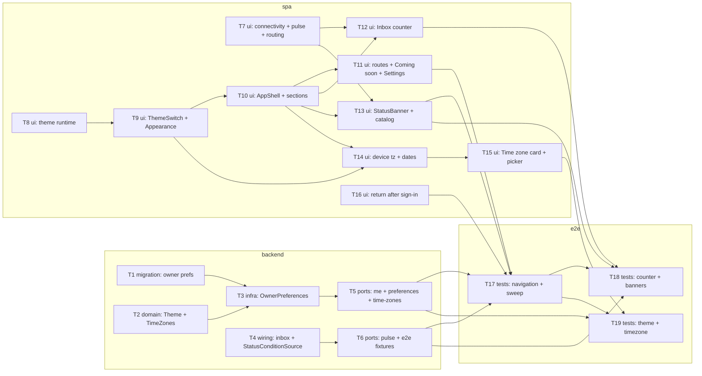

# Epic — app-shell

> **Spec:** [spec.md](../spec.md) · **Design:** [sad.md](../sad.md) · **Data model:** [data-model.md](../data-model.md) · **API:** [openapi.yaml](../contracts/openapi.yaml) · **Screens:** [screens.md](../screens.md) · **ADRs:** [adr/](../adr/)

## Goal

Every signed-in screen gets one shell. On desktop it is a side menu with the seven sections, and on phone a bottom bar with "More". The Inbox counter is live, a Status Banner reports when teleX can't serve the Owner, and theme and timezone are saved on the account. Later UI epics plug into the section registry, the `InboxSource` and the `StatusConditionSource` extension points without changing the shell (spec §2 Goals, sad §1 quality goals).

## Scope

- **In:**
  - Backend: `identity` gains preferences and the known timezone list. A new `inbox` module is added. `shared` gains `StatusConditionSource`. `web` gains the pulse, preferences and timezone-list endpoints, plus the `e2e`-profile fixtures. One migration adds three columns to `owner`.
  - SPA: AppShell and StatusBanner are ported. The section and condition registries, connectivity, the pulse, theme, timezone, Coming soon, Settings and More are added. The return-after-sign-in change touches E01 code.
  - e2e: both Playwright profiles, axe in both themes, the width and target checks, the fast-4G load trace and the 5 s timings.
- **Out (spec §3):**
  - Stop all (C-03) and Resume (E23).
  - The account switcher (C-02, E02/E04).
  - The adaptive panel (C-05, E14).
  - Operator console navigation (E26).
  - Offline reading.
  - A collapsible sidebar and a custom section order.
  - Any real Inbox item or real Status Banner producer. In E06 these exist only as `e2e`-profile fixtures.

## Task map

**Waves** (topological):

| Wave | Tasks |
|---|---|
| 1 | T1, T2, T4, T7, T8, T16 |
| 2 | T3, T6, T9 |
| 3 | T5, T10 |
| 4 | T11, T12, T13, T14 |
| 5 | T15, T17 |
| 6 | T18, T19 |

Backend and SPA start in parallel in wave 1. The SPA builds against `contracts/openapi.yaml` with mocked `fetch`, and only the e2e tasks need the real endpoints. The critical path is T8 → T9 → T10 → T13 → T17 → T18 (6 waves).

**Serialized lanes** (overlapping `files_hint`):
- `shell/AppShell/`: T10 → T12, T13.
- `api/preferences.ts` and `pages/profile-security/`: T9 → T14 → T15.
- `shell/sections.ts`: T10 → T11.
- `e2e/support/shell.ts`: T17 → T18, T19.

## Tasks

See [tracker.md](./tracker.md) for status. Machine contract: [tasks.json](../tasks.json).

| # | Task | Layer | Blocked by | DoD (short) |
|---|---|---|---|---|
| T1 | [Promote the owner-preferences migration](./t01-promote-owner-preferences-migration.md) | migration | — | up → down → up green; both CHECKs proven |
| T2 | [Theme type and known timezone list](./t02-theme-and-known-time-zones.md) | domain | — | unit tests for the list rules |
| T3 | [OwnerPreferences with save-if-unset](./t03-owner-preferences.md) | infra | T1, T2 | IT: change, refuse, never overwrite |
| T4 | [inbox module + StatusConditionSource](./t04-inbox-module-and-condition-source.md) | wiring | — | sum test; `verify()` with 15 modules |
| T5 | [me, preferences, detected tz, time-zones endpoints](./t05-preferences-and-time-zones-endpoints.md) | ports | T3 | contract-validated IT incl. field errors |
| T6 | [Pulse endpoint + e2e fixtures](./t06-pulse-endpoint-and-e2e-fixtures.md) | ports | T4 | IT: per-Owner, 401, background, 404 off-profile |
| T7 | [Connectivity, pulse query, narrowed routing](./t07-connectivity-pulse-and-failure-routing.md) | ui | — | Vitest: banner-not-SCR-93, 3 s visible polling |
| T8 | [Theme runtime](./t08-theme-runtime.md) | ui | — | Vitest: first paint, System, single switch |
| T9 | [ThemeSwitch + Toast action + Appearance](./t09-theme-switch-and-appearance-card.md) | ui | T8 | Vitest: apply, revert, Try again |
| T10 | [AppShell + section registry + More](./t10-appshell-port-and-section-registry.md) | ui | T9 | Vitest: order, phone bar, current, sign out |
| T11 | [Section routes, Coming soon, Settings](./t11-section-routes-coming-soon-and-settings.md) | ui | T10 | Vitest: SCR-94 ×5, SCR-69, chunk failure |
| T12 | [Live Inbox counter](./t12-live-inbox-counter.md) | ui | T7, T10 | Vitest: none / n / 99+ |
| T13 | [StatusBanner + condition catalog](./t13-status-banner-and-condition-catalog.md) | ui | T7, T10 | Vitest: no close, still-down, +N more |
| T14 | [Device timezone save + dates](./t14-dates-in-owner-time-zone.md) | ui | T9, T10 | Vitest: save once, zone-aware dates |
| T15 | [Time zone card + TimeZonePicker](./t15-time-zone-card-and-picker.md) | ui | T14 | Vitest: hint, search, no-match, no empty |
| T16 | [Return after sign-in for new accounts](./t16-return-after-sign-in-for-new-accounts.md) | ui | — | Vitest: passkey step then section |
| T17 | [e2e: navigation + shell sweep](./t17-e2e-navigation-and-shell-sweep.md) | tests | T5, T6, T11, T13, T16 | both projects; axe, width, targets, 2.5 s |
| T18 | [e2e: counter + banners](./t18-e2e-counter-and-banners.md) | tests | T6, T12, T13, T17 | both projects; 5 s timings |
| T19 | [e2e: theme + timezone](./t19-e2e-theme-and-time-zone.md) | tests | T5, T15, T17 | both projects; 200 ms theme, tz flows |

**AC coverage:**

| AC | Tasks |
|---|---|
| AC-170 | T10, T17 |
| AC-43 | T10, T17 |
| AC-07b | T10, T17 |
| AC-171 | T11, T17 |
| AC-172 | T10, T11, T17 |
| AC-173 | T6, T7, T16, T17 |
| AC-174 | T4, T6, T12, T18 |
| AC-175 | T4, T6, T12, T18 |
| AC-176 | T7, T13, T18 |
| AC-177 | T7, T13, T18 |
| AC-178 | T6, T13, T18 |
| AC-179 | T1, T3, T5, T9, T19 |
| AC-180 | T8, T19 |
| AC-181 | T8, T19 |
| AC-182 | T5, T9, T19 |
| AC-183 | T1, T3, T5, T14, T15, T19 |
| AC-184 | T2, T3, T5, T15, T19 |
| AC-185 | T15, T19 |
| AC-186 | T1, T2, T3, T5, T15, T19 |

## Risks / Hard rules

- **Owner-only.** Every preference read or write and every Inbox or condition source call uses the session Owner's id. Nothing can name another Owner (spec §6.1, AC-175).
- **The `e2e` profile never reaches production.** Its beans are `@Profile("e2e")`, it is enabled only through `compose.e2e.yaml` in the CI e2e job, and it is never set in `compose.yaml` or `application.yaml` (sad §11).
- **`shared` stays bean-free.** `StatusConditionSource` is an interface with no Spring annotation (ADR-0006).
- **Shell closed to change.** Later epics may touch only `sections.ts` and `conditions.ts` entries under `frontend/src/shell/` (QG-3a).
- **AC-102 narrowed.** T7 updates `client.test.ts` and `FailureBoundary.test.tsx`, and T18 updates `system-pages.spec.ts`, in the same tasks that change the behavior (sad §11).
- **The 5 s budget is tight.** A 3 s interval plus a 2 s timeout leaves no slack. If T18's timings are flaky, shorten the interval to 2 s (one config value in `pulse.ts`) before `/sdd:ship` (sad §11).
- **Shared append-only files are left out of `files_hint` on purpose.** These are `frontend/src/messages.ts` (copy keys), `frontend/src/components/Icon/Icon.tsx` (icon subset; listed only on T10) and `docs/design-system.md` (inventory rows). Almost every UI task adds to them. Listing them would serialize the whole UI, and their merges are line additions.
- **Open item before `implement`.** The Coming soon sentences (screens.md §Open questions) need PM sign-off. T11 uses the draft until then.
- **UI rules.** Tokens only, both themes, status never by color alone, sentence-case English, no emoji, every UI e2e scenario on both Playwright projects.
