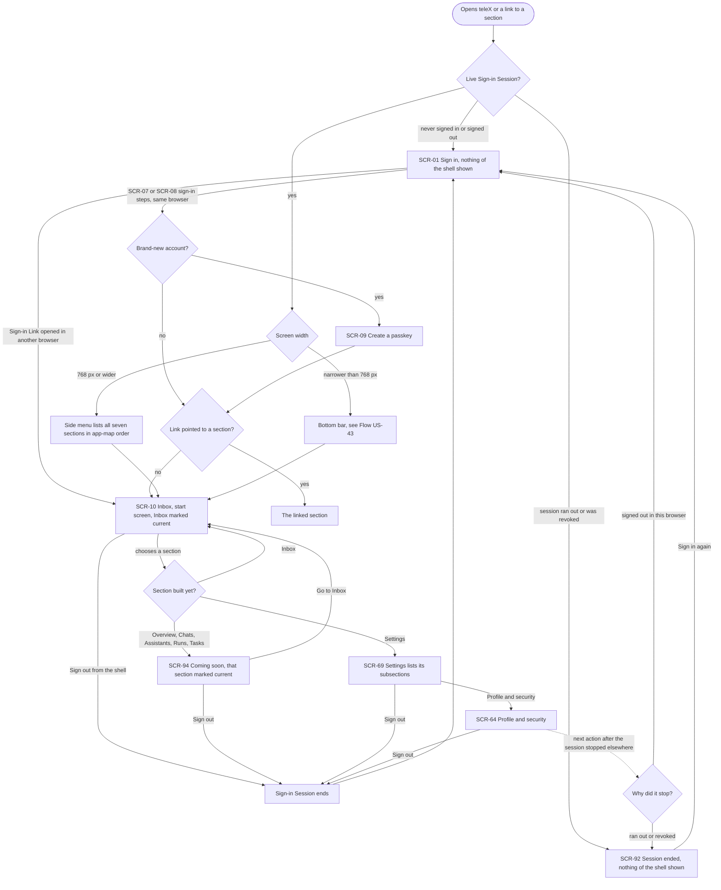
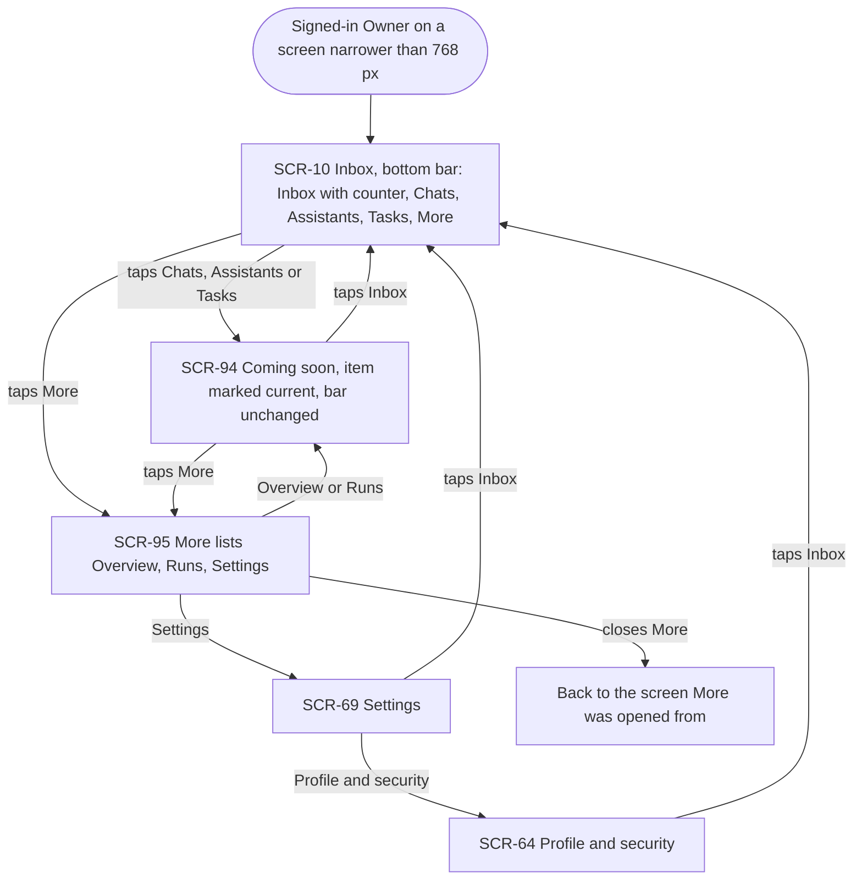
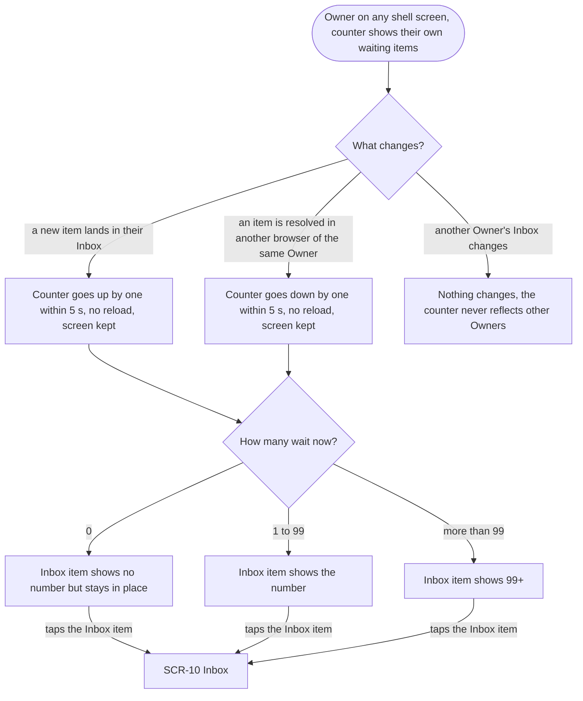
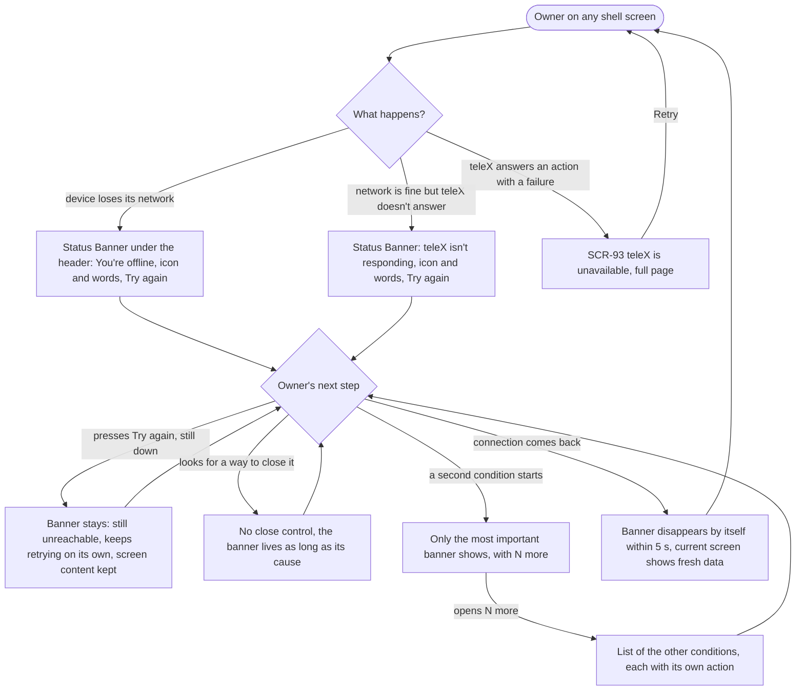
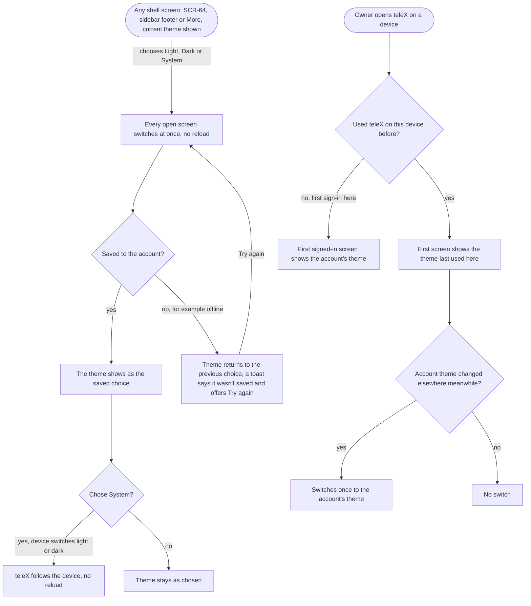
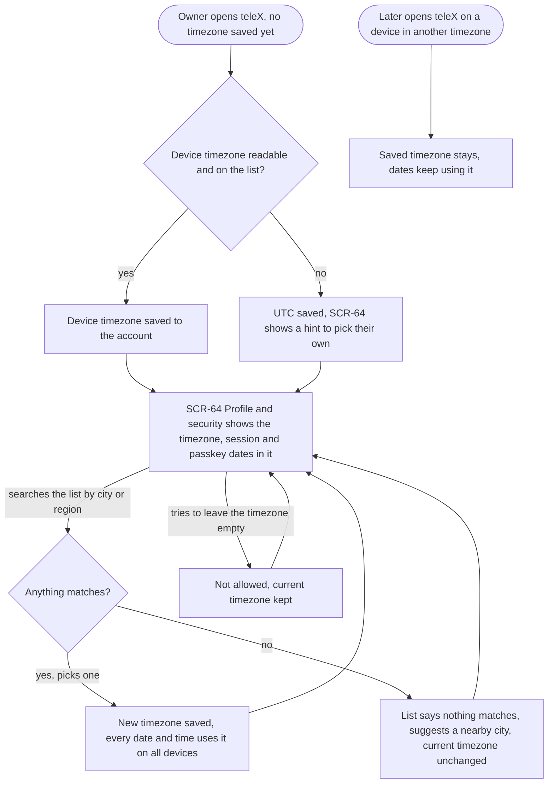

# UX flows — app-shell

> User flows for every UI-touching §4 user story, produced by `ux-flows` (after `clarify`, before
> `design`) and read by `design` (evidence for the target-surface + UI-architecture decisions),
> `sequences` (UI-driven flows align on SCR ids), `screens` (details every inventory row) and
> `plan-tests` (the e2e-through-UI paths). **Always markdown + mermaid `flowchart`**, whatever the
> design tool — this artifact is flow-altitude, not visual design.

## Platform decisions

- **Posture:** responsive-both — per `docs/design-system.md`. Every flow holds at 360 px and 1280 px. The only flow-level difference between widths is the navigation: at 768 px and wider a side menu lists all seven sections, below 768 px a bottom bar holds at most five items with the rest under "More" (SCR-95).
- **One shell around every signed-in screen.** The navigation, Sign out and the Status Banner strip belong to the shell, not to any page, so they're reachable from SCR-10, SCR-64, SCR-69, SCR-94 and SCR-95 alike. In the flows, **"any shell screen"** means any of those five.
- **Sections are pages, not dialogs.** Each of the seven sections has its own address, so a link to it can be shared, bookmarked and resumed after sign-in (AC-173).
- **Unbuilt sections share one page.** Overview, Chats, Assistants, Runs and Tasks each open SCR-94 "Coming soon" at their own address, named for that section, until their epic (E29, E04, E09, E14, E22) replaces it with SCR-80, SCR-20, SCR-30, SCR-40 or SCR-50 ([ADR-0001](./adr/0001-shell-scope-moves-offline-banner-coming-soon-panel.md)).
- **"More" is a phone-only navigation step** (SCR-95), not a section. The bar contents follow the §8 OQ default: Inbox, Chats, Assistants, Tasks, More, with Overview, Runs and Settings under "More". The Inbox never moves under "More".
- **The Status Banner is a strip inside the shell, not a screen.** It never replaces the page and never takes the Owner elsewhere. Only "teleX answered an action with a failure" still replaces the page with SCR-93 (narrowed from E01 AC-102, AC-176).
- **Theme lives in the shell; timezone is edited on SCR-64.** The theme switch is also in the sidebar footer and under More, and still on Profile and security (AC-179); the timezone picker opens in a dialog from SCR-64 (decided 2026-10-03, screens.md noted gap 2). A theme choice applies before it's saved and is rolled back if the save fails (AC-179, AC-182).
- **Screen ids:** product-spec ids are kept (SCR-01, SCR-07, SCR-08, SCR-09, SCR-10, SCR-64, SCR-92, SCR-93 from E01). Three ids are new and need adding to `docs/docs/03-product-spec.md`: SCR-69 Settings (the free slot after the SCR-60…68 settings pages), SCR-94 Coming soon (next free member of the SCR-90 system-page family) and SCR-95 More.
- **Design input (not decided here):** how the Inbox counter and the theme/timezone reach an already open tab (live push vs polling, AC-174's ≤ 5 s), how the shell tells "no network" from "teleX not answering" (AC-176), and how the deep-link destination survives sign-in (inherited from E01) — all for `design`.

## Screen inventory

| ID | Screen | Purpose | Entry | Exit |
|---|---|---|---|---|
| SCR-01 | Sign in (E01) | Starts a sign-in when there's no Sign-in Session | opening any section while signed out or never signed in (AC-173); Sign out; "Sign in again" on SCR-92 | SCR-07/SCR-08 (E01 sign-in steps), then the linked section or SCR-10 |
| SCR-07 / SCR-08 | Check your email / Confirm sign-in link (E01) | The E01 sign-in steps, unchanged | SCR-01 | SCR-09 (new account); the linked section or SCR-10 |
| SCR-09 | Create a passkey (E01) | The passkey offer after the account-creating sign-in | account-creating sign-in | the linked section or SCR-10 (see ledger item 2) |
| SCR-10 | Inbox | The start screen inside the shell; until E11 it's empty with its "Connect Telegram" step | every sign-in without another destination; the Inbox item in the navigation; "Go to Inbox" on SCR-94 | any section via the navigation; SCR-95 (phone); SCR-01 via Sign out |
| SCR-64 | Profile and security | E01's passkeys and sessions, plus theme (light, dark, system) and timezone (searchable list) | "Profile and security" on SCR-69; the UTC hint after AC-183 | stays on SCR-64 for theme and timezone changes; any section via the navigation; SCR-01 via Sign out |
| SCR-69 | Settings | Lists Settings subsections (in E06 only Profile and security; later epics add theirs) | the Settings item in the side menu; Settings under "More" on phone | SCR-64; any section via the navigation |
| SCR-92 | Session ended (E01) | Shown when the Sign-in Session ran out or was revoked | opening a section, or the next action in an open tab, after the session stopped | SCR-01 via "Sign in again" |
| SCR-93 | teleX is unavailable (E01, narrowed) | Full page only when teleX answers an action with a failure | an action that teleX answers with a failure | the screen the action came from, via "Retry" |
| SCR-94 | Coming soon | Names an unbuilt section, says in one sentence what it will hold, offers a way back to the Inbox; the navigation stays with that section marked as current | Overview, Chats, Assistants, Runs or Tasks in the navigation, or a link to one of them | SCR-10 via "Go to Inbox"; any section via the navigation |
| SCR-95 | More (phone only) | Lists the sections that don't fit the bottom bar (Overview, Runs, Settings) | "More" in the bottom bar below 768 px | the chosen section (SCR-94 or SCR-69); back to the screen it was opened from |

## Flows

### Flow: US-70 — Reach any section from anywhere

The Owner opens teleX, or a link to any section, including a "Coming soon" one. Without a live Sign-in Session they see nothing of the shell: someone who never signed in or signed out gets the sign-in page (SCR-01), and a session that ran out or was revoked gets "Session ended" (SCR-92), whose "Sign in again" leads to SCR-01. Once sign-in finishes in the same browser, a brand-new account first gets the passkey offer (SCR-09), and then everyone lands on the section the link pointed to, or on the Inbox when there was none. A Sign-in Link opened in a different browser lands on the Inbox. With a live session, the shell opens on the Inbox (SCR-10) as the start screen with the Inbox marked as current. On a screen 768 px or wider a side menu lists the seven sections in app-map order; narrower screens get the bottom bar (Flow US-43). Choosing the Inbox shows SCR-10. Overview, Chats, Assistants, Runs or Tasks show the "Coming soon" page (SCR-94) for that section, with the navigation still in place and that section marked as current, and "Go to Inbox" leads back. Settings shows SCR-69, which lists Profile and security, one step from SCR-64. Sign out is reachable from the shell on every one of these screens: it ends the session and shows SCR-01. If the session stopped while a tab was open, the next action there shows SCR-92 (ran out or revoked) or SCR-01 (signed out).

### Flow: US-43 — Use teleX fully from a phone

On a phone the Owner starts on the Inbox (SCR-10) with a bottom bar of five items: the Inbox with its counter, Chats, Assistants, Tasks and "More". Tapping Chats, Assistants or Tasks shows that section's "Coming soon" page (SCR-94) with the item marked as current and the bar unchanged. "More" (SCR-95) lists Overview, Runs and Settings, so every section is one tap away. Overview and Runs show SCR-94, Settings shows SCR-69, and from there Profile and security (SCR-64) is one step further. Closing "More" returns to the screen it was opened from. The Inbox item with its counter stays in the bar on every one of these screens and never moves under "More", so the Inbox is one tap away from anywhere. Every screen on this path, in both themes and with a Status Banner showing, fits 360 px without sideways scrolling (AC-07b).

### Flow: US-71 — See what waits for me

On any shell screen, the Inbox item in the navigation counts only the current Owner's waiting items. When a new item lands in their Inbox, or one is resolved in another browser of the same Owner, the counter on the current screen goes up or down within 5 seconds, without a reload and without leaving the screen. Changes in another Owner's Inbox never affect it, and an Owner with nothing waiting sees no number (AC-175). With zero items the Inbox item shows no number but stays in place, from 1 to 99 it shows the number, and above 99 it shows "99+". Tapping it opens the Inbox (SCR-10). Until E11 nothing puts items in the Inbox, so the counter stays empty and the Inbox shows its "Connect Telegram" step.

### Flow: US-72 — Know when teleX can't serve me

On any shell screen, if the device loses its network a Status Banner appears under the header within 5 seconds saying "You're offline"; if the network is fine but teleX doesn't answer (for example while it restarts), it says "teleX isn't responding". Either way it has an icon and words, not color alone, and a "Try again" action, and the Owner stays on their screen. Pressing "Try again" while the connection is still down keeps the banner, which now says teleX is still unreachable and keeps retrying on its own, and nothing on the screen is cleared. There is no way to close the banner while its cause holds. If a second condition starts while the first holds, only the most important banner shows (by the fixed order in spec §8) with "N more", which lists the others, each with its own action. When the connection comes back, the banner disappears by itself within 5 seconds and the current screen refreshes. Separately, when teleX does answer an action but with a failure, the full page "teleX is unavailable" (SCR-93) still replaces the screen, and its "Retry" returns to where the Owner was.

### Flow: US-73 — Choose my theme

On Profile and security (SCR-64), in the sidebar footer or under More, the Owner chooses Light, Dark or System. Every open teleX screen switches to it at once, without a reload, and the choice is saved to their account. If the save fails, for example offline, the theme returns to the previous choice and a toast says the change wasn't saved and offers to try again. With System chosen, teleX follows the device whenever it switches between light and dark, again without a reload. When the Owner opens teleX on a device, a first sign-in there shows the account's theme from the first signed-in screen. A device they've used before first shows the theme last used there, then switches once to the account's theme only if it changed elsewhere in the meantime. A device that was already open picks up a change made elsewhere the next time teleX is opened or reloaded there.

### Flow: US-74 — See times in my timezone

The first time the Owner opens teleX after this change with no timezone saved, teleX takes the device's timezone and saves it to their account. If the device's timezone can't be read or isn't on the list, it saves UTC and Profile and security (SCR-64) shows a hint to pick their own. SCR-64 shows the saved timezone, and the dates on that page (when a Sign-in Session or Passkey was last used) are shown in it. Opening teleX later on a device in another timezone doesn't change it. On SCR-64 the Owner searches the list by city or region and picks another timezone. It's saved, and every date and time uses it from then on, on all their devices; devices already open pick it up on their next open or reload. A search that matches nothing says so, suggests a nearby city, and leaves the current timezone as it was. Trying to leave the timezone empty isn't allowed and keeps the current one, so the only way to change it is to pick another from the list.

## AC coverage

| AC | Shown by | Notes |
|---|---|---|
| AC-170 | Flow US-70 → `WIDTH` "768 px or wider" → `SIDE` → `S10` | Inbox start screen + seven sections in app-map order; "marked by more than color" is a screens/a11y concern |
| AC-43 | Flow US-43 → `S10` bar, `S95` More | Bar contents per §8 OQ default; Inbox never under More |
| AC-07b | Flow US-43 (every node) + every flow at 360 px | A layout check across all shell screens incl. SCR-95, SCR-94, SCR-64 and the banner strip; verified by the NFR width check, not a branch |
| AC-171 | Flow US-70 → `WHICH` → `S94` → "Go to Inbox"; Flow US-43 → `S94` | Navigation stays, section marked current |
| AC-172 | Flow US-70 → `S69` → `S64`; Sign out from every shell screen → `OUT` → `S01` | Same on both widths (SCR-69 reached via More on phone, Flow US-43) |
| AC-173 | Flow US-70 → `SESS` branches → `S01` / `S92`; `NEWACC` → `S09` → `DEST`; another-browser link → `S10`; dotted `STOP` branch | See ledger item 2 (passkey then deep link vs E01 rule) |
| AC-174 | Flow US-71 → `UP` / `DOWN` → `SHOW` (0 / 1–99 / 99+) | Until E11 the Inbox stays empty |
| AC-175 | Flow US-71 → `EVT` "another Owner's Inbox changes" → `NONE` | |
| AC-176 | Flow US-72 → `OFF` / `NR` → `BACK`; `S93` for answered failures | Narrows E01 AC-102 |
| AC-177 | Flow US-72 → `WAIT` "presses Try again, still down" → `STILL` | |
| AC-178 | Flow US-72 → `NOCLOSE`; `MULTI` → `LIST` | In E06 only offline/not-responding exist and they're mutually exclusive, so `MULTI` needs a test-only second condition |
| AC-179 | Flow US-73 → `APPLY` → `SAVE` yes → `DONE` | |
| AC-180 | Flow US-73 → `SYS` yes → `FOLLOW` | |
| AC-181 | Flow US-73 → `DEV` → `SEEN` → `ACC` / `LAST` → `CHG` | Already open devices pick it up on next open or reload |
| AC-182 | Flow US-73 → `SAVE` no → `REVERT` | |
| AC-183 | Flow US-74 → `READ` → `AUTO` / `UTC` → `S64`; `OTHER` → `NOCHG` | |
| AC-184 | Flow US-74 → `MATCH` yes → `SAVED` | |
| AC-185 | Flow US-74 → `MATCH` no → `EMPTY` | |
| AC-186 | Flow US-74 → `REFUSE` | |

## Assumptions ledger (easy depth — veto any item)

1. **New screen ids** SCR-69 Settings, SCR-94 Coming soon, SCR-95 More — to be added to `03-product-spec.md`.
2. **Passkey offer then deep link.** AC-173 says a brand-new account "first gets the passkey offer" and lands on the linked section; the E01 flows sent the account-creating sign-in always to the Inbox (AC-34 over AC-101). These flows follow AC-173 (SCR-09 → linked section or SCR-10). Confirm in `design`, or tighten AC-173.
3. **Timezone save failure isn't specified.** AC-182 covers a failed theme save only. A failed timezone save (offline) isn't drawn; likely the same as the theme (keep the old value, say it wasn't saved, Try again). Candidate for a spec AC.
4. **"More" closes back to where it was opened**, rather than being its own address — a flow choice, not an AC.
5. **Sign out on phone** is reachable from the shell on every screen (AC-172); where exactly (under More or the header) is a `screens` decision.
6. **Crossing 768 px while open** (rotate or resize) isn't drawn; no AC demands a specific behavior beyond the navigation switching form.

## Out of scope

None of §4's user stories are backend-only; all six are drawn. The Operator has no story in this feature (spec §4).
