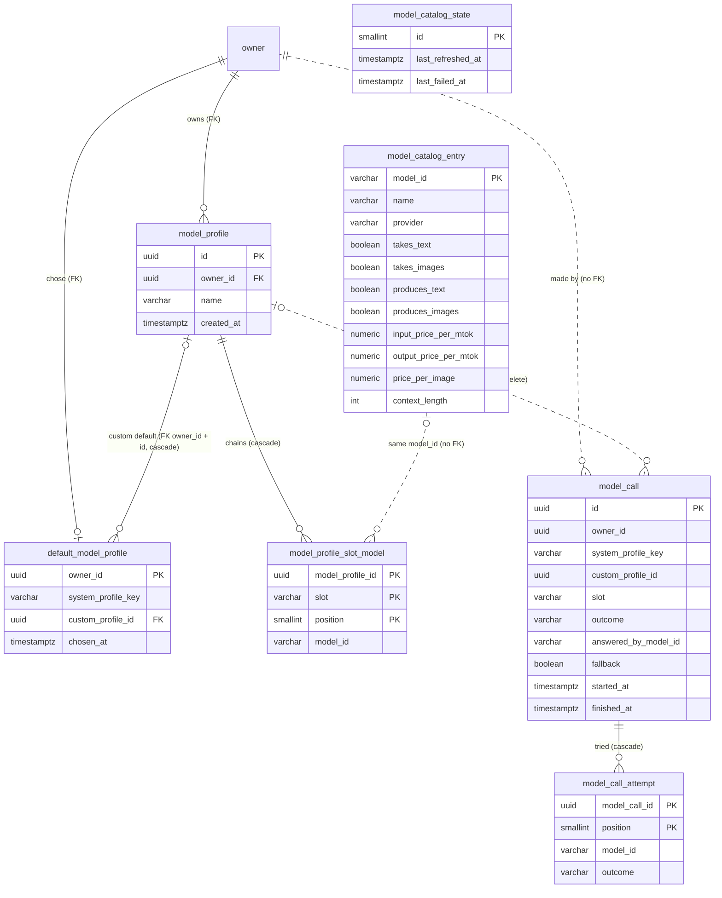

# Data model — model-profiles

> **Sources:** spec.md §5 (AC-10, AC-51, AC-210…AC-229) and §6.1 · sad.md §4 (availability evaluated at use, never stored), §5 (`llm` owns the catalog snapshot, `agents` owns profiles and call records), §6 flows 1–6 + "Flags from `sequences`" (the data-model hints), §7 (call-record growth threshold), §8 (tenancy, concurrency, ID strategy, call-record write) · feature ADR-0002 (`agents`/`llm` split), ADR-0004 (call records in an `agents` table), ADR-0005 (system profiles in configuration, `ProfileRef` encoding left to this stage) · foundation `docs/adr/0003` (Flyway + rollback, UUIDv7) · precedent `docs/features/platform-skeleton/data-model.md`.
> **Staged migrations:** `migrations/01…04_*.up.sql` + `.down.sql`. `implement` promotes them into `db/migration/V<yyyyMMddHHmm>__*.sql` + `db/rollback/U<same>__*.sql`.

Two modules own tables, and neither reads the other's. `llm` owns the Model Catalog snapshot (`model_catalog_entry`, `model_catalog_state`). `agents` owns custom profiles, their chains, the default profile and the call records. `web` owns none. The baseline `event_publication` table carries `ModelCatalogRefreshed`, `ModelProfileDeleted` and `ModelCallFinished` and needs nothing new.

**Conventions applied** (followed from the repo and E01's data model; the four open choices confirmed with the user on 2026-10-03):
- PK: app-generated UUIDv7 (`telex.shared.Uuid7`) for `model_profile` and `model_call`. Natural keys where the domain has one: the provider's model id for catalog entries, `owner_id` for the one-per-Owner default, and `(parent, slot/position)` for chain and attempt rows.
- Time: `TIMESTAMP WITH TIME ZONE`, written from the injectable `Clock`. No `DEFAULT now()`.
- Audit columns: only the timestamps the domain needs (`created_at`, `chosen_at`, `started_at`/`finished_at`, refresh times). No generic `updated_at` (profile edits are last-write-wins, sad §11).
- Delete strategy: hard delete for custom profiles (AC-220). Their chains and a default that points to them go with them. Call records are append-only in code and are never deleted in E10.
- Constraints: NOT NULL / UNIQUE / FK, plus light named `CHECK`s on enum-like values, ranges and "exactly one of" pairs, the same as E01. The rules are still enforced and tested in Kotlin. The DB checks are a backstop.
- Constraint names: `<table>_<what>_{ck|fk|uq|idx}`.
- Strings: `VARCHAR(N)`. A profile name is 40 (AC-214). A model id is 200: OpenRouter ids such as `openai/gpt-4o-mini:free` are well under 100, so 200 leaves headroom. The adapter skips and logs a longer one (sad §11 defensive parsing).
- Money: `NUMERIC(14, 6)` USD (Kotlin `BigDecimal`, sad §8), stored **per million tokens** and **per image**, the units the catalog shows (AC-211). The adapter converts OpenRouter's per-token decimal strings by shifting the decimal point, with no rounding.

**User decisions taken in this stage (2026-10-03):**
1. **`ProfileRef` = two columns**, `system_profile_key VARCHAR(16)` + `custom_profile_id UUID`, with exactly one set (`CHECK num_nonnulls(…) = 1`). E09's agent table copies this pair. Where the reference must stay inside the Owner's own profiles, it gets the composite FK `(owner_id, custom_profile_id) → model_profile(owner_id, id)`. Resolves feature ADR-0005's open encoding.
2. **Fallback Chains and call attempts in child tables** (`model_profile_slot_model`, `model_call_attempt`), so the DB enforces "at most three, each model once".
3. **Catalog snapshot as one row per model**, plus a one-row state table, rather than a JSONB document.
4. **FK to `owner(id)` on the profile tables only.** `model_call.owner_id` has no FK and no index, because the record is a log that outlives its references.

**Not stored (by design):**
- *System profiles.* They live in `telex.models.system-profiles.*` settings and are referenced by key (feature ADR-0005).
- *Model availability, slot state, "Main model unavailable", price estimate.* These are computed against the current catalog at read and call time (sad §4). A profile keeps every model id the Owner chose, including ones that left the catalog (AC-221, AC-10).
- *Unsaved drafts, including the "duplicated from" source.* Create and Duplicate return a draft, and only Save writes a profile (sad §6 flags for `api`).
- *Request or answer text.* No column holds content (AC-229, spec §6.1).
- *A refresh history.* Only the last success and the last failure are kept. Catalog age comes from `last_refreshed_at` and the `telex.llm.catalog.age.hours` gauge (sad §7).

## ER diagram

`owner` belongs to `identity` (E01) and is shown only as the FK target. Dotted lines are logical links without a database FK.

## Entities

### `llm` — Model Catalog snapshot

#### `model_catalog_entry`

| Column | Type | Constraints | Notes |
|---|---|---|---|
| `model_id` | VARCHAR(200) | PK | Provider's id, e.g. `openai/gpt-4o-mini` (`ModelId`) |
| `name` | VARCHAR(200) | NOT NULL | Display name (AC-211) |
| `provider` | VARCHAR(100) | NOT NULL | Shown as the provider (AC-211). The adapter derives it from the id prefix |
| `takes_text` | BOOLEAN | NOT NULL | What it accepts (AC-211). Slot fit: text = `takes_text AND produces_text` |
| `takes_images` | BOOLEAN | NOT NULL | Vision = `takes_images AND produces_text` (AC-211, AC-216) |
| `produces_text` | BOOLEAN | NOT NULL | |
| `produces_images` | BOOLEAN | NOT NULL | Image = `produces_images` |
| `input_price_per_mtok` | NUMERIC(14,6) | NULL, `≥ 0` | USD per million input tokens. NULL = unknown → "Price unknown" (AC-210). 0 → "Free" |
| `output_price_per_mtok` | NUMERIC(14,6) | NULL, `≥ 0` | USD per million output tokens |
| `price_per_image` | NUMERIC(14,6) | NULL, `≥ 0` | USD per created image, for image models (AC-211) |
| `context_length` | INTEGER | NULL, `> 0` | "How much text it can take at once" (AC-211). NULL when the provider doesn't say |

**Aggregate root:** the snapshot as a whole (`ModelCatalog`). A refresh replaces every row and updates `model_catalog_state` in **one transaction**, so a restart never loads a half-written list (AC-212).
**Access patterns:** load all rows at startup into the in-memory holder (sad §7), then replace all rows on each successful refresh. Both are full-table operations on about 500 rows, so the PK is the only index.
**Constraints:** `model_catalog_entry_fits_a_slot_ck`: only slot-fit models are stored (AC-211). Non-negative prices and a positive context length. Modalities other than text and images (audio, files) aren't stored, because no slot uses them.

#### `model_catalog_state`

| Column | Type | Constraints | Notes |
|---|---|---|---|
| `id` | SMALLINT | PK, `CHECK id = 1` | Single row, upserted (`INSERT … ON CONFLICT (id) DO UPDATE`) |
| `last_refreshed_at` | TIMESTAMPTZ | NULL | Last successful refresh: "the time it is from" (AC-212), the catalog age KPI |
| `last_failed_at` | TIMESTAMPTZ | NULL | Last failed refresh. `last_failed_at > last_refreshed_at` (or no success yet) → "couldn't be updated" note (AC-212) |

**Aggregate root:** part of the snapshot.
**States:** no row = never attempted. A row with `last_refreshed_at IS NULL` = never loaded ("The model list isn't available yet", AC-212). A missing provider key writes nothing: "not configured" is a runtime state from settings (AC-226).
**Constraints:** `model_catalog_state_attempted_ck`: a row exists only after at least one attempt.

### `agents` — custom Model Profiles (aggregate root `model_profile`)

#### `model_profile`

| Column | Type | Constraints | Notes |
|---|---|---|---|
| `id` | UUID | PK, app-generated UUIDv7 | `ModelProfileId` |
| `owner_id` | UUID | NOT NULL, FK → `owner(id)` | Every query filters on it (AC-222, sad §8) |
| `name` | VARCHAR(40) | NOT NULL, `1–40` chars, stored trimmed | AC-214. Unique per Owner ignoring case (index below). System names are reserved in code |
| `created_at` | TIMESTAMPTZ | NOT NULL | Stable list order on the Models page |

**Aggregate root:** root (chains are its children).
**Access patterns:**
- find my profile by id (edit, delete, set as default, resolve for a call; AC-222) → `model_profile_owner_id_id_uq`;
- list my profiles, and count them for the 20 limit (AC-218) → leading `owner_id` of `model_profile_owner_id_lower_name_uq` / `model_profile_owner_id_id_uq`;
- name taken? (AC-214, the "Balanced copy N" pick in AC-213) → `model_profile_owner_id_lower_name_uq`.
**Constraints:** `model_profile_owner_id_id_uq` UNIQUE `(owner_id, id)` is the target of the composite FK from `default_model_profile`, and E09's agents will use it too. `model_profile_name_trimmed_ck`: `char_length(name) ≥ 1 AND name = btrim(name)`. Kotlin trims before saving. Case-insensitive uniqueness uses Postgres `lower()`. Kotlin compares with `lowercase()`, and the unique index is the final word on a race.
**Limit of 20 (AC-218) under concurrency:** the save transaction first takes `pg_advisory_xact_lock(<hash of owner_id>)`, then counts the Owner's profiles and inserts. Two parallel creates by one Owner are serialized, so the 21st fails as `profile-limit-reached` (sad §6 flow 5, "limit reached meanwhile"). This needs no schema object.

#### `model_profile_slot_model`

| Column | Type | Constraints | Notes |
|---|---|---|---|
| `model_profile_id` | UUID | PK part, FK → `model_profile(id)` ON DELETE CASCADE | |
| `slot` | VARCHAR(8) | PK part, `IN ('text','vision','image')` | `ModelSlotKind` |
| `position` | SMALLINT | PK part, `1–3` | 1 = main model. At most three per slot (AC-217) |
| `model_id` | VARCHAR(200) | NOT NULL, no FK | May have left the catalog: kept and marked "Not in the catalog" (AC-213, AC-221, AC-10) |

**Aggregate root:** `model_profile`. A save deletes the profile's rows and inserts the new chains in the same transaction as the profile row, so a reorder (AC-213) never hits the unique keys halfway. Positions are written contiguously from 1 by code. An empty vision or image slot has no rows ("Not used", AC-223). The text slot needs at least one row (AC-215, enforced in code).
**Access patterns:** load the chains of one profile, or of all my profiles at once (`model_profile_id = ANY(…)`) → PK / `model_profile_slot_model_once_uq` (leading `model_profile_id`).
**Constraints:** `model_profile_slot_model_once_uq` UNIQUE `(model_profile_id, slot, model_id)`: each model at most once per slot (AC-217). Capability fit (AC-216) is checked in code against the catalog. It can't be a DB rule, because the catalog changes.

### `agents` — default profile

#### `default_model_profile`

| Column | Type | Constraints | Notes |
|---|---|---|---|
| `owner_id` | UUID | PK, FK → `owner(id)` | One per Owner. **No row = Balanced** (feature ADR-0005) |
| `system_profile_key` | VARCHAR(16) | NULL, `IN ('fast','balanced','careful')` | `ProfileRef.System` |
| `custom_profile_id` | UUID | NULL, FK `(owner_id, custom_profile_id)` → `model_profile(owner_id, id)` ON DELETE CASCADE | `ProfileRef.Custom`. The composite FK keeps it among the Owner's own profiles (AC-222) |
| `chosen_at` | TIMESTAMPTZ | NOT NULL | When the default was last set |

**Aggregate root:** root (one per Owner).
**Access patterns:** read my default on every Models page load and profile call → PK. Set the default → upsert on PK (AC-51). Choosing Balanced deletes the row, so "stored only when it differs from Balanced" holds (ADR-0005). The `'balanced'` key is still allowed by the check, because the key set is shared with `model_call` and E09.
**Delete of the default custom profile (AC-220):** the delete transaction first runs `DELETE FROM default_model_profile WHERE owner_id = ? AND custom_profile_id = ?`. Its row count tells the service whether to say "Balanced is now the default". Then it deletes the profile. The FK's `ON DELETE CASCADE` is the backstop, so the default can never point at a deleted profile (sad §6 flow 6 postcondition). Verified on Postgres: the cascade removes the default and chain rows and leaves call records alone.
**Constraints:** `default_model_profile_ref_ck`: exactly one of the two reference columns. The FK index for both FKs is the PK, because `owner_id` is unique here.

### `agents` — call records (aggregate root `model_call`, append-only)

#### `model_call`

| Column | Type | Constraints | Notes |
|---|---|---|---|
| `id` | UUID | PK, app-generated UUIDv7 | `ModelCallId` |
| `owner_id` | UUID | NOT NULL, **no FK** | The Owner (AC-229) |
| `system_profile_key` | VARCHAR(16) | NULL, `IN ('fast','balanced','careful')` | Profile used, as `ProfileRef` |
| `custom_profile_id` | UUID | NULL, **no FK** | Kept after the profile is deleted (sad §6 flags) |
| `slot` | VARCHAR(8) | NOT NULL, `IN ('text','vision','image')` | |
| `outcome` | VARCHAR(24) | NOT NULL, `IN ('answered','no-model-available','no-model-answered','ai-not-configured')` | Slot result (sad §8 "Model call failures") |
| `answered_by_model_id` | VARCHAR(200) | NULL, set iff `outcome = 'answered'` | The model that answered (AC-224) |
| `fallback` | BOOLEAN | NOT NULL | True when a later model answered or was needed, **including** a skipped missing main model (AC-229) |
| `started_at` | TIMESTAMPTZ | NOT NULL | "When it happened" (AC-229) |
| `finished_at` | TIMESTAMPTZ | NOT NULL, `≥ started_at` | Call duration for run details (E14) |

**Aggregate root:** root, with attempts as children. Written once per profile call, in the call path, after `llm` returns or fails (feature ADR-0004). The repository exposes insert and read only.
**Access patterns in E10:** insert only, plus tests. Future readers are E14 run details (E14 adds its `run_id` column and its own index) and the "Calls saved by fallback" KPI, which is an occasional aggregate over a time window. Neither has an E10 query, so **no secondary index** is created. An index on `started_at` comes with the retention or rollup job at about 1 000 000 rows (sad §7, §11).
**Constraints:** `model_call_profile_ref_ck` (exactly one reference), `model_call_answered_by_ck` (answering model ⇔ answered), `model_call_finished_ck`. No FKs: the record must outlive the profile, and the busiest table gets no FK index (user decision 4).

#### `model_call_attempt`

| Column | Type | Constraints | Notes |
|---|---|---|---|
| `model_call_id` | UUID | PK part, FK → `model_call(id)` ON DELETE CASCADE | Cascade lets a future retention job delete calls only |
| `position` | SMALLINT | PK part, `1–3` | Chain order. A chain holds at most three models, and Operator models beyond the third are ignored (AC-227) |
| `model_id` | VARCHAR(200) | NOT NULL | Model tried |
| `outcome` | VARCHAR(24) | NOT NULL, `IN ('answered','missing','unavailable','provider-error','rate-limited','timeout','too-large','content-refused','invalid-request')` | Per-attempt outcome (feature ADR-0003). `missing` = skipped as not in the catalog |

**Aggregate root:** `model_call`. An empty slot or `ai-not-configured` has zero attempts. `no-model-available` with a chain of missing models has one `missing` row per model (sad §8).
**Access patterns:** read a call's attempts (run details, tests) → PK.

## Indexes

| Index | Columns | Query it serves |
|---|---|---|
| `model_catalog_entry_pkey` | `model_catalog_entry(model_id)` | Replace-all on refresh and the full load at startup (Critical flow 2). No secondary index: the catalog is read whole into memory |
| `model_catalog_state_pkey` | `model_catalog_state(id)` | Upsert of the refresh outcome, read at startup (Critical flow 2; AC-212) |
| `model_profile_owner_id_id_uq` (unique) | `model_profile(owner_id, id)` | Find my profile by id for edit, delete, default and call resolution (flows 1, 4, 5, 6; AC-222). Target of the composite FK from `default_model_profile`. Also covers the `owner_id` FK |
| `model_profile_owner_id_lower_name_uq` (unique, expression) | `model_profile(owner_id, lower(name))` | Name taken / pick "Balanced copy N" (flow 5; AC-213, AC-214). Its leading `owner_id` also serves "list my profiles" and the count for the 20 limit (flows 3, 5; AC-218) |
| `model_profile_slot_model_pkey` | `model_profile_slot_model(model_profile_id, slot, position)` | Load chains for one or all of my profiles (flows 3, 5, 1). Also the FK index for `model_profile_id` |
| `model_profile_slot_model_once_uq` (unique) | `model_profile_slot_model(model_profile_id, slot, model_id)` | Enforces "each model once per slot" (AC-217) |
| `default_model_profile_pkey` | `default_model_profile(owner_id)` | Read or set my default (flows 3, 4; AC-51). Clear it on delete (flow 6; AC-220). FK index for both FKs (leading `owner_id`, unique) |
| `model_call_pkey` | `model_call(id)` | Insert. Read one call (run details, tests) |
| `model_call_attempt_pkey` | `model_call_attempt(model_call_id, position)` | Read a call's attempts. Also the FK index |

Verified with `EXPLAIN` on Postgres 17 (`pgvector/pgvector:pg17`): find by `(owner_id, id)`, count by `owner_id`, name lookup by `(owner_id, lower(name))` and the chain load by `model_profile_id = ANY(…)` each use the index named above.

## Test fixtures

Kotlin builders under `backend/app/src/integrationTest/kotlin/telex/{llm,agents}/` (not in `db/migration`). Every timestamp comes from a test `Clock`. Owners come from E01's `anOwner(email = "user-<uuid>@example.test")`.

- `aCatalogEntry(modelId = "test/text-model-a", name = "Test text model A", provider = "test", takes = setOf(TEXT), produces = setOf(TEXT), inputPerMtok = "0.15", outputPerMtok = "0.60", perImage = null, contextLength = 128_000)` plus presets `aVisionModel()`, `anImageModel()`, `aFreeModel()`, `anUnpricedModel()` (AC-210, AC-211).
- `aCatalogSnapshot(entries, refreshedAt, failedAt = null)` writes entries and the state row in one transaction. `aCatalogOf(count = 500)` is the QG-4 payload.
- `aCustomProfile(owner, name = "Cheap vision", text = listOf(…), vision = listOf(…), image = emptyList(), createdAt)` — model ids may be absent from the catalog on purpose (AC-221, AC-10).
- `twentyProfiles(owner)` — the AC-218 limit.
- `aDefaultProfile(owner, ref = ProfileRef.System("careful") | ProfileRef.Custom(id))`.
- `aCallRecord(owner, ref, slot = TEXT, attempts = listOf("test/a" to MISSING, "test/b" to ANSWERED), fallback = true)` — KPI and run-detail reads.
- WireMock `/models` fixtures: copies of real OpenRouter responses with only the model list trimmed (sad §11).

No bootstrap or lookup seeds: system profiles come from settings, and a new Owner needs no row (no default = Balanced).
