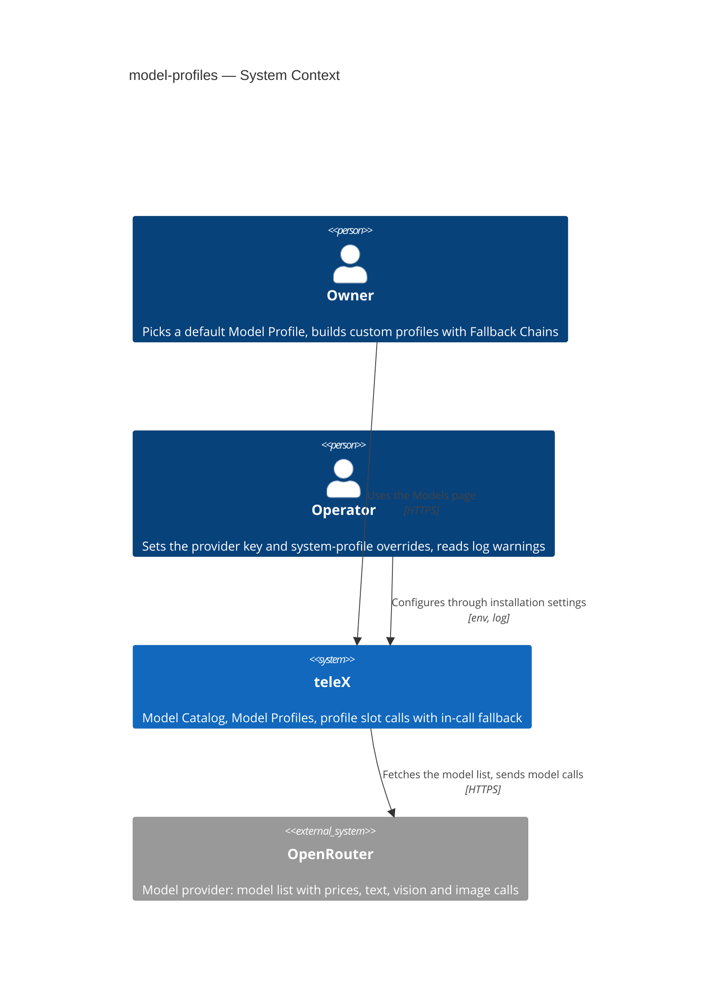
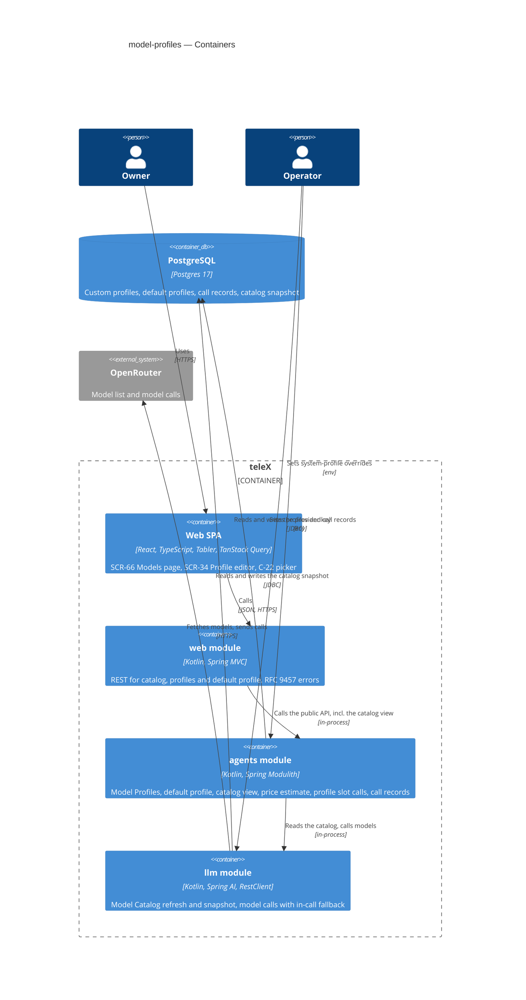
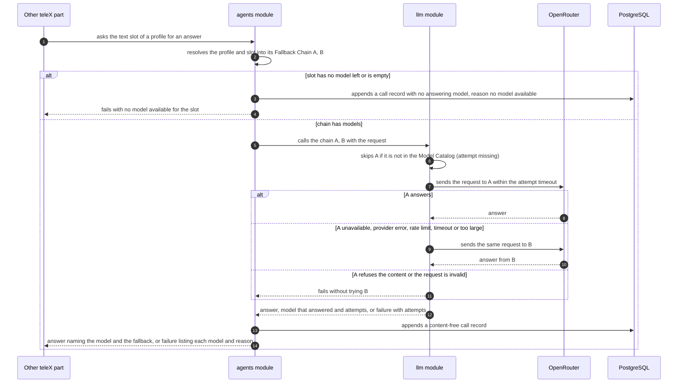
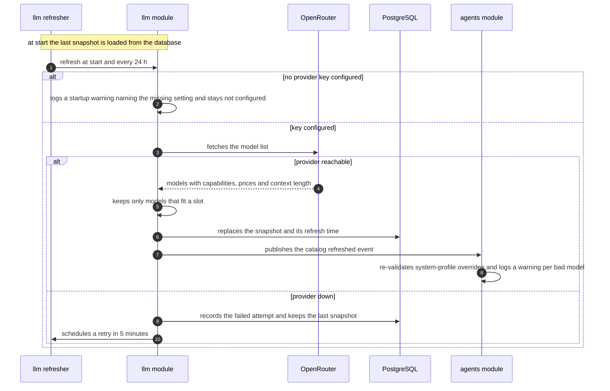
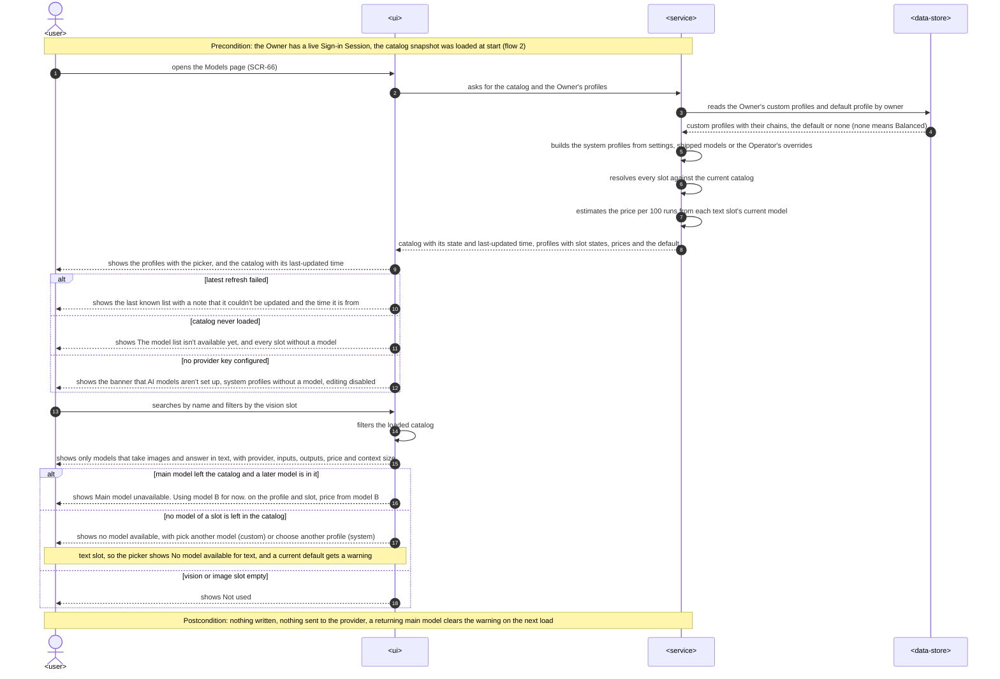
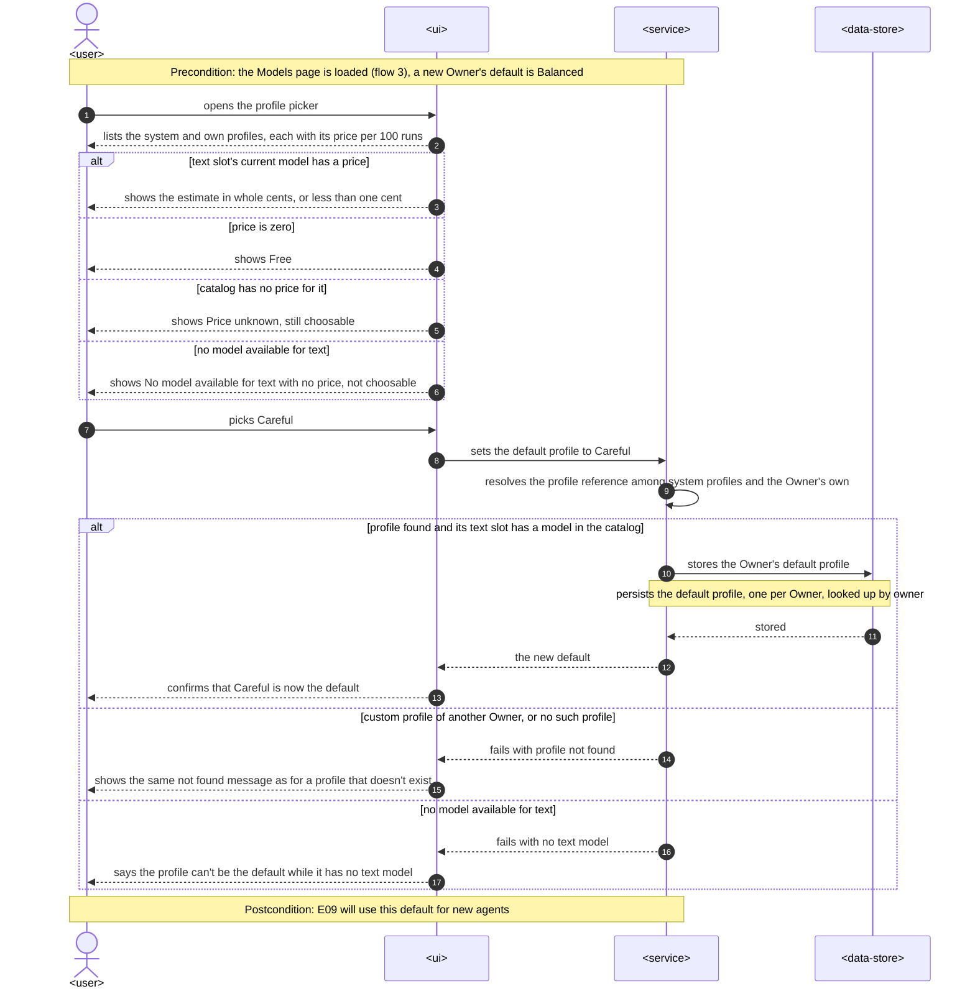
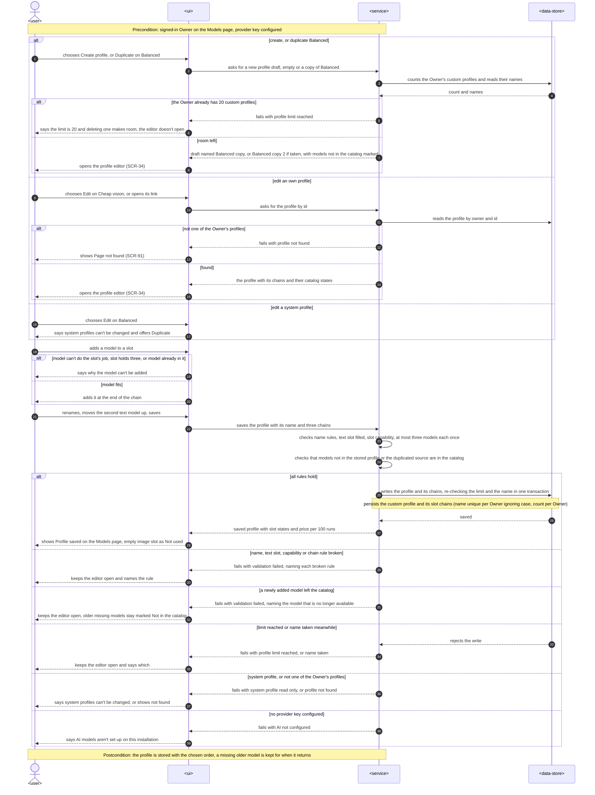
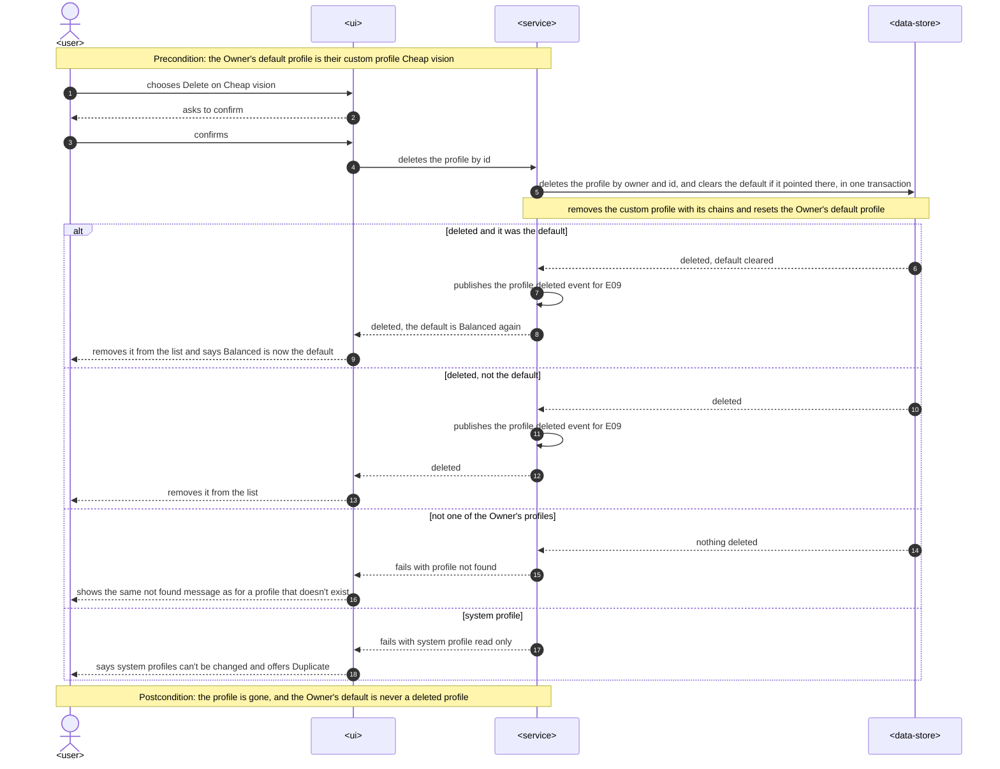

# Software Architecture Document — model-profiles

<!-- 12 Arc42 sections. Empty section → <!-- N/A: <one-line reason> -->. -->
<!-- C4 Context (L1) lives inline in §3. C4 Container (L2) lives inline in §5. -->
<!-- Numbers in §10 come VERBATIM from spec.md §6 NFR — no inventing, no rounding. -->

## 1. Introduction and goals

**Intent.** teleX gets its model choice before anything uses it. A Models page shows the Model Catalog, which is refreshed automatically from the model provider (OpenRouter) and survives restarts and outages. Next to it are the Owner's Model Profiles: three system profiles (Fast and cheap, Balanced, Careful) whose models the Operator may override, and up to 20 custom profiles per Owner. Each profile has three Model Slots (text, vision, image), and each slot holds a Fallback Chain of up to three models. The Owner picks a default profile in a reusable picker that shows an estimated price per 100 runs. Behind the page, other parts of teleX (E14 runs, triage) ask a profile's slot for an answer. teleX uses the first model in the chain that is in the catalog, moves to the next model inside the same request when one fails, and records every call without content. Success means that no AI work stops because one model vanished, and that the Owner can read the price of a choice before making it (spec §2).

**Top-3 quality goals (1-liners; full scenarios in §10):**

1. **Model loss never stops AI work.** A missing or failing model is skipped within the same request. A provider outage breaks no page load, profile save or slot resolution, and the last known catalog stays in use, also after a restart.
2. **The price is readable before the choice.** Every profile in the picker shows a correctly rounded estimate per 100 runs, or an explicit "Free", "< $0.01" or "Price unknown".
3. **The Models page is fast and works everywhere.** p95 ≤ 1 s with a catalog of 500 models, at 360 px and 1280 px, WCAG 2.2 AA.

**Stakeholders.**

| Role | Interest | Sign-off owner? |
|---|---|---|
| Owner | Browses the Model Catalog, builds custom Model Profiles with Fallback Chains, picks a default profile by price, and sees fallback warnings (US-13, US-80, US-81, US-82) | No |
| Operator | Sets the installation's provider key and optional system-profile slot overrides, and reads startup and override warnings in the log (US-83) | No |
| Tech Lead | SAD approval; the `agents`/`llm` split and the profile-call port that E09, E14 and triage build on | Yes |
| Security Lead | Owner isolation of custom profiles (AC-222) and provider-key handling, reviewed through the regular `/sdd:review` (spec §6.1) | No |

<!-- Decision overrides (¶4) — populated by the critic resolution loop, empty otherwise. -->

## 2. Constraints

**Technical.**
- Kotlin 2.4.10 on JDK 25 with virtual threads on (`spring.threads.virtual.enabled`). A model call blocks its virtual thread for up to the attempt timeout. Foundation [ADR-0001](../../adr/0001-kotlin-spring-modulith-postgres-react-stack.md).
- Spring Boot 4.1.1 (Web MVC, Data JDBC with `JdbcClient`, Flyway, Actuator, Validation, Security from E01), Spring Modulith 2.1.1 with the JDBC event publication registry, and Spring AI 2.0.1 (BOM already applied through `spring.ai.conventions`). **Added by this feature:** the Spring AI OpenAI-compatible chat model starter, pointed at OpenRouter's endpoint. Versions only in `gradle/libs.versions.toml`.
- PostgreSQL 17 + pgvector (`pgvector/pgvector:pg17`) through Flyway, with a paired rollback per migration. Foundation [ADR-0003](../../adr/0003-postgres-jdbc-flyway-uuidv7-persistence.md).
- Frontend: React 19, TypeScript 6, Vite, `@tabler/core` 1.6.1, React Router 8, TanStack Query 5. Playwright at 360 px and 1280 px (spec §6).
- Module boundaries: `llm` is an integration ACL that may depend on `shared` only. `web` may depend on core modules (incl. `agents`) but not on `llm`. `agents` may depend on `llm` (`package-info.java` of each). This feature keeps all of them unchanged ([feature ADR-0002](adr/0002-profiles-in-agents-llm-thin-acl.md)).

**Organisational.**
- One developer (Anton Husiev) on the course timeline. The spec sets no deadline. E10 is roadmap wave 3, in parallel with E02 (telegram-link) and E06 (app-shell), and it unblocks E26 and E14.
- Size S, route `quick`. No real model call is made by anything an Owner does in E10. The real call per slot is a developer smoke check recorded in the pull request (spec §6).
- E06 (app shell, with the Settings page) may not have shipped when E10 does. The Models page therefore has its own route and an interim entry link (§4).

**Conventions.**
- `CLAUDE.md` and `docs/architecture-map.md` §Conventions: public API at the module root, the rest in `internal`, `ApplicationModules.verify()` in `ModularityTest`.
- IDs: app-generated UUIDv7 via `telex.shared.Uuid7.next()`, typed `ModelProfileId` / `ModelCallId` as `@JvmInline value class … : TypedId`. System profiles have keys, not ids ([feature ADR-0005](adr/0005-system-profiles-in-configuration-by-key.md)). Model ids are the provider's strings (e.g. `openai/gpt-4o-mini`), typed as `ModelId`.
- Errors: RFC 9457 `application/problem+json`, `type = urn:telex:error:<code>`, kebab-case `code` and `errors[]`; domain errors extend `telex.shared.DomainProblem`, rendered by `telex.web.ProblemHandler`.
- Every Owner-owned row carries `owner_id` and every query filters on it (precedent: `identity/internal/owner/Owners.kt`).
- UI: `docs/docs/design-system/README.md`. Tokens only, status never by color alone, `ai` purple only for AI-produced content (none here), sentence-case English copy in `frontend/src/messages.ts`, no emoji.

**Regulatory / external.**
- Data classification internal. teleX never stores or logs request or answer text (spec §6.1). A profile call passes the caller's request only to the model provider and returns the answer to the caller, and the call record is content-free by construction (AC-229). Nothing an Owner does in E10 triggers a model call.
- The provider key is an installation secret. It is set only through installation settings (environment), never returned to the browser, never logged (spec §6.1).
- Security review: N/A per spec §6.1. Ownership follows E01's rule (AC-97), and key handling is covered by `/sdd:review`.
- OpenRouter terms of use apply to the installation key. Data-retention filtering is out of scope (spec §3, §8).

## 3. Context and scope

teleX lets each Owner run AI helpers inside their Telegram account. This feature adds the model layer under those helpers. teleX keeps a catalog of the models the installation can call, lets Owners compose them into profiles with backups, and gives the rest of teleX one way to get an answer from a profile's slot that survives a vanished or failing model. The only new external system is the model provider, OpenRouter. The trust boundary is the provider's HTTPS endpoint: its catalog data is validated before it is stored, and its errors are classified, never passed through raw.

<!-- brownfield: post-scaffold + E01 repo — 14 Modulith modules with `llm` and `agents` empty, `identity`/`web`/`mail` built by E01, React SPA with React Router + TanStack Query, Flyway with 6 migrations, `Clock` bean, Actuator; no OpenRouter config or scheduling yet -->

**External systems (in / out):**

| Actor or system | Type | Interaction |
|---|---|---|
| Owner | Person | Browses the catalog, builds and deletes custom profiles, picks a default profile on the Models page |
| Operator | Person | Sets the provider key and optional system-profile overrides in the installation settings, reads warnings in the teleX log |
| OpenRouter | System (external) | Supplies the model list with capabilities and prices (refreshed at start and every 24 h), and answers text, vision and image calls |
| Other teleX parts (E14 runs, triage) | System (internal, future callers) | Ask a profile's slot for an answer through the `agents` profile-call API and get the answer or a typed failure. No caller exists in E10 besides tests and the smoke check |

**C4 Context (L1):**



## 4. Solution strategy

**Top strategic choices (the seeds for ADRs):**

1. **Target surfaces: `backend-service` + `web-frontend`.** The spec's actors are an Owner on a web page (SCR-66 Models, SCR-34 Profile editor in `ux-flows.md`) and internal callers of a profile slot. That is the existing app container plus the existing SPA. Both containers already exist, so this is an inline decision with no ADR. **UI architecture (web-frontend):** client-side SPA, inherited from foundation ADR-0001 and E01. The Models page is a React Router route, `/settings/models`, so that E06's Settings navigation can link it. The profile editor is a modal over it, on the child routes `/settings/models/profiles/new` and `/settings/models/profiles/:id`. A `:id` the Owner can't see renders SCR-91 "Page not found" (AC-222). Server state goes through TanStack Query. The picker (C-22) is a standalone component that takes the profile list and the current default, so E09 can embed it in the builder (feature ADR-0001). Until E06 ships, a "Models" link in the E01 signed-in page frame is the entry.
2. **Profiles in `agents`, `llm` a thin provider ACL** ([feature ADR-0002](adr/0002-profiles-in-agents-llm-thin-acl.md)). `llm` knows models and calls: the catalog, its snapshot, capabilities, prices, and a call over an ordered list of model ids. `agents` knows Owners and profiles: custom and system profiles, slot rules, the default profile, price estimates, resolution and call records. No module boundary changes.
3. **In-call fallback as a client-side loop in `llm`** ([feature ADR-0003](adr/0003-client-side-fallback-loop-in-llm.md)). There is one attempt per model, each with its own timeout (60 s by default, configurable). Each outcome is classified as move-on or stop, and the result carries the attempts. This is what makes AC-224, AC-228 and AC-229 hold, and it keeps E27's BYOK a change inside `llm`.
4. **Content-free call records in `agents`** ([feature ADR-0004](adr/0004-call-records-in-agents-table.md)). One append-only record per profile call, including calls that fail before reaching the provider, written in the call path, plus a `ModelCallFinished` event. Run details (E14) and the fallback KPI read one table.
5. **System profiles in configuration, referenced by key** ([feature ADR-0005](adr/0005-system-profiles-in-configuration-by-key.md)). `ProfileRef = System(key) | Custom(ModelProfileId)`. Profile tables hold only Owner-owned rows, and "no stored default" means Balanced.

Resilience comes from one rule applied everywhere: **model availability is evaluated against the catalog at the moment of use, never stored on the profile.** A profile keeps the model ids the Owner chose, including ones that left the catalog (marked "Not in the catalog"). Warnings, prices and call routing are computed from the current catalog, so a model that returns is used again with no data change (AC-10, AC-221).

Each tactical decision in later sections should trace to one of these seeds. Tactical decisions that *contradict* a strategic choice are red flags — surface them in §11.

## 5. Building block view

The feature follows the repo's Modulith layering (public API at the module root, everything else in `internal`) across three modules plus the SPA. The flow of dependency is `web` → `agents` → `llm`, which are all edges already allowed. `llm` is hexagonal in miniature: a provider port with an OpenRouter adapter behind it, so tests replace OpenRouter with WireMock. `agents` holds the domain rules (slot capability, chain size and uniqueness, name rules, the 20-profile limit, system read-only) in plain Kotlin, tested without Spring.

**Internal decomposition:**

```
backend/app/src/main/kotlin/telex/
├── llm/                              # integration ACL — models and calls, no Owners
│   ├── ModelCatalog.kt               # API: current snapshot (models, capabilities, prices, refreshedAt, state)
│   ├── ModelCalls.kt                 # API: call(chain: List<ModelId>, slot, request) → answer + attempts | failure
│   ├── ModelId.kt, Slot.kt, …        # API value types (ModelId, ModelSlotKind, Capability, Price, Attempt, Outcome)
│   └── internal/
│       ├── catalog/                  # refresher (@Scheduled), snapshot store (Postgres), in-memory holder, slot-fit filter
│       ├── call/                     # fallback loop, outcome classification, attempt timeout
│       └── openrouter/               # RestClient for /models and image calls, Spring AI chat model for text + vision, properties
├── agents/                           # core — Model Profiles now; Agents and Runs later (E09, E14)
│   ├── ModelProfiles.kt              # API: list/get/create/duplicate/update/delete, default profile, picker view
│   ├── ModelCatalogView.kt           # API: the catalog for the Models page in agents' own types (llm types never reach web)
│   ├── ProfileCalls.kt               # API: call(ownerId, ProfileRef, slot, request) for other modules
│   ├── ProfileRef.kt, ModelProfileId.kt, ModelProfileDeleted.kt, ModelCallFinished.kt
│   └── internal/profile/             # aggregate + rules, system profiles from properties, override validation,
│                                     # resolution (chain → current model), price estimate, repositories, call records
└── web/api/
    └── ModelsController.kt           # catalog, profiles, default profile; maps domain problems to RFC 9457

frontend/src/
├── pages/models/                     # SCR-66 ModelsPage (profiles + picker, catalog), SCR-34 ProfileEditorModal
├── components/ModelProfilePicker/    # C-22, reusable (E09 embeds it)
└── api/models.ts                     # TanStack Query hooks
```

**C4 Container (L2):**



## 6. Runtime view

**Critical flow 1: a profile slot call with in-call fallback (AC-10, AC-224, AC-228, AC-229)**



**Critical flow 2: catalog refresh and outage (AC-212, AC-225, AC-226, AC-227)**



Flows 3–6 below are UI-driven and use generic participants: `<user>` is the Owner, `<ui>` the Models page (SCR-66) with the profile editor (SCR-34), `<service>` the backend (the `web` → `agents` → `llm` path of §5, with the catalog snapshot already in its memory), and `<data-store>` the database.

### Critical flow 3: open the Models page (AC-211, AC-212, AC-10, AC-223, AC-225, AC-226)



### Critical flow 4: choose the default profile (AC-51, AC-210, AC-222, AC-223)



### Critical flow 5: create, duplicate or edit a custom profile and save it (AC-213…AC-219, AC-221, AC-222, AC-226)



### Critical flow 6: delete a custom profile (AC-219, AC-220, AC-222)



**AC coverage of §6:**

| AC | Shown by |
|---|---|
| AC-51 | Flow 4, happy path |
| AC-210 | Flow 4, price-state branches |
| AC-211 | Flow 3, search and vision filter |
| AC-212 | Flow 2, provider down and restart load, and Flow 3, failed refresh and never loaded branches |
| AC-213 | Flow 5, duplicate draft, reorder, save |
| AC-214, AC-215 | Flow 5, broken rule branch |
| AC-216, AC-217 | Flow 5, add-model branch in the editor, re-checked on save |
| AC-218 | Flow 5, limit branch on open, and the race branch on save |
| AC-219 | Flow 5, system profile edit, and Flow 6, system profile branch |
| AC-220 | Flow 6, deleted default branch |
| AC-221 | Flow 5, newly added model left the catalog branch |
| AC-222 | Flow 4, Flow 5 and Flow 6, not found branches |
| AC-10 | Flow 1, missing model skipped, and Flow 3, main model unavailable branch |
| AC-223 | Flow 1, no model available branch, Flow 3, no model left and Not used branches, and Flow 4, no text model branch |
| AC-224 | Flow 1, move-on branch |
| AC-228 | Flow 1, stop branch and failure with attempts |
| AC-229 | Flow 1, call record in both branches |
| AC-225 | Flow 2, refresh, and Flow 3, system profiles from settings |
| AC-226 | Flow 2, no key branch, Flow 3, banner branch, and Flow 5, AI not configured branch |
| AC-227 | Flow 2, override re-validation, and Flow 3, fallback warning |

**Flags from `sequences` (for later stages, no ADR written):**

- Flows 1 and 2 come from `design` and name concrete participants (`agents module`, `OpenRouter`, `PostgreSQL`). They are kept as written. Flows 3 to 6 use the generic vocabulary.
- Flow 2 is a scheduled job without a dead-letter branch. Refresh replaces the whole snapshot, so it is idempotent, and it retries every 5 minutes with no limit (AC-212). That is intended, and there is no message to park.
- For `api`: Create and Duplicate first ask for an unsaved draft. The draft request checks the 20-profile limit and picks the copy name. The profile is created only on Save, with the duplicated source named, so a cancelled duplicate leaves nothing behind. Search and the slot filter run in the browser over one catalog response, so QG-4 has to confirm the 500-model payload stays inside p95 ≤ 1 s.
- For `data-model`: one default profile per Owner, looked up by owner. Custom profiles are looked up by `(owner_id, id)`, with names unique per Owner ignoring case and counted per Owner. Deleting a profile removes its chains and clears a default that points to it, in the same transaction. Call records keep their profile reference after a delete, so they must not cascade from the profile.
- `ModelProfileDeleted` is published in the delete transaction through the event registry. E10 has no listener for it.

## 7. Deployment view

No new deployment unit. The feature runs inside the existing single app instance next to one Postgres (foundation ADR-0001, platform-skeleton §7), and the SPA ships in the same image. The spec sets no availability SLO (spec §6 Availability: N/A).

- **New installation settings:** `TELEX_OPENROUTER_API_KEY` → `telex.llm.openrouter.api-key` (required for AI; its absence is a startup WARN, not a failure, AC-226). `telex.llm.openrouter.base-url` defaults to `https://openrouter.ai/api/v1`. `telex.llm.attempt-timeout` defaults to `60s`. `telex.llm.catalog.refresh-interval` defaults to `24h` and `telex.llm.catalog.retry-interval` to `5m`. The system-profile slot overrides go under `telex.models.system-profiles.<fast|balanced|careful>.<text|vision|image>` (a list of up to three model ids). The README lists all of them, in the same section as `TELEX_PUBLIC_URL`.
- **Scheduling:** Spring `@Scheduled` inside the app (`@EnableScheduling`). There is no Quartz until E20. Refresh is idempotent (it replaces the snapshot), so a second instance would only double the free `/models` fetch.
- **Local:** `docker compose up` works without a key, showing the "AI models aren't set up" banner. Tests never reach OpenRouter: WireMock serves `/models` and the chat and image endpoints.

**Monitoring:**
- Metrics (Micrometer via Actuator): gauge `telex.llm.catalog.age.hours`, counter `telex.llm.catalog.refresh{outcome=ok|failed}`, gauge `telex.llm.catalog.models`, counter `telex.model.calls{slot,outcome=answered|failed,fallback=true|false}`, timer `telex.model.attempt{outcome}`. No model output, Owner ids or key material in tags.
- Logs: WARN on a missing key at startup, on each failed refresh, and per invalid override (profile, slot, model). INFO on each successful refresh with the model count.
- Alerts: none in E10 (no SLO). The catalog-age KPI (spec §7) is read from the gauge and from the refresh records.

**Scaling thresholds:**
- The catalog is about 300–500 slot-fit models (spec §6 sizes the page for 500). It is held in memory after start (well under 1 MB) and served from memory, so the Models page doesn't touch OpenRouter.
- Call records grow by one row per model call. There are none in E10, and from E14 on, about runs × calls per run. Add a retention or rollup job when the table passes about 1 000 000 rows or when E27 budgets need aggregates, whichever comes first (§11).

## 8. Crosscutting concepts

| Concept | Convention | Where defined |
|---|---|---|
| Logging | SLF4J. WARN for missing key, failed refresh and invalid overrides (naming profile, slot, model). Never log the provider key, request or answer text, or profile names | here + `CLAUDE.md` |
| Authentication | Every `/api/models/**` endpoint needs a live Sign-in Session (E01 Spring Security). There is no Operator endpoint: the Operator acts only through installation settings | platform-skeleton SAD §8 |
| Authorization / tenancy | Custom profiles and default profiles are looked up only by `(owner_id, id)`. Another Owner's profile is `404 profile-not-found`, the same as a missing one (AC-222). System profiles are read-only for everyone (`409 system-profile-read-only`, AC-219) | here, spec §6.1 |
| Error handling | `DomainProblem` subclasses rendered by `ProblemHandler`. Codes: `validation-failed` with `errors[]` (`name-required`, `name-too-long`, `name-taken`, `name-reserved`, `text-slot-required`, `model-not-capable`, `slot-full`, `model-duplicate`, `model-left-catalog`), `profile-limit-reached`, `profile-not-found`, `system-profile-read-only`, `no-text-model` (choosing a profile with no text model), `ai-not-configured`. `api` finalizes the list | `CLAUDE.md`, `web/ProblemHandler.kt` |
| Model call failures | Typed results, not exceptions, across the `llm` and `agents` APIs. Per-attempt outcomes: `missing`, `unavailable`, `provider-error`, `rate-limited`, `timeout`, `too-large` (move on); `content-refused`, `invalid-request` (stop). Slot failures: `no-model-available`, `no-model-answered` (with attempts), `ai-not-configured` | feature ADR-0003 |
| Attempt timeout | `telex.llm.attempt-timeout`, 60 s by default. This resolves spec §8 "How long does one model attempt wait" | feature ADR-0003 |
| Availability evaluation | A model is usable when it is in the current catalog and fits the slot. Evaluated at read and call time, never persisted on the profile | §4 |
| Price estimate | Computed in `agents` from the text slot's current model: 100 × (3,000 input + 500 output tokens) × catalog price, rounded to whole cents. States: `estimate`, `under-one-cent`, `free`, `unknown`, `no-text-model`. Money is in USD as `BigDecimal` and the SPA only formats it | spec §6, AC-210 |
| ID strategy | UUIDv7 `ModelProfileId`, `ModelCallId`. `ProfileRef` = `system:<key>` or `custom:<uuid>`, with the encoding fixed by `data-model` and reused by E09. `ModelId` = the provider's model string | feature ADR-0005, `CLAUDE.md` |
| Configuration | `@ConfigurationProperties` under `telex.llm.*` (provider, timeouts, refresh) and `telex.models.system-profiles.*` (defaults in `application.yaml`, overrides by environment). These are the first typed properties classes in the repo | feature ADR-0005 |
| Time | The injected `java.time.Clock` bean for refresh times, catalog age and call timestamps, so freshness tests can control the clock (spec §6) | `ClockConfiguration.kt` |
| Concurrency | Custom profile edits are last-write-wins. Name uniqueness is enforced by a unique index on `(owner_id, lower(name))`, and the 20-profile limit is checked in the save transaction | here |
| Events | `ModelCatalogRefreshed` (llm → agents: re-validate overrides). `ModelProfileDeleted` (agents, for E09 to move agents to the default; no listener in E10). `ModelCallFinished` (agents, for future audit or budgets). Delivered through `@ApplicationModuleListener` and the JDBC event registry | here, tech spec §Architecture |
| Call record write | Every profile call gets one record: after `llm` returns or fails, or with reason `no-model-available` when the slot has no usable model (skipped models recorded as `missing`). A failed record write is logged and does not turn a successful answer into an error | feature ADR-0004 |
| Internationalisation | English UI copy only, from `frontend/src/messages.ts`. Profile names are shown as plain text (spec §6.1 abuse case) | design system README |
| Observability | Micrometer metrics in §7. No tracing in E10 | §7 |

## 9. Architecture decisions

| # | Title | Status | Section |
|---|---|---|---|
| 0001 | Model choice ships before agents; E09 embeds the picker and the card warning | Accepted | §1 (from specify) |
| 0002 | Keep Model Profiles in the `agents` core module and `llm` a thin provider ACL | Accepted | §4, §5 |
| 0003 | Run the in-call fallback as a client-side loop in `llm`, one attempt per model | Accepted | §4, §6, §8 |
| 0004 | Store content-free model call records in an `agents`-owned table, written in the call path | Accepted | §5, §8 |
| 0005 | Define system profiles in configuration and reference profiles by a key-or-id `ProfileRef` | Accepted | §4, §8 |

ADR files live under `docs/features/model-profiles/adr/NNNN-<title>.md`.

## 10. Quality requirements

**QG-1. Resilience — model loss and provider outage**
- **When:** the provider is down, or a slot's first model has left the catalog, or fails in the middle of a call.
- **Then:** 0 failed Models page loads, profile saves and slot resolutions while the provider is down; the last known catalog stays in use. The next model is tried within the same request; a model that doesn't answer within the attempt timeout (default 60 s, §8) counts as failed.
- **How verify:** an `integrationTest` with the WireMock provider fake down (page, save and resolution all succeed from the stored snapshot, also after a context restart). A second one with a provider fake that fails, stalls past a shortened attempt timeout, rate-limits and refuses content, checking the answering model, the attempts and the call record for each case.

**QG-2. Catalog freshness**
- **When:** teleX runs with the provider reachable, or restarts, or a refresh fails.
- **Then:** refreshed at start and every 24 h, retried every 5 min after a failure; age ≤ 25 h while the provider is reachable; the last catalog survives a restart.
- **How verify:** an `integrationTest` with a controlled `Clock` and a restart. It advances the clock 24 h to assert a refresh, fails the fake to assert a retry after 5 min, and restarts the context to assert the snapshot and its time are loaded.

**QG-3. Price estimate correctness**
- **When:** the picker shows a profile.
- **Then:** per 100 runs of a typical run of 3,000 input + 500 output tokens on the text slot's current model, rounded to whole cents; "< $0.01" below one cent; "Free" at a price of zero; "Price unknown" when the catalog has no price.
- **How verify:** a unit test over catalog prices covering each state and the rounding edges, plus the fallback case where the estimate follows model B (AC-10).

**QG-4. Models page performance and reach**
- **When:** an Owner opens the Models page (catalog + profiles + picker), at phone or desktop width.
- **Then:** p95 ≤ 1 s with a catalog of 500 models. The Models page and the profile editor work at 360 px and 1280 px and meet WCAG 2.2 AA.
- **How verify:** Playwright timing on the CI build with a 500-model fake catalog, plus the server request-duration metric (`http.server.requests` for `/api/models/**`). Playwright at both widths plus an automated accessibility scan with 0 violations.

**QG-5. Real call per slot (release gate)**
- **When:** before the epic ships.
- **Then:** text, vision and image each answered by a real provider call through a profile.
- **How verify:** a smoke check with a real key, recorded in the E10 pull request (E10 DoD).

## 11. Risks and technical debt

| Risk / debt | Severity | Mitigation | Owner |
|---|---|---|---|
| Image generation through OpenRouter goes over the chat endpoint with image output, which Spring AI's OpenAI chat model may not parse | Medium | The `llm` adapter calls image models with its own `RestClient` request. The QG-5 smoke check proves all three slots with a real key before shipping | Anton Husiev (Backend) |
| OpenRouter's `/models` schema or error bodies change, so capability, price or outcome mapping is wrong | Medium | Parse defensively: skip a model with unknown modalities and log it. Map errors by HTTP status first and by the body second. WireMock fixtures are copied from real responses | Anton Husiev (Backend) |
| A stalled first model delays every call on that slot by up to the attempt timeout (60 s), with no circuit breaker | Low | No callers in E10. Revisit with E14 by adding a short-lived "recently failed" skip if the run latency KPIs suffer. The timeout is configurable | Anton Husiev (Backend) |
| E06 (app shell) and E10 ship in parallel, so the Settings navigation may not exist yet | Low | The route `/settings/models` plus an interim "Models" link in the E01 page frame. E06 replaces the link with its Settings entry. **Closed at `/sdd:ship`:** E06 shipped first; the merge put SCR-66 in the AppShell and added the Settings row | Anton Husiev (Frontend) |
| `ProfileRef` encoding and system profile keys become a contract E09 must copy exactly | Low | The encoding is fixed once in `data-model` and exposed as a type in the `agents` API. Feature ADR-0005 records that keys can't be renamed without a migration | Anton Husiev (Architect) |
| The architecture map still says `llm` owns Model Profiles, cost and Budget | Low | Re-run `/sdd:survey` after E10 to flip the map to `mode: current` and update the `llm` and `agents` rows (feature ADR-0002) | Anton Husiev (Architect) |
| Consent and private-zone checks before an external AI call (architecture-map §Conventions) are not done by the profile call path | Low | They belong to the callers that hold message context: E14 runs and the private zone (E08). E10 has no callers besides tests and the smoke check. `ProfileCalls` documents that callers must have passed those checks | Anton Husiev (Architect) |
| The design is above the S envelope of the size matrix (a new REST API and an internal port, tables in two modules, a new external integration, 5 ADRs) | Low | Re-run `/sdd:classify-size model-profiles` before `tasks`. If it becomes M, the route turns `standard` and the optional stages run in full. The architecture is unaffected | Anton Husiev (PM) |
| Spec §8 open questions remain (agents on a deleted profile, zero-retention filter, price ceiling, who pays under BYOK) | Low | None of them change E10's architecture. `ModelProfileDeleted` is published for E09, and the call path is the single place to add a ceiling or key choice in E27 | Anton Husiev (PM) |

**Accepted debt (acceptable in v1, plan to fix later):**
- Call records have no retention or rollup job, which is fine until E14 produces volume (§7 threshold).
- Last-write-wins on profile edits. Two tabs editing the same custom profile can overwrite each other, which is acceptable for a single Owner's low-stakes settings.
- No Operator screen for the catalog or system profiles. Overrides are environment settings until E26.

## 12. Glossary

| Term | Meaning |
|---|---|
| Model Catalog | The list of AI models this installation can call, with what each accepts and produces and what it costs, refreshed from the model provider automatically (CONTEXT) |
| Model Profile | A named choice of models made of three Model Slots; system profiles are set by the installation, custom profiles belong to one Owner (CONTEXT) |
| Model Slot | One job inside a profile (text, vision, image), filled with a Fallback Chain; text is required (CONTEXT) |
| Fallback Chain | The ordered list of one to three models in a slot; teleX uses the first one that is in the catalog and answers (CONTEXT) |
| Owner / Operator | The teleX account holder / the person who runs the installation (CONTEXT) |
| Default profile | The Owner's chosen Model Profile that E09 uses for new agents; Balanced until the Owner picks another (spec §1) |
| Main model | The first model in a Fallback Chain; while it is missing from the catalog, the profile shows "Main model unavailable" (AC-10) |
| ProfileRef | The reference to a profile used across modules: a system profile key or a custom profile id (feature ADR-0005) |
| Attempt | One try of one model within a profile call, with its outcome (answered, missing, unavailable, provider error, rate limited, timeout, too large, content refused, invalid request) (feature ADR-0003) |
| Call record | The content-free record of one profile call: time, Owner, profile, slot, attempts, answering model, fallback flag (AC-229, feature ADR-0004) |
| Price per 100 runs | The estimate shown in the picker, from the text slot's current model at 3,000 input + 500 output tokens per run (spec §6) |
