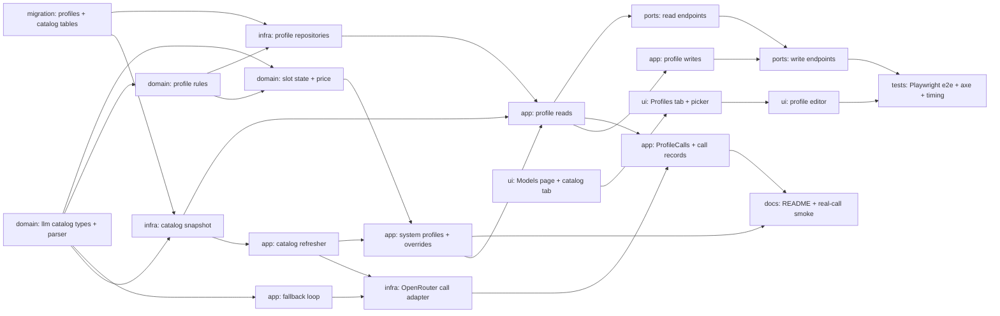

# Epic — model-profiles

> **Spec:** [spec.md](../spec.md) · **Design:** [sad.md](../sad.md) · **Data model:** [data-model.md](../data-model.md) · **API:** [openapi.yaml](../contracts/openapi.yaml) · **Port:** [public-api.md](../contracts/public-api.md) · **Events:** [events.md](../contracts/events.md) · **Screens:** [screens.md](../screens.md) · **ADRs:** [adr/](../adr/)

## Goal

teleX gets its model choice before anything uses it. An Owner sees what each model can do and costs, builds custom Model Profiles with a Fallback Chain in every slot, and picks a default profile knowing roughly what 100 runs cost. When a model disappears or fails, AI work continues on the next model in the chain inside the same request, the Owner is told while a main model is missing, and every call is recorded without content (spec §2).

## Scope

- **In:** `llm` (catalog snapshot, refresh from OpenRouter, in-call fallback loop, OpenRouter adapter), `agents` (custom and system profiles, rules, slot resolution, price estimate, default profile, `ProfileCalls`, call records, events), `web` (`/api/v1/models/**`), the SPA (SCR-66 Models with the C-22 picker, SCR-34 Profile editor), the four staged migrations, README settings, Playwright e2e and the real-call smoke check.
- **Out:** choosing a profile per agent and warnings on assistant cards (E09), running agents and run cost (E14), budgets and BYOK (E27), a per-slot price ceiling, an Operator screen for the catalog or system profiles (E26), a quality cascade, data-retention filtering, the semantic-search model (E07) (spec §3).

## Task map

Parallel starts: **T1**, **T2** and **T16** need nothing (T7 joins as soon as T2 lands). The backend splits into an `llm` branch (T3 → T4 → T6, T5) and an `agents` branch (T7 → T8 / T10) that meet at T9/T11. The UI branch (T16 → T17 → T18) builds against the contract and only meets the backend at T19.

## Tasks

See [tracker.md](./tracker.md) for status. Machine contract: [tasks.json](../tasks.json).

| # | Task | Layer | Blocked by | DoD (short) |
|---|---|---|---|---|
| T1 | Promote the four staged model-profiles migrations into the live Flyway tree | migration | — | up → down → up green; schema IT pins constraints |
| T2 | Define the llm catalog value types, the slot-fit rule and the OpenRouter model-list parser | domain | — | slot fit + parser unit tests over a real fixture |
| T3 | Store the catalog snapshot in Postgres, load it at start and hold it in memory | infra | T1, T2 | snapshot survives a restart; state derived |
| T4 | Refresh the catalog from OpenRouter at start, every 24 h and every 5 min after a failure | app | T3 | start / 24 h / 5 min retry / no-key WARN tested |
| T5 | Build the in-call fallback loop in llm with one attempt per model, a per-attempt timeout and outcome classification | app | T2 | every outcome moves on or stops as specified |
| T6 | Call OpenRouter for text, vision and image through the provider port and classify its errors | infra | T4, T5 | text, vision, image + error classes via WireMock |
| T7 | Model the custom profile aggregate, ProfileRef and the profile rules in plain Kotlin | domain | T2 | every rule and field code unit-tested |
| T8 | Resolve slots against the current catalog and estimate the price per 100 runs | domain | T2, T7 | slot states + price states + rounding edges |
| T9 | Build the three system profiles from settings and validate the Operator's slot overrides | app | T4, T8 | shipped vs overridden models; WARN per bad model |
| T10 | Persist custom profiles, their chains and the default profile, always scoped by Owner | infra | T1, T7 | owner-scoped queries, lock, default reset |
| T11 | Serve the catalog view, the profile list with picker data, one profile and a new-profile draft | app | T3, T9, T10 | list, get, draft, catalog view module test |
| T12 | Create, update and delete custom profiles and choose the default, each in one transaction | app | T11 | create/update/delete/default + event |
| T13 | Answer profile slot calls through ProfileCalls and record every call without content | app | T6, T11 | typed results + content-free records + event |
| T14 | Expose the read endpoints: catalog, profile list, one profile and the draft | ports | T11 | GET shapes, 404 parity, 409 draft, 401 |
| T15 | Expose the write endpoints for profiles and the default profile with their problem codes | ports | T12, T14 | every AC's status + code, XSRF, Location |
| T16 | Add the models API hooks, the Models route and link, and the Model catalog tab | ui | — | catalog tab states in Vitest |
| T17 | Build the Profiles tab: the profile picker, profile cards, delete and the AI-not-set-up alert | ui | T16 | Profiles tab states in Vitest |
| T18 | Build the profile editor modal with the chain editor and the model chooser | ui | T17 | SCR-34 states in Vitest |
| T19 | Add Playwright end-to-end tests for the Models page at 360 px and 1280 px with axe and a 500-model load timing | tests | T15, T18 | journeys at 360/1280, axe 0, p95 ≤ 1 s |
| T20 | Document the AI settings in the README and add the real-call smoke check per slot | docs | T9, T13 | README settings + smoke run recorded in PR |

## Risks / Hard rules

- **Module boundaries unchanged** (sad §2, ADR-0002): `llm` depends on `shared` only and never sees Owners; `web` never imports `telex.llm` — `agents` exposes the catalog in its own types. `ModularityTest` is part of every backend task's gate.
- **No content stored or logged** (spec §6.1, sad §2): no request or answer text in `model_call*`, events, logs or metric tags; the provider key is never returned or logged.
- **Tenancy** (sad §8, AC-222): every custom/default profile query filters on `owner_id`; another Owner's profile answers exactly like a missing one (`404 not-found` — the contract's code, not the sad's `profile-not-found`).
- **Availability is computed, never stored** (sad §4): a profile keeps every model id the Owner chose; slot state, warnings and prices come from the current catalog.
- **Typed results, not exceptions** for model failures across `llm` and `agents` (sad §8, ADR-0003); move-on vs stop exactly as AC-224 / AC-228.
- **Compile-coupled pair T5 + T6** share `telex/llm/internal/call/ModelProvider.kt`: the `ModelCalls` bean needs a provider to boot, so `implement` may close both with one gate.
- **Gaps carried into implement:** the shipped default model ids for the three system profiles are not fixed upstream (T9 picks them, T20 documents them); the OpenRouter error-to-outcome table is proposed in T6 and must be confirmed against real responses; the contract uses `/api/v1/models/**` where sad §8 says `/api/models/**` — the contract wins.
- **Size signal:** sad §11 notes the design exceeds the S envelope; 20 tasks confirms it. Consider `/sdd:classify-size model-profiles` (likely M) before `implement`.
