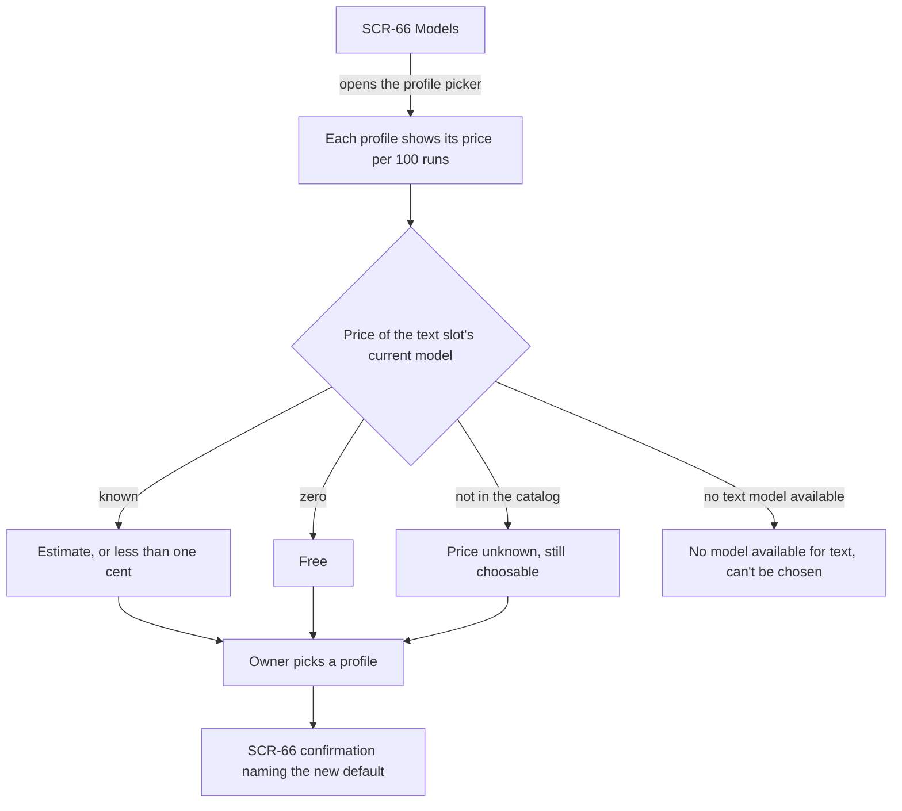
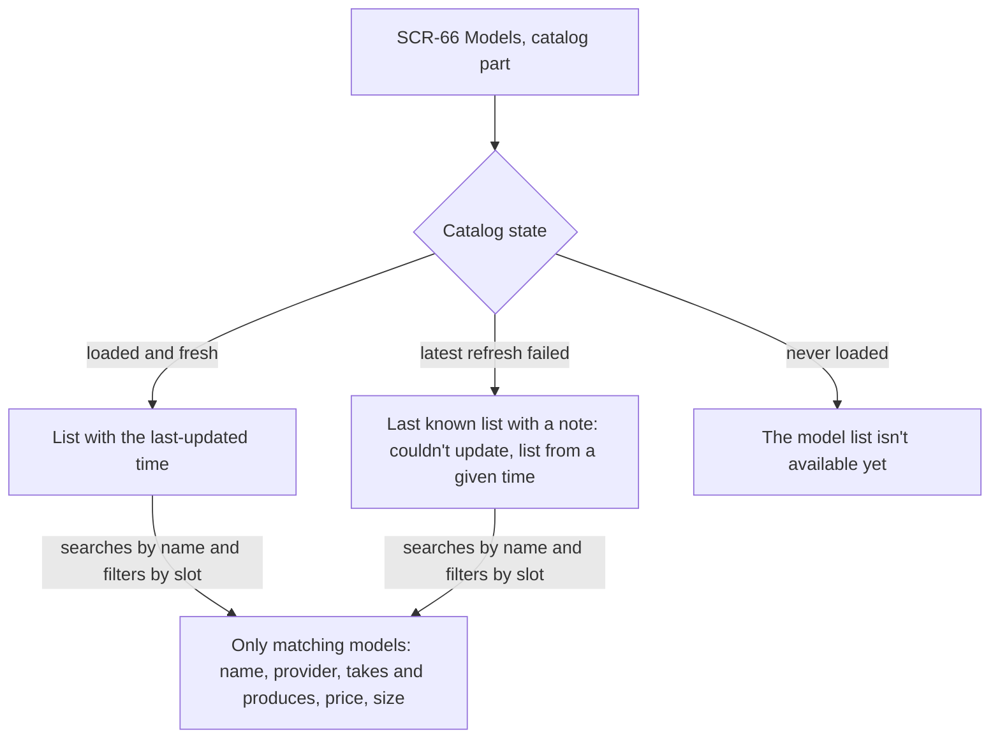
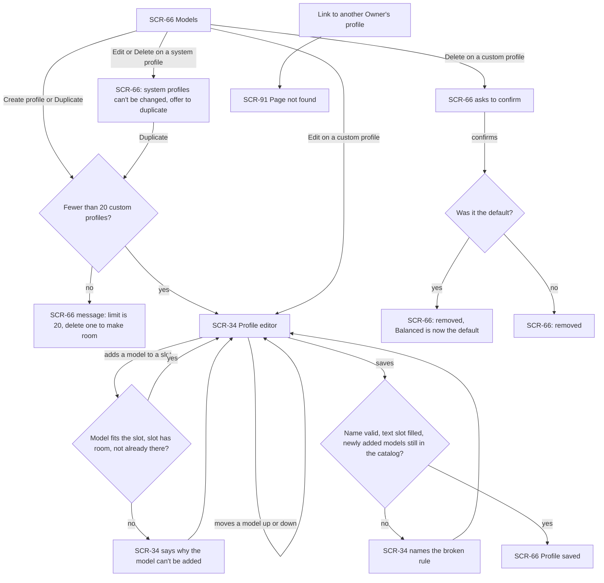
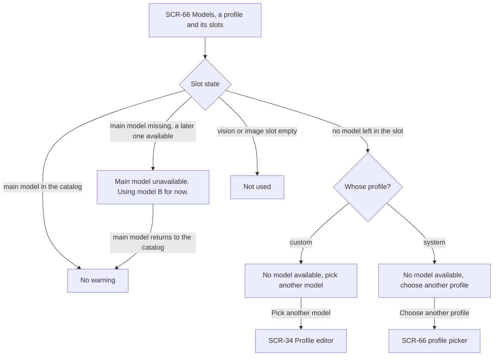
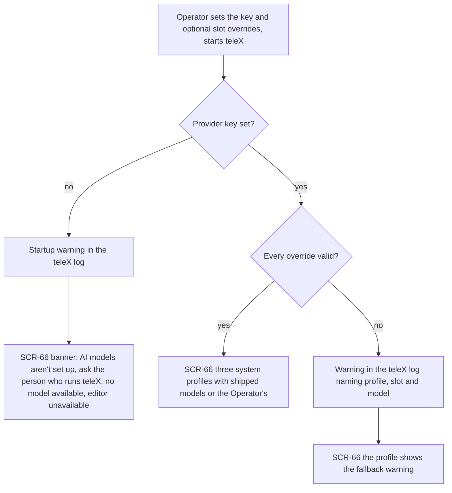

# UX flows — model-profiles

> User flows for every UI-touching §4 user story, produced by `ux-flows` (after `clarify`, before
> `design`) and read by `design` (evidence for the target-surface + UI-architecture decisions),
> `sequences` (UI-driven flows align on SCR ids), `screens` (details every inventory row) and
> `plan-tests` (the e2e-through-UI paths). **Always markdown + mermaid `flowchart`**, whatever the
> design tool — this artifact is flow-altitude, not visual design.

## Platform decisions

- **Posture:** responsive-both — per `docs/docs/design-system/README.md` and D-04 ("every screen is fully responsive") and spec §6 (360 px and 1280 px). No flow branches by device. `docs/design-system.md` doesn't exist yet.
- **Screen ids:** SCR-34 (custom profile editor) keeps its product-spec id. The Models page has no product-spec id. It takes the free slot SCR-66 in the Settings range (SCR-60…68), because it is a Settings subsection. SCR-66 needs to be added to `docs/docs/03-product-spec.md`. SCR-91 "Page not found" is reused from E01.
- **One page, two parts.** SCR-66 holds the Owner's profiles with the default-profile picker, and the Model Catalog. Moving between the two parts stays on SCR-66; the flows treat them as one screen.
- **The editor opens over the Models page.** SCR-34 is opened from SCR-66 for create, duplicate and edit, and it always returns there, as the product spec's "modal" suggests. Saving, cancelling and every validation message happen inside SCR-34.
- **Actions on a profile row stay in place.** Choosing the default, deleting a custom profile (with a confirmation step on SCR-66), and the "Duplicate instead" offer for a system profile all happen on SCR-66 without leaving it.
- **Model call outcomes have no screen in E10.** In-call fallback, a failed chain and the call record (AC-224, AC-228, AC-229) are seen by other parts of teleX. Run details show them from E14 on.
- **Design input (not decided here):** E10 and E06 (app shell) are both in wave 3. If the shell's Settings page isn't there yet when E10 ships, SCR-66 needs another way in, such as a link in the E01 page frame. `design` decides.

## Screen inventory

| ID | Screen | Purpose | Entry | Exit |
|---|---|---|---|---|
| SCR-66 | Models | The Owner's profiles (system + own) with the default-profile picker, prices per 100 runs and fallback warnings; the Model Catalog with search, slot filter and its last-updated time | Settings → Models (E06); a direct link to the page | SCR-34 (Create, Duplicate, Edit, or "pick another model" on a warning); stays on SCR-66 for every other action |
| SCR-34 | Profile editor | Create, duplicate or edit a custom profile: name, the three slots, add / remove / reorder models in each Fallback Chain, save | "Create profile", "Duplicate" or "Edit" on SCR-66; "Pick another model" on a slot warning | SCR-66 after "Profile saved" or Cancel |
| SCR-91 | Page not found | Shown for a profile address that doesn't exist or belongs to another Owner (E01 system page) | a link to a profile the Owner can't see | the Inbox via "Go to Inbox" (E01) |

## Flows

### Flow: US-13 — Choose a model profile

The Owner opens the picker on the Models page (SCR-66). Every new Owner starts with Balanced as the default. Every option shows an estimated price per 100 runs, worked out from the text slot's current model. A known price shows the estimate, or "< $0.01" below one cent. A price of zero shows "Free". A missing price shows "Price unknown", and the profile can still be chosen. A profile with no available text model shows "No model available for text", has no price, and can't be chosen. Picking a profile makes it the default, and SCR-66 confirms it by name.

### Flow: US-80 — Browse the model catalog

On the catalog part of the Models page (SCR-66), the Owner sees the list and when it was last updated. If the latest refresh failed, they see the last known list with a note saying it couldn't be updated and how old it is. Profiles keep working with that list, also after a restart. If no list has ever loaded (first start with the provider unreachable), the Owner sees "The model list isn't available yet", and teleX retries every 5 minutes. Searching by name and filtering by slot narrows the list. The vision filter, for example, shows only models that take images and answer in text. Each row shows the name, provider, what the model takes and produces, its price in US dollars and how much text it can take at once.

### Flow: US-81 — Build my own profile

From the Models page (SCR-66) the Owner creates a profile or duplicates one. If they already have 20 custom profiles, SCR-66 says so and nothing opens. A duplicate is first named "Balanced copy", or "Balanced copy 2" when that name is taken. It also keeps any models that have left the catalog, marked "Not in the catalog". Trying to edit or delete a system profile leaves the Owner on SCR-66 with an explanation and an offer to duplicate it. In the editor (SCR-34), adding a model is refused with a reason in three cases: the model can't do the slot's job, the slot already holds three models, or the model is already there. Models can be moved up or down, and the first one is the main model. Saving checks three things: the name (not empty, at most 40 characters, not a duplicate ignoring case, not a system name), that the text slot has at least one model, and that every model added in this edit is still in the catalog. Models that were already missing don't block the save. Any broken rule keeps the Owner in SCR-34 with the rule named. A successful save returns to SCR-66 with "Profile saved". Deleting a custom profile asks for confirmation on SCR-66. If that profile was the default, the Owner is told that Balanced is the default again. A link to another Owner's profile opens the same "Page not found" (SCR-91) as a profile that doesn't exist.

### Flow: US-82 — Keep working when a model disappears

Every profile on the Models page (SCR-66) shows the state of each slot. When the main model is in the catalog, there is no warning. When it is missing but a later model is available, the profile and the slot say "Main model unavailable. Using model B for now.", and the price estimate follows model B. The warning disappears when the main model returns. When no model in a slot is left, the slot says no model is available. On a custom profile it offers "Pick another model", which opens the editor (SCR-34). On a system profile it suggests choosing another profile in the picker. For the text slot, that profile can't be chosen as a new default, and Owners who already use it as their default see a warning. An empty vision or image slot shows "Not used".

### Flow: US-83 — Give Owners working defaults

The Operator sets the provider key, and optionally some system-profile slots, in the installation settings, then starts teleX. They have no screen in E10, and their warnings go to the teleX log. Without a key, the log names the missing setting. Everything without AI keeps working. On the Models page (SCR-66) the Owner sees a banner saying AI models aren't set up and to ask the person who runs teleX. The three system profiles show no model available, and custom profiles can't be edited. With a key and valid overrides, Owners see the three system profiles, each slot with the models that ship with teleX or the Operator's override for that slot. An override with a model that isn't in the catalog, can't do the slot's job, or comes after the third in its slot gets a log warning. That model is skipped, and Owners see the usual fallback warning on that profile.

## AC coverage

| AC | Shown by | Notes |
|---|---|---|
| AC-51 | Flow US-13 → picker → "Owner picks a profile" → confirmation | default starts at Balanced |
| AC-210 | Flow US-13 → "Price unknown", "Free", "less than one cent" branches | |
| AC-211 | Flow US-80 → search and slot filter → matching models | |
| AC-212 | Flow US-80 → "latest refresh failed" and "never loaded" branches | survives restarts (no UI branch) |
| AC-213 | Flow US-81 → Duplicate → SCR-34 → reorder → save → "Profile saved" | copy naming and "Not in the catalog" in prose |
| AC-214 | Flow US-81 → save check → "names the broken rule" | name rules |
| AC-215 | Flow US-81 → save check → "names the broken rule" | text slot required |
| AC-216 | Flow US-81 → add model → "says why the model can't be added" | slot capability |
| AC-217 | Flow US-81 → add model → "says why the model can't be added" | at most three, each once |
| AC-218 | Flow US-81 → limit check → "limit is 20" | |
| AC-219 | Flow US-81 → system profile → "can't be changed, offer to duplicate" | |
| AC-220 | Flow US-81 → Delete → confirm → "Balanced is now the default" | |
| AC-221 | Flow US-81 → save check → "newly added models still in the catalog" | older missing models don't block |
| AC-222 | Flow US-81 → "Link to another Owner's profile" → SCR-91 | |
| AC-10 | Flow US-82 → "Main model unavailable. Using model B for now." → returns → no warning | the call itself has no UI |
| AC-223 | Flow US-82 → "no model left" (custom and system) and "Not used" branches; Flow US-13 → "can't be chosen" | |
| AC-224 | N/A: no UI in E10 | in-call fallback is seen by the calling part of teleX; run details show it from E14 |
| AC-228 | N/A: no UI in E10 | failed chain reaches the caller, not a screen |
| AC-229 | N/A: no UI in E10 | content-free call record, read by E14 run details and the KPI |
| AC-225 | Flow US-83 → "three system profiles with shipped models or the Operator's" | |
| AC-226 | Flow US-83 → no key → banner on SCR-66 | |
| AC-227 | Flow US-83 → invalid override → fallback warning on SCR-66 | |
