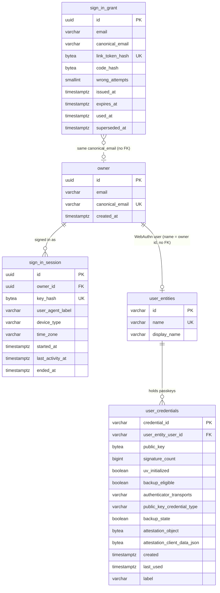

# Data model — platform-skeleton

> **Sources:** spec.md §5 (AC-34…AC-105) and §6.1 · sad.md §5 (identity owns the data), §6 (`persists` notes, "Index hints for data-model"), §8 (secrets, time, ID strategy) · ADR-0001 (session table), ADR-0002 (Spring WebAuthn tables), ADR-0003 (grant + atomic redeem), ADR-0005 (activity bump) · foundation `docs/adr/0003` (Flyway + rollback, UUIDv7).
> **Staged migrations:** `migrations/01…05_*.up.sql` + `.down.sql` (05 widens `user_entities.display_name` to 254, added by review fix T23 as a new migration because 04 was already applied). `implement` promotes them into `db/migration/V<yyyyMMddHHmm>__*.sql` + `db/rollback/U<same>__*.sql`.

All tables belong to the `identity` module. `web` and `mail` own no tables. The Modulith `event_publication` table (baseline) carries `SignInSessionStarted` and needs nothing new.

**Conventions applied** (from the architecture, confirmed with the user where the repo had no precedent):
- PK: app-generated UUIDv7 (`telex.shared.Uuid7`). Exception: the Spring passkey tables, keyed by WebAuthn ids as text (ADR-0002).
- Time: `TIMESTAMP WITH TIME ZONE`, written from the injectable `Clock`. No `DEFAULT now()`, so tests with a fixed clock control every timestamp.
- Audit columns: only the timestamps the domain needs (`created_at`, `issued_at`, `started_at`…). No generic `updated_at`.
- Delete strategy: none in E01, except passkey removal (hard delete, AC-92). Grants and sessions use state timestamps (`used_at`, `superseded_at`, `ended_at`) and are kept (sad §11 accepted debt: no purge).
- Secrets: SHA-256 digests stored as 32-byte `BYTEA`; plaintext never stored (spec §6.1).
- Constraints: NOT NULL / UNIQUE / FK, plus light `CHECK`s on counters, hash lengths, enum-like values and time order (user decision, 2026-10-02). The rules are still enforced and tested in Kotlin.
- Email: `VARCHAR(254)` (the SMTP path limit). Canonical form = lowercased, `+tag` removed from the local part (AC-34); computed in Kotlin.

**Not stored (confirmed):**
- *Passkey step pending* — derived from the redeem's created-account flag (sad §6 "Flagged by sequences"); no column on `owner`.
- *Grant voided* — derived as `wrong_attempts = 5`; no separate column.
- *WebAuthn challenge* — kept in a short-lived `HttpSession` for the ceremony only (Spring's default options repositories); no table (user decision, 2026-10-02). Sign-in Sessions themselves stay on `sign_in_session` (ADR-0001).
- *Address as typed for each sign-in email* beyond the grant itself — the email is sent inside the request (ADR-0004).

## ER diagram

## Entities

### Aggregate: Owner

#### `owner`

| Column | Type | Constraints | Notes |
|---|---|---|---|
| `id` | UUID | PK, app-generated (UUIDv7) | `OwnerId` |
| `email` | VARCHAR(254) | NOT NULL | The address exactly as typed when the account was created; the "New sign-in to teleX" email goes here (AC-34, AC-98) |
| `canonical_email` | VARCHAR(254) | NOT NULL, UNIQUE, CHECK lowercase | Lowercased, `+tag` removed; one account per canonical address (AC-34) |
| `created_at` | TIMESTAMPTZ | NOT NULL | Set from `Clock` at the redeem that creates the account |

**Aggregate root:** root.
**Access patterns:** find by canonical address at redeem (create-if-absent) → `owner_canonical_email_uq`; load by id for "who am I" and the notice email → PK.
**Constraints:** UNIQUE `canonical_email`. A concurrent first sign-in by two browsers resolves through `INSERT … ON CONFLICT (canonical_email) DO NOTHING` + re-read.

### Aggregate: Sign-in Grant

#### `sign_in_grant`

| Column | Type | Constraints | Notes |
|---|---|---|---|
| `id` | UUID | PK, app-generated (UUIDv7) | `SignInGrantId`; held by SCR-07 to redeem a code against this grant only (AC-82, AC-103) |
| `email` | VARCHAR(254) | NOT NULL | Address as typed for this email; shown on SCR-08 "Continue as <address>", and becomes `owner.email` if this redeem creates the account |
| `canonical_email` | VARCHAR(254) | NOT NULL, CHECK lowercase | Supersede lookup (AC-103); Owner lookup at redeem |
| `link_token_hash` | BYTEA | NOT NULL, UNIQUE, CHECK 32 bytes | SHA-256 of the 256-bit link token (ADR-0003) |
| `code_hash` | BYTEA | NOT NULL, CHECK 32 bytes | SHA-256(grant id + 6-digit code) (ADR-0003) |
| `wrong_attempts` | SMALLINT | NOT NULL DEFAULT 0, CHECK 0–5 | Atomic increment; at 5 the grant is void for code and link (AC-85) |
| `issued_at` | TIMESTAMPTZ | NOT NULL | |
| `expires_at` | TIMESTAMPTZ | NOT NULL, CHECK > `issued_at` | `issued_at + 15 min`; checked at confirm / typed code (AC-35) |
| `used_at` | TIMESTAMPTZ | NULL | Set by the redeeming `UPDATE`; kills both link and code (AC-82, AC-84) |
| `superseded_at` | TIMESTAMPTZ | NULL, CHECK not both with `used_at` | Set when a newer grant is issued for the same canonical address (AC-103) |

**Aggregate root:** root. No FK to `owner`: a grant exists before the account it may create.
**Access patterns:**
- read state / redeem by link token → `sign_in_grant_link_token_hash_uq`;
- redeem by code, wrong-attempt increment → PK;
- supersede live grants for a canonical address at issue → `sign_in_grant_live_by_canonical_email_idx` (partial).

**Redeem (ADR-0003):** `UPDATE sign_in_grant SET used_at = :now WHERE <key> AND used_at IS NULL AND superseded_at IS NULL AND wrong_attempts < 5 AND expires_at > :now RETURNING …`. No row → re-read by key to classify the refusal (expired / used / void / superseded = expired).

### Aggregate: Sign-in Session

#### `sign_in_session`

| Column | Type | Constraints | Notes |
|---|---|---|---|
| `id` | UUID | PK, app-generated (UUIDv7) | `SignInSessionId`; the id the sessions list and "End session" use (AC-93) |
| `owner_id` | UUID | NOT NULL, FK → `owner(id)` | Every query filters on it (AC-97) |
| `key_hash` | BYTEA | NOT NULL, UNIQUE, CHECK 32 bytes | SHA-256 of the 256-bit `telex_session` cookie value (ADR-0001) |
| `user_agent_label` | VARCHAR(100) | NOT NULL | "Safari on iPhone"; neutral fallback for unknown agents (sad §8 Device naming) |
| `device_type` | VARCHAR(16) | NOT NULL, CHECK in `phone`, `tablet`, `computer`, `unknown` | Sessions list (AC-93), notice email (AC-98) |
| `time_zone` | VARCHAR(64) | NOT NULL | IANA zone sent by the SPA at sign-in; `UTC` when the browser sends none; for the notice email (AC-98) |
| `started_at` | TIMESTAMPTZ | NOT NULL | 90-day cap (AC-96) |
| `last_activity_at` | TIMESTAMPTZ | NOT NULL, CHECK ≥ `started_at` | Bumped at most once a minute by unmarked requests (ADR-0005); 30-day idle rule (AC-96) |
| `ended_at` | TIMESTAMPTZ | NULL, CHECK ≥ `started_at` | Sign-out, End session, Sign out of all others, replaced in the same browser (AC-104), or marked when found expired |

**Aggregate root:** root (references Owner by id).
**Live** = `ended_at IS NULL AND last_activity_at > :now - 30 days AND started_at > :now - 90 days`.
**Access patterns:**
- resolve the cookie on every authenticated request → `sign_in_session_key_hash_uq`;
- list my live sessions, end one of mine, end all my others → `sign_in_session_owner_id_idx`;
- end the session this browser held (AC-104) → `sign_in_session_key_hash_uq`.

### Aggregate: Passkey (Spring Security WebAuthn tables, ADR-0002)

Shape follows `spring-security-web` 7.1.1 `user-entities-schema.sql` and `user-credentials-schema-postgres.sql`. The teleX deviations are listed below the tables.

#### `user_entities`

| Column | Type | Constraints | Notes |
|---|---|---|---|
| `id` | VARCHAR(1000) | PK | WebAuthn user handle (random bytes, Base64URL), generated by Spring |
| `name` | VARCHAR(100) | NOT NULL, UNIQUE | `OwnerId` as text: one user entity per Owner. No FK to `owner` (type differs: text vs UUID) |
| `display_name` | VARCHAR(254) | NULL | The Owner's email, shown by the authenticator's account picker (widened from 200 by migration 05) |

#### `user_credentials`

| Column | Type | Constraints | Notes |
|---|---|---|---|
| `credential_id` | VARCHAR(1000) | PK | WebAuthn credential id (Base64URL) — the Passkey's key |
| `user_entity_user_id` | VARCHAR(1000) | NOT NULL, FK → `user_entities(id)` ON DELETE CASCADE | Ownership path to the Owner |
| `public_key` | BYTEA | NOT NULL | COSE public key |
| `signature_count` | BIGINT | NULL | Updated on each assertion |
| `uv_initialized` | BOOLEAN | NULL | |
| `backup_eligible` | BOOLEAN | NOT NULL | |
| `authenticator_transports` | VARCHAR(1000) | NULL | |
| `public_key_credential_type` | VARCHAR(100) | NULL | |
| `backup_state` | BOOLEAN | NOT NULL | |
| `attestation_object` | BYTEA | NULL | |
| `attestation_client_data_json` | BYTEA | NULL | |
| `created` | TIMESTAMPTZ | NULL | Creation date on SCR-64 (AC-89) |
| `last_used` | TIMESTAMPTZ | NULL | "Never used" when NULL (AC-89); set at passkey sign-in |
| `label` | VARCHAR(1000) | NOT NULL | Auto name from the User-Agent mapper, e.g. "Safari on iPhone" (AC-89) |

**Aggregate root:** `user_entities` (one per Owner, found by `name = OwnerId`).
**Access patterns:**
- find or create the Owner's user entity before registration → `user_entities_name_uq`;
- list / remove my passkeys (filtered by my user entity, AC-92, AC-97) → `user_credentials_user_entity_user_id_idx`;
- find credential at passkey sign-in, update `last_used` / `signature_count` → PK.

**Deviations from Spring's DDL (deliberate, user-confirmed 2026-10-02):**
1. `created` / `last_used` are `TIMESTAMP WITH TIME ZONE` instead of `timestamp`, matching the teleX UTC convention. Spring's `JdbcUserCredentialRepository` binds `java.sql.Timestamp` from an `Instant` and reads it back via `getTimestamp(...).toInstant()`, which round-trips on `timestamptz`. **Verify** with an integration test that saves and reloads a credential (`implement`).
2. FK `user_credentials.user_entity_user_id → user_entities(id)`. Spring always saves the user entity before the credential.
3. Indexes on `user_entities(name)` (unique) and `user_credentials(user_entity_user_id)`. Spring's DDL ships none, but its repositories query both columns.

The column names, nullability and the rest of the types are unchanged, so Spring's JDBC repositories work without a custom row mapper.

## Indexes

| Index | Columns | Query it serves |
|---|---|---|
| `owner_canonical_email_uq` (unique) | `owner(canonical_email)` | Redeem: find or create the Owner for the grant's canonical address (Critical flow 1, Flow US-01 sign in by code; AC-34) |
| `sign_in_grant_link_token_hash_uq` (unique) | `sign_in_grant(link_token_hash)` | Read grant state when the link opens (SCR-08), redeem by link (Critical flow 1; AC-84, AC-86) |
| `sign_in_grant_live_by_canonical_email_idx` (partial: `used_at IS NULL AND superseded_at IS NULL`) | `sign_in_grant(canonical_email)` | Supersede every live grant for the address when a new one is issued (Flow US-01 request a sign-in email; AC-103) |
| `sign_in_session_key_hash_uq` (unique) | `sign_in_session(key_hash)` | Resolve the session cookie on every request (Critical flow 3); end the browser's held session (AC-104) |
| `sign_in_session_owner_id_idx` | `sign_in_session(owner_id)` | List my sessions, end one, end all others (Flow US-46 manage Sign-in Sessions; AC-93, AC-94); also the FK index |
| `user_entities_name_uq` (unique) | `user_entities(name)` | Find or create the Owner's WebAuthn user entity (Flow US-45 passkey step); resolve the Owner from a credential's user entity |
| `user_credentials_user_entity_user_id_idx` | `user_credentials(user_entity_user_id)` | List / remove my passkeys (Flow US-46 manage passkeys; AC-92, AC-97); also the FK index |
| (existing) `event_publication_by_completion_date_idx` | `event_publication(completion_date)` | Incomplete `SignInSessionStarted` publications resubmitted on restart (Flow US-47) — baseline, unchanged |

Grant by id (redeem by code) and credential by id (passkey sign-in) use the primary keys.

## Test fixtures

Kotlin builders under `backend/app/src/integrationTest/kotlin/telex/identity/` (not in `db/migration`). Every value is fixed or derived from a test `Clock`; addresses use `example.test` only.

- `anOwner(email = "user-<uuid>@example.test", createdAt = clock.instant())` — an `owner` row with its canonical address computed by the production canonicaliser.
- `aGrant(email, issuedAt, linkToken, code, wrongAttempts = 0, usedAt = null, supersededAt = null)` — inserts hashes, returns the plaintext link token and code for the test to "type".
- `aSession(owner, key, startedAt, lastActivityAt = startedAt, endedAt = null, label = "Test Browser on Test Device", deviceType = "computer", timeZone = "Europe/Kyiv")` — returns the plaintext cookie value.
- Passkeys: created through Spring's WebAuthn endpoints with the Playwright virtual authenticator (e2e) or by saving `ImmutableCredentialRecord` via `UserCredentialRepository` with a fixed `label = "Test Browser on Test Device"` (integration).
- Test user display name: `Test User`.

No bootstrap or lookup seeds: the first Owner is created by signing in (AC-33).
