# Software Architecture Document — platform-skeleton

<!-- 12 Arc42 sections. Empty section → <!-- N/A: <one-line reason> -->. -->
<!-- C4 Context (L1) lives inline in §3. C4 Container (L2) lives inline in §5. -->
<!-- Numbers in §10 come VERBATIM from spec.md §6 NFR — no inventing, no rounding. -->

## 1. Introduction and goals

**Intent.** teleX gets its front door. An Operator starts a complete installation with one command and can finish the first sign-in from a local mailbox without configuring anything. An Owner signs up and signs in with nothing but an email address: they use the emailed Sign-in Link (confirmed on the page it opens) or its 6-digit Sign-in Code. After the first sign-in they can add a Passkey, which is never required. Owners see and end their own Sign-in Sessions, get a "New sign-in to teleX" email for every later sign-in, and always land on a clear system page instead of a dead end. Every later epic (E02 Telegram link, E06 app shell, E10 model profiles, E26 operator console) builds on the signed-in Owner this feature creates.

**Top-3 quality goals (1-liners; full scenarios in §10):**

1. **No silent takeover.** A sign-in email is a single-use, 15-minute permission whose code dies after 5 wrong tries. Secrets are stored only as hashes. Every later sign-in is announced by email, and every session can be revoked and is capped at 30 days idle / 90 days total.
2. **One-command install.** The sign-in page is open within 5 minutes of the README command, not counting the first image build, and the first sign-in needs only the bundled local mailbox.
3. **Works everywhere it's opened.** Every screen works at phone and desktop widths and meets WCAG 2.2 AA. Passkeys work in current Chrome and Safari (macOS, iOS), and email sign-in stays as the fallback.

**Stakeholders.**

| Role | Interest | Sign-off owner? |
|---|---|---|
| Operator | Starts the installation with one command; completes the first sign-in from the local mailbox (US-41) | No |
| Owner | Signs up and signs in by link, code or Passkey; controls their Sign-in Sessions and Passkeys; hears about new sign-ins (US-01, US-45, US-46, US-47, US-49) | No |
| Tech Lead | SAD approval; the identity/web/mail boundaries every later epic builds on | Yes |
| Security Lead | Review of the session, grant and passkey decisions (ADR-0001…0003, 0006), done through the regular `/sdd:review` (spec §6.1) | No |

<!-- Decision overrides (¶4) — populated by the critic resolution loop, empty otherwise. -->

- Decision override: ADR-0004 keeps "SMTP adapter inside `identity`" as a considered option even though the ACL convention points the other way — rationale: the decision weighed was whether to extend the integration-ACL convention to email at all; the alternative the critic proposed (email inside the `bot` ACL, which wraps the Telegram Bot API) would be the actual strawman.

## 2. Constraints

**Technical.**
- Kotlin 2.4.10 on JDK 25 with virtual threads on (`application.yaml`). Foundation [ADR-0001](../../adr/0001-kotlin-spring-modulith-postgres-react-stack.md).
- Spring Boot 4.1.1 (Web MVC, Data JDBC, Flyway, Actuator, Validation) and Spring Modulith 2.1.1 with the JDBC event publication registry, as already on the classpath. **Added by this feature:** Spring Security 7 (Boot-managed) with its WebAuthn support (`spring-security-webauthn` + `webauthn4j-core`), and `spring-boot-starter-mail`. Versions only in `gradle/libs.versions.toml`.
- PostgreSQL 17 + pgvector (`pgvector/pgvector:pg17`) through Spring Data JDBC and Flyway, with a paired rollback script per migration. Foundation [ADR-0003](../../adr/0003-postgres-jdbc-flyway-uuidv7-persistence.md).
- Frontend: React 19, TypeScript 6, Vite 8, `@tabler/core` 1.6.1, `@tabler/icons-react`, pnpm. **Added by this feature:** React Router, TanStack Query and Playwright (run at 360 px and 1280 px).
- Architecture convention: a Spring Modulith modular monolith. Each module is a direct sub-package of `telex` with its public API at the root and the rest in `internal`, and `ApplicationModules.verify()` runs in `ModularityTest`. This feature adds a 14th module, `mail`, an integration ACL (ADR-0004). Foundation [ADR-0002](../../adr/0002-single-app-with-isolated-tdlib-subproject.md).

**Organisational.**
- One developer (Anton Husiev) on the course's 8-week timeline (foundation ADR-0001). Neither the spec nor the roadmap sets a per-epic deadline.
- This is roadmap step 1, the only blocker for wave 3 (E02, E06, E10, E26 need a signed-in Owner), so it ships before any of them start.
- Implementation runs through the SDD `implement` engine (TDD, per-task gate, up to 3 parallel agents in worktrees per `.claude/sdd.local.md`).

**Conventions.**
- `CLAUDE.md` (layout, IDs, errors, migrations, tests, quality gates) and `docs/architecture-map.md` §Conventions.
- IDs: app-generated UUIDv7 via `telex.shared.Uuid7.next()`, typed `@JvmInline value class XId(override val value: UUID) : TypedId`. One exception: a Passkey is keyed by its WebAuthn credential id (ADR-0002).
- Errors: RFC 9457 `application/problem+json`, `type = urn:telex:error:<code>`, rendered by `telex.web.ProblemHandler`; domain errors extend `telex.shared.DomainProblem`.
- Every Owner-owned row carries `owner_id`, and every query filters on it. One exception: the Spring-owned passkey tables (`user_entities`, `user_credentials`) have no `owner_id` column. A Passkey belongs to an Owner through its WebAuthn user entity, whose `name` is the `OwnerId`, and every passkey query filters on that user entity (ADR-0002).
- UI: `docs/docs/design-system/README.md`. Tokens only, status never by color alone, sentence-case English copy from `frontend/src/messages.ts`, no emoji.

**Regulatory / external.**
- Data is classified confidential (spec §6.1). Personal data stored: the Owner's email address; per Passkey, the public credential with its name and dates; per Sign-in Session, the browser, device type, time zone, and start and last-activity times. No compliance regime is in scope for a course installation.
- A Sign-in Link, a Sign-in Code or a session key is never stored, shown back or logged in readable form (spec §6.1). Only hashes are kept (ADR-0001, ADR-0003).
- Locally the app runs on plain HTTP at `http://localhost:8080`. In production it sits behind Cloudflare, which terminates HTTPS. Links, cookie security and the passkey relying-party ID derive from one configured public URL (ADR-0006).
- Anti-enumeration and sign-in-email rate limits are deliberately out of E01 (spec §3). Registration stays open, and the README warns against public exposure before E26 (spec §8 OQ-2 → §11).

## 3. Context and scope

teleX is a self-hosted web Telegram client. This feature draws its outer boundary for people: who can get in, how, and how they are told about it. The trust boundary is the browser. Everything a browser sends is unauthenticated until it carries a live Sign-in Session. An email is trusted only as proof that its reader controls the mailbox, and only for 15 minutes, once.

<!-- brownfield: scaffold present at 16b5183 — 13 empty Modulith modules with verified allowedDependencies, telex.shared (Uuid7, DomainProblem), telex.web SpaHosting + ProblemHandler, Flyway baseline + MigrationRollbackIT, compose.yaml with Postgres only, single-page App.tsx with no router or query client, no Dockerfile, one-line README. docs/architecture-map.md reflects the pre-scaffold commit ce5eabf (stale — re-run /sdd:survey). -->

**External systems (in / out):**

| Actor or system | Type | Interaction |
|---|---|---|
| Operator | Person | Runs the one README command, opens the sign-in page and the local mailbox, completes the first sign-in |
| Owner | Person | Signs up and signs in by Sign-in Link, Sign-in Code or Passkey; manages Sign-in Sessions and Passkeys |
| Mail server | System (external) | Receives every email teleX sends over SMTP. Locally this is Mailpit, bundled in compose, whose web page is the "local mailbox"; in production it is the Operator's SMTP provider |
| Owner's mailbox | System (external) | Where the Owner reads the Sign-in Link, the Sign-in Code and the "New sign-in to teleX" email. Mail scanners and link previews may open links here, and they never confirm (AC-86) |
| Passkey authenticator | System (external) | The device or password manager behind the browser's WebAuthn API; it creates and signs with the Owner's Passkey after biometrics or a PIN |
| Cloudflare | System (external, production only) | Terminates HTTPS and proxies to the app over HTTP; not present locally |

**C4 Context (L1):**

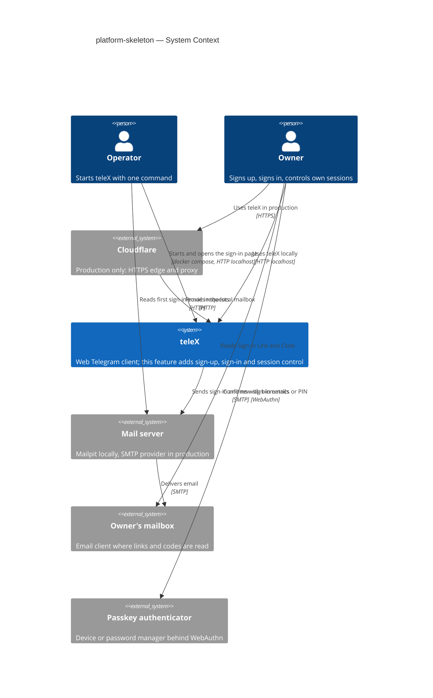
```mermaid
C4Context
    title platform-skeleton — System Context

    Person(operator, "Operator", "Starts teleX with one command")
    Person(owner, "Owner", "Signs up, signs in, controls own sessions")

    System_Ext(cloudflare, "Cloudflare", "Production only: HTTPS edge and proxy")
    System(telex, "teleX", "Web Telegram client; this feature adds sign-up, sign-in and session control")
    System_Ext(mailserver, "Mail server", "Mailpit locally, SMTP provider in production")
    System_Ext(mailbox, "Owner's mailbox", "Email client where links and codes are read")
    System_Ext(authenticator, "Passkey authenticator", "Device or password manager behind WebAuthn")

    Rel(operator, telex, "Starts and opens the sign-in page", "docker compose, HTTP localhost")
    Rel(operator, mailserver, "Reads first sign-in email in the local mailbox", "HTTP")
    Rel(owner, cloudflare, "Uses teleX in production", "HTTPS")
    Rel(cloudflare, telex, "Proxies requests", "HTTP")
    Rel(owner, telex, "Uses teleX locally", "HTTP localhost")
    Rel(telex, mailserver, "Sends sign-in and new-sign-in emails", "SMTP")
    Rel(mailserver, mailbox, "Delivers email", "SMTP")
    Rel(owner, mailbox, "Reads Sign-in Link and Code")
    Rel(owner, authenticator, "Confirms with biometrics or PIN", "WebAuthn")
```

## 4. Solution strategy

**Target surfaces: `[backend-service, web-frontend]`.** The Owner and the Operator reach teleX only through a browser (spec §1, §4), and `ux-flows.md` lists nine screens (SCR-01…SCR-93). The backend owns the JSON contract and the browser UI consumes it. Two surfaces, but the split is not new: foundation [ADR-0001](../../adr/0001-kotlin-spring-modulith-postgres-react-stack.md) already fixed "React SPA served by Spring Web", so this is recorded inline, not as a new ADR.

**UI architecture (web-frontend): a client-side SPA served as static files by the app.** This was also fixed by foundation ADR-0001. `SpaHosting` already falls back to `index.html` for client routes. This feature adds:
- **React Router** for the SCR routes;
- **TanStack Query** for server state, as planned in `architecture-map.md` §Frontend;
- one fetch client that owns the 10-second timeout, the problem-code → system-page mapping (sad §8) and the background-request marker (ADR-0005).

Sign-in is a sequence of full pages, not dialogs (`ux-flows.md` §Platform decisions). There is no global state library; session state is a TanStack query on "who am I".

**Top strategic choices (the seeds for ADRs):**

1. **Spring Security is the one gate, and every sign-in method ends in one session mechanism.** The filter chain in `web` guards every route except the sign-in pages, the system pages, the static SPA and health. The Sign-in Link, the Sign-in Code and the Passkey are three ways to prove identity, and each ends in `identity`'s `SignInSessions.start(...)`. That call writes an identity-owned session row behind an opaque, hashed cookie, ends any session the browser already holds, and publishes `SignInSessionStarted`. One mechanism gives one place to enforce the 30/90-day rules, revocation and the new-sign-in email (quality goal 1). → [ADR-0001](adr/0001-keep-sign-in-sessions-in-an-identity-owned-table-behind-an-opaque-cookie.md)
2. **Email sign-in is an identity-owned grant, redeemed atomically.** One `sign_in_grant` row per sign-in email holds hashes of the link token and the code plus the counters that enforce 15 minutes, single use, 5 wrong codes and "newest email wins". It is redeemed by one conditional `UPDATE`, so the database settles races. Opening the link only reads the grant, and only the explicit confirm redeems it, which keeps mail scanners harmless (AC-86). → [ADR-0003](adr/0003-redeem-sign-in-link-and-code-as-one-hashed-single-use-grant.md)
3. **Passkeys come from the framework, not from us.** Spring Security 7's WebAuthn support runs the ceremonies and stores credentials in its own tables. The WebAuthn user entity is the Owner, and our success handler starts the Sign-in Session. No hand-written cryptographic verification. → [ADR-0002](adr/0002-use-spring-security-webauthn-for-passkeys.md)
4. **Email is an integration, kept behind an ACL; secrets never touch durable storage.** A new `mail` integration module owns SMTP. The sign-in email is sent synchronously inside the request, so the plaintext link and code live only in memory and in the email. The "New sign-in to teleX" email is sent after commit from the `SignInSessionStarted` event, and the event registry retries it. → [ADR-0004](adr/0004-send-email-through-a-new-mail-integration-module.md)

Tactical choices in §5–§8 trace to these four. Two more blast-radius decisions sit outside §4: session activity marking (§8 → ADR-0005) and the public-URL source of truth (§7 → ADR-0006).

## 5. Building block view

The repo's Spring Modulith modular monolith is followed as-is. Each module is a direct sub-package of `telex`, with its public API and events at the module root and everything else in `internal`. `ApplicationModules.verify()` enforces the boundaries. The feature touches three modules:
- **`identity`** (core) is the first real module and owns every domain rule of this feature.
- **`web`** (interface) owns HTTP, the Spring Security filter chain and SPA hosting, and calls only `identity`'s public API.
- **`mail`** (new, integration) owns SMTP and depends on `shared` only (ADR-0004).

`identity`'s `allowedDependencies` gains `mail`. `web`'s stay as they are: `web` never reaches `mail`. The SPA is a second container that consumes the `web` contract.

**Internal decomposition:**

```
backend/app/src/main/kotlin/telex/
├── identity/                      core — public API at the root
│   ├── OwnerId, SignInGrantId, SignInSessionId (typed UUIDv7 ids)
│   ├── SignIn                     request a sign-in email, read a grant's state, redeem by link or code
│   ├── SignInSessions             start, resolve by cookie key, list own, end one / all others, sign out
│   ├── Passkeys                   list own, remove, label for a new credential
│   ├── Owners                     "who am I" (address, has-passkey-step-pending)
│   ├── SignInSessionStarted       event (owner id, session id, created-account flag — no secrets)
│   └── internal/
│       ├── owner/                 Owner aggregate, email canonicalisation, repository
│       ├── grant/                 SignInGrant aggregate, hashing, atomic redeem, repository
│       ├── session/               SignInSession aggregate, 30/90-day rules, activity bump, repository
│       ├── passkey/               Spring WebAuthn JDBC repositories (beans), Owner ↔ user-entity mapping
│       ├── device/                User-Agent → "Safari on iPhone" + device type mapper
│       └── email/                 sign-in + new-sign-in templates, SignInSessionStarted listener
├── mail/                          integration ACL (new module, depends on shared only)
│   ├── Mailer, OutgoingEmail      port
│   └── internal/SmtpMailer        spring-boot-starter-mail adapter
├── web/                           interface
│   ├── security/                  SecurityFilterChain, SessionCookieSecurityContextRepository (→ SignInSessions),
│   │                              WebAuthn wiring + success handler, CSRF, forwarded headers, PublicUrl
│   ├── api/                       SignInController, SessionsController, PasskeysController, MeController
│   ├── SpaHosting.kt              existing; must not swallow /webauthn/** and /login/webauthn
│   └── ProblemHandler.kt          existing; new problem codes (sad §8)
└── shared/                        existing kernel (Uuid7, DomainProblem)

frontend/src/
├── app/                           router (SCR routes), QueryClient, page frame (Profile and security, Sign out)
├── api/                           fetch client: 10 s timeout, X-Telex-Background, CSRF header, problem → system page
├── pages/                         sign-in (SCR-01), check-email (SCR-07), confirm-link (SCR-08), create-passkey (SCR-09),
│                                  inbox (SCR-10), profile-security (SCR-64), system/ (SCR-91, SCR-92, SCR-93)
├── components/                    ported from docs/docs/design-system/components as first used
└── messages.ts                    all UI copy

compose.yaml + Dockerfile          app (multi-stage build) + postgres + mailpit — §7
```

**C4 Container (L2):**

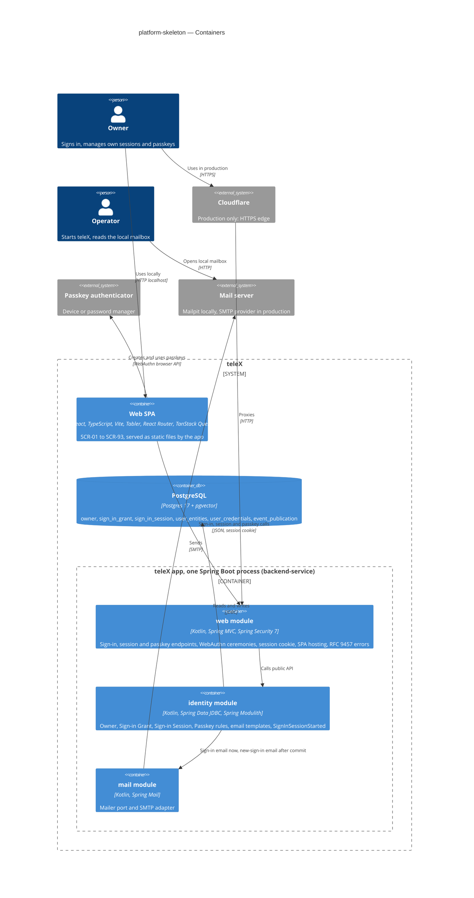
```mermaid
C4Container
    title platform-skeleton — Containers

    Person(owner, "Owner", "Signs in, manages own sessions and passkeys")
    Person(operator, "Operator", "Starts teleX, reads the local mailbox")

    System_Ext(cloudflare, "Cloudflare", "Production only: HTTPS edge")
    System_Ext(authenticator, "Passkey authenticator", "Device or password manager")
    System_Ext(mailserver, "Mail server", "Mailpit locally, SMTP provider in production")

    System_Boundary(telex, "teleX") {
        Container(spa, "Web SPA", "React, TypeScript, Vite, Tabler, React Router, TanStack Query", "SCR-01 to SCR-93, served as static files by the app")
        Container_Boundary(app, "teleX app, one Spring Boot process (backend-service)") {
        Container(web, "web module", "Kotlin, Spring MVC, Spring Security 7", "Sign-in, session and passkey endpoints, WebAuthn ceremonies, session cookie, SPA hosting, RFC 9457 errors")
        Container(identity, "identity module", "Kotlin, Spring Data JDBC, Spring Modulith", "Owner, Sign-in Grant, Sign-in Session, Passkey rules, email templates, SignInSessionStarted")
        Container(mail, "mail module", "Kotlin, Spring Mail", "Mailer port and SMTP adapter")
        }
        ContainerDb(db, "PostgreSQL", "Postgres 17 + pgvector", "owner, sign_in_grant, sign_in_session, user_entities, user_credentials, event_publication")
    }

    Rel(owner, spa, "Uses locally", "HTTP localhost")
    Rel(owner, cloudflare, "Uses in production", "HTTPS")
    Rel(cloudflare, web, "Proxies", "HTTP")
    Rel(spa, web, "Sign-in, session and passkey calls", "JSON, session cookie")
    Rel(spa, authenticator, "Creates and uses passkeys", "WebAuthn browser API")
    Rel(web, identity, "Calls public API")
    Rel(identity, db, "Reads and writes", "JDBC")
    Rel(identity, mail, "Sign-in email now, new-sign-in email after commit")
    Rel(mail, mailserver, "Sends", "SMTP")
    Rel(operator, mailserver, "Opens local mailbox", "HTTP")
```

## 6. Runtime view

These are seed flows. `/sdd:sequences` adds one flow per critical user story and covers every §5 AC with a flow or a branch. Messages are semantic; endpoints and status codes arrive at `/sdd:api`.

**Critical flow 1: sign up by Sign-in Link (AC-34, AC-35, AC-84, AC-85, AC-86, AC-103, AC-104)**

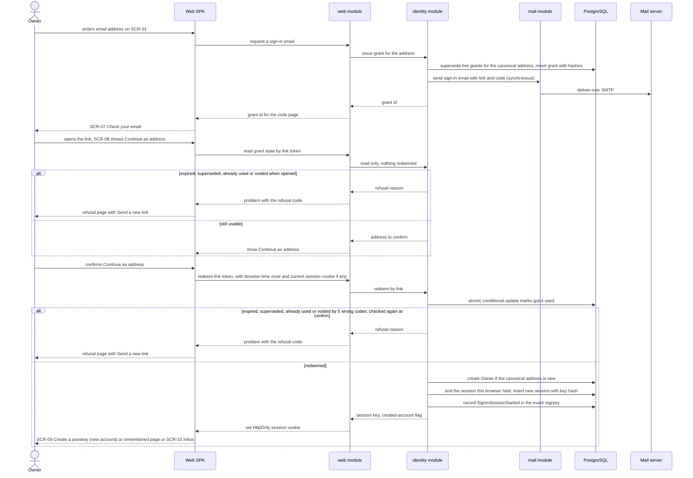
```mermaid
sequenceDiagram
    actor Owner
    participant SPA as Web SPA
    participant Web as web module
    participant Identity as identity module
    participant Mail as mail module
    participant DB as PostgreSQL
    participant MS as Mail server

    Owner->>SPA: enters email address on SCR-01
    SPA->>Web: request a sign-in email
    Web->>Identity: issue grant for the address
    Identity->>DB: supersede live grants for the canonical address, insert grant with hashes
    Identity->>Mail: send sign-in email with link and code (synchronous)
    Mail->>MS: deliver over SMTP
    Identity-->>Web: grant id
    Web-->>SPA: grant id for the code page
    SPA-->>Owner: SCR-07 Check your email
    Owner->>SPA: opens the link, SCR-08 shows Continue as address
    SPA->>Web: read grant state by link token
    Web->>Identity: read only, nothing redeemed
    alt expired, superseded, already used or voided when opened
        Identity-->>Web: refusal reason
        Web-->>SPA: problem with the refusal code
        SPA-->>Owner: refusal page with Send a new link
    else still usable
        Identity-->>Web: address to confirm
        Web-->>SPA: show Continue as address
    end
    Owner->>SPA: confirms Continue as address
    SPA->>Web: redeem link token, with browser time zone and current session cookie if any
    Web->>Identity: redeem by link
    Identity->>DB: atomic conditional update marks grant used
    alt expired, superseded, already used or voided by 5 wrong codes, checked again at confirm
        Identity-->>Web: refusal reason
        Web-->>SPA: problem with the refusal code
        SPA-->>Owner: refusal page with Send a new link
    else redeemed
        Identity->>DB: create Owner if the canonical address is new
        Identity->>DB: end the session this browser held, insert new session with key hash
        Identity->>DB: record SignInSessionStarted in the event registry
        Identity-->>Web: session key, created-account flag
        Web-->>SPA: set HttpOnly session cookie
        SPA-->>Owner: SCR-09 Create a passkey (new account) or remembered page or SCR-10 Inbox
    end
```

**Critical flow 2: "New sign-in to teleX" notice after commit (AC-98, event propagation)**

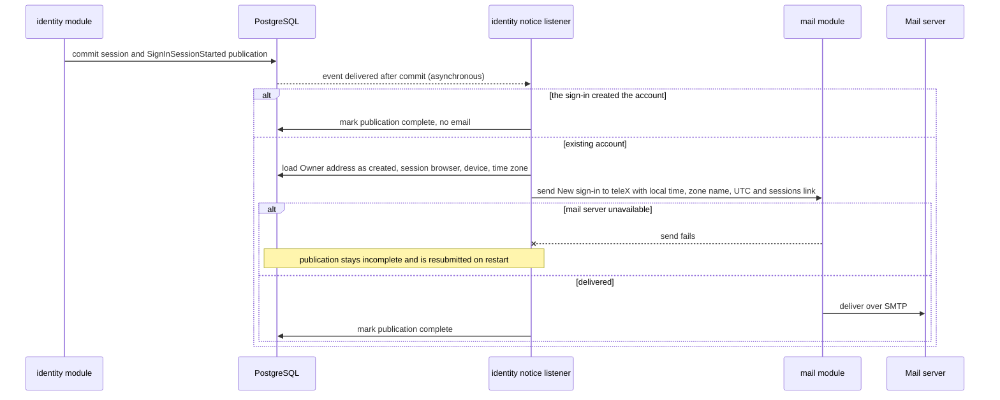
```mermaid
sequenceDiagram
    participant Identity as identity module
    participant DB as PostgreSQL
    participant Listener as identity notice listener
    participant Mail as mail module
    participant MS as Mail server

    Identity->>DB: commit session and SignInSessionStarted publication
    DB-->>Listener: event delivered after commit (asynchronous)
    alt the sign-in created the account
        Listener->>DB: mark publication complete, no email
    else existing account
        Listener->>DB: load Owner address as created, session browser, device, time zone
        Listener->>Mail: send New sign-in to teleX with local time, zone name, UTC and sessions link
        alt mail server unavailable
            Mail--xListener: send fails
            Note over Listener,DB: publication stays incomplete and is resubmitted on restart
        else delivered
            Mail->>MS: deliver over SMTP
            Listener->>DB: mark publication complete
        end
    end
```

**Critical flow 3: an authenticated request, ended or idle session (AC-93, AC-96, AC-97, AC-102)**

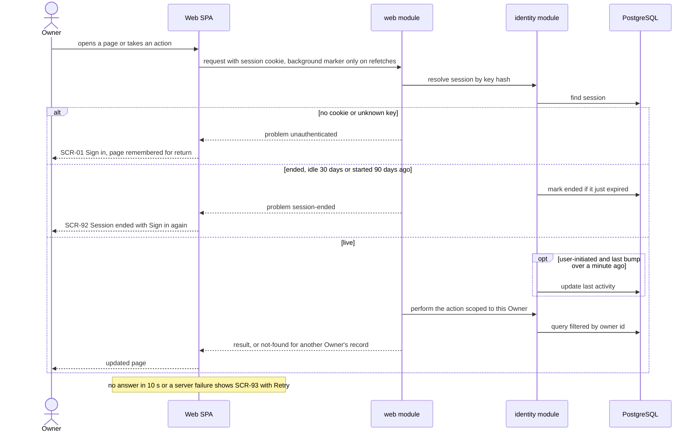
```mermaid
sequenceDiagram
    actor Owner
    participant SPA as Web SPA
    participant Web as web module
    participant Identity as identity module
    participant DB as PostgreSQL

    Owner->>SPA: opens a page or takes an action
    SPA->>Web: request with session cookie, background marker only on refetches
    Web->>Identity: resolve session by key hash
    Identity->>DB: find session
    alt no cookie or unknown key
        Web-->>SPA: problem unauthenticated
        SPA-->>Owner: SCR-01 Sign in, page remembered for return
    else ended, idle 30 days or started 90 days ago
        Identity->>DB: mark ended if it just expired
        Web-->>SPA: problem session-ended
        SPA-->>Owner: SCR-92 Session ended with Sign in again
    else live
        opt user-initiated and last bump over a minute ago
            Identity->>DB: update last activity
        end
        Web->>Identity: perform the action scoped to this Owner
        Identity->>DB: query filtered by owner id
        Web-->>SPA: result, or not-found for another Owner's record
        SPA-->>Owner: updated page
    end
    Note over SPA: no answer in 10 s or a server failure shows SCR-93 with Retry
```

### Runtime flows by user story

The flows below were added by `/sdd:sequences`, one per critical user story or distinct runtime path, in §4 order. They use generic participants that map onto §5: `<user>` is the Owner or the Operator, `<ui>` is the Web SPA, `<service>` is the teleX app (the `web`, `identity` and `mail` modules together), `<data-store>` is the database, `<external-system>` is the mail server with the Owner's mailbox or the passkey authenticator (named per flow), and `<message-bus>` is the event publication registry. Every `persists` note marks a write that `/sdd:data-model` must index for. The three critical flows above stay as design drew them and count toward coverage.

### Flow US-41: start teleX with one command

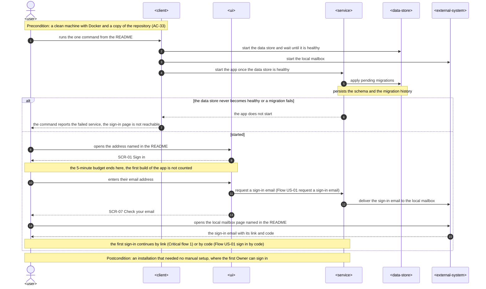
```mermaid
sequenceDiagram
    autonumber
    actor U as <user>
    participant C as <client>
    participant UI as <ui>
    participant S as <service>
    participant D as <data-store>
    participant X as <external-system>

    Note over U,C: Precondition: a clean machine with Docker and a copy of the repository (AC-33)
    U->>C: runs the one command from the README
    C->>D: start the data store and wait until it is healthy
    C->>X: start the local mailbox
    C->>S: start the app once the data store is healthy
    S->>D: apply pending migrations
    Note over S,D: persists the schema and the migration history
    alt the data store never becomes healthy or a migration fails
        S-->>C: the app does not start
        C-->>U: the command reports the failed service, the sign-in page is not reachable
    else started
        U->>UI: opens the address named in the README
        UI-->>U: SCR-01 Sign in
        Note over U,UI: the 5-minute budget ends here, the first build of the app is not counted
        U->>UI: enters their email address
        UI->>S: request a sign-in email (Flow US-01 request a sign-in email)
        S->>X: deliver the sign-in email to the local mailbox
        UI-->>U: SCR-07 Check your email
        U->>X: opens the local mailbox page named in the README
        X-->>U: the sign-in email with its link and code
        Note over U,S: the first sign-in continues by link (Critical flow 1) or by code (Flow US-01 sign in by code)
    end
    Note over U,S: Postcondition: an installation that needed no manual setup, where the first Owner can sign in
```

### Flow US-01: request a sign-in email

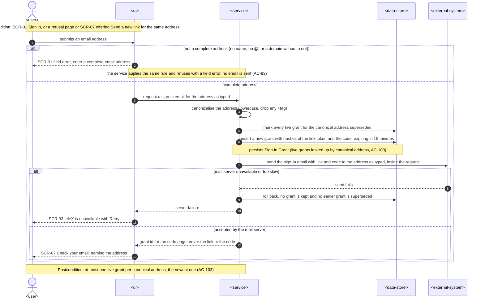
```mermaid
sequenceDiagram
    autonumber
    actor U as <user>
    participant UI as <ui>
    participant S as <service>
    participant D as <data-store>
    participant X as <external-system>

    Note over U,UI: Precondition: SCR-01 Sign in, or a refusal page or SCR-07 offering Send a new link for the same address
    U->>UI: submits an email address
    alt not a complete address (no name, no @, or a domain without a dot)
        UI-->>U: SCR-01 field error, enter a complete email address
        Note over UI,S: the service applies the same rule and refuses with a field error, no email is sent (AC-83)
    else complete address
        UI->>S: request a sign-in email for the address as typed
        S->>S: canonicalise the address (lowercase, drop any +tag)
        S->>D: mark every live grant for the canonical address superseded
        S->>D: insert a new grant with hashes of the link token and the code, expiring in 15 minutes
        Note over S,D: persists Sign-in Grant (live grants looked up by canonical address, AC-103)
        S->>X: send the sign-in email with link and code to the address as typed, inside the request
        alt mail server unavailable or too slow
            X--xS: send fails
            S->>D: roll back, no grant is kept and no earlier grant is superseded
            S-->>UI: server failure
            UI-->>U: SCR-93 teleX is unavailable with Retry
        else accepted by the mail server
            S-->>UI: grant id for the code page, never the link or the code
            UI-->>U: SCR-07 Check your email, naming the address
        end
    end
    Note over U,S: Postcondition: at most one live grant per canonical address, the newest one (AC-103)
```

### Flow US-01: sign in by Sign-in Code

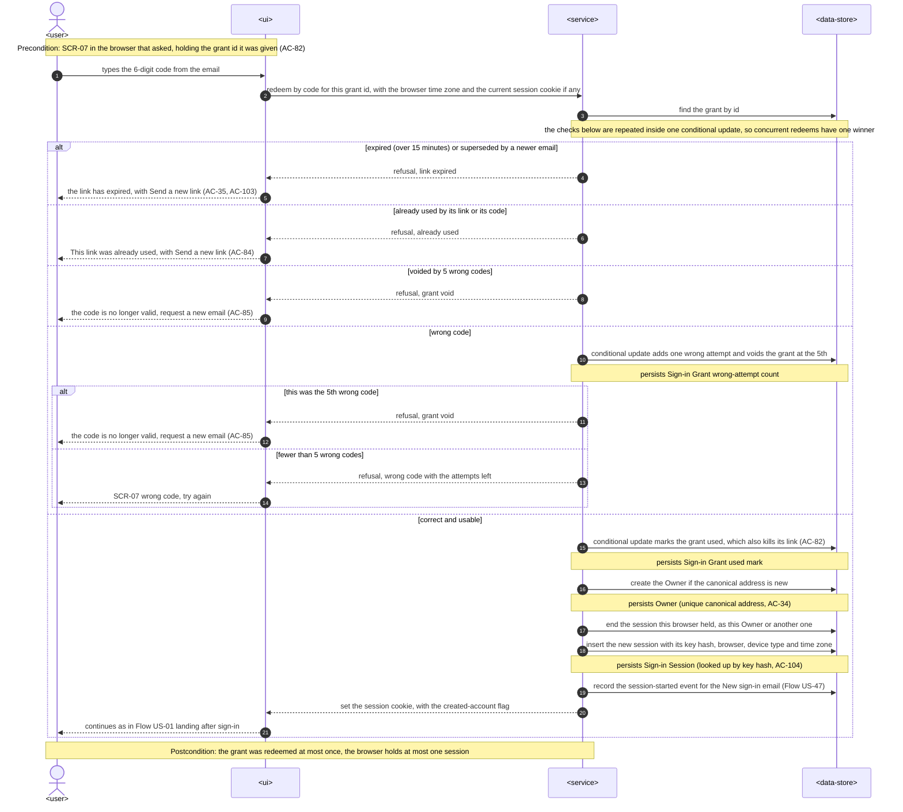
```mermaid
sequenceDiagram
    autonumber
    actor U as <user>
    participant UI as <ui>
    participant S as <service>
    participant D as <data-store>

    Note over U,UI: Precondition: SCR-07 in the browser that asked, holding the grant id it was given (AC-82)
    U->>UI: types the 6-digit code from the email
    UI->>S: redeem by code for this grant id, with the browser time zone and the current session cookie if any
    S->>D: find the grant by id
    Note over S,D: the checks below are repeated inside one conditional update, so concurrent redeems have one winner
    alt expired (over 15 minutes) or superseded by a newer email
        S-->>UI: refusal, link expired
        UI-->>U: the link has expired, with Send a new link (AC-35, AC-103)
    else already used by its link or its code
        S-->>UI: refusal, already used
        UI-->>U: This link was already used, with Send a new link (AC-84)
    else voided by 5 wrong codes
        S-->>UI: refusal, grant void
        UI-->>U: the code is no longer valid, request a new email (AC-85)
    else wrong code
        S->>D: conditional update adds one wrong attempt and voids the grant at the 5th
        Note over S,D: persists Sign-in Grant wrong-attempt count
        alt this was the 5th wrong code
            S-->>UI: refusal, grant void
            UI-->>U: the code is no longer valid, request a new email (AC-85)
        else fewer than 5 wrong codes
            S-->>UI: refusal, wrong code with the attempts left
            UI-->>U: SCR-07 wrong code, try again
        end
    else correct and usable
        S->>D: conditional update marks the grant used, which also kills its link (AC-82)
        Note over S,D: persists Sign-in Grant used mark
        S->>D: create the Owner if the canonical address is new
        Note over S,D: persists Owner (unique canonical address, AC-34)
        S->>D: end the session this browser held, as this Owner or another one
        S->>D: insert the new session with its key hash, browser, device type and time zone
        Note over S,D: persists Sign-in Session (looked up by key hash, AC-104)
        S->>D: record the session-started event for the New sign-in email (Flow US-47)
        S-->>UI: set the session cookie, with the created-account flag
        UI-->>U: continues as in Flow US-01 landing after sign-in
    end
    Note over U,S: Postcondition: the grant was redeemed at most once, the browser holds at most one session
```

### Flow US-01: landing after sign-in

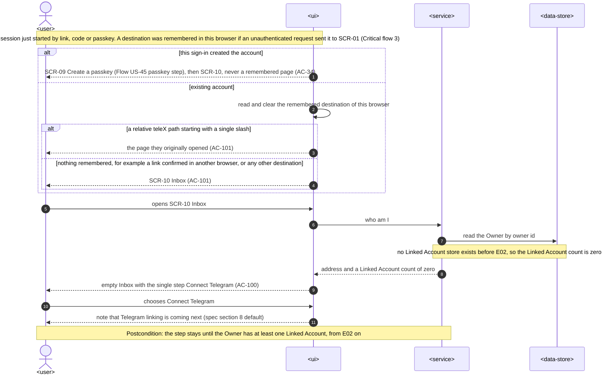
```mermaid
sequenceDiagram
    autonumber
    actor U as <user>
    participant UI as <ui>
    participant S as <service>
    participant D as <data-store>

    Note over U,UI: Precondition: a session just started by link, code or passkey. A destination was remembered in this browser if an unauthenticated request sent it to SCR-01 (Critical flow 3)
    alt this sign-in created the account
        UI-->>U: SCR-09 Create a passkey (Flow US-45 passkey step), then SCR-10, never a remembered page (AC-34)
    else existing account
        UI->>UI: read and clear the remembered destination of this browser
        alt a relative teleX path starting with a single slash
            UI-->>U: the page they originally opened (AC-101)
        else nothing remembered, for example a link confirmed in another browser, or any other destination
            UI-->>U: SCR-10 Inbox (AC-101)
        end
    end
    U->>UI: opens SCR-10 Inbox
    UI->>S: who am I
    S->>D: read the Owner by owner id
    Note over S,D: no Linked Account store exists before E02, so the Linked Account count is zero
    S-->>UI: address and a Linked Account count of zero
    UI-->>U: empty Inbox with the single step Connect Telegram (AC-100)
    U->>UI: chooses Connect Telegram
    UI-->>U: note that Telegram linking is coming next (spec section 8 default)
    Note over U,S: Postcondition: the step stays until the Owner has at least one Linked Account, from E02 on
```

### Flow US-45: passkey step after the first sign-in

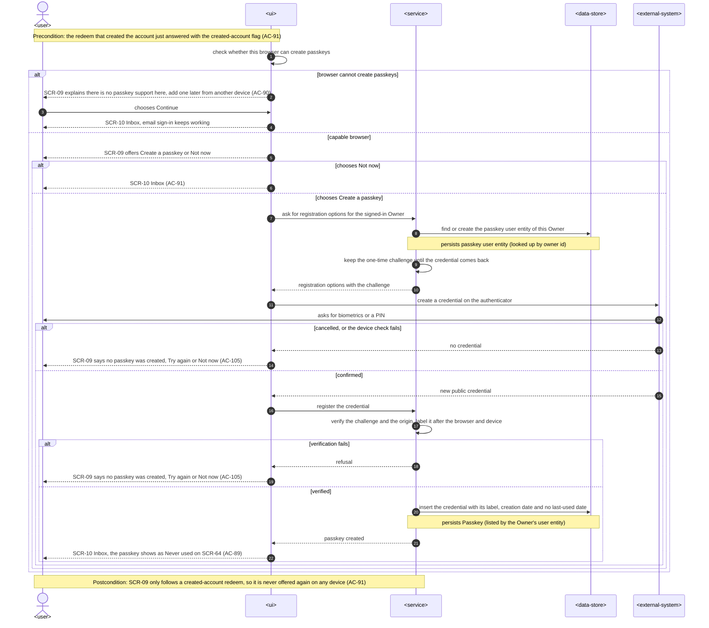
```mermaid
sequenceDiagram
    autonumber
    actor U as <user>
    participant UI as <ui>
    participant S as <service>
    participant D as <data-store>
    participant X as <external-system>

    Note over U,UI: Precondition: the redeem that created the account just answered with the created-account flag (AC-91)
    UI->>UI: check whether this browser can create passkeys
    alt browser cannot create passkeys
        UI-->>U: SCR-09 explains there is no passkey support here, add one later from another device (AC-90)
        U->>UI: chooses Continue
        UI-->>U: SCR-10 Inbox, email sign-in keeps working
    else capable browser
        UI-->>U: SCR-09 offers Create a passkey or Not now
        alt chooses Not now
            UI-->>U: SCR-10 Inbox (AC-91)
        else chooses Create a passkey
            UI->>S: ask for registration options for the signed-in Owner
            S->>D: find or create the passkey user entity of this Owner
            Note over S,D: persists passkey user entity (looked up by owner id)
            S->>S: keep the one-time challenge until the credential comes back
            S-->>UI: registration options with the challenge
            UI->>X: create a credential on the authenticator
            X->>U: asks for biometrics or a PIN
            alt cancelled, or the device check fails
                X-->>UI: no credential
                UI-->>U: SCR-09 says no passkey was created, Try again or Not now (AC-105)
            else confirmed
                X-->>UI: new public credential
                UI->>S: register the credential
                S->>S: verify the challenge and the origin, label it after the browser and device
                alt verification fails
                    S-->>UI: refusal
                    UI-->>U: SCR-09 says no passkey was created, Try again or Not now (AC-105)
                else verified
                    S->>D: insert the credential with its label, creation date and no last-used date
                    Note over S,D: persists Passkey (listed by the Owner's user entity)
                    S-->>UI: passkey created
                    UI-->>U: SCR-10 Inbox, the passkey shows as Never used on SCR-64 (AC-89)
                end
            end
        end
    end
    Note over U,S: Postcondition: SCR-09 only follows a created-account redeem, so it is never offered again on any device (AC-91)
```

### Flow US-45: sign in with a passkey

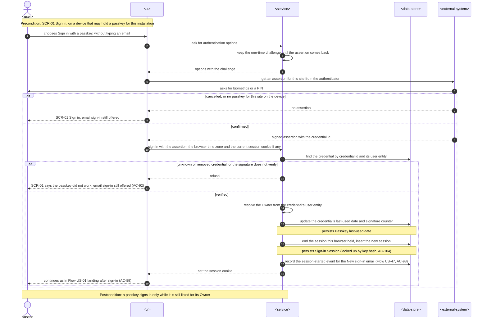
```mermaid
sequenceDiagram
    autonumber
    actor U as <user>
    participant UI as <ui>
    participant S as <service>
    participant D as <data-store>
    participant X as <external-system>

    Note over U,UI: Precondition: SCR-01 Sign in, on a device that may hold a passkey for this installation
    U->>UI: chooses Sign in with a passkey, without typing an email
    UI->>S: ask for authentication options
    S->>S: keep the one-time challenge until the assertion comes back
    S-->>UI: options with the challenge
    UI->>X: get an assertion for this site from the authenticator
    X->>U: asks for biometrics or a PIN
    alt cancelled, or no passkey for this site on the device
        X-->>UI: no assertion
        UI-->>U: SCR-01 Sign in, email sign-in still offered
    else confirmed
        X-->>UI: signed assertion with the credential id
        UI->>S: sign in with the assertion, the browser time zone and the current session cookie if any
        S->>D: find the credential by credential id and its user entity
        alt unknown or removed credential, or the signature does not verify
            S-->>UI: refusal
            UI-->>U: SCR-01 says the passkey did not work, email sign-in still offered (AC-92)
        else verified
            S->>S: resolve the Owner from the credential's user entity
            S->>D: update the credential's last-used date and signature counter
            Note over S,D: persists Passkey last-used date
            S->>D: end the session this browser held, insert the new session
            Note over S,D: persists Sign-in Session (looked up by key hash, AC-104)
            S->>D: record the session-started event for the New sign-in email (Flow US-47, AC-98)
            S-->>UI: set the session cookie
            UI-->>U: continues as in Flow US-01 landing after sign-in (AC-89)
        end
    end
    Note over U,S: Postcondition: a passkey signs in only while it is still listed for its Owner
```

### Flow US-46: manage passkeys on Profile and security

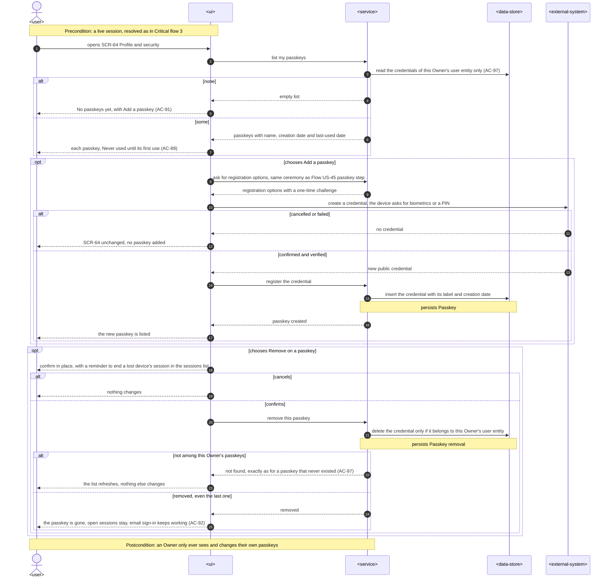
```mermaid
sequenceDiagram
    autonumber
    actor U as <user>
    participant UI as <ui>
    participant S as <service>
    participant D as <data-store>
    participant X as <external-system>

    Note over U,UI: Precondition: a live session, resolved as in Critical flow 3
    U->>UI: opens SCR-64 Profile and security
    UI->>S: list my passkeys
    S->>D: read the credentials of this Owner's user entity only (AC-97)
    alt none
        S-->>UI: empty list
        UI-->>U: No passkeys yet, with Add a passkey (AC-91)
    else some
        S-->>UI: passkeys with name, creation date and last-used date
        UI-->>U: each passkey, Never used until its first use (AC-89)
    end
    opt chooses Add a passkey
        UI->>S: ask for registration options, same ceremony as Flow US-45 passkey step
        S-->>UI: registration options with a one-time challenge
        UI->>X: create a credential, the device asks for biometrics or a PIN
        alt cancelled or failed
            X-->>UI: no credential
            UI-->>U: SCR-64 unchanged, no passkey added
        else confirmed and verified
            X-->>UI: new public credential
            UI->>S: register the credential
            S->>D: insert the credential with its label and creation date
            Note over S,D: persists Passkey
            S-->>UI: passkey created
            UI-->>U: the new passkey is listed
        end
    end
    opt chooses Remove on a passkey
        UI-->>U: confirm in place, with a reminder to end a lost device's session in the sessions list
        alt cancels
            UI-->>U: nothing changes
        else confirms
            UI->>S: remove this passkey
            S->>D: delete the credential only if it belongs to this Owner's user entity
            Note over S,D: persists Passkey removal
            alt not among this Owner's passkeys
                S-->>UI: not found, exactly as for a passkey that never existed (AC-97)
                UI-->>U: the list refreshes, nothing else changes
            else removed, even the last one
                S-->>UI: removed
                UI-->>U: the passkey is gone, open sessions stay, email sign-in keeps working (AC-92)
            end
        end
    end
    Note over U,S: Postcondition: an Owner only ever sees and changes their own passkeys
```

### Flow US-46: manage Sign-in Sessions

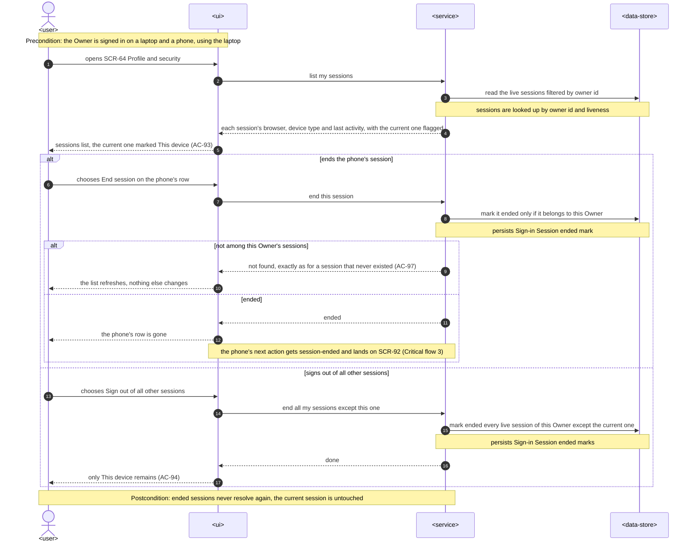
```mermaid
sequenceDiagram
    autonumber
    actor U as <user>
    participant UI as <ui>
    participant S as <service>
    participant D as <data-store>

    Note over U,UI: Precondition: the Owner is signed in on a laptop and a phone, using the laptop
    U->>UI: opens SCR-64 Profile and security
    UI->>S: list my sessions
    S->>D: read the live sessions filtered by owner id
    Note over S,D: sessions are looked up by owner id and liveness
    S-->>UI: each session's browser, device type and last activity, with the current one flagged
    UI-->>U: sessions list, the current one marked This device (AC-93)
    alt ends the phone's session
        U->>UI: chooses End session on the phone's row
        UI->>S: end this session
        S->>D: mark it ended only if it belongs to this Owner
        Note over S,D: persists Sign-in Session ended mark
        alt not among this Owner's sessions
            S-->>UI: not found, exactly as for a session that never existed (AC-97)
            UI-->>U: the list refreshes, nothing else changes
        else ended
            S-->>UI: ended
            UI-->>U: the phone's row is gone
            Note over UI,S: the phone's next action gets session-ended and lands on SCR-92 (Critical flow 3)
        end
    else signs out of all other sessions
        U->>UI: chooses Sign out of all other sessions
        UI->>S: end all my sessions except this one
        S->>D: mark ended every live session of this Owner except the current one
        Note over S,D: persists Sign-in Session ended marks
        S-->>UI: done
        UI-->>U: only This device remains (AC-94)
    end
    Note over U,S: Postcondition: ended sessions never resolve again, the current session is untouched
```

### Flow US-46: sign out

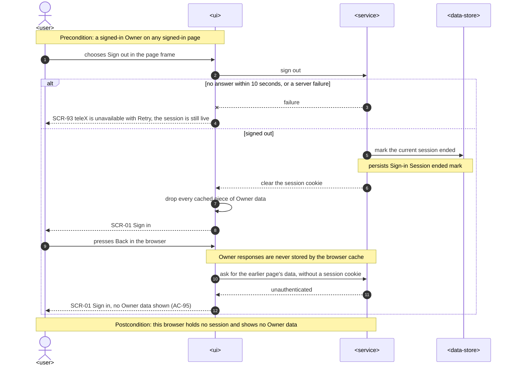
```mermaid
sequenceDiagram
    autonumber
    actor U as <user>
    participant UI as <ui>
    participant S as <service>
    participant D as <data-store>

    Note over U,UI: Precondition: a signed-in Owner on any signed-in page
    U->>UI: chooses Sign out in the page frame
    UI->>S: sign out
    alt no answer within 10 seconds, or a server failure
        S--xUI: failure
        UI-->>U: SCR-93 teleX is unavailable with Retry, the session is still live
    else signed out
        S->>D: mark the current session ended
        Note over S,D: persists Sign-in Session ended mark
        S-->>UI: clear the session cookie
        UI->>UI: drop every cached piece of Owner data
        UI-->>U: SCR-01 Sign in
        U->>UI: presses Back in the browser
        Note over UI,S: Owner responses are never stored by the browser cache
        UI->>S: ask for the earlier page's data, without a session cookie
        S-->>UI: unauthenticated
        UI-->>U: SCR-01 Sign in, no Owner data shown (AC-95)
    end
    Note over U,S: Postcondition: this browser holds no session and shows no Owner data
```

### Flow US-47: New sign-in to teleX email

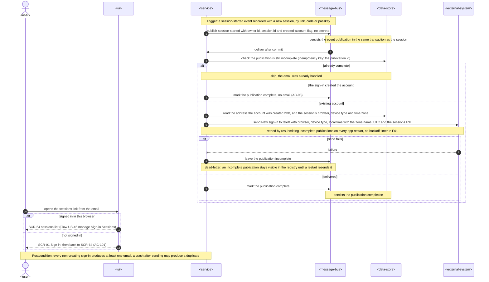
```mermaid
sequenceDiagram
    autonumber
    actor U as <user>
    participant UI as <ui>
    participant S as <service>
    participant B as <message-bus>
    participant D as <data-store>
    participant X as <external-system>

    Note over S,B: Trigger: a session-started event recorded with a new session, by link, code or passkey
    S->>B: publish session-started with owner id, session id and created-account flag, no secrets
    Note over B,D: persists the event publication in the same transaction as the session
    B->>S: deliver after commit
    S->>D: check the publication is still incomplete (idempotency key: the publication id)
    alt already complete
        Note over S,D: skip, the email was already handled
    else the sign-in created the account
        S->>B: mark the publication complete, no email (AC-98)
    else existing account
        S->>D: read the address the account was created with, and the session's browser, device type and time zone
        S->>X: send New sign-in to teleX with browser, device type, local time with the zone name, UTC and the sessions link
        Note over S,X: retried by resubmitting incomplete publications on every app restart, no backoff timer in E01
        alt send fails
            X--xS: failure
            S->>B: leave the publication incomplete
            Note over S,B: dead-letter: an incomplete publication stays visible in the registry until a restart resends it
        else delivered
            S->>B: mark the publication complete
            Note over B,D: persists the publication completion
        end
    end
    U->>UI: opens the sessions link from the email
    alt signed in in this browser
        UI-->>U: SCR-64 sessions list (Flow US-46 manage Sign-in Sessions)
    else not signed in
        UI-->>U: SCR-01 Sign in, then back to SCR-64 (AC-101)
    end
    Note over U,S: Postcondition: every non-creating sign-in produces at least one email, a crash after sending may produce a duplicate
```

### Flow US-49: system pages

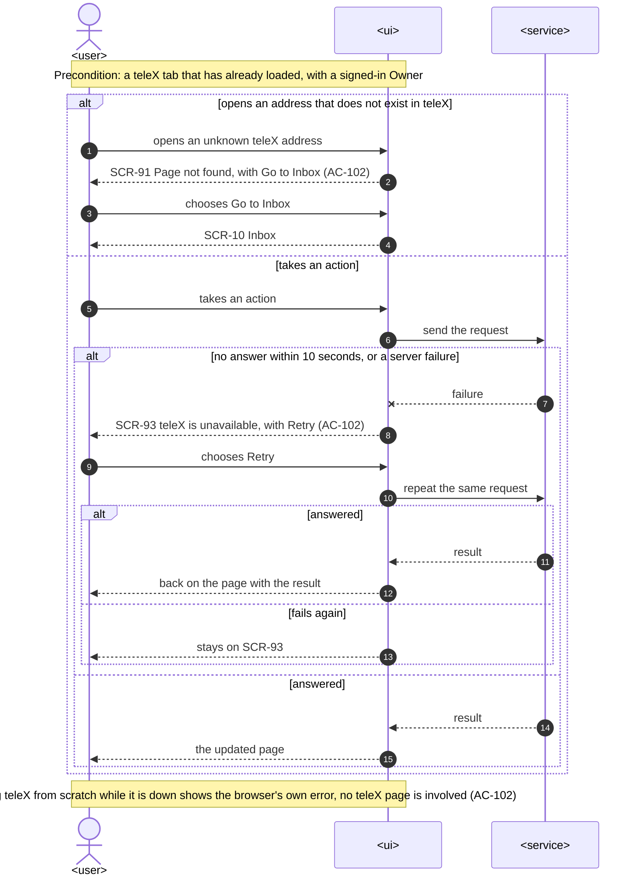
```mermaid
sequenceDiagram
    autonumber
    actor U as <user>
    participant UI as <ui>
    participant S as <service>

    Note over U,UI: Precondition: a teleX tab that has already loaded, with a signed-in Owner
    alt opens an address that does not exist in teleX
        U->>UI: opens an unknown teleX address
        UI-->>U: SCR-91 Page not found, with Go to Inbox (AC-102)
        U->>UI: chooses Go to Inbox
        UI-->>U: SCR-10 Inbox
    else takes an action
        U->>UI: takes an action
        UI->>S: send the request
        alt no answer within 10 seconds, or a server failure
            S--xUI: failure
            UI-->>U: SCR-93 teleX is unavailable, with Retry (AC-102)
            U->>UI: chooses Retry
            UI->>S: repeat the same request
            alt answered
                S-->>UI: result
                UI-->>U: back on the page with the result
            else fails again
                UI-->>U: stays on SCR-93
            end
        else answered
            S-->>UI: result
            UI-->>U: the updated page
        end
    end
    Note over U,UI: opening teleX from scratch while it is down shows the browser's own error, no teleX page is involved (AC-102)
```

### Coverage

| User story | Flows |
|---|---|
| US-41 | Flow US-41 |
| US-01 | Critical flow 1 (link), Flow US-01 request a sign-in email, Flow US-01 sign in by Sign-in Code, Flow US-01 landing after sign-in |
| US-45 | Flow US-45 passkey step, Flow US-45 sign in with a passkey |
| US-46 | Flow US-46 manage passkeys, Flow US-46 manage Sign-in Sessions, Flow US-46 sign out, Critical flow 3 |
| US-47 | Critical flow 2, Flow US-47 |
| US-49 | Flow US-49 system pages, Flow US-01 landing after sign-in, Critical flow 3 |

| AC | Shown by |
|---|---|
| AC-33 | Flow US-41, the `started` branch (the 5-minute timing is measured by hand per spec §6) |
| AC-34 | Critical flow 1, `redeemed`; Flow US-01 sign in by code, Owner creation; Flow US-01 landing, `created the account` |
| AC-82 | Flow US-01 sign in by code, `correct and usable` |
| AC-35 | Critical flow 1, both refusal branches; Flow US-01 sign in by code, `expired` |
| AC-83 | Flow US-01 request a sign-in email, `not a complete address` |
| AC-84 | Critical flow 1, refusal branches; Flow US-01 sign in by code, `already used` |
| AC-85 | Critical flow 1, refusal branches; Flow US-01 sign in by code, `voided` and `5th wrong code` |
| AC-86 | Critical flow 1, the read-only open before the confirm |
| AC-103 | Flow US-01 request a sign-in email, supersede step; Flow US-01 sign in by code, `superseded`; Critical flow 1 |
| AC-104 | Critical flow 1, `redeemed`; Flow US-01 sign in by code and Flow US-45 sign in with a passkey, the end-the-held-session step |
| AC-89 | Flow US-45 passkey step, `verified`; Flow US-45 sign in with a passkey, `verified`; Flow US-46 manage passkeys, list |
| AC-90 | Flow US-45 passkey step, `browser cannot create passkeys` |
| AC-105 | Flow US-45 passkey step, `cancelled` and `verification fails` |
| AC-91 | Flow US-45 passkey step, `Not now` and postcondition; Flow US-46 manage passkeys, `none` |
| AC-92 | Flow US-46 manage passkeys, `Remove`; Flow US-45 sign in with a passkey, `unknown or removed credential` |
| AC-93 | Flow US-46 manage Sign-in Sessions, list and `ends the phone's session`; Critical flow 3, `ended` |
| AC-94 | Flow US-46 manage Sign-in Sessions, `signs out of all other sessions` |
| AC-95 | Flow US-46 sign out |
| AC-96 | Critical flow 3, `ended, idle 30 days or started 90 days ago` |
| AC-97 | Flow US-46 manage passkeys and manage Sign-in Sessions, `not among this Owner's`; Critical flow 3, owner-filtered query |
| AC-98 | Critical flow 2; Flow US-47 |
| AC-100 | Flow US-01 landing after sign-in, Inbox part |
| AC-101 | Flow US-01 landing after sign-in, `existing account`; Critical flow 3, `no cookie`; Flow US-47, `not signed in` |
| AC-102 | Flow US-49 system pages; Critical flow 3, closing note |

### Flagged by sequences

- **WebAuthn challenge storage (for design / data-model).** Flows US-45 keep a one-time challenge between the options request and the credential or assertion request. Spring Security keeps it in the `HttpSession` by default, while ADR-0001 replaces container sessions with the `telex_session` cookie. Decide whether a short-lived `HttpSession` is allowed for the ceremony alone, or a custom options repository stores the challenge (in memory or a table).
- **Passkey step is derived, not stored (for data-model).** §5 lists "has-passkey-step-pending" on `Owners`. The flows derive SCR-09 from the created-account flag of the redeem answer, so no column is needed, and reloading SCR-09 simply skips the step. Data-model confirms the column is not added.
- **Retry shape of the notice (accepted deviation).** The async-flow rule expects N retries with backoff and a dead-letter queue. ADR-0004 resubmits incomplete publications on restart only, and an incomplete publication in the registry is the dead letter (§11 risk "Notice email retried only on restart"). Delivery is at least once, so a crash after sending may duplicate the email.
- **Participants not declared in §5.** Flow US-41 uses `<client>` for the command that starts the containers (compose, §7, not a §5 building block). `<message-bus>` is the Modulith event publication registry, which lives in the database container of §5.
- **Index hints for data-model.** Live grants by canonical address (supersede), grant by id, Owner unique by canonical address, session unique by key hash, live sessions by owner id, credentials by WebAuthn user entity, incomplete event publications.
- The three critical flows above keep design's concrete participant names. They are left as drawn, because this stage only adds.

## 7. Deployment view

**Topology.** One app instance plus one Postgres, as fixed by foundation ADR-0001. The spec sets no availability SLO for E01 (spec §6 Availability: N/A).
- **Local (AC-33).** `docker compose up` starts three services:
  - `app`, built by a new multi-stage `Dockerfile`: a build stage on JDK 25 + Node/pnpm runs the Gradle `bootJar`, including the SPA; a runtime stage on JRE 25 runs it. The app is reachable at `http://localhost:8080`.
  - `postgres` (`pgvector/pgvector:pg17`, host port `TELEX_DB_PORT`, default 5432).
  - `mailpit`, the local mailbox: SMTP on 1025 for the app, a web page on `http://localhost:8025` for the Operator.

  The app waits for Postgres's health check, and Flyway migrates on start. The README names both addresses. The first image build is outside the 5-minute budget (spec §6).
- **Production (out of E01 scope beyond configuration).** The same image runs behind Cloudflare, which terminates HTTPS and proxies to the app over HTTP. The Operator sets `TELEX_PUBLIC_URL=https://<domain>` (ADR-0006), real SMTP settings (`TELEX_MAIL_*` → `spring.mail.*`) and the datasource. The app trusts `X-Forwarded-*` from the proxy (`server.forward-headers-strategy=framework`), so redirects and `request.isSecure` see the original HTTPS request. The README lists exactly these settings and warns against public exposure before E26 (spec §3, §8 OQ-2).
- **Developer loop (unchanged).** `docker compose up -d postgres mailpit` plus `bootRun --spring.profiles.active=local`, and `pnpm dev` with the Vite proxy extended to `/webauthn/**` and `/login/webauthn`. The `local` profile alone adds the Vite origin `http://localhost:5173` to the allowed WebAuthn origins (ADR-0006).

**Monitoring:**
- Metrics: Spring Boot Actuator + Micrometer counters `telex.signin.grants.issued`, `telex.signin.redeemed{method=link|code|passkey}`, `telex.signin.refused{reason=expired|used|void|wrong_code}`, `telex.sessions.started{created_account}`, `telex.mail.sent{template,outcome}`. No email addresses or secrets in tags.
- Health: `/actuator/health` (public, used by the compose health check); incomplete event publications are visible in `event_publication`.
- Alerts: none in E01 (no SLO). Tracing: none in E01; the tech spec's OpenTelemetry arrives with the agent epics.
- KPIs (spec §7) are read with SQL over `owner`, `sign_in_grant`, `sign_in_session` and `user_credentials`. There is no analytics pipeline.

**Scaling thresholds:**
- A single instance is enough for a course installation. Sessions resolve by a unique index on `key_hash`, one indexed read per request, plus at most one activity write per session per minute (ADR-0005).
- Expired grants and ended sessions are kept, with no cleanup job (§11 accepted debt). Add a purge job once `sign_in_grant` passes about 100 000 rows, or when E26 brings Operator maintenance tasks, whichever comes first.
- A second app instance needs no change to sessions: the state is in Postgres, not in memory.

## 8. Crosscutting concepts

Repo conventions are inherited by default (`CLAUDE.md`, `docs/architecture-map.md` §Conventions). The rows below are those conventions plus what this feature adds.

| Concept | Convention | Where defined |
|---|---|---|
| Logging | Spring Boot default logging with module loggers. **Never logged:** email addresses, link tokens, codes, session keys, WebAuthn payloads. An Owner is identified by `OwnerId` only (spec §6.1) | here |
| Authentication | One Spring Security filter chain in `web`. `SessionCookieSecurityContextRepository` resolves the `telex_session` cookie through `identity`'s `SignInSessions` (ADR-0001). Public routes: sign-in API (request, read grant, redeem by link or code), WebAuthn authentication options and login, `/actuator/health`, static SPA assets and client routes. Everything else needs a live session | ADR-0001, ADR-0002 |
| Authorization | Owner-scoped by construction: every `identity` query for sessions, passkeys or profile takes the `OwnerId` from the security context and filters on it. Passkeys are filtered by the Owner's WebAuthn user entity, because Spring's tables have no `owner_id` (ADR-0002). Another Owner's record is indistinguishable from a missing one, with the same `not-found` problem (AC-97). No roles in E01 (the Operator role is E26) | `architecture-map.md` §Persistence + here |
| Session cookie | `telex_session`: 256-bit random, `HttpOnly`, `SameSite=Lax`, `Path=/`, `Secure` when `TELEX_PUBLIC_URL` is https. Lifetime is enforced server-side: the cookie has a 90-day `Max-Age` as a hint only | ADR-0001, ADR-0006 |
| CSRF | Spring Security `CookieCsrfTokenRepository` (readable `XSRF-TOKEN` cookie, `X-XSRF-TOKEN` header from the fetch client) on every state-changing request, including the sign-in endpoints and the WebAuthn ceremonies | here |
| Session activity | Unmarked requests bump `last_activity_at` at most once a minute; `X-Telex-Background: 1` requests don't (AC-96) | ADR-0005 |
| Error handling | RFC 9457 via `ProblemHandler`, `type = urn:telex:error:<code>`, domain errors extend `DomainProblem`. New codes, each keying a `messages.ts` entry: `unauthenticated` (401), `session-ended` (401), `sign-in-link-expired`, `sign-in-link-used`, `sign-in-grant-void`, `sign-in-code-wrong` (with remaining attempts), `not-found` (404). Invalid email reuses `validation-failed` with a field error (AC-83). Exact statuses are settled by `/sdd:api` | `CLAUDE.md` §Errors + here |
| SPA failure handling | One fetch client: `unauthenticated` → SCR-01 with the current path remembered; `session-ended` → SCR-92; no answer within 10 s or a 5xx → SCR-93 whose "Retry" repeats the failed request; unknown client route → SCR-91 (AC-101, AC-102). Sign-out clears the TanStack cache so Back shows no data (AC-95) | here |
| Remembered destination | Stored in `localStorage` of the browser that asked to sign in; accepted only if it is a relative path starting with a single `/`, otherwise Inbox. A link confirmed in another browser finds nothing and lands on SCR-10 (AC-101, `ux-flows.md` design input). The account-creating sign-in always goes SCR-09 → SCR-10 | here |
| ID strategy | UUIDv7 typed ids: `OwnerId`, `SignInGrantId`, `SignInSessionId`. Exception: a Passkey is keyed by its WebAuthn credential id (ADR-0002) | foundation ADR-0003 |
| Email identity | `email_canonical` = lowercase, with the `+tag` removed from the local part, and unique across the installation, so one canonical address is one Owner (AC-34). `email_as_created` is kept for the new-sign-in email. A sign-in email goes to the address as typed that time. Validation: a name, an `@`, and a domain containing a dot (AC-83) | here |
| Secrets | `SecureRandom` everywhere. Link token and session key: 256 bits, stored as SHA-256. Code: 6 digits, stored as SHA-256(grant id + code). Never returned by any API after issue | ADR-0001, ADR-0003 |
| Time | One injectable `java.time.Clock` bean (fixed in tests). `timestamptz` in UTC. The new-sign-in email shows the signing-in browser's IANA zone (sent by the SPA at sign-in, stored on the session) with its name, and UTC (AC-98) | here |
| Device naming | In-house User-Agent mapper → "<Browser> on <Device>" and a device type (phone / tablet / computer), with a neutral fallback for unknown agents. Used for the session list, the passkey label and the email | here |
| Internationalisation | English only (D-14). UI copy in `frontend/src/messages.ts`, email copy in `identity` templates, sentence case, no emoji | design-system README |
| Events | `SignInSessionStarted` (identity → identity listener) through the Modulith JDBC registry. Event payloads never carry secrets | ADR-0004 |
| Proxy | Production runs behind Cloudflare (TLS terminated at the edge, origin HTTP). The app trusts `X-Forwarded-*` (`server.forward-headers-strategy=framework`). Email links, the cookie `Secure` flag and the WebAuthn RP ID/origins come from `TELEX_PUBLIC_URL`, never from request headers | ADR-0006 |
| Caching | API responses carry `Cache-Control: no-store` (Spring Security default), so Cloudflare and the browser never cache Owner data. Hashed static assets can be cached | ADR-0006 |
| Observability | Actuator health + Micrometer counters listed in §7. Tracing deferred | §7 |

## 9. Architecture decisions

| # | Title | Status | Section |
|---|---|---|---|
| [0001](adr/0001-keep-sign-in-sessions-in-an-identity-owned-table-behind-an-opaque-cookie.md) | Keep Sign-in Sessions in an identity-owned table behind an opaque, hashed cookie | Accepted | §4 |
| [0002](adr/0002-use-spring-security-webauthn-for-passkeys.md) | Use Spring Security's built-in WebAuthn support for Passkeys | Accepted | §4 |
| [0003](adr/0003-redeem-sign-in-link-and-code-as-one-hashed-single-use-grant.md) | Redeem the Sign-in Link and Sign-in Code as one hashed, single-use grant owned by identity | Accepted | §4 |
| [0004](adr/0004-send-email-through-a-new-mail-integration-module.md) | Send email through a new `mail` integration module; sign-in emails synchronously, notices by event | Accepted | §4 |
| [0005](adr/0005-count-session-activity-only-from-requests-the-spa-does-not-mark-as-background.md) | Count session activity only from requests the SPA does not mark as background | Accepted | §8 |
| [0006](adr/0006-derive-links-cookie-security-and-passkey-rp-id-from-one-public-url.md) | Derive email links, cookie security and the passkey RP ID from one configured public URL | Accepted | §7 |

ADR files live under `docs/features/platform-skeleton/adr/NNNN-<title>.md`. Foundation decisions this feature builds on: [`docs/adr/0001`](../../adr/0001-kotlin-spring-modulith-postgres-react-stack.md) (stack, SPA served by the app), [`0002`](../../adr/0002-single-app-with-isolated-tdlib-subproject.md) (one app, module packages), [`0003`](../../adr/0003-postgres-jdbc-flyway-uuidv7-persistence.md) (JDBC, Flyway + rollback, UUIDv7).

## 10. Quality requirements

Each §1 goal is expanded into testable scenarios. Numbers are quoted verbatim from spec §6.

**QG-1. No silent takeover (security of sign-in)**

*QG-1a: Sign-in Link lifetime.*
- **When:** a Sign-in Link is confirmed, or its Sign-in Code typed, after its window, or a second time.
- **Then:** sign-in is refused. Spec §6: Sign-in Link lifetime "15 min, single use". The check happens when the link is opened (SCR-08 shows the refusal at once) and again at the confirm or the typed code, not only at opening (AC-35, AC-84).
- **How verify:** `identity` integration test with a fixed `Clock`. For an email sent at 14:00, it opens the link at 14:05 and confirms at 15:01 (refused), redeems at 14:59, opens a used link (refused on open), and fires two concurrent redeems where exactly one succeeds (ADR-0003).

*QG-1b: Sign-in Code guessing.*
- **When:** wrong codes are typed against one sign-in email.
- **Then:** spec §6: Sign-in Code guessing "6 digits, ≤ 5 wrong attempts per email, then void". The link of a voided email is refused too (AC-85).
- **How verify:** integration test that types 5 wrong codes, then the right code and then the link, and asserts the `sign-in-grant-void` refusals.

*QG-1c: Sign-in Session lifetime.*
- **When:** a session has been idle, ignoring requests marked as background, or has been alive for a long time.
- **Then:** spec §6: Sign-in Session lifetime "ends after 30 days idle or 90 days from start". The next request gets `session-ended` and the SPA shows SCR-92.
- **How verify:** integration test with a fixed `Clock`. It runs background-only requests for 31 days (session ends), a user request on day 29 (session lives), and daily user requests up to day 90 (session ends at 90). A Playwright check covers SCR-92.

*QG-1d: Secrets at rest.*
- **When:** any Sign-in Link, Sign-in Code or session key has been issued.
- **Then:** it is never stored, shown back or logged in readable form (spec §6.1).
- **How verify:** integration test that captures the email from the fake `Mailer`, then searches every column of `sign_in_grant`, `sign_in_session` and `event_publication`, and the captured log output, for the raw token, code and cookie value. Zero hits.

**QG-2. One-command install**
- **When:** the Operator runs the README command on a clean machine.
- **Then:** spec §6: "≤ 5 min from the command to the sign-in page on a clean machine with Docker and ≥ 50 Mbit/s, not counting the first build of the teleX application image". The first sign-in then completes from the Mailpit page named in the README (AC-33).
- **How verify:** spec §6 measurement, a manual timed run on a clean machine recorded in the E01 pull request. Plus a CI-free smoke script (`docker compose up` → poll the sign-in page → request an email → read it through Mailpit's API) that anyone can rerun.

**QG-3. Works everywhere it's opened**

*QG-3a: Responsive and accessible.*
- **When:** any screen of this feature (SCR-01, 07, 08, 09, 10, 64, 91, 92, 93) is rendered in any of its states.
- **Then:** spec §6: "every screen in this spec works at 360 px and 1280 px and meets WCAG 2.2 AA".
- **How verify:** spec §6 measurement. Playwright runs each screen at both widths, plus an automated accessibility scan (axe) with 0 violations.

*QG-3b: Passkey browser coverage.*
- **When:** an Owner signs up, creates a Passkey and signs in with it.
- **Then:** spec §6: "sign-up, passkey creation and passkey sign-in work in current Chrome, Safari (macOS) and Safari (iOS)".
- **How verify:** spec §6 measurement. Playwright with a CDP virtual authenticator (Chromium) in CI, plus a manual check on Safari macOS and iOS against `localhost`, or HTTPS through Cloudflare, recorded per the E01 DoD.

**QG-4. Quality gate holds (E01 DoD)**
- **When:** a pull request introduces a deliberate detekt or ktlint violation.
- **Then:** spec §6: "a pull request with a deliberate detekt or ktlint violation fails CI and can't be merged". `ModularityTest` also stays green with the new `mail` module and `identity`'s widened `allowedDependencies`.
- **How verify:** a one-off check recorded in the E01 pull request (spec §6 measurement). `./gradlew test` runs `ApplicationModules.verify()` on every build.

## 11. Risks and technical debt

| Risk / debt | Severity | Mitigation | Owner |
|---|---|---|---|
| **The mailbox is the master key.** Whoever reads an Owner's email can sign in as them, and from E02 on that means their Telegram (spec §1) | Medium | New-sign-in email to the address the account was created with (AC-98), session list + revoke (AC-93, AC-94), 90-day cap (AC-96). Anti-enumeration and rate limits deliberately deferred (spec §3) | Anton Husiev (PM) |
| **Public exposure behind Cloudflare before E26.** Registration is open and sign-in emails have no rate limit, so anyone reaching the domain can create Owners or flood an address with sign-in emails | Medium | README warns against public exposure until E26 (spec §8 OQ-2, due before `/sdd:specify operator-console`). Stopgap if exposed: a Cloudflare rate-limiting rule or Cloudflare Access in front of the domain, which needs no app change | Anton Husiev (PM) |
| **Passkeys are bound to the RP ID.** Changing the production domain (`TELEX_PUBLIC_URL` host) makes every registered Passkey unusable | Medium | ADR-0006 makes the RP ID an explicit, rarely changed setting. Email sign-in always remains (AC-92), and the README flags the setting as "choose once" | Anton Husiev (Architect) |
| **No passkeys over LAN HTTP.** A phone opening teleX via the laptop's IP over HTTP isn't a secure context, so Passkeys fail there | Low | The Sign-in Code covers the phone/laptop case (AC-82). The README explains that Passkeys work on `localhost` or HTTPS | Anton Husiev (Architect) |
| **The framework owns the passkey schema and endpoints.** A Spring Security upgrade may change the `user_entities` / `user_credentials` shape or the WebAuthn paths | Low | Versions pinned by the Boot BOM. Migrations create the tables explicitly (no auto-init). Playwright virtual-authenticator tests catch path changes (ADR-0002) | Anton Husiev (Architect) |
| **Synchronous sign-in email.** A down or slow mail server fails or slows "send me a link" | Low | The transaction rolls back (no orphaned grant), and the SPA shows SCR-93 with Retry. Mailpit is local, so it only matters in production (ADR-0004) | Anton Husiev (Architect) |
| **Notice email retried only on restart.** A failed "New sign-in to teleX" send stays an incomplete event publication until the app restarts | Low | `republish-outstanding-events-on-restart` on. Incomplete publications are visible in `event_publication`. A periodic resubmit can come with E26 Operator tooling (ADR-0004) | Anton Husiev (Architect) |
| **Brownfield drift.** `docs/architecture-map.md` reflects the pre-scaffold commit `ce5eabf` and says "13 modules"; this feature adds `mail` as the 14th and is the first to add Spring Security, mail, a router and a Dockerfile | Low | Re-run `/sdd:survey` after this design, and update the tech spec's module list when `implement` lands the `mail` module | Anton Husiev (Architect) |
| **Spec §8 OQ-1 is overdue** (due "before `/sdd:design`"): where "Connect Telegram" leads before E02 | Low | Design assumes the spec's default (a "Telegram linking is coming next" note, no stub E02 page). It doesn't affect the architecture, so it can close any time before `/sdd:screens` | Anton Husiev (PM) |

**Accepted debt (acceptable in v1, plan to fix later):**
- No cleanup of expired grants or ended sessions. Rows accumulate; add a purge job at about 100 000 `sign_in_grant` rows or with E26 (sad §7).
- A Sign-in Code hash (SHA-256 of grant id + code) can be brute-forced offline from a leaked database, but it's useful only within the grant's 15 minutes. A keyed hash (HMAC with a server secret) can replace it without a schema change.
- The in-house User-Agent mapper covers the major browsers and devices only; unknown agents get a neutral label.
- No anti-enumeration and no rate limits on sign-in emails (spec §3, deferred to the public-installation work).

## 12. Glossary

Canonical terms come from [`CONTEXT.md`](../../../CONTEXT.md) (repo root); the definitions there win. Terms marked **new** surfaced during design and aren't in CONTEXT yet. Recommend `/sdd:glossary platform-skeleton` for them.

| Term | Meaning |
|---|---|
| Owner | A person with a teleX account; someone becomes an Owner at sign-up, before any Telegram account is linked (CONTEXT) |
| Operator | The person who deploys and administers a teleX installation; in E01, only the person who runs the one command (CONTEXT, spec §3) |
| Sign-in Link | A single-use link in a sign-in email; opening and confirming it starts a Sign-in Session in that browser; it expires 15 minutes after it's sent, checked at the confirm (CONTEXT) |
| Sign-in Code | The 6-digit code in the same email; typed in the browser that asked; shares the link's expiry and single use; 5 wrong codes void both (CONTEXT) |
| Sign-in Session | The signed-in state of one Owner in one browser; ends on sign-out, revocation, 30 days without activity or 90 days after start (CONTEXT) |
| Passkey | A passwordless sign-in key on the Owner's device or in a password manager, confirmed with biometrics or a PIN; has a name, a creation date and a last-used date (CONTEXT) |
| Sign-in Grant (**new**) | The server-side record behind one sign-in email: hashes of its Sign-in Link token and Sign-in Code, wrong-attempt count, expiry, use and supersede marks. One grant = one single-use permission to sign in (ADR-0003) |
| Canonical email (**new**) | An address lowercased, with any `+tag` before the `@` removed; two addresses with the same canonical form are one Owner (AC-34) |
| Background request (**new**) | A request the SPA sends without the Owner doing anything (refetch on focus or interval); marked `X-Telex-Background: 1` and not counted as session activity (ADR-0005) |
| Public URL (**new**) | `TELEX_PUBLIC_URL`, the address where an installation is reached; source of email links, cookie security and the passkey RP ID (ADR-0006) |
| RP ID | WebAuthn relying-party ID, the domain a Passkey is bound to; the host of the Public URL (ADR-0006) |
| Local mailbox | The Mailpit web page bundled with the one-command install, where every email teleX sends shows up (AC-33) |
