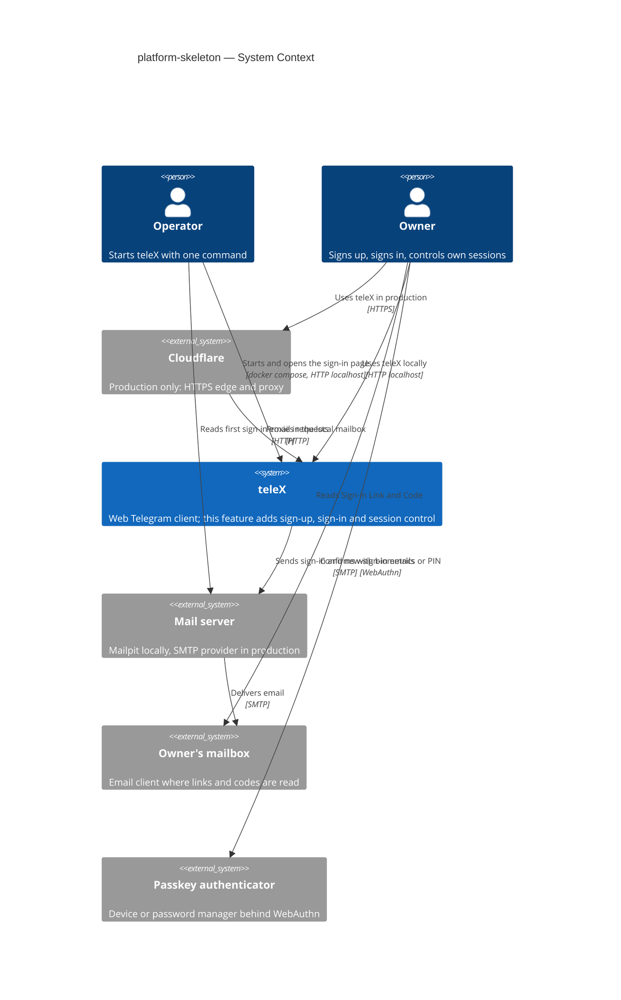
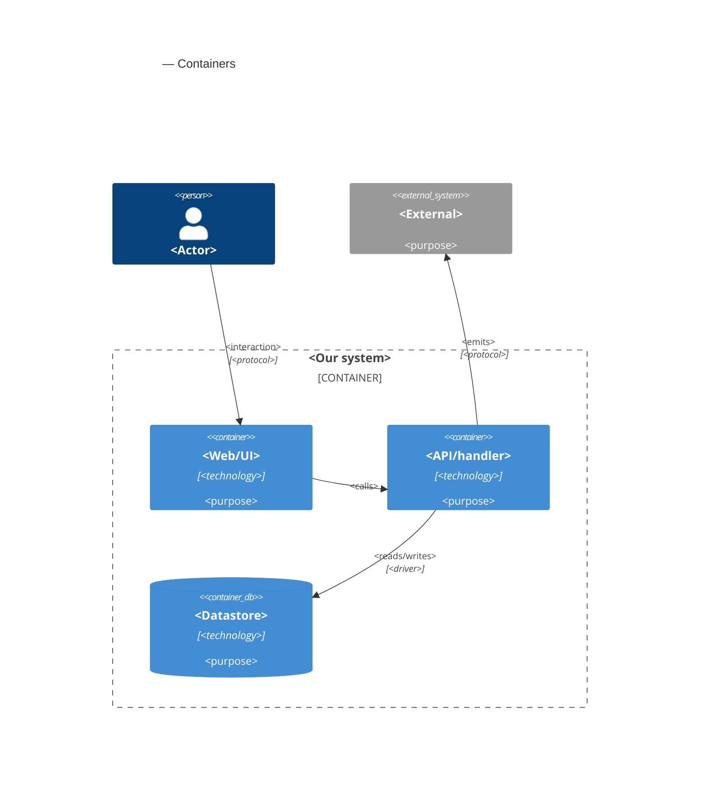

# Software Architecture Document — platform-skeleton

<!-- 12 Arc42 sections. Empty section → <!-- N/A: <one-line reason> -->. -->
<!-- C4 Context (L1) lives inline in §3. C4 Container (L2) lives inline in §5. -->
<!-- Numbers in §10 come VERBATIM from spec.md §6 NFR — no inventing, no rounding. -->

## 1. Introduction and goals

**Intent.** teleX gets its front door. An Operator starts a complete installation with one command and can finish the first sign-in from a local mailbox without configuring anything. An Owner signs up and signs in with nothing but an email address: they use the emailed Sign-in Link (confirmed on the page it opens) or its 6-digit Sign-in Code. After the first sign-in they can add a Passkey, which is never required. Owners see and end their own Sign-in Sessions, get a "New sign-in to teleX" email for every later sign-in, and always land on a clear system page instead of a dead end. Every later epic (E02 Telegram link, E06 app shell, E10 model profiles, E26 operator console) builds on the signed-in Owner this feature creates.

**Top-3 quality goals (1-liners; full scenarios in §10):**

1. **No silent takeover.** A sign-in email is a single-use, 15-minute permission whose code dies after 5 wrong tries. Secrets are stored only as hashes. Every later sign-in is announced by email, and every session can be revoked and is capped at 30 days idle / 90 days total.
2. **One-command install.** The sign-in page is open within 5 minutes of the README command, not counting the first image build, and the first sign-in needs only the bundled local mailbox.
3. **Works everywhere it's opened.** Every screen works at phone and desktop widths and meets WCAG 2.2 AA. Passkeys work in current Chrome and Safari (macOS, iOS), and email sign-in stays as the fallback.

**Stakeholders.**

| Role | Interest | Sign-off owner? |
|---|---|---|
| Operator | Starts the installation with one command; completes the first sign-in from the local mailbox (US-41) | No |
| Owner | Signs up and signs in by link, code or Passkey; controls their Sign-in Sessions and Passkeys; hears about new sign-ins (US-01, US-45, US-46, US-47, US-49) | No |
| Tech Lead | SAD approval; the identity/web/mail boundaries every later epic builds on | Yes |
| Security Lead | Review of the session, grant and passkey decisions (ADR-0001…0003, 0006), done through the regular `/sdd:review` (spec §6.1) | No |

<!-- Decision overrides (¶4) — populated by the critic resolution loop, empty otherwise. -->

## 2. Constraints

**Technical.**
- Kotlin 2.4.10 on JDK 25 with virtual threads on (`application.yaml`). Foundation [ADR-0001](../../adr/0001-kotlin-spring-modulith-postgres-react-stack.md).
- Spring Boot 4.1.1 (Web MVC, Data JDBC, Flyway, Actuator, Validation) and Spring Modulith 2.1.1 with the JDBC event publication registry, as already on the classpath. **Added by this feature:** Spring Security 7 (Boot-managed) with its WebAuthn support (`spring-security-webauthn` + `webauthn4j-core`), and `spring-boot-starter-mail`. Versions only in `gradle/libs.versions.toml`.
- PostgreSQL 17 + pgvector (`pgvector/pgvector:pg17`) through Spring Data JDBC and Flyway, with a paired rollback script per migration. Foundation [ADR-0003](../../adr/0003-postgres-jdbc-flyway-uuidv7-persistence.md).
- Frontend: React 19, TypeScript 6, Vite 8, `@tabler/core` 1.6.1, `@tabler/icons-react`, pnpm. **Added by this feature:** React Router, TanStack Query and Playwright (run at 360 px and 1280 px).
- Architecture convention: a Spring Modulith modular monolith. Each module is a direct sub-package of `telex` with its public API at the root and the rest in `internal`, and `ApplicationModules.verify()` runs in `ModularityTest`. This feature adds a 14th module, `mail`, an integration ACL (ADR-0004). Foundation [ADR-0002](../../adr/0002-single-app-with-isolated-tdlib-subproject.md).

**Organisational.**
- One developer (Anton Husiev) on the course's 8-week timeline (foundation ADR-0001). Neither the spec nor the roadmap sets a per-epic deadline.
- This is roadmap step 1, the only blocker for wave 3 (E02, E06, E10, E26 need a signed-in Owner), so it ships before any of them start.
- Implementation runs through the SDD `implement` engine (TDD, per-task gate, up to 3 parallel agents in worktrees per `.claude/sdd.local.md`).

**Conventions.**
- `CLAUDE.md` (layout, IDs, errors, migrations, tests, quality gates) and `docs/architecture-map.md` §Conventions.
- IDs: app-generated UUIDv7 via `telex.shared.Uuid7.next()`, typed `@JvmInline value class XId(override val value: UUID) : TypedId`. One exception: a Passkey is keyed by its WebAuthn credential id (ADR-0002).
- Errors: RFC 9457 `application/problem+json`, `type = urn:telex:error:<code>`, rendered by `telex.web.ProblemHandler`; domain errors extend `telex.shared.DomainProblem`.
- Every Owner-owned row carries `owner_id`, and every query filters on it.
- UI: `docs/docs/design-system/README.md`. Tokens only, status never by color alone, sentence-case English copy from `frontend/src/messages.ts`, no emoji.

**Regulatory / external.**
- Data is classified confidential (spec §6.1). Personal data stored: the Owner's email address; per Passkey, the public credential with its name and dates; per Sign-in Session, the browser, device type, time zone, and start and last-activity times. No compliance regime is in scope for a course installation.
- A Sign-in Link, a Sign-in Code or a session key is never stored, shown back or logged in readable form (spec §6.1). Only hashes are kept (ADR-0001, ADR-0003).
- Locally the app runs on plain HTTP at `http://localhost:8080`. In production it sits behind Cloudflare, which terminates HTTPS. Links, cookie security and the passkey relying-party ID derive from one configured public URL (ADR-0006).
- Anti-enumeration and sign-in-email rate limits are deliberately out of E01 (spec §3). Registration stays open, and the README warns against public exposure before E26 (spec §8 OQ-2 → §11).

## 3. Context and scope

teleX is a self-hosted web Telegram client. This feature draws its outer boundary for people: who can get in, how, and how they are told about it. The trust boundary is the browser. Everything a browser sends is unauthenticated until it carries a live Sign-in Session. An email is trusted only as proof that its reader controls the mailbox, and only for 15 minutes, once.

<!-- brownfield: scaffold present at 16b5183 — 13 empty Modulith modules with verified allowedDependencies, telex.shared (Uuid7, DomainProblem), telex.web SpaHosting + ProblemHandler, Flyway baseline + MigrationRollbackIT, compose.yaml with Postgres only, single-page App.tsx with no router or query client, no Dockerfile, one-line README. docs/architecture-map.md reflects the pre-scaffold commit ce5eabf (stale — re-run /sdd:survey). -->

**External systems (in / out):**

| Actor or system | Type | Interaction |
|---|---|---|
| Operator | Person | Runs the one README command, opens the sign-in page and the local mailbox, completes the first sign-in |
| Owner | Person | Signs up and signs in by Sign-in Link, Sign-in Code or Passkey; manages Sign-in Sessions and Passkeys |
| Mail server | System (external) | Receives every email teleX sends over SMTP. Locally this is Mailpit, bundled in compose, whose web page is the "local mailbox"; in production it is the Operator's SMTP provider |
| Owner's mailbox | System (external) | Where the Owner reads the Sign-in Link, the Sign-in Code and the "New sign-in to teleX" email. Mail scanners and link previews may open links here, and they never confirm (AC-86) |
| Passkey authenticator | System (external) | The device or password manager behind the browser's WebAuthn API; it creates and signs with the Owner's Passkey after biometrics or a PIN |
| Cloudflare | System (external, production only) | Terminates HTTPS and proxies to the app over HTTP; not present locally |

**C4 Context (L1):**



## 4. Solution strategy

**Target surfaces: `[backend-service, web-frontend]`.** The Owner and the Operator reach teleX only through a browser (spec §1, §4), and `ux-flows.md` lists nine screens (SCR-01…SCR-93). The backend owns the JSON contract and the browser UI consumes it. Two surfaces, but the split is not new: foundation [ADR-0001](../../adr/0001-kotlin-spring-modulith-postgres-react-stack.md) already fixed "React SPA served by Spring Web", so this is recorded inline, not as a new ADR.

**UI architecture (web-frontend): a client-side SPA served as static files by the app.** This was also fixed by foundation ADR-0001. `SpaHosting` already falls back to `index.html` for client routes. This feature adds:
- **React Router** for the SCR routes;
- **TanStack Query** for server state, as planned in `architecture-map.md` §Frontend;
- one fetch client that owns the 10-second timeout, the problem-code → system-page mapping (sad §8) and the background-request marker (ADR-0005).

Sign-in is a sequence of full pages, not dialogs (`ux-flows.md` §Platform decisions). There is no global state library; session state is a TanStack query on "who am I".

**Top strategic choices (the seeds for ADRs):**

1. **Spring Security is the one gate, and every sign-in method ends in one session mechanism.** The filter chain in `web` guards every route except the sign-in pages, the system pages, the static SPA and health. The Sign-in Link, the Sign-in Code and the Passkey are three ways to prove identity, and each ends in `identity`'s `SignInSessions.start(...)`. That call writes an identity-owned session row behind an opaque, hashed cookie, ends any session the browser already holds, and publishes `SignInSessionStarted`. One mechanism gives one place to enforce the 30/90-day rules, revocation and the new-sign-in email (quality goal 1). → [ADR-0001](adr/0001-keep-sign-in-sessions-in-an-identity-owned-table-behind-an-opaque-cookie.md)
2. **Email sign-in is an identity-owned grant, redeemed atomically.** One `sign_in_grant` row per sign-in email holds hashes of the link token and the code plus the counters that enforce 15 minutes, single use, 5 wrong codes and "newest email wins". It is redeemed by one conditional `UPDATE`, so the database settles races. Opening the link only reads the grant, and only the explicit confirm redeems it, which keeps mail scanners harmless (AC-86). → [ADR-0003](adr/0003-redeem-sign-in-link-and-code-as-one-hashed-single-use-grant.md)
3. **Passkeys come from the framework, not from us.** Spring Security 7's WebAuthn support runs the ceremonies and stores credentials in its own tables. The WebAuthn user entity is the Owner, and our success handler starts the Sign-in Session. No hand-written cryptographic verification. → [ADR-0002](adr/0002-use-spring-security-webauthn-for-passkeys.md)
4. **Email is an integration, kept behind an ACL; secrets never touch durable storage.** A new `mail` integration module owns SMTP. The sign-in email is sent synchronously inside the request, so the plaintext link and code live only in memory and in the email. The "New sign-in to teleX" email is sent after commit from the `SignInSessionStarted` event, and the event registry retries it. → [ADR-0004](adr/0004-send-email-through-a-new-mail-integration-module.md)

Tactical choices in §5–§8 trace to these four. Two more blast-radius decisions sit outside §4: session activity marking (§8 → ADR-0005) and the public-URL source of truth (§7 → ADR-0006).

## 5. Building block view

<!-- 🎯 Why: INTERNAL DECOMPOSITION — modules, containers, datastores. The static topology: who
     may talk to whom. Without §5, §6 (the flows) has no vocabulary of participants.
     📋 Write: 1 ¶ on the style (layered / hexagonal / clean / event-driven) + a folder tree + a
     C4Container block.
     📌 Draw ONE Container per declared `target_surface` (frontmatter): a fullstack
     [backend-service, web-frontend] = a backend-API container + a web/SPA container; a
     [backend-service, mobile-app] = the API + the mobile app. The Container(web, …) line below is
     just one surface's container — swap/add per what was declared in §4. → _shared/surfaces.md
     📌 e.g. «web app, content API, media worker, datastore, object store, CDN». -->

<One paragraph: layered / hexagonal / clean / event-driven, and why.>

**Internal decomposition:**

```
<e.g. modules/<feature>/>
├── domain/       <entities + sentinel errors>
├── app/          <use cases / services>
├── infra/        <repository + integration impl>
├── ports/        <handlers, DTOs, error mapping>
└── wiring        <self-wiring entry point>
```

**C4 Container (L2):** <!-- syntax → references/c4-mermaid-syntax.md. Real names, no <placeholder> stubs. ONE Container per declared target_surface (frontmatter); the web container below is one example surface. -->



## 6. Runtime view

<!-- 🎯 Why: the RUNTIME FLOW of 1–2 critical scenarios — who talks to whom, when, in what order.
     Without §6, §5 is just boxes with no life.
     📋 Write: a Mermaid sequenceDiagram. Participants are names from §5 (don't invent new ones).
     Messages are semantic («saves a draft»), NO HTTP verbs / paths / status codes — endpoint-level
     sequences arrive at the `api` stage.
     📌 e.g. «author → web: composes draft → web → content API: save». Seed the primary flow(s) here;
     the `sequences` stage then covers every §5 AC (no cap). Never N/A for M+; XS/S keeps ≥1 happy-path flow. -->

**Critical flow 1: <flow name>**

```mermaid
sequenceDiagram
    actor Actor
    participant Web
    participant Service
    participant Store
    Actor->>Web: <action>
    Web->>Service: <call>
    Service->>Store: <write>
    Store-->>Service: ok
    Service-->>Web: result
    Web-->>Actor: confirmation
```

**Critical flow 2: <e.g. async event propagation>** — <if applicable, otherwise N/A>.

## 7. Deployment view

<!-- 🎯 Why: the TOPOLOGY DevOps must know without reading the deploy charts — how many replicas,
     where the background worker lives, AT WHAT NUMBERS we scale.
     📋 Write: 2–3 sentences on topology + monitoring + concrete threshold numbers.
     📌 e.g. «500 authors → partition by quarter» (not «we'll think about scale later»).
     🎯 N/A allowed for XS/S that reuses an existing deployment unit with no change.
     Deployment-diagram scaffold → templates/deployment.md. -->

<Topology in 2–3 sentences. Where it runs, replicas, scaling thresholds.>

**Monitoring:**
- <Metrics — e.g. `<metric_name>`>
- <Alerts — e.g. «worker lag > 10 min → page on-call»>
- <Tracing — e.g. spans on the request boundary>

**Scaling thresholds:**
- <e.g. comfortable in one table up to N rows/year>
- <e.g. partition by quarter above N rows/year>

<!-- For XS/S with no deployment change: <!-- N/A: reuses existing deployment unit, no infra change --> -->

## 8. Crosscutting concepts

<!-- 🎯 Why: CROSS-CUTTING PATTERNS spanning several modules: logging, errors, authorization, ID
     strategy, events, caching. ⭐ The second-densest section. A pattern inside one module is NOT
     here; a project-wide convention belongs in the convention file.
     📋 Write: a table — concept / convention / where defined. One row per concept.
     📌 e.g. «sortable time-based IDs generated in the app layer» as a default from the convention file. -->

| Concept | Convention | Where defined |
|---|---|---|
| Logging | <e.g. structured, fields `module=<name>`> | <convention file §X or here> |
| Authentication | <e.g. token-based via middleware> | <convention file §X> |
| Error handling | <e.g. domain sentinel → ports error mapping → JSON> | <convention file §X> |
| ID strategy | <e.g. sortable time-based ID in the app layer> | <convention file §X> |
| Internationalisation | <e.g. N/A, single language> | — |
| Observability | <e.g. tracing on the request boundary> | — |
| Events | <module-specific patterns, if any> | <here> |

## 9. Architecture decisions

<!-- 🎯 Why: the REVERSE INDEX onto the adr/ folder. `ls adr/` gives the files; §9 gives the
     semantics — why they exist, which SAD section they attach to, what status.
     📋 Write: a 4-column table, one row per ADR. Mixed status is fine.
     📌 e.g. «0001 | Store content as a table of typed blocks | Accepted | §4». -->

| # | Title | Status | Section |
|---|---|---|---|
| <NNNN> | <imperative — e.g. "Use a sliding-window counter for rate limiting"> | Accepted | §<N> |
| <NNNN> | <imperative — e.g. "Co-locate the worker in the API process"> | Accepted | §<N> |

ADR files live under `docs/features/<slug>/adr/NNNN-<title>.md`.

## 10. Quality requirements

<!-- 🎯 Why: the QUALITY TREE — take a goal from §1 and break it into concrete leaves: tests,
     metrics, configs, drills. ⭐ Without §10, §1 is a manifesto. With §10 each declaration maps
     to something PROVABLE.
     📋 Write: per §1 goal — When / Then / How-verify. Numbers from spec §6 NFR VERBATIM (don't
     round ≤250ms to ≤300ms — that's a critic F6 hit).
     📌 e.g. «p95 ≤ 500 ms on a block update, verified by a 100 req/s load test». -->

Each top-3 goal from §1 expanded into a full scenario:

**QG-1. <quality attribute>**
- **When:** <trigger condition>
- **Then:** <expected behaviour with numbers from spec §6 NFR>
- **How verify:** <test / chaos drill / load test / metric>

**QG-2. <quality attribute>**
- **When:** <trigger>
- **Then:** <expected>
- **How verify:** <how>

**QG-3. <quality attribute>**
- **When:** <trigger>
- **Then:** <expected>
- **How verify:** <how>

## 11. Risks and technical debt

<!-- 🎯 Why: ⭐ collects EVERYTHING that can break — not only the technical. Without §11 risks get
     discussed at standups and lost; debt lives only in the head of whoever accepted it.
     📋 Write: a risk/debt table — severity — mitigation — owner. Accepted debt in its own block.
     📌 The first risk is often a product risk, not a technical one. That's normal. -->

<!-- Severity literals: Low / Medium / High for regular risks; "Open question" for rows created by
     a Save-as-OQ resolution during the Socratic walk (see references/socratic.md). -->

| Risk / debt | Severity | Mitigation | Owner |
|---|---|---|---|
| <e.g. Worker lag may reach hours during a downstream outage> | Medium | <alert >10 min, on-call playbook, retry backoff> | <DevOps> |
| <e.g. No event-schema versioning in v1> | Medium | <ADR-NNNN planned for v2, tolerate unknown fields> | <Backend> |
| Open architectural decision: <decision-headline> | Open question | Resolve before <stage trigger or YYYY-MM-DD>; <inline rationale from the Save-as-OQ> | <owner> |

**Accepted debt (acceptable in v1, plan to fix later):**
- <e.g. the entity is immutable / unversioned — OK for v1, may need audit versioning in v2>

## 12. Glossary

<!-- 🎯 Why: ⭐ the DOMAIN GLOSSARY that ends arguments a year later («checkpoint — weekly or
     biweekly? quarter — calendar or fiscal?»).
     📋 Write: a term / meaning table. Business + technical terms mixed.
     📌 e.g. «Lesson | a unit inside a course made of blocks (text, video)». -->

| Term | Meaning |
|---|---|
| <e.g. domain object A> | <its meaning in this domain> |
| <e.g. domain object B> | <its meaning> |
| <e.g. domain invariant name> | <the rule, in plain language> |
