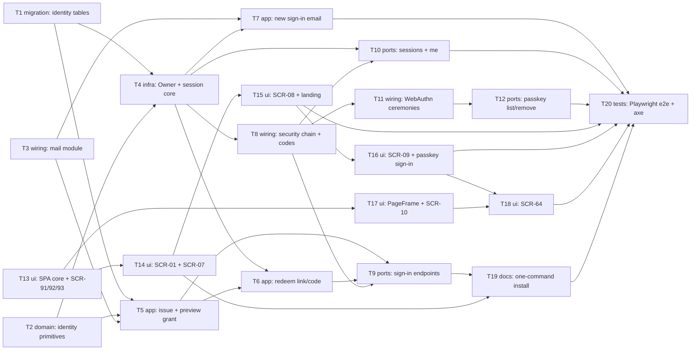

# Epic — platform-skeleton

> **Spec:** [spec.md](../spec.md) · **Design:** [sad.md](../sad.md) · **Data model:** [data-model.md](../data-model.md) · **API:** [openapi.yaml](../contracts/openapi.yaml) · **Events:** [events.md](../contracts/events.md) · **Screens:** [screens.md](../screens.md) · **ADRs:** [adr/](../adr/)

## Goal

teleX gets its front door. An Operator starts a complete installation with one command and finishes the first sign-in from the local mailbox. An Owner signs up and signs in with only an email address (link or code), can add a skippable Passkey, sees and ends their own Sign-in Sessions, and is emailed about every later sign-in (spec §2). Every wave-3 epic (E02, E06, E10, E26) builds on the signed-in Owner this epic creates.

## Scope

- **In:** `identity` (Owner, Sign-in Grant, Sign-in Session, Passkeys, email templates, `SignInSessionStarted`), the new `mail` integration module, `web` (Spring Security filter chain, session cookie, CSRF, WebAuthn wiring, REST controllers, problem codes), the React SPA (router, fetch client, SCR-01/07/08/09/10/64/91/92/93), the four staged migrations, Dockerfile + compose + README, Playwright e2e.
- **Out:** linking Telegram (E02), the navigation shell and theme (E06), Operator tools and roles (E26), passwords / social sign-in / SSO, email change and account deletion, anti-enumeration and rate limits, passkey renaming, the "no access" and maintenance pages, a production deployment guide (spec §3).

## Task map

Parallel starts (wave 1): T1 migrations, T2 identity primitives, T3 mail module and T13 SPA foundations. The backend (T1–T12) and the SPA (T13–T18) run as two branches that meet at T19 (one-command install) and T20 (end-to-end tests).

## Tasks

See [tracker.md](./tracker.md) for status. Machine contract: [tasks.json](../tasks.json).

| # | Task | Layer | Blocked by | Wave | DoD (short) |
|---|---|---|---|---|---|
| T1 | [Promote the four staged identity migrations into the live Flyway tree](./t01-promote-identity-migrations.md) | migration | — | 1 | 4 migrations promoted; MigrationRollbackIT green |
| T2 | [Add identity domain primitives: typed ids, Clock, email canonicalisation, secrets, device naming and the public URL](./t02-identity-domain-primitives.md) | domain | — | 1 | pure unit tests for every primitive |
| T3 | [Create the mail integration module with the Mailer port and the SMTP adapter](./t03-mail-integration-module.md) | wiring | — | 1 | mail module + fake; ModularityTest green |
| T4 | [Build the Owner and Sign-in Session core: start, resolve with the 30/90-day rules, end by key, and the SignInSessionStarted event](./t04-owner-and-session-core.md) | infra | T1, T2 | 2 | session start/resolve/end ITs with fixed Clock |
| T5 | [Issue a Sign-in Grant with its email and read a Sign-in Link without redeeming it](./t05-issue-and-preview-sign-in-grant.md) | app | T1, T2, T3 | 2 | issue/supersede/rollback/preview ITs |
| T6 | [Redeem a Sign-in Link or Sign-in Code atomically and start the Sign-in Session](./t06-redeem-sign-in-link-and-code.md) | app | T4, T5 | 3 | atomic redeem + refusal ITs |
| T7 | [Send the "New sign-in to teleX" email from the SignInSessionStarted event after commit](./t07-new-sign-in-notice-email.md) | app | T3, T4 | 3 | listener scenario test |
| T8 | [Add the Spring Security filter chain with the session cookie, CSRF and no-store, and switch problem codes to kebab-case](./t08-web-security-and-problem-codes.md) | wiring | T4 | 3 | filter chain ITs; kebab codes |
| T9 | [Expose the sign-in REST endpoints: request email, preview and redeem link, redeem code, sign out](./t09-sign-in-rest-endpoints.md) | ports | T5, T6, T8 | 4 | 5 operations match openapi |
| T10 | [List and end my Sign-in Sessions and answer "who am I", Owner-scoped end to end](./t10-sessions-and-me-endpoints.md) | ports | T4, T8 | 4 | me + sessions ITs incl. cross-Owner 404 |
| T11 | [Wire Spring Security WebAuthn for passkey registration and passkey sign-in into the one session mechanism](./t11-passkey-ceremonies.md) | wiring | T8 | 4 | register + sign-in ceremonies ITs |
| T12 | [List and remove my Passkeys, filtered by my WebAuthn user entity](./t12-passkey-management-endpoints.md) | ports | T11 | 5 | passkey list/remove ITs incl. cross-Owner 404 |
| T13 | [Set up the SPA router, query client and fetch client with failure routing, and build the system pages SCR-91, SCR-92 and SCR-93](./t13-spa-foundations-and-system-pages.md) | ui | — | 1 | fetch client + router + system pages, Vitest |
| T14 | [Build Sign in (SCR-01, email part) and Check your email (SCR-07) with the Sign-in Code](./t14-sign-in-and-check-email-pages.md) | ui | T13 | 2 | SCR-01 email + SCR-07 all states, Vitest |
| T15 | [Build Confirm sign-in link (SCR-08) and the landing-after-sign-in rule](./t15-confirm-link-page-and-landing.md) | ui | T14 | 3 | SCR-08 states + landing rule, Vitest |
| T16 | [Build Create a passkey (SCR-09) and "Sign in with a passkey" on SCR-01](./t16-passkey-step-and-passkey-sign-in.md) | ui | T15 | 4 | SCR-09 + SCR-01 passkey states, Vitest |
| T17 | [Build the signed-in PageFrame with Sign out and the empty Inbox (SCR-10)](./t17-page-frame-inbox-and-sign-out.md) | ui | T13 | 2 | PageFrame + SCR-10 + sign-out, Vitest |
| T18 | [Build Profile and security (SCR-64): passkeys card and sign-in sessions card](./t18-profile-and-security-page.md) | ui | T16, T17 | 5 | SCR-64 all states, Vitest |
| T19 | [Make teleX start with one command: Dockerfile, compose with app and Mailpit, README and a smoke script](./t19-one-command-install.md) | docs | T9, T14 | 5 | compose up → SCR-01 + Mailpit; smoke script |
| T20 | [Add Playwright end-to-end tests at 360 px and 1280 px with an accessibility scan and a virtual authenticator](./t20-end-to-end-browser-tests.md) | tests | T7, T10, T12, T15, T16, T18, T19 | 6 | e2e at both widths + axe 0 violations |

## Risks / Hard rules

- **Secrets never readable** (spec §6.1): link token, code and session key are stored only as SHA-256, never returned after issue, never in a URL the server sees, never logged — T2, T4, T5, T6, T9.
- **One session mechanism** (sad §4, ADR-0001): link, code and passkey all end in `SignInSessions.start(...)`; no Spring `HttpSession` for sign-in state (only the WebAuthn challenge, ADR-0002 / data-model) — T4, T6, T11.
- **Owner-scoped by construction** (sad §8, AC-97): every session/passkey/profile query filters on the caller's `OwnerId` (passkeys via the user entity); another Owner's record answers the same `404 not-found` as a missing one — T10, T12.
- **Module boundaries** (CLAUDE.md, ADR-0004): `mail` depends on `shared` only; `identity` gains `mail`; `web` never reaches `mail`; `ModularityTest` green after every task.
- **No hand-written WebAuthn crypto** (sad §4 choice 3, ADR-0002) — T11.
- **One public URL** (ADR-0006): email links, cookie `Secure` and RP ID come from `TELEX_PUBLIC_URL`, never from request headers — T2, T5, T7, T8, T11. Breakdown deviation: `PublicUrl` lives at the `identity` root (not `web/security`, sad §5) because identity's emails need it and identity can't depend on `web` (T2).
- **Breakdown decisions to confirm in review:** SPA route table (T13), used by the email links in T5/T7; error codes switch to kebab-case (T8, per `api-sync-report.md §B.2`).
- **Quality gates** (CLAUDE.md shared DoD): detekt + ktlint 0 warnings, ESLint + `tsc --noEmit` clean, every touched screen at 360 px and 1280 px with every `screens.md` state, tokens only, status never by color alone, all strings in `messages.ts`.
