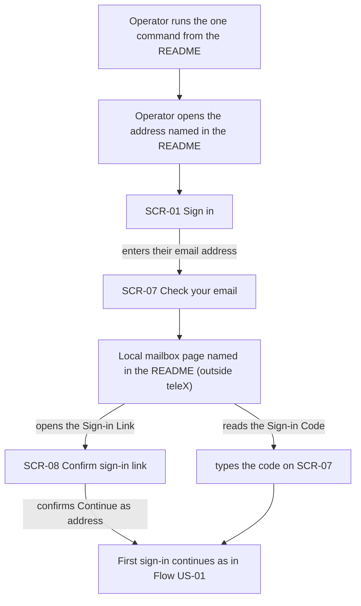
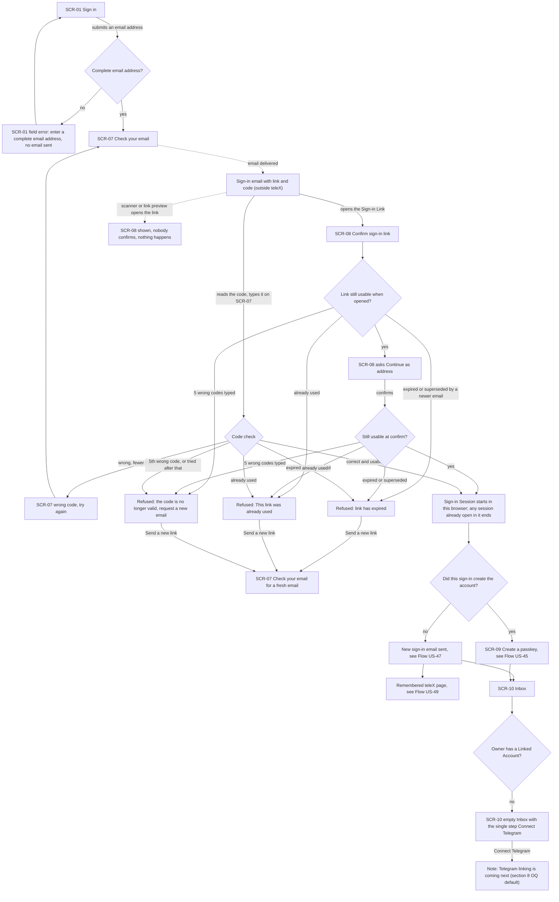
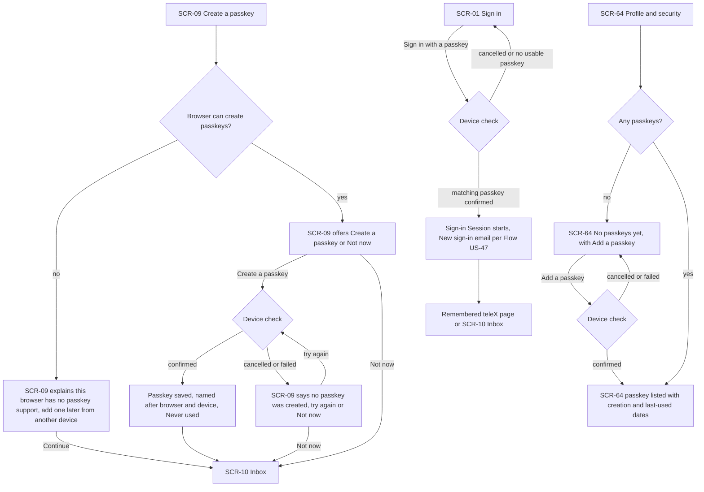
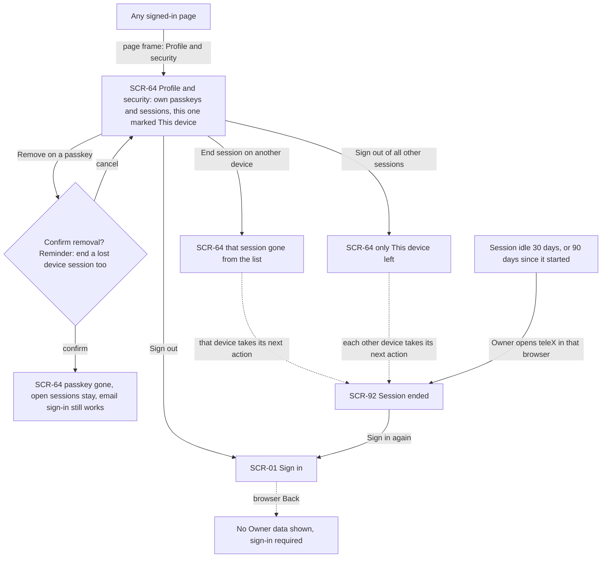
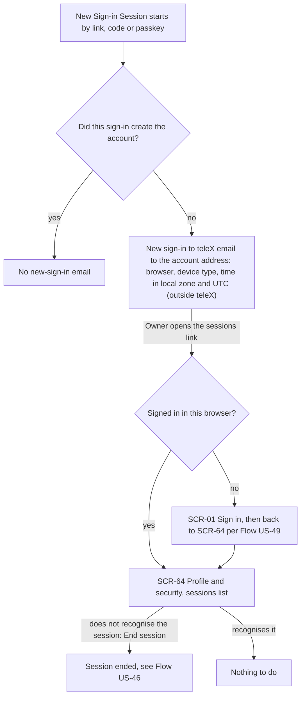
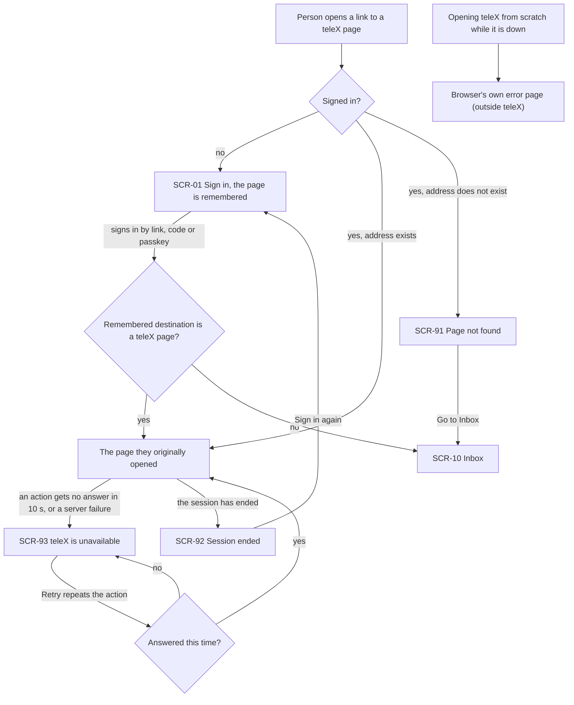

# UX flows — platform-skeleton

> User flows for every UI-touching §4 user story, produced by `ux-flows` (after `clarify`, before
> `design`) and read by `design` (evidence for the target-surface + UI-architecture decisions),
> `sequences` (UI-driven flows align on SCR ids), `screens` (details every inventory row) and
> `plan-tests` (the e2e-through-UI paths). **Always markdown + mermaid `flowchart`**, whatever the
> design tool — this artifact is flow-altitude, not visual design.

## Platform decisions

- **Posture:** responsive-both — per `docs/docs/design-system/README.md` ("every screen is fully responsive", breakpoints 360 / 768 / 1280) and spec §6 (360 px and 1280 px). No flow branches by device; AC-82 (email read on the phone, code typed on the laptop) needs both ends to be first-class. `docs/design-system.md` doesn't exist yet.
- **Screen ids:** product-spec ids are kept where they exist (SCR-01 Sign in, SCR-10 Inbox, SCR-64 Profile and security). Pages that the product spec folds into SCR-01 or SCR-90 get free slots in the same ranges: SCR-07, SCR-08 and SCR-09 for the sign-in steps, and SCR-91, SCR-92 and SCR-93 for the three E01 members of the SCR-90 system-page family. These six ids need to be added to `docs/docs/03-product-spec.md`.
- **Sign-in is a sequence of full pages, not dialogs.** SCR-08 is a separate page because it opens from an email, often in a different browser or on a different device from the one that asked for it.
- **The passkey step (SCR-09) is a full-page step.** It follows only the sign-in that creates the account (AC-91); every later sign-in goes straight to its destination. The account-creating sign-in always continues from SCR-09 to the Inbox, never to a remembered page, because AC-34 takes precedence over AC-101 for a brand-new Owner.
- **No navigation shell in E01.** Signed-in pages sit in a minimal page frame that gives access to Profile and security (SCR-64) and Sign out. The full shell is E06.
- **Confirmations stay in place on SCR-64.** Removing a passkey asks for confirmation on SCR-64 itself (AC-92). Ending one session, signing out of all other sessions and signing out act immediately, because the spec asks for no confirmation.
- **System pages replace the page content.** "teleX is unavailable" (SCR-93) only appears in a teleX tab that has already loaded. A cold open while teleX is down shows the browser's own error, which is outside teleX.
- **Emails and the local mailbox are outside teleX.** They are drawn as external nodes without an SCR id: the sign-in email, the "New sign-in to teleX" email, and the local mailbox page from the README.
- **Design input (not decided here):** the "remembered destination" from AC-101 belongs to the browser that asked for the sign-in. A link confirmed in a different browser therefore lands on SCR-10. `design` decides how the destination is carried.

## Screen inventory

| ID | Screen | Purpose | Entry | Exit |
|---|---|---|---|---|
| SCR-01 | Sign in | Enter an email address to get a sign-in email, or use "Sign in with a passkey" | the README address; opening teleX while signed out; a protected page opened while signed out (AC-101); Sign out; "Sign in again" on SCR-92 | SCR-07 (email accepted); destination page or SCR-10 (passkey sign-in) |
| SCR-07 | Check your email | Says which address the email went to and takes the 6-digit Sign-in Code; shows code errors and "Send a new link" | SCR-01 after submitting a valid address; "Send a new link" on SCR-07 or SCR-08 | SCR-09 (new account), the remembered page or SCR-10 (existing account); a fresh SCR-07 via "Send a new link" |
| SCR-08 | Confirm sign-in link | Opened from the Sign-in Link; asks "Continue as address" so a scanner or link preview never signs anyone in; shows expired, used or void refusals | the Sign-in Link in the email | SCR-09 (new account), the remembered page or SCR-10 (existing account); SCR-07 via "Send a new link" |
| SCR-09 | Create a passkey | Offers a passkey right after the sign-in that created the account; explains when the browser can't create one | the account-creating sign-in from SCR-07 or SCR-08 | SCR-10 (passkey created, "Not now", or unsupported browser) |
| SCR-10 | Inbox (empty) | The empty Inbox with the single step "Connect Telegram" | every sign-in without another destination; SCR-09; "Go to Inbox" on SCR-91 | SCR-64 and Sign out via the page frame; the "Telegram linking is coming next" note (§8 OQ default) |
| SCR-64 | Profile and security | Lists the Owner's Passkeys and Sign-in Sessions; add or remove a passkey, end a session, sign out of all other sessions, sign out | the page frame on any signed-in page; the link in the "New sign-in to teleX" email | SCR-01 after Sign out; stays on SCR-64 for every other action |
| SCR-91 | Page not found | Shown for an address that doesn't exist in teleX | any unknown teleX address | SCR-10 via "Go to Inbox" |
| SCR-92 | Session ended | Shown when the Sign-in Session was ended elsewhere or expired (30 days idle, 90 days total) | the next page or action in a browser whose session ended | SCR-01 via "Sign in again" |
| SCR-93 | teleX is unavailable | Shown in a loaded tab when an action gets no answer within 10 seconds or a server failure | any action in a loaded teleX tab | the page the action came from, via "Retry" (which repeats the action) |

## Flows

### Flow: US-41 — Start teleX with one command

The Operator runs the one command from the README, then opens the address the README names in their browser and lands on the sign-in page (SCR-01). The 5-minute budget in AC-33 ends here. They enter their email address and reach "Check your email" (SCR-07). The email arrives in the local mailbox page that the README also names, which is outside teleX. From there they either open the Sign-in Link, which leads to the confirm page (SCR-08) where they confirm "Continue as address", or they type the Sign-in Code on SCR-07. Either way the first sign-in continues exactly as in Flow US-01. The spec defines no error branch for this story.

### Flow: US-01 — Sign in without a password

A person enters an address on the sign-in page (SCR-01). If it isn't a complete address (a name, an @ and a domain with a dot), the field shows an error and no email is sent (AC-83). Otherwise they reach "Check your email" (SCR-07), and an email with both a Sign-in Link and a Sign-in Code arrives.

- **Link path.** Opening the link shows the confirm page (SCR-08). A mail scanner or link preview that opens it never confirms, so nothing happens (AC-86). When the person confirms "Continue as address", the link is checked again at that moment, because the 15 minutes count at the confirm (AC-35).
- **Code path.** The person types the code on SCR-07 in the browser that asked, for example on the laptop while reading the email on the phone (AC-82). A wrong code with fewer than 5 tries keeps them on SCR-07.
- **Refusals.** There are three, and each leads through "Send a new link" to a fresh SCR-07 for the same address:
  - *Expired*: older than 15 minutes, or a newer email was requested for the address (AC-35, AC-103).
  - *Already used* (AC-84).
  - *No longer valid*: after 5 wrong codes, for the code and the link alike (AC-85).
- **Success.** A Sign-in Session starts in the browser where the link was confirmed or the code typed, and any session already open in that browser ends (AC-104). Using one half of the email voids the other half (AC-82).
  - If this sign-in created the account, the person goes to the passkey step (SCR-09), then to the Inbox (AC-34).
  - If the account already existed, the "New sign-in to teleX" email goes out (Flow US-47), and the person lands on the remembered teleX page (Flow US-49) or the Inbox.
- **Inbox.** An Owner without a Linked Account sees the empty Inbox with the single step "Connect Telegram" (AC-100). That step opens a short "Telegram linking is coming next" note, which is the §8 open-question default.

### Flow: US-45 — Use a passkey

This flow has three parts.

- **The passkey step (SCR-09).** It appears only after the sign-in that created the account.
  - On a browser that can't create passkeys, it explains why, says the Owner can add a passkey later from another device, and continues to the Inbox. Email sign-in keeps working (AC-90).
  - On a capable browser, it offers "Create a passkey" or "Not now". A confirmed device check saves a passkey named after the browser and device, marked "Never used", and goes to the Inbox (AC-89).
  - A cancelled or failed device check keeps the Owner on SCR-09. The page says no passkey was created and offers "Try again" or "Not now" (AC-105).
  - "Not now" goes straight to the Inbox, and the step never comes back on later sign-ins (AC-91).
- **Profile and security (SCR-64).** With no passkeys it shows "No passkeys yet" and "Add a passkey" (AC-91). Adding one runs the same device check; a confirmed check lists the passkey with its dates, and a cancelled one leaves the empty state.
- **Later sign-in.** On SCR-01 the Owner chooses "Sign in with a passkey" and only confirms on the device, without typing an email (AC-89). The session starts and the new-sign-in email goes out (AC-98). The Owner then lands on the remembered page or the Inbox. If the device check is cancelled, or no usable passkey exists (for example after one was removed, AC-92), they stay on SCR-01 with email sign-in still there.

### Flow: US-46 — Control where I am signed in

From any signed-in page, the page frame leads to Profile and security (SCR-64). It lists only the Owner's own passkeys and sessions, each session with its browser, device type and last activity, and the current one marked "This device" (AC-93, AC-97).

- **Removing a passkey.** It asks for confirmation in place, and the confirmation reminds the Owner to also end a lost device's session. Cancel changes nothing. Confirm removes the passkey, even the last one. Open sessions stay, and email sign-in keeps working (AC-92).
- **Ending another device's session.** The session leaves the list, and that device's next action lands on "Session ended" (SCR-92) (AC-93).
- **"Sign out of all other sessions".** Only "This device" is left, and every other device hits SCR-92 on its next action (AC-94).
- **Sign out.** It lands on SCR-01, and pressing Back in the browser shows no Owner data (AC-95).
- **Expiry.** A session that has been idle for 30 days, or is 90 days old, shows SCR-92 the next time the Owner opens teleX in that browser (AC-96). From SCR-92, "Sign in again" returns to SCR-01.

### Flow: US-47 — Hear about new sign-ins

Every new Sign-in Session, whether by link, code or passkey, is checked once. The sign-in that creates the account sends no email. Every other sign-in sends a "New sign-in to teleX" email to the address the account was created with. The email names the browser, the device type and the time, given in the signing-in browser's zone with the zone's name and in UTC (AC-98, AC-34).

The email links to the sessions list. If the Owner is signed in in the browser where they open the link, they land on SCR-64 directly. Otherwise they sign in first on SCR-01 and are returned to SCR-64 (AC-101). If they don't recognise a session there, they end it as in Flow US-46 (AC-93). If they do recognise it, nothing else happens.

### Flow: US-49 — Understand dead ends

A person opens a link to a teleX page.

- **Signed out.** They see the sign-in page (SCR-01), and teleX remembers the page they asked for. After any kind of sign-in they land on that page, but only if it is a teleX page; any other destination leads to the Inbox (AC-101).
- **Signed in, unknown address.** They see "Page not found" (SCR-91), whose "Go to Inbox" action leads to SCR-10 (AC-102).
- **No answer while using teleX.** If an action gets no answer within 10 seconds, or teleX answers with a server failure, the loaded tab shows "teleX is unavailable" (SCR-93). "Retry" repeats the action: on success they're back on the page, and on another failure they stay on SCR-93 (AC-102).
- **Session ended.** A session that ended elsewhere or expired shows "Session ended" (SCR-92), and "Sign in again" leads to SCR-01 (AC-93, AC-96).
- **teleX down from the start.** Opening teleX from scratch while it is down shows the browser's own error, because no teleX page has loaded yet (AC-102).

## AC coverage

| AC | Shown by | Notes |
|---|---|---|
| AC-33 | Flow US-41 → README address → SCR-01 → local mailbox → SCR-08 / SCR-07 | The 5-minute budget ends at SCR-01; the first sign-in itself continues in Flow US-01 |
| AC-34 | Flow US-01 → link path → SES → NEW "yes" → SCR-09 → SCR-10 | Same-address and normalisation rules are backend behaviour; in the flow, an existing address takes the NEW "no" branch |
| AC-82 | Flow US-01 → code path → K "correct and usable" → SES | Code typed on the browser that asked; using the code voids the link (later opening hits USED) |
| AC-35 | Flow US-01 → L1 / L2 / K "expired" → EXP → "Send a new link" → SCR-07 | Checked again at the confirm (L2) and at the typed code (K) |
| AC-83 | Flow US-01 → V "no" → SCR-01 field error | No email sent |
| AC-84 | Flow US-01 → L1 / L2 / K "already used" → USED → "Send a new link" | — |
| AC-85 | Flow US-01 → K "5th wrong code" and L1 / L2 "5 wrong codes typed" → VOID | The link of a voided email is refused as well |
| AC-86 | Flow US-01 → SCAN (preview never confirms) → later S8C confirm → SES | — |
| AC-103 | Flow US-01 → L1 / L2 / K "superseded by a newer email" → EXP | A code counts only against the email that this SCR-07 asked for |
| AC-104 | Flow US-01 → SES "any session already open in it ends" | Also applies when the browser was signed in as another Owner |
| AC-89 | Flow US-45 → DEV "confirmed" → OK → SCR-10; SCR-64 list; SCR-01 → DEV3 "matching passkey" | Covers creation, listing and passkey sign-in without an email |
| AC-90 | Flow US-45 → SUP "no" → SCR-09 explanation → SCR-10 | — |
| AC-105 | Flow US-45 → DEV "cancelled or failed" → S9F → try again / Not now | — |
| AC-91 | Flow US-45 → "Not now" → SCR-10; SCR-64 HAS "no" → "No passkeys yet" + "Add a passkey" | The step never follows later sign-ins (Flow US-01 NEW "no" skips SCR-09) |
| AC-92 | Flow US-46 → "Remove" → CONF (with reminder) → RM; Flow US-45 DEV3 "no usable passkey" | Last passkey removable |
| AC-93 | Flow US-46 → "End session" → END1 → other device → SCR-92 | List shows browser, device type, last activity, "This device" |
| AC-94 | Flow US-46 → "Sign out of all other sessions" → END2 | — |
| AC-95 | Flow US-46 → "Sign out" → SCR-01 → Back shows no data | — |
| AC-96 | Flow US-46 → IDLE → SCR-92 → "Sign in again" → SCR-01; Flow US-49 → SCR-92 | — |
| AC-97 | Flow US-46 → SCR-64 lists only the Owner's own records | There is no UI branch for reaching another Owner's record; a direct attempt behaves as "not found". This is enforced and tested below the UI (sequences / api) |
| AC-98 | Flow US-47 → NEW "no" → email → SCR-64 sessions list | No email for the account-creating sign-in (NEW "yes") |
| AC-100 | Flow US-01 → TG "no" → SCR-10 empty Inbox → "Connect Telegram" → coming-next note | The note's content is the §8 OQ default |
| AC-101 | Flow US-49 → AUTH "no" → SCR-01 → TELEX "yes" / "no"; Flow US-47 → SCR-01 → SCR-64 | A link confirmed in a different browser lands on SCR-10 (design input, see Platform decisions) |
| AC-102 | Flow US-49 → SCR-91 → "Go to Inbox"; PAGE → SCR-93 → "Retry"; COLD → browser error | — |
