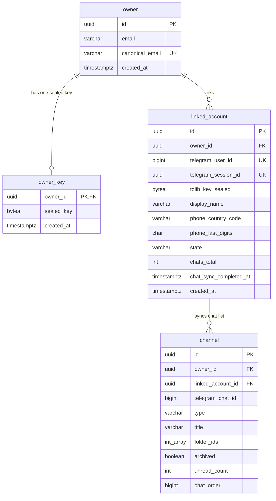

# Data model — telegram-link

> **Sources:** spec.md §5 (AC-01…AC-122) and §6 / §6.1 · sad.md §5 (`messaging` owns the Linked Account and the chat list, `identity` owns Owner keys, `telegram` owns no tables), §6 (`persists` notes and "Persist hints for `/sdd:data-model`"), §7 (master-key check and reset, session volume), §8 (one Owner per Telegram account, account limit, personal data minimisation, ID strategy) · [ADR-0002](adr/0002-own-linked-accounts-and-their-chat-list-in-messaging-behind-a-session-only-telegram-acl.md) (one module, one unlink transaction) · [ADR-0003](adr/0003-seal-each-tdlib-database-key-with-a-stored-per-owner-key-under-an-installation-master-key.md) (envelope encryption) · foundation `docs/adr/0003` (Flyway + rollback, UUIDv7).
> **Staged migrations:** `migrations/01_create_owner_key`, `02_create_linked_account`, `03_create_channel` (`.up.sql` + `.down.sql`). `implement` promotes them into `db/migration/V<yyyyMMddHHmm>__*.sql` + `db/rollback/U<same>__*.sql`.

`messaging` owns `linked_account` and `channel`. `identity` owns `owner_key`. `telegram` owns no table: its session directories live on the `telex-tdlib` volume (sad §7), and the `telegram` module never sees an `OwnerId` or a `LinkedAccountId`. `web` owns no table. The Modulith `event_publication` table (baseline) carries `AccountLinked`, `AccountUnlinked`, `LinkedAccountStateChanged`, `LinkedAccountSyncProgressed`, and needs nothing new. The `telegram` events (`TelegramChatsChanged` and the session events) are in-process only and are not persisted: they carry Telegram data.

**Conventions applied** (from E01's data model and the architecture; no new convention introduced):
- PK: app-generated UUIDv7 (`telex.shared.Uuid7`). `owner_key` is keyed by `owner_id`, because it is 1:1 with the Owner and the Owner is its only lookup.
- Telegram's own ids (`telegram_user_id`, `telegram_chat_id`) are `BIGINT` attributes, never keys of our aggregates (sad §8 ID strategy).
- Time: `TIMESTAMP WITH TIME ZONE`, written from the injectable `Clock`. No `DEFAULT now()`.
- Audit columns: only the timestamps the domain needs (`created_at`, `chat_sync_completed_at`). No generic `updated_at`.
- Delete strategy: hard delete. Unlink deletes the account, its sealed key and its chat list in one transaction (ADR-0002); nothing identifying the Telegram account survives (spec §6 "Unlink leaves nothing").
- Constraints: NOT NULL / UNIQUE / named FKs, plus light `CHECK`s on enum-like values, byte lengths, digit formats and counters, as in E01. The rules are still enforced and tested in Kotlin.
- Secrets: stored only sealed (AES-256-GCM, 12-byte nonce || ciphertext || 16-byte tag = 60 bytes for a 32-byte key). Plaintext keys, login codes, passwords and password hints are never stored (spec §6.1).

**Not stored (confirmed):**
- *Linking attempt* — held in memory by `messaging`, one per Owner, lost on restart (sad §8, §11 accepted debt). Its fresh TDLib key exists only in memory until the account row is inserted.
- *Full phone number* — only the country code and the last two digits (AC-01, sad §8). The full number goes to Telegram and nowhere else.
- *Telegram flood wait* — Telegram enforces it, and the wizard shows the remaining time from Telegram's answer (sad §8).
- *TDLib state sequence* — kept in memory per running client to drop stale state changes (flow 9). A new client restarts TDLib's sequence, so persisting it would be wrong.
- *Synced chat count* — derived as `COUNT(*)` of the account's `channel` rows, so it can't drift from the rows and follows joins and leaves by itself (AC-116, AC-121; user decision, 2026-10-03). Only Telegram's reported total and the "finished" time are stored.
- *Master-key check value* — not a separate table. Startup opens any one `owner_key` row: a wrong key fails the GCM tag and the app refuses to start; zero rows means an installation that has never stored an Owner key, where a missing key only makes linking report "isn't set up" (AC-119). `TELEX_MASTER_KEY_RESET=true` deletes every `owner_key` row, so the next key created starts the check afresh (user decision, 2026-10-03; deviation from the sad §7 / ADR-0003 wording "key-check value", same behaviour).
- *Account limit* — installation config `TELEX_TELEGRAM_MAX_ACCOUNTS_PER_OWNER` (sad §7); the final count runs under a transaction-scoped advisory lock keyed by the `OwnerId` (sad §8), which needs no schema.

## ER diagram

`owner` is E01's table, shown for context and unchanged. `channel`'s `(linked_account_id, owner_id)` is one composite FK to `linked_account(id, owner_id)`.

## Entities

### Aggregate: Owner key (`identity`)

#### `owner_key`

| Column | Type | Constraints | Notes |
|---|---|---|---|
| `owner_id` | UUID | PK, FK → `owner(id)` | One key per Owner, created lazily the first time the Owner needs one (sad §5 `OwnerKeys`) |
| `sealed_key` | BYTEA | NOT NULL, CHECK `octet_length = 60` | A random 32-byte Owner key sealed under `TELEX_MASTER_KEY`, AAD = the owner id. Reused later for BYOK secrets (ADR-0003) |
| `created_at` | TIMESTAMPTZ | NOT NULL | From `Clock` |

**Aggregate root:** root (`identity` exposes only `OwnerKeys.seal` / `open`, never the key).
**Access patterns:**
- open the Owner's key to seal or open a TDLib key (flows 1, 3, 10) → PK;
- startup master-key check: open any one row (`LIMIT 1`) → PK;
- master-key reset: delete every row → full delete, rare and explicit.

An unlink keeps the Owner's key: it belongs to the Owner, not to the account. The account's own TDLib key is the one that is shredded.

### Aggregate: Linked Account (`messaging`)

#### `linked_account`

| Column | Type | Constraints | Notes |
|---|---|---|---|
| `id` | UUID | PK, app-generated (UUIDv7) | `LinkedAccountId`. Kept across Session lost and "Sign in again" (AC-117); a re-link after an unlink gets a new id (AC-112) |
| `owner_id` | UUID | NOT NULL, FK → `owner(id)` | Every query filters on it; another Owner's account behaves as missing (AC-03). `UNIQUE (id, owner_id)` is the target of `channel`'s composite FK |
| `telegram_user_id` | BIGINT | NOT NULL, UNIQUE (installation-wide) | Telegram's identity of the account. One Owner per Telegram account and no duplicates, matched by identity, not phone (AC-04, AC-108); the index settles two Owners finishing at once (sad §8). Session lost accounts keep it, so they keep their place |
| `telegram_session_id` | UUID | NULL, UNIQUE | `TelegramSessionId` of the current Telegram session (its directory on the volume). Swapped on "Sign in again" (ADR-0002). NULL only after a master-key reset |
| `tdlib_key_sealed` | BYTEA | NULL, CHECK `octet_length = 60` | The session's 32-byte TDLib database key sealed with the Owner's key, AAD = `id` (ADR-0003). NULL together with `telegram_session_id` (CHECK `num_nonnulls IN (0, 2)`) |
| `display_name` | VARCHAR(255) | NOT NULL | Telegram first + last name (Telegram caps each at 64 characters; 255 leaves room for the units Telegram counts in). Refreshed on each sign-in |
| `phone_country_code` | VARCHAR(3) | NOT NULL, CHECK 1–3 digits | Calling code of the masked phone (AC-01). Never the full number (sad §8). Refreshed on each sign-in, so a changed number shows after Sign in again (AC-108) |
| `phone_last_digits` | CHAR(2) | NOT NULL, CHECK 2 digits | Last two digits of the masked phone (AC-01). Refreshed on each sign-in |
| `state` | VARCHAR(16) | NOT NULL, CHECK IN (`connected`, `reconnecting`, `session_lost`) | Follows TDLib's signals (sad §4 choice 4, flows 3 and 9). A row that isn't `session_lost` must have a Telegram session (CHECK) |
| `chats_total` | INTEGER | NULL, CHECK ≥ 0 | Telegram's total for the account, archived included (AC-116); NULL until the first batch reports it. The synced count is `COUNT(channel)` |
| `chat_sync_completed_at` | TIMESTAMPTZ | NULL, CHECK needs `chats_total` | When the initial load finished (flow 11 "mark the sync finished"). Reset to NULL when a new Telegram session starts loading (Sign in again) |
| `created_at` | TIMESTAMPTZ | NOT NULL | When the account was linked, from `Clock`; the Accounts list order |

**Aggregate root:** root.
**Access patterns:**
- list my Linked Accounts with state and sync counts (flow 13, AC-114, SCR-60 / SCR-10; Status Banner condition, AC-122) → `linked_account_owner_id_idx`, plus the chat count through `channel_linked_account_telegram_chat_uq`;
- count my accounts for the limit, at start and inside the insert transaction (flow 4, flow 1, AC-115) → `linked_account_owner_id_idx`;
- get / unlink / "Sign in again" on my account A: `WHERE id = ? AND owner_id = ?` (flows 2, 10, 13; AC-03) → PK;
- who owns Telegram user U, when an attempt is authorized (flow 1, flow 10; AC-04, AC-108, AC-117) → `linked_account_telegram_user_id_uq`;
- map a `telegram` event's session id to its account (flows 9, 11; state and chat changes) → `linked_account_telegram_session_id_uq`;
- boot reconnect of every account that is not Session lost (flow 3, AC-36, AC-118) → sequential scan; the table holds at most a few hundred rows per instance (sad §7 scaling), so no index;
- startup sweep: every referenced session id (sad §7, flow 8, flow 12) → index-only scan of `linked_account_telegram_session_id_uq`.

**Unlink** (flow 2, flow 12): `DELETE FROM linked_account WHERE id = ? AND owner_id = ?` deletes the sealed TDLib key with the row and cascades to `channel`, in the same transaction that records `AccountUnlinked`.

**Master-key reset** (sad §7): `UPDATE linked_account SET state = 'session_lost', telegram_session_id = NULL, tdlib_key_sealed = NULL`, together with deleting every `owner_key` row and every session directory.

#### `channel`

| Column | Type | Constraints | Notes |
|---|---|---|---|
| `id` | UUID | PK, app-generated (UUIDv7) | `ChannelId`; stays stable across upserts, so E04 can hang history on it |
| `owner_id` | UUID | NOT NULL, part of the composite FK | Every Channel query filters on it (sad §8 Authorization) |
| `linked_account_id` | UUID | NOT NULL, FK `(linked_account_id, owner_id)` → `linked_account(id, owner_id)` ON DELETE CASCADE | A chat can only sit on an account of the same Owner (AC-03), and goes with the account on unlink (AC-111, ADR-0002) |
| `telegram_chat_id` | BIGINT | NOT NULL, UNIQUE with `linked_account_id` | Telegram's chat id; the upsert key, so a chat seen again isn't counted twice (flow 11) |
| `type` | VARCHAR(16) | NOT NULL, CHECK IN (`private`, `secret`, `basic_group`, `supergroup`, `channel`) | From TDLib's chat type (a supergroup with `is_channel` maps to `channel`) |
| `title` | VARCHAR(255) | NOT NULL | Chat title (Telegram caps group titles at 128 characters; a private chat's title is the person's name) |
| `folder_ids` | INTEGER[] | NOT NULL | TDLib chat folder ids the chat is in; empty array when none. Written explicitly (no DB default) |
| `archived` | BOOLEAN | NOT NULL | In the Archive list rather than the main list; archived chats count toward the total (AC-116) |
| `unread_count` | INTEGER | NOT NULL, CHECK ≥ 0 | Telegram's unread count (AC-121) |
| `chat_order` | BIGINT | NOT NULL | TDLib's position order within its list (main or archive); new messages change it (AC-121). Showing the list in this order is E04 |

**Aggregate root:** `linked_account` (sad §8 personal data minimisation lists exactly these fields).
**Access patterns:**
- upsert or remove a chat by `(linked_account_id, telegram_chat_id)` (flow 11, AC-116, AC-121) → `channel_linked_account_telegram_chat_uq` (`ON CONFLICT`);
- count the account's chats for progress and the total shown (flow 11, flow 13) → index-only scan of `channel_linked_account_telegram_chat_uq`;
- delete by account on unlink → the FK cascade, through the same index (leading column).

No owner-wide chat query exists in E02 (showing chats is E04), so there is no index on `owner_id` alone; E04 adds the one its chat list needs.

## Indexes

| Index | Columns | Query it serves |
|---|---|---|
| (PK) `owner_key_pkey` | `owner_key(owner_id)` | Open the Owner's key to seal or open a TDLib key (flows 1, 3, 10); startup master-key check (sad §7). Also the FK index |
| `linked_account_telegram_user_id_uq` (unique) | `linked_account(telegram_user_id)` | One Owner per Telegram account and no duplicate Linked Account: who owns user U once Telegram authorizes an attempt (flow 1, flow 10; AC-04, AC-108, AC-117) |
| `linked_account_telegram_session_id_uq` (unique) | `linked_account(telegram_session_id)` | Map each `TelegramSessionStateChanged` / `TelegramChatsChanged` to its account (flows 9, 11); startup sweep of orphan session directories (sad §7) |
| `linked_account_owner_id_idx` | `linked_account(owner_id)` | List my Linked Accounts (flow 13; AC-114, AC-122 banner) and count them for the limit (flow 4, flow 1; AC-115). Also the FK index |
| `linked_account_id_owner_uq` (unique constraint) | `linked_account(id, owner_id)` | Target of `channel`'s composite FK (AC-03); not a query index |
| `channel_linked_account_telegram_chat_uq` (unique) | `channel(linked_account_id, telegram_chat_id)` | Upsert/remove a chat (flow 11; AC-116, AC-121); count an account's chats (flows 11, 13); unlink cascade (flow 2). Also the FK index |
| (existing) `event_publication_by_completion_date_idx` | `event_publication(completion_date)` | Incomplete `AccountUnlinked` publications republished on restart (flow 12, AC-112, NFR-06) — baseline, unchanged |

Account by id (get, unlink, "Sign in again") uses the primary key with `owner_id` checked on the row.

## Test fixtures

Kotlin builders under `backend/app/src/integrationTest/kotlin/telex/messaging/` and `.../telex/identity/` (not in `db/migration`). Every value is fixed or derived from a test `Clock`. No real-looking data: addresses use `example.test`, names are `Test User` / `Test chat <n>`, phones are never stored in full.

- `anOwnerKey(owner)` — seals a fixed test Owner key under the test master key through the production `OwnerKeys`, so the startup check and the reset can be exercised.
- `aLinkedAccount(owner, telegramUserId = <unique>, state = CONNECTED, displayName = "Test User", phoneCountryCode = "999", phoneLastDigits = "00", chatsTotal = null, chatSyncCompletedAt = null)` — creates the row with a fresh `TelegramSessionId` and a TDLib key sealed through `OwnerKeys` (AAD = the account id), and registers the same session in the `fake` Telegram adapter. `state = SESSION_LOST` keeps the session; `afterMasterKeyReset()` clears both session columns.
- `someChannels(account, count = 500, archived = 50)` — `channel` rows with ids `-1000…`, titles `Test chat <n>`, type `supergroup`, empty `folder_ids`, `unread_count = 0`, and descending `chat_order`; mirrored as chats in the `fake` adapter for the sync tests (QG-3b).
- The `fake` Telegram adapter's accounts use Telegram's test-number shape (`99966XYYYY`), never a real-looking number.

No bootstrap or lookup seeds: Owner keys and Linked Accounts are created by the Owner linking an account.
