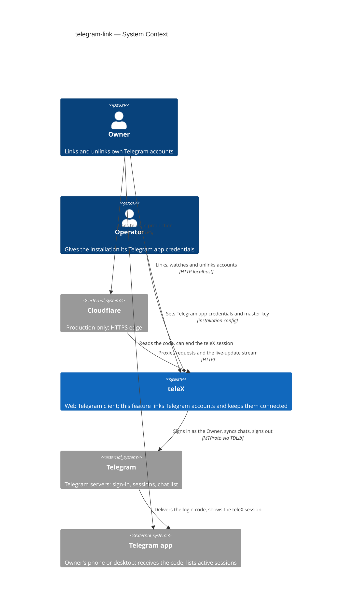
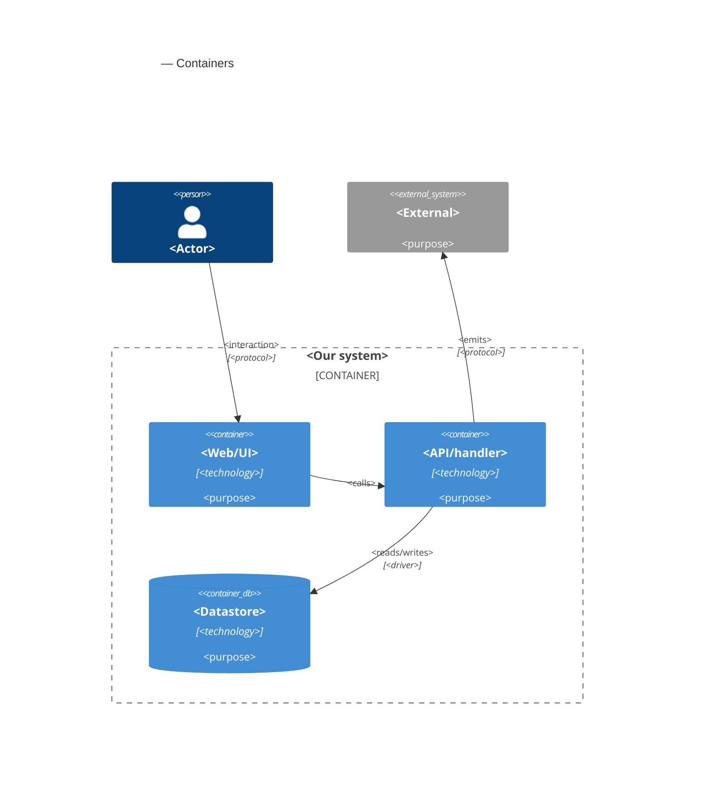

# Software Architecture Document — telegram-link

<!-- 12 Arc42 sections. Empty section → <!-- N/A: <one-line reason> -->. -->
<!-- C4 Context (L1) lives inline in §3. C4 Container (L2) lives inline in §5. -->
<!-- Numbers in §10 come VERBATIM from spec.md §6 NFR — no inventing, no rounding. -->

## 1. Introduction and goals

**Intent.** An Owner hands teleX access to their own Telegram account, and can take it back completely. From the browser, on a phone or a laptop, the Owner goes through the sign-in steps Telegram itself asks for: phone number, the code sent to their other devices, and their two-step verification password if they have one. teleX then holds that account's Telegram session, encrypted with a key per Owner. It syncs the account's chat list in the background with visible progress, and it reconnects the account by itself after a restart. A lost session is not an unlink: the Linked Account waits for the Owner to sign in again, and everything attached to it stays. An unlink is explicit and total. It signs teleX out of Telegram, keeps no session and no data, and is announced to every part of teleX that acts through the account. Every later epic that works in Telegram (E03 consent, E04 chat reading, E09 agents, E17 Owner Bot) builds on the Linked Account this feature creates.

**Top-3 quality goals (1-liners; full scenarios in §10):**

1. **Nothing left behind, nothing readable.** Session data at rest is unreadable without the Owner's key. An unlink leaves no stored item that identifies the Telegram account and no teleX device in Telegram. The unlink announcement survives a restart.
2. **Stays connected by itself.** Linked Accounts reconnect within 60 s after a restart without a code. A Telegram outage shows "Reconnecting", never "Session lost". A real session loss shows within 5 minutes. At least 50 accounts stay connected on one instance.
3. **Linking feels like Telegram, at Telegram's speed.** Each wizard step answers within 3 s at p95. A typical account (≤ 500 chats) is fully synced within 60 s, and the wizard survives a reload or a switch to the Telegram app on a phone. It works at 360 px and 1280 px with WCAG 2.2 AA.

**Stakeholders.**

| Role | Interest | Sign-off owner? |
|---|---|---|
| Owner | Links, re-signs-in to and unlinks their own Telegram accounts; sees each account's state and sync progress (US-02, US-03, US-50, US-51, US-52) | No |
| Operator | Gives the installation its Telegram app credentials once (README step); never sees any Owner's Telegram data (US-53, AC-120) | No |
| Tech Lead | SAD approval; the Linked Account boundary that E03, E04, E09, E17 and E20 build on | Yes |
| Security Lead | Review of the first stored third-party credential (the Telegram session) and the encryption and unlink decisions, done as a security-focused pass inside `/sdd:review` (spec §6.1) | No |

<!-- Decision overrides (¶4) — populated by the critic resolution loop, empty otherwise. -->

## 2. Constraints

**Technical.**
- Kotlin 2.4.10 on JDK 25 with virtual threads (`gradle/libs.versions.toml`). Foundation [ADR-0001](../../adr/0001-kotlin-spring-modulith-postgres-react-stack.md).
- Spring Boot 4.1.1 (Web MVC, Security, Data JDBC through `JdbcClient`, Flyway) and Spring Modulith 2.1.1 with the JDBC event publication registry and `republish-outstanding-events-on-restart: true` (`application.yaml`). No new Spring starter is needed.
- PostgreSQL 17 + pgvector (`pgvector/pgvector:pg17`) through Flyway, with a paired rollback script per migration. Foundation [ADR-0003](../../adr/0003-postgres-jdbc-flyway-uuidv7-persistence.md).
- **Added by this feature:** TDLight Java (a maintained TDLib fork whose native libraries ship prebuilt in Maven for linux x64/arm64 and macOS), only as an `implementation` dependency of `backend/telegram-tdlib`, so the binding's `it.tdlight.*` classes never reach `backend/app`. This keeps foundation [ADR-0002](../../adr/0002-single-app-with-isolated-tdlib-subproject.md) and architectural rule 1 in spirit; the rule's package name changes from `org.drinkless.tdlib.*` to the TDLight one (ADR-0004, §11). The `TdlibFacade` interface exists but is empty. Whether the binding runs on JDK 25 inside the `eclipse-temurin:25-jre` image is still unproven (roadmap D1, spec §8 OQ-2), and the spike is the first E02 task (ADR-0004).
- Module rules, as declared in each `package-info.java` and checked by `ModularityTest`: `telegram` may depend on `shared` only, and `web` may reach core modules but not `telegram`. So every Owner-facing operation on a Linked Account enters through a core module, and `telegram` reports back only through events or return values (ADR-0002).
- Frontend: React 19, TypeScript 6, Vite 8, React Router 8, TanStack Query 5, `@tabler/core` 1.6.1, Playwright at 360 px and 1280 px. No live-update channel exists in the SPA yet (ADR-0005).
- Runtime: one app instance with one Postgres (foundation ADR-0001, spec §6 availability N/A). TDLib clients are in-process, stateful objects, so the Linked Accounts of an installation are served by exactly one app process (§7).

**Organisational.**
- One developer (Anton Husiev) on the course's 8-week timeline. Neither the spec nor the roadmap sets a per-epic deadline.
- Roadmap step 2, wave 3, running in parallel with E06 `app-shell` and E10 `model-profiles`. This is the only blocker for wave 4 (E03, E04, E17).
- Implementation runs through the SDD `implement` engine (TDD, per-task gate). The TDLib spike runs before any wizard work (spec §8 OQ-2 default).

**Conventions.**
- `CLAUDE.md` (layout, IDs, errors, migrations, tests, quality gates) and `docs/architecture-map.md` §Conventions; the closest precedent is the `identity` module from E01 (`internal/<concern>/` sub-packages, `JdbcClient` row classes, small event data classes with no personal data).
- IDs: app-generated UUIDv7 via `telex.shared.Uuid7.next()`, typed `@JvmInline value class LinkedAccountId(override val value: UUID) : TypedId`.
- Errors: RFC 9457 `application/problem+json`, `type = urn:telex:error:<code>`; domain errors extend `telex.shared.DomainProblem`, rendered by `telex.web.ProblemHandler`.
- Every Owner-owned row carries `owner_id`, and every query filters on it. Another Owner's record is indistinguishable from a missing one (E01's `not-found` precedent, AC-03).
- Config: keys under `telex:` in `application.yaml`, bound from `TELEX_*` environment variables, as with `TELEX_PUBLIC_URL` and `TELEX_MAIL_*`.
- UI: `docs/docs/design-system/README.md`. Tokens only, status never by color alone, sentence-case English copy from `frontend/src/messages.ts`, no emoji. The Status Banner mechanism is E06's (`app-shell`); this feature adds the "account disconnected" condition to it.

**Regulatory / external.**
- Data is classified confidential (spec §6.1). Personal data per Linked Account: phone number, Telegram account id and display name, the Telegram session, and the synced chat list (titles, types, folders, unread counts).
- The login code and the two-step verification password pass through to Telegram and are never stored, shown back or logged (spec §6.1). The session is stored only encrypted with a key per Owner (NFR-05, ADR-0003).
- Telegram's terms: teleX signs in as the user through the official client library with the Operator's own `api_id` / `api_hash` from my.telegram.org. Telegram's attempt limits are surfaced, never retried around (spec §6.1). The tech-spec ban risk applies (§11).
- No compliance regime is in scope for a course installation.

## 3. Context and scope

This feature opens teleX's second outer boundary, toward Telegram. Until now teleX only faced browsers and a mail server. Now it signs in to Telegram as a person, holds that person's session, and keeps a connection open per Linked Account. There are two trust boundaries. The browser stays untrusted until it carries a live Sign-in Session, and even then it reaches only its own Owner's Linked Accounts (AC-03). Telegram is trusted for identity, meaning it says which Telegram account a sign-in belongs to and whether a session still exists. Telegram data itself (names, chat titles) is stored and shown, never interpreted.

<!-- brownfield: skeleton + E01 present at f0d9437 — identity (Owners, SignInSessions, Passkeys, SignInSessionStarted; JdbcClient rows under internal/<concern>/), web (REST controllers under /api/v1, Spring Security with an opaque session cookie + CSRF cookie, SpaHosting, ProblemHandler), mail module, Modulith JDBC registry with republish on restart; telegram = package-info only (allowedDependencies: shared); web may not depend on telegram; messaging = package-info only; telegram-tdlib = empty TdlibFacade, no binding in the version catalog; no SSE endpoint or client; no port fakes in integrationTest; Dockerfile (temurin 25 jdk → jre) + compose (app, postgres, mailpit). docs/architecture-map.md still reflects ce5eabf (stale — re-run /sdd:survey). -->

**External systems (in / out):**

| Actor or system | Type | Interaction |
|---|---|---|
| Owner | Person | Links, re-signs-in to and unlinks their own Telegram accounts in the browser; reads the login code in the Telegram app |
| Operator | Person | Puts the installation's Telegram app credentials (`api_id`, `api_hash`, obtained at my.telegram.org) and the master key into the installation config (README step); sees no Owner's Telegram data |
| Telegram | System (external) | Telegram's servers, reached over MTProto through TDLib. They run the sign-in (phone → code → password), report authorization and connection state, serve the chat list and its updates, and end sessions |
| Telegram app on the Owner's devices | System (external) | Where the login code arrives and where the Owner can see and end teleX's session (the "teleX device" in active sessions) |
| Cloudflare | System (external, production only) | Terminates HTTPS in front of the app, as in E01. It must pass the long-lived live-update stream through unbuffered (ADR-0005) |

**C4 Context (L1):**



## 4. Solution strategy

**Target surfaces: `[backend-service, web-frontend]`.** The Owner acts only in a browser (spec §1, §4), and `ux-flows.md` details three screens (SCR-02, SCR-10, SCR-60) plus the Status Banner condition. The Operator only edits installation config. The backend owns the JSON contract and the live-update stream, and the SPA consumes them. Foundation [ADR-0001](../../adr/0001-kotlin-spring-modulith-postgres-react-stack.md) already fixed the two-container split, so it's recorded inline, not as an ADR.

**UI architecture (web-frontend): the existing client-side SPA.** It keeps the existing stack (React Router, TanStack Query, one fetch client) and adds one SSE client that turns hints into query invalidation (ADR-0005). The wizard (SCR-02) is one full-page route whose current step comes **from the server**, from the Owner's open linking attempt, never from browser state. That way a reload, a second tab or another device lands on the same step (AC-109), and closing the tab loses nothing. No global state library is added.

**Top strategic choices (the seeds for ADRs):**

1. **The Linked Account is a `messaging` aggregate; `telegram` only runs Telegram sessions.** `messaging` owns the rules and the data. That covers one Owner per Telegram account (by Telegram user id, not phone), no duplicates, the limit, the states, the chat list, and the `AccountLinked` / `AccountUnlinked` events. `telegram` owns TDLib clients and their session directories, keyed by its own `TelegramSessionId`, and reports back through return values and events. An unlink deletes the account, its sealed key and its chat list in one transaction, and the same transaction records the announcement (quality goal 1). → [ADR-0002](adr/0002-own-linked-accounts-and-their-chat-list-in-messaging-behind-a-session-only-telegram-acl.md)
2. **Envelope encryption with crypto-shredding.** A master key from config wraps a per-Owner key kept by `identity`, which wraps a fresh TDLib database key per Telegram session, kept sealed on the Linked Account. Deleting the sealed key makes any leftover session file unreadable, so "nothing left behind" holds even if deleting the files fails (quality goal 1). → [ADR-0003](adr/0003-seal-each-tdlib-database-key-with-a-stored-per-owner-key-under-an-installation-master-key.md)
3. **TDLight behind the facade, a fake adapter beside it, and the spike first.** The prebuilt TDLight natives retire roadmap D1 without a C++ build. The `fake` Telegram adapter makes every AC testable and runs the Playwright e2e and Telegram-free local runs. → [ADR-0004](adr/0004-use-tdlight-java-behind-the-tdlib-facade-with-a-fake-telegram-adapter.md)
4. **Telegram decides the state, and the browser hears it live.** The account state follows TDLib's own signals:
   - authorization ready → Connected;
   - connection lost → Reconnecting;
   - only authorization closed (the session was ended in or by Telegram) → Session lost.

   So an outage never looks like a lost session (quality goal 2). State changes reach open pages as SSE invalidation hints, with REST as the only data path. → [ADR-0005](adr/0005-push-live-state-to-the-spa-as-sse-invalidation-hints.md)

Tactical choices in §5–§8 trace to these four:
- one in-memory linking attempt per Owner, held by `messaging` (§5, §8);
- a bounded sign-out before the unlink deletes (§6);
- parallel client start on boot and a startup sweep of orphan session directories (§7).

## 5. Building block view

<!-- 🎯 Why: INTERNAL DECOMPOSITION — modules, containers, datastores. The static topology: who
     may talk to whom. Without §5, §6 (the flows) has no vocabulary of participants.
     📋 Write: 1 ¶ on the style (layered / hexagonal / clean / event-driven) + a folder tree + a
     C4Container block.
     📌 Draw ONE Container per declared `target_surface` (frontmatter): a fullstack
     [backend-service, web-frontend] = a backend-API container + a web/SPA container; a
     [backend-service, mobile-app] = the API + the mobile app. The Container(web, …) line below is
     just one surface's container — swap/add per what was declared in §4. → _shared/surfaces.md
     📌 e.g. «web app, content API, media worker, datastore, object store, CDN». -->

<One paragraph: layered / hexagonal / clean / event-driven, and why.>

**Internal decomposition:**

```
<e.g. modules/<feature>/>
├── domain/       <entities + sentinel errors>
├── app/          <use cases / services>
├── infra/        <repository + integration impl>
├── ports/        <handlers, DTOs, error mapping>
└── wiring        <self-wiring entry point>
```

**C4 Container (L2):** <!-- syntax → references/c4-mermaid-syntax.md. Real names, no <placeholder> stubs. ONE Container per declared target_surface (frontmatter); the web container below is one example surface. -->



## 6. Runtime view

<!-- 🎯 Why: the RUNTIME FLOW of 1–2 critical scenarios — who talks to whom, when, in what order.
     Without §6, §5 is just boxes with no life.
     📋 Write: a Mermaid sequenceDiagram. Participants are names from §5 (don't invent new ones).
     Messages are semantic («saves a draft»), NO HTTP verbs / paths / status codes — endpoint-level
     sequences arrive at the `api` stage.
     📌 e.g. «author → web: composes draft → web → content API: save». Seed the primary flow(s) here;
     the `sequences` stage then covers every §5 AC (no cap). Never N/A for M+; XS/S keeps ≥1 happy-path flow. -->

**Critical flow 1: <flow name>**

```mermaid
sequenceDiagram
    actor Actor
    participant Web
    participant Service
    participant Store
    Actor->>Web: <action>
    Web->>Service: <call>
    Service->>Store: <write>
    Store-->>Service: ok
    Service-->>Web: result
    Web-->>Actor: confirmation
```

**Critical flow 2: <e.g. async event propagation>** — <if applicable, otherwise N/A>.

## 7. Deployment view

<!-- 🎯 Why: the TOPOLOGY DevOps must know without reading the deploy charts — how many replicas,
     where the background worker lives, AT WHAT NUMBERS we scale.
     📋 Write: 2–3 sentences on topology + monitoring + concrete threshold numbers.
     📌 e.g. «500 authors → partition by quarter» (not «we'll think about scale later»).
     🎯 N/A allowed for XS/S that reuses an existing deployment unit with no change.
     Deployment-diagram scaffold → templates/deployment.md. -->

<Topology in 2–3 sentences. Where it runs, replicas, scaling thresholds.>

**Monitoring:**
- <Metrics — e.g. `<metric_name>`>
- <Alerts — e.g. «worker lag > 10 min → page on-call»>
- <Tracing — e.g. spans on the request boundary>

**Scaling thresholds:**
- <e.g. comfortable in one table up to N rows/year>
- <e.g. partition by quarter above N rows/year>

<!-- For XS/S with no deployment change: <!-- N/A: reuses existing deployment unit, no infra change --> -->

## 8. Crosscutting concepts

<!-- 🎯 Why: CROSS-CUTTING PATTERNS spanning several modules: logging, errors, authorization, ID
     strategy, events, caching. ⭐ The second-densest section. A pattern inside one module is NOT
     here; a project-wide convention belongs in the convention file.
     📋 Write: a table — concept / convention / where defined. One row per concept.
     📌 e.g. «sortable time-based IDs generated in the app layer» as a default from the convention file. -->

| Concept | Convention | Where defined |
|---|---|---|
| Logging | <e.g. structured, fields `module=<name>`> | <convention file §X or here> |
| Authentication | <e.g. token-based via middleware> | <convention file §X> |
| Error handling | <e.g. domain sentinel → ports error mapping → JSON> | <convention file §X> |
| ID strategy | <e.g. sortable time-based ID in the app layer> | <convention file §X> |
| Internationalisation | <e.g. N/A, single language> | — |
| Observability | <e.g. tracing on the request boundary> | — |
| Events | <module-specific patterns, if any> | <here> |

## 9. Architecture decisions

<!-- 🎯 Why: the REVERSE INDEX onto the adr/ folder. `ls adr/` gives the files; §9 gives the
     semantics — why they exist, which SAD section they attach to, what status.
     📋 Write: a 4-column table, one row per ADR. Mixed status is fine.
     📌 e.g. «0001 | Store content as a table of typed blocks | Accepted | §4». -->

| # | Title | Status | Section |
|---|---|---|---|
| <NNNN> | <imperative — e.g. "Use a sliding-window counter for rate limiting"> | Accepted | §<N> |
| <NNNN> | <imperative — e.g. "Co-locate the worker in the API process"> | Accepted | §<N> |

ADR files live under `docs/features/<slug>/adr/NNNN-<title>.md`.

## 10. Quality requirements

<!-- 🎯 Why: the QUALITY TREE — take a goal from §1 and break it into concrete leaves: tests,
     metrics, configs, drills. ⭐ Without §10, §1 is a manifesto. With §10 each declaration maps
     to something PROVABLE.
     📋 Write: per §1 goal — When / Then / How-verify. Numbers from spec §6 NFR VERBATIM (don't
     round ≤250ms to ≤300ms — that's a critic F6 hit).
     📌 e.g. «p95 ≤ 500 ms on a block update, verified by a 100 req/s load test». -->

Each top-3 goal from §1 expanded into a full scenario:

**QG-1. <quality attribute>**
- **When:** <trigger condition>
- **Then:** <expected behaviour with numbers from spec §6 NFR>
- **How verify:** <test / chaos drill / load test / metric>

**QG-2. <quality attribute>**
- **When:** <trigger>
- **Then:** <expected>
- **How verify:** <how>

**QG-3. <quality attribute>**
- **When:** <trigger>
- **Then:** <expected>
- **How verify:** <how>

## 11. Risks and technical debt

<!-- 🎯 Why: ⭐ collects EVERYTHING that can break — not only the technical. Without §11 risks get
     discussed at standups and lost; debt lives only in the head of whoever accepted it.
     📋 Write: a risk/debt table — severity — mitigation — owner. Accepted debt in its own block.
     📌 The first risk is often a product risk, not a technical one. That's normal. -->

<!-- Severity literals: Low / Medium / High for regular risks; "Open question" for rows created by
     a Save-as-OQ resolution during the Socratic walk (see references/socratic.md). -->

| Risk / debt | Severity | Mitigation | Owner |
|---|---|---|---|
| <e.g. Worker lag may reach hours during a downstream outage> | Medium | <alert >10 min, on-call playbook, retry backoff> | <DevOps> |
| <e.g. No event-schema versioning in v1> | Medium | <ADR-NNNN planned for v2, tolerate unknown fields> | <Backend> |
| Open architectural decision: <decision-headline> | Open question | Resolve before <stage trigger or YYYY-MM-DD>; <inline rationale from the Save-as-OQ> | <owner> |

**Accepted debt (acceptable in v1, plan to fix later):**
- <e.g. the entity is immutable / unversioned — OK for v1, may need audit versioning in v2>

## 12. Glossary

<!-- 🎯 Why: ⭐ the DOMAIN GLOSSARY that ends arguments a year later («checkpoint — weekly or
     biweekly? quarter — calendar or fiscal?»).
     📋 Write: a term / meaning table. Business + technical terms mixed.
     📌 e.g. «Lesson | a unit inside a course made of blocks (text, video)». -->

| Term | Meaning |
|---|---|
| <e.g. domain object A> | <its meaning in this domain> |
| <e.g. domain object B> | <its meaning> |
| <e.g. domain invariant name> | <the rule, in plain language> |
