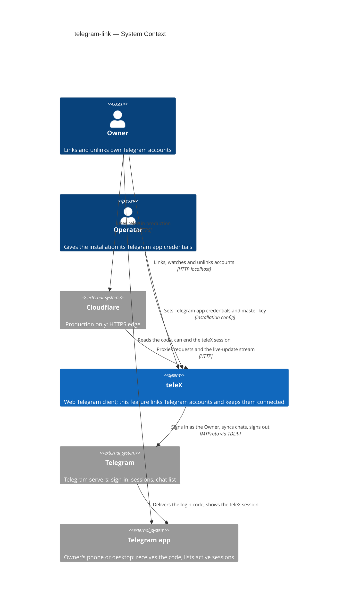
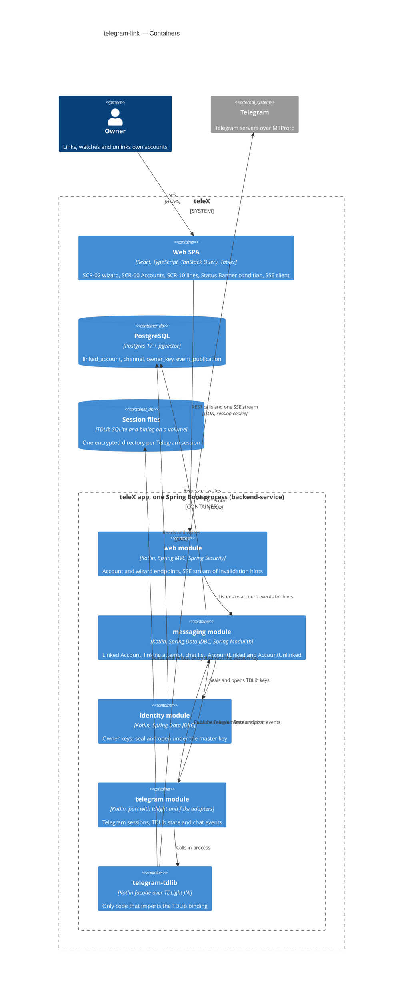
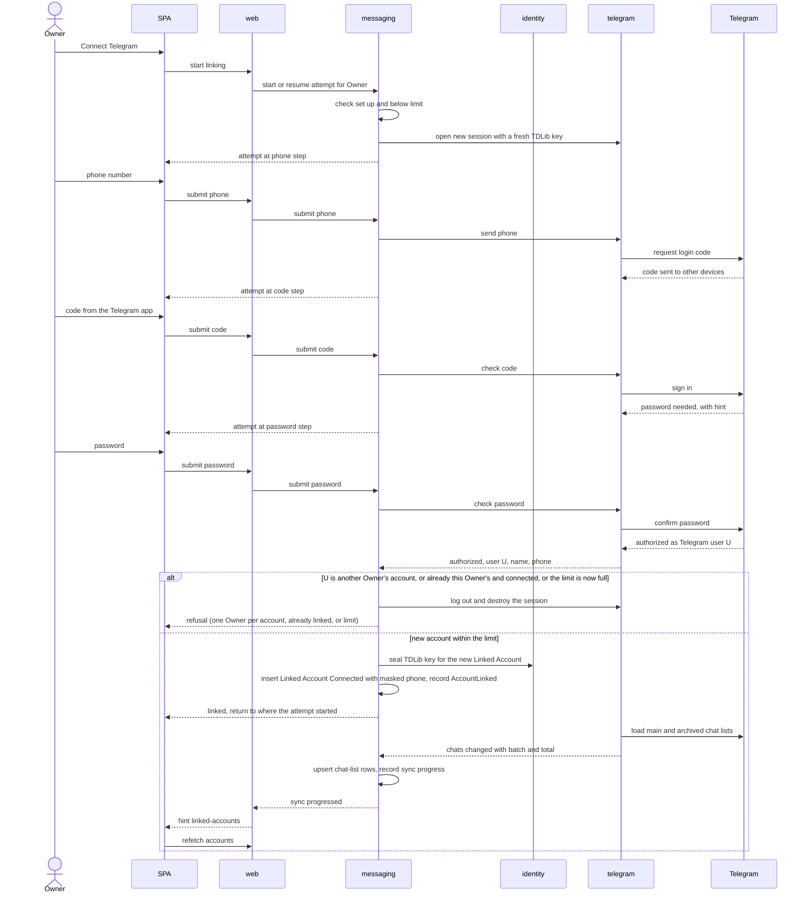
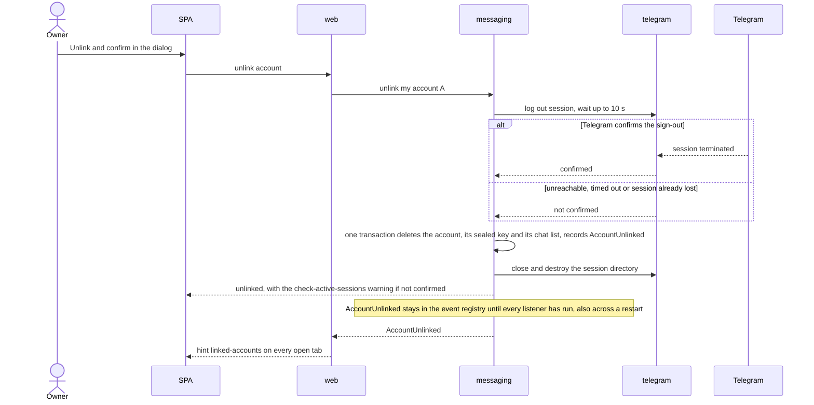
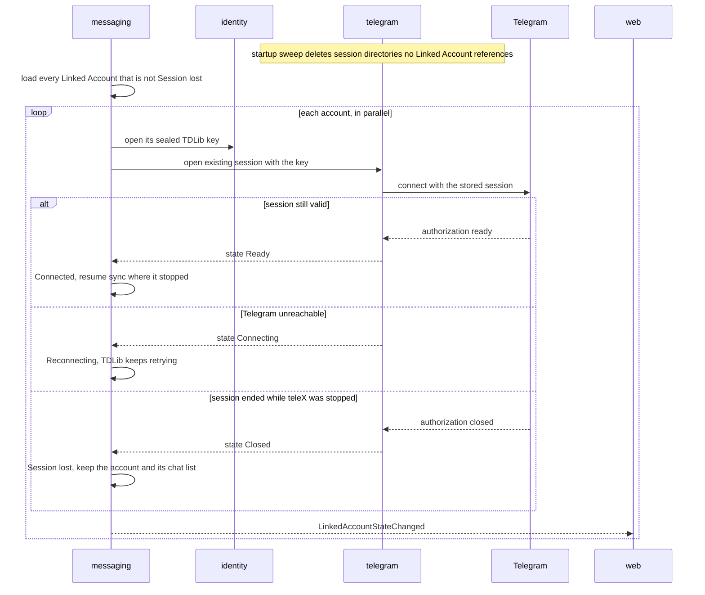

# Software Architecture Document — telegram-link

<!-- 12 Arc42 sections. Empty section → <!-- N/A: <one-line reason> -->. -->
<!-- C4 Context (L1) lives inline in §3. C4 Container (L2) lives inline in §5. -->
<!-- Numbers in §10 come VERBATIM from spec.md §6 NFR — no inventing, no rounding. -->

## 1. Introduction and goals

**Intent.** An Owner hands teleX access to their own Telegram account, and can take it back completely. From the browser, on a phone or a laptop, the Owner goes through the sign-in steps Telegram itself asks for: phone number, the code sent to their other devices, and their two-step verification password if they have one. teleX then holds that account's Telegram session, encrypted with a key per Owner. It syncs the account's chat list in the background with visible progress, and it reconnects the account by itself after a restart. A lost session is not an unlink: the Linked Account waits for the Owner to sign in again, and everything attached to it stays. An unlink is explicit and total. It signs teleX out of Telegram, keeps no session and no data, and is announced to every part of teleX that acts through the account. Every later epic that works in Telegram (E03 consent, E04 chat reading, E09 agents, E17 Owner Bot) builds on the Linked Account this feature creates.

**Top-3 quality goals (1-liners; full scenarios in §10):**

1. **Nothing left behind, nothing readable.** Session data at rest is unreadable without the Owner's key. An unlink leaves no stored item that identifies the Telegram account and no teleX device in Telegram. The unlink announcement survives a restart.
2. **Stays connected by itself.** Linked Accounts reconnect within 60 s after a restart without a code. A Telegram outage shows "Reconnecting", never "Session lost". A real session loss shows within 5 minutes. At least 50 accounts stay connected on one instance.
3. **Linking feels like Telegram, at Telegram's speed.** Each wizard step answers within 3 s at p95. A typical account (≤ 500 chats) is fully synced within 60 s, and the wizard survives a reload or a switch to the Telegram app on a phone. It works at 360 px and 1280 px with WCAG 2.2 AA.

**Stakeholders.**

| Role | Interest | Sign-off owner? |
|---|---|---|
| Owner | Links, re-signs-in to and unlinks their own Telegram accounts; sees each account's state and sync progress (US-02, US-03, US-50, US-51, US-52) | No |
| Operator | Gives the installation its Telegram app credentials once (README step); never sees any Owner's Telegram data (US-53, AC-120) | No |
| Tech Lead | SAD approval; the Linked Account boundary that E03, E04, E09, E17 and E20 build on | Yes |
| Security Lead | Review of the first stored third-party credential (the Telegram session) and the encryption and unlink decisions, done as a security-focused pass inside `/sdd:review` (spec §6.1) | No |

<!-- Decision overrides (¶4) — populated by the critic resolution loop, empty otherwise. -->

## 2. Constraints

**Technical.**
- Kotlin 2.4.10 on JDK 25 with virtual threads (`gradle/libs.versions.toml`). Foundation [ADR-0001](../../adr/0001-kotlin-spring-modulith-postgres-react-stack.md).
- Spring Boot 4.1.1 (Web MVC, Security, Data JDBC through `JdbcClient`, Flyway) and Spring Modulith 2.1.1 with the JDBC event publication registry and `republish-outstanding-events-on-restart: true` (`application.yaml`). No new Spring starter is needed.
- PostgreSQL 17 + pgvector (`pgvector/pgvector:pg17`) through Flyway, with a paired rollback script per migration. Foundation [ADR-0003](../../adr/0003-postgres-jdbc-flyway-uuidv7-persistence.md).
- **Added by this feature:** TDLight Java (a maintained TDLib fork whose native libraries ship prebuilt in Maven for linux x64/arm64 and macOS), only as an `implementation` dependency of `backend/telegram-tdlib`, so the binding's `it.tdlight.*` classes never reach `backend/app`. This keeps foundation [ADR-0002](../../adr/0002-single-app-with-isolated-tdlib-subproject.md) and architectural rule 1 in spirit; the rule's package name changes from `org.drinkless.tdlib.*` to the TDLight one (ADR-0004, §11). The `TdlibFacade` interface exists but is empty. Whether the binding runs on JDK 25 inside the `eclipse-temurin:25-jre` image is still unproven (roadmap D1, spec §8 OQ-2), and the spike is the first E02 task (ADR-0004).
- Module rules, as declared in each `package-info.java` and checked by `ModularityTest`: `telegram` may depend on `shared` only, and `web` may reach core modules but not `telegram`. So every Owner-facing operation on a Linked Account enters through a core module, and `telegram` reports back only through events or return values (ADR-0002).
- Frontend: React 19, TypeScript 6, Vite 8, React Router 8, TanStack Query 5, `@tabler/core` 1.6.1, Playwright at 360 px and 1280 px. No live-update channel exists in the SPA yet (ADR-0005).
- Runtime: one app instance with one Postgres (foundation ADR-0001, spec §6 availability N/A). TDLib clients are in-process, stateful objects, so the Linked Accounts of an installation are served by exactly one app process (§7).

**Organisational.**
- One developer (Anton Husiev) on the course's 8-week timeline. Neither the spec nor the roadmap sets a per-epic deadline.
- Roadmap step 2, wave 3, running in parallel with E06 `app-shell` and E10 `model-profiles`. This is the only blocker for wave 4 (E03, E04, E17).
- Implementation runs through the SDD `implement` engine (TDD, per-task gate). The TDLib spike runs before any wizard work (spec §8 OQ-2 default).

**Conventions.**
- `CLAUDE.md` (layout, IDs, errors, migrations, tests, quality gates) and `docs/architecture-map.md` §Conventions; the closest precedent is the `identity` module from E01 (`internal/<concern>/` sub-packages, `JdbcClient` row classes, small event data classes with no personal data).
- IDs: app-generated UUIDv7 via `telex.shared.Uuid7.next()`, typed `@JvmInline value class LinkedAccountId(override val value: UUID) : TypedId`.
- Errors: RFC 9457 `application/problem+json`, `type = urn:telex:error:<code>`; domain errors extend `telex.shared.DomainProblem`, rendered by `telex.web.ProblemHandler`.
- Every Owner-owned row carries `owner_id`, and every query filters on it. Another Owner's record is indistinguishable from a missing one (E01's `not-found` precedent, AC-03).
- Config: keys under `telex:` in `application.yaml`, bound from `TELEX_*` environment variables, as with `TELEX_PUBLIC_URL` and `TELEX_MAIL_*`.
- UI: `docs/docs/design-system/README.md`. Tokens only, status never by color alone, sentence-case English copy from `frontend/src/messages.ts`, no emoji. The Status Banner mechanism is E06's (`app-shell`); this feature adds the "account disconnected" condition to it.

**Regulatory / external.**
- Data is classified confidential (spec §6.1). Personal data per Linked Account: phone number, Telegram account id and display name, the Telegram session, and the synced chat list (titles, types, folders, unread counts).
- The login code and the two-step verification password pass through to Telegram and are never stored, shown back or logged (spec §6.1). The session is stored only encrypted with a key per Owner (NFR-05, ADR-0003).
- Telegram's terms: teleX signs in as the user through the official client library with the Operator's own `api_id` / `api_hash` from my.telegram.org. Telegram's attempt limits are surfaced, never retried around (spec §6.1). The tech-spec ban risk applies (§11).
- No compliance regime is in scope for a course installation.

## 3. Context and scope

This feature opens teleX's second outer boundary, toward Telegram. Until now teleX only faced browsers and a mail server. Now it signs in to Telegram as a person, holds that person's session, and keeps a connection open per Linked Account. There are two trust boundaries. The browser stays untrusted until it carries a live Sign-in Session, and even then it reaches only its own Owner's Linked Accounts (AC-03). Telegram is trusted for identity, meaning it says which Telegram account a sign-in belongs to and whether a session still exists. Telegram data itself (names, chat titles) is stored and shown, never interpreted.

<!-- brownfield: skeleton + E01 present at f0d9437 — identity (Owners, SignInSessions, Passkeys, SignInSessionStarted; JdbcClient rows under internal/<concern>/), web (REST controllers under /api/v1, Spring Security with an opaque session cookie + CSRF cookie, SpaHosting, ProblemHandler), mail module, Modulith JDBC registry with republish on restart; telegram = package-info only (allowedDependencies: shared); web may not depend on telegram; messaging = package-info only; telegram-tdlib = empty TdlibFacade, no binding in the version catalog; no SSE endpoint or client; no port fakes in integrationTest; Dockerfile (temurin 25 jdk → jre) + compose (app, postgres, mailpit). docs/architecture-map.md still reflects ce5eabf (stale — re-run /sdd:survey). -->

**External systems (in / out):**

| Actor or system | Type | Interaction |
|---|---|---|
| Owner | Person | Links, re-signs-in to and unlinks their own Telegram accounts in the browser; reads the login code in the Telegram app |
| Operator | Person | Puts the installation's Telegram app credentials (`api_id`, `api_hash`, obtained at my.telegram.org) and the master key into the installation config (README step); sees no Owner's Telegram data |
| Telegram | System (external) | Telegram's servers, reached over MTProto through TDLib. They run the sign-in (phone → code → password), report authorization and connection state, serve the chat list and its updates, and end sessions |
| Telegram app on the Owner's devices | System (external) | Where the login code arrives and where the Owner can see and end teleX's session (the "teleX device" in active sessions) |
| Cloudflare | System (external, production only) | Terminates HTTPS in front of the app, as in E01. It must pass the long-lived live-update stream through unbuffered (ADR-0005) |

**C4 Context (L1):**



## 4. Solution strategy

**Target surfaces: `[backend-service, web-frontend]`.** The Owner acts only in a browser (spec §1, §4), and `ux-flows.md` details three screens (SCR-02, SCR-10, SCR-60) plus the Status Banner condition. The Operator only edits installation config. The backend owns the JSON contract and the live-update stream, and the SPA consumes them. Foundation [ADR-0001](../../adr/0001-kotlin-spring-modulith-postgres-react-stack.md) already fixed the two-container split, so it's recorded inline, not as an ADR.

**UI architecture (web-frontend): the existing client-side SPA.** It keeps the existing stack (React Router, TanStack Query, one fetch client) and adds one SSE client that turns hints into query invalidation (ADR-0005). The wizard (SCR-02) is one full-page route whose current step comes **from the server**, from the Owner's open linking attempt, never from browser state. That way a reload, a second tab or another device lands on the same step (AC-109), and closing the tab loses nothing. No global state library is added.

**Top strategic choices (the seeds for ADRs):**

1. **The Linked Account is a `messaging` aggregate; `telegram` only runs Telegram sessions.** `messaging` owns the rules and the data. That covers one Owner per Telegram account (by Telegram user id, not phone), no duplicates, the limit, the states, the chat list, and the `AccountLinked` / `AccountUnlinked` events. `telegram` owns TDLib clients and their session directories, keyed by its own `TelegramSessionId`, and reports back through return values and events. An unlink deletes the account, its sealed key and its chat list in one transaction, and the same transaction records the announcement (quality goal 1). → [ADR-0002](adr/0002-own-linked-accounts-and-their-chat-list-in-messaging-behind-a-session-only-telegram-acl.md)
2. **Envelope encryption with crypto-shredding.** A master key from config wraps a per-Owner key kept by `identity`, which wraps a fresh TDLib database key per Telegram session, kept sealed on the Linked Account. Deleting the sealed key makes any leftover session file unreadable, so "nothing left behind" holds even if deleting the files fails (quality goal 1). → [ADR-0003](adr/0003-seal-each-tdlib-database-key-with-a-stored-per-owner-key-under-an-installation-master-key.md)
3. **TDLight behind the facade, a fake adapter beside it, and the spike first.** The prebuilt TDLight natives retire roadmap D1 without a C++ build. The `fake` Telegram adapter makes every AC testable and runs the Playwright e2e and Telegram-free local runs. → [ADR-0004](adr/0004-use-tdlight-java-behind-the-tdlib-facade-with-a-fake-telegram-adapter.md)
4. **Telegram decides the state, and the browser hears it live.** The account state follows TDLib's own signals:
   - authorization ready → Connected;
   - connection lost → Reconnecting;
   - only authorization closed (the session was ended in or by Telegram) → Session lost.

   So an outage never looks like a lost session (quality goal 2). State changes reach open pages as SSE invalidation hints, with REST as the only data path. → [ADR-0005](adr/0005-push-live-state-to-the-spa-as-sse-invalidation-hints.md)

Tactical choices in §5–§8 trace to these four:
- one in-memory linking attempt per Owner, held by `messaging` (§5, §8);
- a bounded sign-out before the unlink deletes (§6);
- parallel client start on boot and a startup sweep of orphan session directories (§7).

## 5. Building block view

The repo's Spring Modulith modular monolith is followed as-is (`internal/<concern>/` sub-packages, public API and events at the module root, `ModularityTest`). The feature touches four modules and the facade subproject, and every edge it needs is already allowed by the current `package-info.java` files:
- **`messaging`** (core, first real code) owns the Linked Account, the linking attempt and the chat list (ADR-0002).
- **`telegram`** (integration, `shared` only) owns Telegram sessions: the port, the `tdlight` and `fake` adapters, and session directories (ADR-0004).
- **`identity`** (core) gains `OwnerKeys` for envelope encryption and reads the master key (ADR-0003).
- **`web`** (interface) adds the account and wizard endpoints and the SSE stream, and calls only `messaging` and `identity` (ADR-0005).

Ids that cross into `telegram` are `telegram`'s own (`TelegramSessionId`, Telegram user and chat ids). `OwnerId` and `LinkedAccountId` never enter it.

**Internal decomposition:**

```
backend/app/src/main/kotlin/telex/
├── messaging/                       core — public API at the root
│   ├── LinkedAccountId, ChannelId   typed UUIDv7 ids
│   ├── LinkedAccounts               list mine, get mine, unlink, linking-availability (set up? within limit?)
│   ├── Linking                      start / resume attempt, submit phone, code, password, resend code, cancel,
│   │                                start "Sign in again" for a Session-lost account
│   ├── AccountLinked, AccountUnlinked, LinkedAccountStateChanged, LinkedAccountSyncProgressed   events (ids + state only)
│   └── internal/
│       ├── account/                 LinkedAccount aggregate, states, one-owner + duplicate + limit rules, repository
│       ├── attempt/                 in-memory LinkingAttempts (one per Owner), 15-min expiry sweep, outcome mapping
│       ├── channel/                 Channel rows (the chat list), upsert/remove from telegram events, counts
│       ├── lifecycle/               boot reconnect of every Connected account, telegram event listeners → state
│       └── config/                  max linked accounts per Owner (installation-wide, default 3)
├── telegram/                        integration ACL — depends on shared only
│   ├── TelegramSessions             port: open, phone, code, resend, password, log out, close and destroy
│   ├── TelegramSessionId, SignInOutcome, ChatSnapshot          port types
│   ├── TelegramSessionStateChanged, TelegramChatsChanged       events (session id, never an Owner id)
│   └── internal/
│       ├── tdlight/                 adapter over telex.telegram.tdlib facade; TDLib states → port types; chat sync
│       ├── fake/                    in-memory Telegram (codes, 2FA, flood waits, bans, termination, N chats)
│       └── files/                   session directory root, per-session dirs, orphan sweep at startup
├── identity/                        existing core
│   ├── OwnerKeys                    seal / open with the Owner's key (AES-256-GCM, AAD), lazily creates the key
│   └── internal/key/                owner_key rows, master key from TELEX_MASTER_KEY
├── web/                             existing interface
│   ├── api/LinkedAccountsController, api/LinkingController   SCR-02 / SCR-60 / SCR-10 endpoints
│   └── live/                        EventStreamController (SSE), per-Owner emitter registry, hint throttling
└── shared/                          existing kernel

backend/telegram-tdlib/              facade subproject: TdlibFacade over TDLight (implementation dependency)

frontend/src/
├── pages/accounts/                  SCR-60 Accounts list, unlink dialog (C-33)
├── pages/connect-telegram/          SCR-02 wizard, step from the server's attempt
├── pages/inbox/                     SCR-10: Connect Telegram step ↔ one line per Linked Account
├── components/                      account line/state badge, sync progress, wait countdown (ported from the design system)
├── api/live.ts                      the single SSE client → queryClient.invalidateQueries
└── messages.ts                      all new copy
```

**C4 Container (L2):**



## 6. Runtime view

Design seeds the three flows that carry the strategic choices. `/sdd:sequences` then adds a flow or branch for every remaining AC, including the wizard errors (AC-02, AC-106, AC-107), cancel and expiry (AC-109, AC-110), "Sign in again" (AC-117), the limit (AC-115) and authorization (AC-03). Messages are semantic, and endpoints arrive with `/sdd:api`.

**Critical flow 1: link a new account with two-step verification (AC-01, AC-04, AC-108, AC-115, AC-116)**



**Critical flow 2: unlink, including Telegram unreachable (AC-111, AC-112, AC-113)**



**Critical flow 3: restart, reconnect and lost-session detection (AC-36, AC-118, AC-122)**



## 7. Deployment view

**Topology.** One app instance plus one Postgres (foundation ADR-0001; spec §6 availability N/A). This feature makes "one instance" a hard rule. TDLib clients live in the app process and own their session directories, so two instances would run two clients on the same session.
- **Image.** The existing multi-stage `Dockerfile` is unchanged in shape. The TDLight natives come in through Gradle inside the boot jar (ADR-0004), so there is no C++ stage. The runtime base stays `eclipse-temurin:25-jre` (Ubuntu, glibc). The spike confirms the native classifier matches it.
- **Session files.** A new named volume `telex-tdlib` is mounted at `/var/lib/telex/tdlib` (`TELEX_TELEGRAM_SESSIONS_DIR`), with one directory per `TelegramSessionId`. It is backed up together with Postgres or not at all. A session directory without its sealed key in Postgres is unreadable, and Postgres without the directories means every account goes to Session lost.
- **Operator config (README step, US-53).**
  - `TELEX_TELEGRAM_API_ID` and `TELEX_TELEGRAM_API_HASH`, from my.telegram.org.
  - `TELEX_MASTER_KEY`: 32 random bytes, base64. The README shows `openssl rand -base64 32` and warns that losing it loses every session (ADR-0003).
  - `TELEX_TELEGRAM_MAX_ACCOUNTS_PER_OWNER`, default 3 (spec §8 OQ-1 default).

  When the API credentials or the master key are missing, linking reports "isn't set up" (AC-119). The app still starts.
- **Local and CI.** `compose.yaml` gains the volume and passes the variables. Integration tests and Playwright run `telex.telegram.adapter=fake`. `bootRun --spring.profiles.active=local` uses `fake` unless real credentials are set. Real-Telegram checks (spec §6 manual rows) run against Telegram's test servers or a test account, as the spec states.
- **Boot order.** The app starts, Flyway migrates, the session sweeper runs, then `messaging` reopens every non-lost Linked Account in parallel on virtual threads. Readiness doesn't wait for the reconnects. The spec's "≤ 60 s after teleX is ready" counts from there.

**Monitoring:**
- Metrics (Micrometer, with no phone numbers, names or Telegram ids in tags):
  - `telex.telegram.sessions.active{state=ready|connecting|closed}`;
  - `telex.linking.attempts{outcome=linked|cancelled|expired|refused_other_owner|refused_duplicate|refused_limit|flood_wait}`;
  - `telex.linking.step.duration{step=phone|code|password}` (the p95 ≤ 3 s target);
  - `telex.linked_accounts.reconnect.duration`;
  - `telex.unlink{signout=confirmed|unconfirmed}`;
  - `telex.chat_sync.duration`.
- KPIs (spec §7): link completion and time to link come from the `telex.linking.*` metrics, restart survival from `telex.linked_accounts.reconnect.*`, and unlink completeness from the recorded dump. There is no analytics pipeline.
- Health: `/actuator/health` stays green when Telegram is unreachable, because a Telegram outage is an account state, not an app failure. Incomplete `AccountUnlinked` publications are visible in `event_publication`.
- Alerts and tracing: none in E02 (no SLO). OpenTelemetry arrives with the agent epics.

**Scaling thresholds:**
- Target ≥ 50 connected Linked Accounts on 4 vCPU / 8 GB (spec §6, tech-spec NFR-04). Budget: about 30–60 MB of native memory per TDLib client, measured in the spike and in the 50-account load run, so the JVM heap is capped to leave room. Above roughly 100 accounts per instance, revisit TDLib's chat and message database options before adding instances.
- A second app instance needs sharding of Linked Accounts across instances and a shared SSE fan-out (ADR-0005). That is out of scope until an installation needs more than one instance.
- The `channel` table holds about 500 rows per account in the typical case. No partitioning is needed in E02; E04 revisits this when message history arrives.

## 8. Crosscutting concepts

Repo conventions are inherited by default (`CLAUDE.md`, `docs/architecture-map.md` §Conventions, platform-skeleton SAD §8). The rows below are those conventions plus what this feature adds.

| Concept | Convention | Where defined |
|---|---|---|
| Logging | Spring Boot default logging with module loggers. **Never logged:** phone numbers, login codes, passwords, password hints, TDLib keys, Telegram names, chat titles, raw TDLib objects. Accounts appear in logs only as `LinkedAccountId` or `TelegramSessionId`. TDLib's own log goes to the app log at verbosity 1 (errors only) | here |
| Authentication | Unchanged E01 filter chain. Every account, wizard and stream endpoint needs a live Sign-in Session | platform-skeleton ADR-0001 |
| Authorization | Owner-scoped by construction. `messaging` takes the `OwnerId` from the caller and filters every Linked Account and Channel query on `owner_id`. Another Owner's account behaves as missing, with the same `not-found` problem, for list, get, re-sign-in, unlink and chats (AC-03). The Operator has no endpoint that reads Linked Accounts (AC-120) | here |
| One Owner per Telegram account | Unique index on `linked_account.telegram_user_id` across the installation. The check runs after Telegram reports who signed in, not on the phone number (AC-04, AC-108). Two Owners finishing at the same moment are settled by the index: the loser's session is logged out | ADR-0002 |
| Account limit | Checked when an attempt starts and again, inside the insert transaction, when it finishes (AC-115). Session-lost accounts count, re-sign-in takes no new place, and a lowered limit never unlinks. The final count runs under a row lock on the Owner's accounts, so two parallel finishes can't both take the last place | here |
| Linking attempt | At most one per Owner, held in memory by `messaging`. It holds the open Telegram session, the step, where it started (SCR-10 or SCR-60), the target account for "Sign in again", the Sign-in Session that last stepped it and the last-step time. It is discarded on cancel, after 15 min without a step (a one-minute sweep), when the Sign-in Session that last stepped it is no longer live (AC-110), or on restart. Discarding always closes and destroys its Telegram session. An attempt never authorizes without immediately becoming a Linked Account or being logged out, so no teleX device is left behind (AC-109) | here |
| Telegram wait (flood wait) | Not stored by teleX. Telegram itself refuses the same number again before the wait ends, and the wizard shows the remaining time from Telegram's answer as a countdown (AC-02). teleX adds no retries | here |
| Secrets | Login code and password go from the request straight to TDLib and are never stored or echoed. TDLib keys are generated with `SecureRandom` (32 bytes) and stored only sealed. The master key comes only from config | ADR-0003 |
| Personal data minimisation | Stored per Linked Account: Telegram user id, display name, **masked** phone (country code and last two digits only; the full number is never stored), state, sealed key, sync counts. Chat-list rows: Telegram chat id, type, title, folder ids, archived flag, unread count, order | here |
| Error handling | RFC 9457 via `ProblemHandler`. New codes, each keying a `messages.ts` entry: `telegram-linking-not-set-up`, `linked-account-limit-reached`, `linking-attempt-not-found` (expired, cancelled or session ended), `telegram-phone-invalid`, `telegram-phone-unregistered`, `telegram-phone-banned`, `telegram-code-wrong`, `telegram-code-expired`, `telegram-wait-required` (with the retry time), `telegram-password-wrong` (with the hint), `telegram-account-owned-by-another-owner`, `telegram-account-already-linked`, `telegram-account-mismatch` (Sign in again with a different account), plus `not-found`. Exact statuses are settled by `/sdd:api` | `CLAUDE.md` §Errors + here |
| ID strategy | UUIDv7 typed ids: `LinkedAccountId`, `ChannelId` (messaging) and `TelegramSessionId` (telegram). Telegram's own user and chat ids are stored as `bigint` attributes, never as keys of our aggregates | foundation ADR-0003 |
| Events | Modulith JDBC registry. `messaging` publishes `AccountLinked`, `AccountUnlinked` (durable, survives restart, NFR-06), `LinkedAccountStateChanged` and `LinkedAccountSyncProgressed` (throttled to one per second per account). `telegram` publishes `TelegramSessionStateChanged` and `TelegramChatsChanged`. Payloads carry ids and states only, with no names, phones or titles | ADR-0002 |
| Live updates | One SSE stream per tab, carrying invalidation hints only (`linked-accounts`). It counts as background, so it never bumps session activity. A heartbeat runs every 25 s, and the SPA refetches everything after a reconnect | ADR-0005 |
| Concurrency | Telegram callbacks arrive on TDLib's threads. The adapter hands each one to a virtual thread, and `messaging` applies state changes per account in order (state changes carry TDLib's sequence, and stale ones are dropped). Attempt steps are serialized per Owner | here |
| Time | The injectable `java.time.Clock` bean drives the 15-min attempt expiry, the sweeps and the countdown base. The integration tests use a fixed clock with the `fake` adapter (AC-109, AC-117 within 5 min) | platform-skeleton §8 |
| Internationalisation | English only. Copy in `frontend/src/messages.ts`, sentence case, no emoji. Telegram's own error texts are never shown raw; each maps to a code above | design-system README |
| Observability | Micrometer metrics listed in §7 | §7 |

## 9. Architecture decisions

| # | Title | Status | Section |
|---|---|---|---|
| [0001](adr/0001-move-agent-pause-on-unlink-to-agent-builder.md) | Move "pause agents on unlink" from E02 to E09 and E20; E02 only announces the unlink | Accepted | §1 (spec deviation) |
| [0002](adr/0002-own-linked-accounts-and-their-chat-list-in-messaging-behind-a-session-only-telegram-acl.md) | Own Linked Accounts and their chat list in `messaging`; keep `telegram` a session-only ACL | Accepted | §4 |
| [0003](adr/0003-seal-each-tdlib-database-key-with-a-stored-per-owner-key-under-an-installation-master-key.md) | Seal each TDLib database key with a stored per-Owner key under an installation master key | Accepted | §4 |
| [0004](adr/0004-use-tdlight-java-behind-the-tdlib-facade-with-a-fake-telegram-adapter.md) | Use TDLight Java behind the `telegram-tdlib` facade, with a fake Telegram adapter for tests and local runs | Accepted | §4 |
| [0005](adr/0005-push-live-state-to-the-spa-as-sse-invalidation-hints.md) | Push live state to the SPA as SSE invalidation hints, one stream per browser tab | Accepted | §4 |

ADR files live under `docs/features/telegram-link/adr/NNNN-<title>.md`. ADR-0001 was written by `/sdd:specify`. Foundation decisions this feature builds on: [`docs/adr/0001`](../../adr/0001-kotlin-spring-modulith-postgres-react-stack.md) (stack, SPA served by the app, one instance), [`0002`](../../adr/0002-single-app-with-isolated-tdlib-subproject.md) (TDLib isolated in `telegram-tdlib`), [`0003`](../../adr/0003-postgres-jdbc-flyway-uuidv7-persistence.md) (JDBC, Flyway + rollback, UUIDv7).

## 10. Quality requirements

Each §1 goal is expanded into testable scenarios. Numbers are quoted verbatim from spec §6.

**QG-1. Nothing left behind, nothing readable**

*QG-1a: Session data at rest.*
- **When:** any Linked Account exists, or a linking attempt is open.
- **Then:** spec §6: "100% of stored session data unreadable without the Owner's key" (tech spec NFR-05).
- **How verify:** spec §6 measurement, "dump of the stored data checked for plaintext session material". An integration test with the `tdlight` adapter against a stub directory, or the spike's real session, captures the raw TDLib key in memory. It then searches every column of `linked_account`, `owner_key`, `event_publication` and the captured log output, and every byte of the session volume, for that key. Zero hits. The manual dump of a real test account is recorded in the E02 pull request.

*QG-1b: Unlink leaves nothing.*
- **When:** an Owner unlinks an account, with Telegram reachable or not, and also when the app stops between the database commit and deleting the files.
- **Then:** spec §6: "0 stored items that identify the Telegram account (session, Telegram account id, phone number, name, chat list) for an unlinked account, always; 0 active teleX devices in Telegram whenever Telegram is reachable at unlink time (otherwise AC-113 applies and nothing is kept for a later retry)".
- **How verify:** an integration test with the `fake` adapter unlinks in both cases (confirmed and unreachable). It asserts no `linked_account` or `channel` row, no sealed key and no fake-Telegram session remain. A second test kills the process after the commit and before the directory is deleted, restarts, and asserts that the sweeper removed the directory. The manual check (stored-data dump + the account's active sessions in Telegram) is recorded in the E02 pull request.

*QG-1c: Unlink announcement survives a restart.*
- **When:** teleX stops right after an unlink.
- **Then:** spec §6: "100% of unlinks are delivered to every part of teleX that acts through the account, including when teleX stops right after the unlink" (tech spec NFR-06).
- **How verify:** spec §6 measurement. An integration test registers a test listener for `AccountUnlinked`, stops the context after the commit and before delivery, starts it again, and asserts delivery from `event_publication`.

**QG-2. Stays connected by itself**

*QG-2a: Reconnect after restart.*
- **When:** teleX restarts with Linked Accounts whose sessions are valid.
- **Then:** spec §6: "every Linked Account with a valid session is connected again ≤ 60 s after teleX is ready". An account whose session ended while teleX was stopped shows Session lost, and the others are unaffected (AC-118).
- **How verify:** spec §6 measurement, an integration test with 2 accounts (`fake` adapter, one session ended while stopped), plus a manual restart on a test account.

*QG-2b: Lost session vs outage.*
- **When:** a session is ended from the Telegram app, or Telegram becomes unreachable.
- **Then:** spec §6: "an account shows "Session lost" ≤ 5 min after its session is ended in Telegram, and a Telegram outage never shows "Session lost"".
- **How verify:** spec §6 measurement, an integration test with a controlled clock. The `fake` adapter terminates a session (Session lost within the window, Status Banner condition true) and separately drops connectivity (Reconnecting only, no banner). Plus a manual check on a test account.

*QG-2c: Capacity.*
- **When:** many Linked Accounts are connected on one instance (4 vCPU / 8 GB).
- **Then:** spec §6: "≥ 50 connected at once".
- **How verify:** spec §6 measurement, "one-off load run with 50 accounts on Telegram's test servers, recorded in the E02 pull request". Record resident memory and CPU per client against the §7 budget.

**QG-3. Linking feels like Telegram, at Telegram's speed**

*QG-3a: Wizard step response.*
- **When:** the Owner submits the phone, code or password step.
- **Then:** spec §6: "p95 ≤ 3 s per step", excluding Telegram delivering the code to the Owner.
- **How verify:** spec §6 measurement, "timings recorded in integration tests against the in-memory Telegram fake + manual check on a real test account recorded in the E02 pull request". The production metric is `telex.linking.step.duration`.

*QG-3b: Chat list sync.*
- **When:** a new account finishes linking, and later when its chats change in Telegram.
- **Then:** spec §6: "an account with ≤ 500 chats (archived included) is fully synced within 60 s; later changes show within 60 s (AC-121)". A sync interrupted by a restart continues where it stopped (AC-116).
- **How verify:** spec §6 measurement, a "manual timed run on a real test account, recorded in the E02 pull request". In CI, an integration test with a 500-chat `fake` account asserts completion, progress counts and resume after a restart.

*QG-3c: Responsive and accessible.*
- **When:** the wizard, the Accounts page or the unlink dialog is rendered in any state.
- **Then:** spec §6: "the wizard, the Accounts page and the unlink dialog work at 360 px and 1280 px and meet WCAG 2.2 AA".
- **How verify:** spec §6 measurement. Playwright runs with the `fake` adapter at both widths, plus an automated accessibility scan (axe) with 0 violations. The reload-mid-wizard and second-tab paths (AC-109) are e2e cases.

## 11. Risks and technical debt

| Risk / debt | Severity | Mitigation | Owner |
|---|---|---|---|
| **TDLight on JDK 25 is still unproven** (roadmap D1, spec §8 OQ-2, overdue "before design"). The natives may not load on `eclipse-temurin:25-jre`, or JNI may misbehave on JDK 25 | High | The spike is the first E02 task, before any wizard work (ADR-0004): natives load in the image and on macOS, a test-server sign-in, two clients in one process. Fallback: official TDLib built in a Dockerfile stage, which changes only `telegram-tdlib` and the Dockerfile. Everything above the port is tested on the `fake` adapter, so wizard work isn't blocked by the spike's outcome | agent (spike), Anton Husiev (Architect) |
| **Losing `TELEX_MASTER_KEY` loses every session.** Every Linked Account would go to Session lost and need a new sign-in | Medium | The README step generates the key and puts it next to the database backup instructions. The app refuses to start when the master key differs from the one recorded (a key-check value stored with `owner_key`), instead of silently failing every unseal | Anton Husiev (Architect) |
| **Telegram ban or limit risk for the Owner's account** (tech spec §Risks). Signing in from a new device and syncing chats can trigger Telegram's anti-abuse checks | Medium | Official sign-in flow only, Telegram's waits surfaced and never retried around (AC-02), the chat list loaded at TDLib's own pace. No sending in E02 | Anton Husiev (PM) |
| **Third-party fork dependency.** TDLight may lag official TDLib or stop being maintained | Medium | The facade hides the binding (ADR-0004). Pin the version and re-check at each upgrade. Option 2 of ADR-0004 stays the documented way out | Anton Husiev (Architect) |
| **Single instance by construction.** TDLib clients and SSE streams are in-process | Low | Accepted for a self-hosted installation (§7). A second instance needs account sharding and a shared SSE fan-out | Anton Husiev (Architect) |
| **SSE through Cloudflare.** Proxies may buffer or cut long-lived responses | Low | Heartbeat every 25 s, `X-Accel-Buffering: no`, `Cache-Control: no-store`. The SPA reconnects and refetches everything after a cut (ADR-0005). Polling remains a one-file fallback in the SSE client | Anton Husiev (Architect) |
| **E06 `app-shell` is designed in parallel** and owns the Status Banner mechanism and the live Inbox counter | Low | E02 adds the "account disconnected" condition to E06's mechanism, and its live channel (ADR-0005) is offered to E06 for the counter. Settle this in `/sdd:design app-shell` or `/sdd:tasks` of whichever lands second | Anton Husiev (PM) |
| **Docs drift.** The tech-spec event table names `telegram` as the publisher of `AccountLinked` / `AccountUnlinked`. CLAUDE.md, the tech spec and foundation ADR-0002 name `org.drinkless.tdlib`. `docs/architecture-map.md` reflects `ce5eabf` | Low | `implement` updates the tech-spec event table, rule 1's package name and CLAUDE.md when it lands the dependency. Re-run `/sdd:survey` after E02 | Anton Husiev (Architect) |
| **Spec §8 OQ-1 is overdue** (due "before `/sdd:design`"): the default account limit | Low | The design assumes the spec's default of 3, one installation-wide setting (`TELEX_TELEGRAM_MAX_ACCOUNTS_PER_OWNER`). It's a config value, so it can close any time before `/sdd:ship` | Anton Husiev (PM) |

**Accepted debt (acceptable in v1, plan to fix later):**
- TDLib's `files` directory (downloaded media) isn't covered by TDLib's database encryption. E02 downloads no files. E04 must keep media out of the session volume or encrypt it before it downloads anything (ADR-0003).
- An open linking attempt is lost on restart, and the Owner starts again with the phone number. Acceptable because the 15-minute window is short and restarts are rare.
- `LinkedAccountSyncProgressed` and the state events go through the persistent event registry, even though web hints don't need durability. If `event_publication` growth becomes noticeable, move the hint path to a non-persistent after-commit listener.

## 12. Glossary

Canonical terms come from [`CONTEXT.md`](../../../CONTEXT.md) (repo root); the definitions there win. Terms marked **new** surfaced during design and aren't in CONTEXT yet. Recommend `/sdd:glossary telegram-link` for them.

| Term | Meaning |
|---|---|
| Owner | A person with a teleX account who can link one or more Telegram accounts and owns everything created in them (CONTEXT) |
| Operator | The person who deploys and administers a teleX installation and never sees the content of anyone's chats; in E02, the person who sets the Telegram app credentials and the master key (CONTEXT) |
| Linked Account | A Telegram account an Owner linked by signing in through teleX; belongs to exactly one Owner, keeps its identity across a lost session and a re-sign-in, and is fully deleted by an unlink (CONTEXT) |
| Sign-in Session | The Owner's signed-in state in one browser. NOT the Telegram session of a Linked Account (CONTEXT) |
| Status Banner | The strip under the header on every signed-in screen; E02 adds the "account disconnected" condition (CONTEXT) |
| Inbox | The place where everything waiting for the Owner lands; in E02 it shows "Connect Telegram" or one line per Linked Account (CONTEXT) |
| Telegram session (**new**) | teleX's own signed-in device in one Telegram account: a TDLib client and its encrypted session directory, identified by a `TelegramSessionId`. A Linked Account has one current Telegram session, and a re-sign-in replaces it (ADR-0002) |
| Linking attempt (**new**) | One Owner's open run through the wizard (phone → code → password), at most one per Owner, discarded on cancel, after 15 minutes without a step, when its Sign-in Session ends, or on restart (sad §8) |
| Session lost (**new**, state) | The Linked Account state after Telegram confirms the Telegram session has ended; everything attached stays until the Owner signs in again or unlinks (AC-117, AC-122) |
| Reconnecting (**new**, state) | The Linked Account state while Telegram is unreachable; teleX retries by itself and nothing is asked of the Owner (AC-122) |
| Chat list (**new**) | The Channels of one Linked Account as teleX keeps them (title, type, folders, archived flag, unread count), including archived chats; shown as a count in E02, as a list in E04 |
| Master key (**new**) | `TELEX_MASTER_KEY`, the installation secret that wraps every Owner key; losing it loses every Telegram session (ADR-0003) |
| Owner key (**new**) | A random per-Owner key, stored only wrapped by the master key, that seals the Owner's TDLib keys and later BYOK secrets (ADR-0003) |
| Crypto-shredding | Making data unreadable by destroying its key instead of relying on every copy being deleted; how an unlink guarantees leftover session files are useless (ADR-0003) |
| Masked phone | A phone number with only the country code and the last two digits visible; the only form of the number teleX stores (AC-01) |
