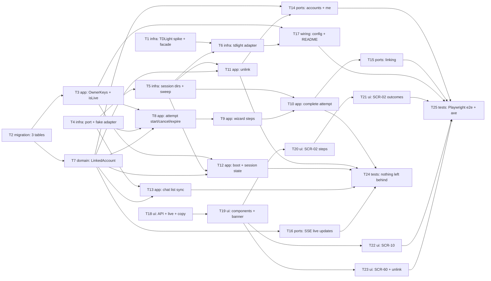

# Epic — telegram-link

> **Spec:** [spec.md](../spec.md) · **Design:** [sad.md](../sad.md) · **Data model:** [data-model.md](../data-model.md) · **API:** [openapi.yaml](../contracts/openapi.yaml) · **Events:** [events.md](../contracts/events.md) · **Screens:** [screens.md](../screens.md) · **ADRs:** [adr/](../adr/)

## Goal

An Owner connects their own Telegram account to teleX from the browser, with only the sign-in steps Telegram itself asks for, and sees its chat list start syncing. Linked Accounts stay connected through restarts, and a lost session keeps everything attached until the Owner signs in again. An unlink cuts teleX off completely: no session, no stored data and no teleX device left in Telegram (spec §2). E03, E04, E09, E17 and E20 build on the Linked Account this epic creates.

## Scope

- **In:** the TDLight spike and the `telegram-tdlib` facade; the `telegram` integration module (port, `fake` and `tdlight` adapters, session directories); `identity` (`OwnerKeys`, master-key check and reset, `SignInSessions.isLive`); `messaging` (Linked Account, linking attempt, chat list, lifecycle, the four account events); `web` (account and linking endpoints, SSE live updates, `getMe` count); the SPA (SCR-02, SCR-10, SCR-60, `StatusBanner`, `LinkedAccountSummary`); three staged migrations; Operator config + README; integration tests and Playwright e2e.
- **Out:** reading or sending messages (E04, E05), QR sign-in, creating or recovering Telegram accounts, Owner Bot notifications (E17), AI consent and the private zone (E03, E08), per-Owner limits (E26), pausing agents and cancelling schedules on unlink (E09, E20 — ADR-0001), custom account names (spec §3).

## Task map

Parallel branches from wave 1: the spike (T1), the migrations (T2), the Telegram port + fake adapter (T4) and the SPA API layer (T18) have no dependencies. Above the port, every `messaging` task runs on the `fake` adapter, so the wizard is never blocked by the spike's outcome (sad §11).

## Tasks

See [tracker.md](./tracker.md) for status. Machine contract: [tasks.json](../tasks.json).

| # | Task | Layer | Blocked by | Wave | Context |
|---|---|---|---|---|---|
| T1 | [Prove TDLight on JDK 25 and land the binding behind the TdlibFacade (spike)](./t01-tdlight-spike-and-facade.md) | infra | — | 1 | M |
| T2 | [Promote the owner_key, linked_account and channel migrations into the live Flyway tree](./t02-promote-telegram-link-migrations.md) | migration | — | 1 | M |
| T3 | [Add OwnerKeys envelope encryption with the master-key check and reset, and SignInSessions.isLive](./t03-identity-owner-keys-and-session-liveness.md) | app | T2 | 2 | M |
| T4 | [Define the TelegramSessions port, its in-process events and the fake Telegram adapter](./t04-telegram-port-and-fake-adapter.md) | infra | — | 1 | M |
| T5 | [Manage Telegram session directories: per-session dir, destroy with one-minute retry, startup orphan sweep](./t05-telegram-session-directories.md) | infra | T4 | 2 | M |
| T6 | [Implement the tdlight adapter: TDLib auth states, errors and chat list mapped to the port](./t06-tdlight-adapter.md) | infra | T1, T5 | 3 | M |
| T7 | [Build the LinkedAccount aggregate: rules, states, masked phone, repository, events and the account limit](./t07-linked-account-aggregate.md) | domain | T2 | 2 | M |
| T8 | [Start, resume, cancel and expire the in-memory linking attempt (one per Owner)](./t08-linking-attempt-lifecycle.md) | app | T3, T4, T7 | 3 | M |
| T9 | [Run the phone, code, resend and password steps with Telegram's refusals and waits](./t09-linking-wizard-steps.md) | app | T8 | 4 | M |
| T10 | [Complete an authorized attempt: link a new account, sign in again, or refuse and log out](./t10-complete-authorized-attempt.md) | app | T5, T9 | 5 | M |
| T11 | [Unlink an account: bounded sign-out, one-transaction delete with AccountUnlinked, then destroy the session](./t11-unlink-linked-account.md) | app | T5, T7 | 3 | M |
| T12 | [Reconnect accounts on boot and follow Telegram's session state (Connected, Reconnecting, Session lost)](./t12-account-lifecycle-and-reconnect.md) | app | T3, T5, T7 | 3 | M |
| T13 | [Sync each account's chat list into channel rows with throttled progress events](./t13-chat-list-sync.md) | app | T4, T7 | 3 | M |
| T14 | [Expose list and unlink of my Linked Accounts, and back getMe.linkedAccountCount with messaging](./t14-linked-accounts-endpoints.md) | ports | T7, T11 | 4 | M |
| T15 | [Expose the linking-attempt endpoints with the contract's problem codes, validation and Retry-After](./t15-linking-endpoints.md) | ports | T10 | 6 | M |
| T16 | [Serve the live-update SSE stream of invalidation hints per Owner](./t16-live-updates-sse.md) | ports | T7 | 3 | M |
| T17 | [Wire the Operator config, the session volume and the README Telegram setup step](./t17-operator-config-and-readme.md) | wiring | T3, T6 | 4 | M |
| T18 | [Add the SPA API clients, the single SSE live-update client and all new copy](./t18-spa-api-live-client-and-copy.md) | ui | — | 1 | M |
| T19 | [Build LinkedAccountSummary, port StatusBanner, extend CodeInput, Icon and PageFrame](./t19-account-components-banner-and-frame.md) | ui | T18 | 2 | M |
| T20 | [Build the SCR-02 wizard steps: phone, code, password with their validation and refusals](./t20-connect-telegram-wizard-steps.md) | ui | T19 | 3 | M |
| T21 | [Build the SCR-02 outcomes: wait countdown, refusals, attempt ended, cancel and success](./t21-connect-telegram-wizard-outcomes.md) | ui | T20 | 4 | M |
| T22 | [Make SCR-10 Inbox start linking and list one line per Linked Account](./t22-inbox-connect-telegram-and-account-lines.md) | ui | T19 | 3 | M |
| T23 | [Build SCR-60 Accounts: the list with states, Add account, Sign in again and the unlink dialog](./t23-accounts-page-and-unlink-dialog.md) | ui | T19 | 3 | M |
| T24 | [Prove nothing is left behind or leaked: unlink dump, restart delivery, registry and log scans](./t24-nothing-left-behind-integration-tests.md) | tests | T10, T11, T12, T13, T16 | 6 | M |
| T25 | [Add Playwright end-to-end tests of linking, live state and unlink at 360 px and 1280 px with axe](./t25-end-to-end-browser-tests.md) | tests | T14, T15, T17, T21, T22, T23 | 7 | M |

## Risks / Hard rules

- **Rule 1:** only `telex.telegram.tdlib` imports the TDLib binding (`it.tdlight.*` after T1); `telegram` depends on `shared` only and never sees an `OwnerId` or `LinkedAccountId` (CLAUDE.md, ADR-0002, ADR-0004).
- **Unlink leaves nothing** — 0 stored items that identify the Telegram account, always; the delete and `AccountUnlinked` commit in one transaction (spec §6, ADR-0002).
- **Session data at rest** — 100% unreadable without the Owner's key; TDLib keys only sealed, AAD = `LinkedAccountId` (spec §6, ADR-0003).
- **Telegram data never enters `event_publication`** — `telegram` → `messaging` events stay in-process (events.md).
- **Secrets never stored, echoed or logged** — phone (beyond the mask), code, password, hint, TDLib keys (spec §6.1, sad §8).
- **Owner-scoped everything** — another Owner's account is `404 not-found`, indistinguishable from a missing one (AC-03).
- **Spike first** (T1, roadmap D1): if TDLight fails, ADR-0004 option 2 changes only `backend/telegram-tdlib` and the `Dockerfile`.
- **Open upstream items** `implement` follows defaults for: api-sync §D gaps 1–2 (`linking-step-mismatch`, `telegram-unavailable` + its timeout — owner `sequences`), spec §8 OQ-1 (limit default 3), the sad §8 Events patch (T17).
