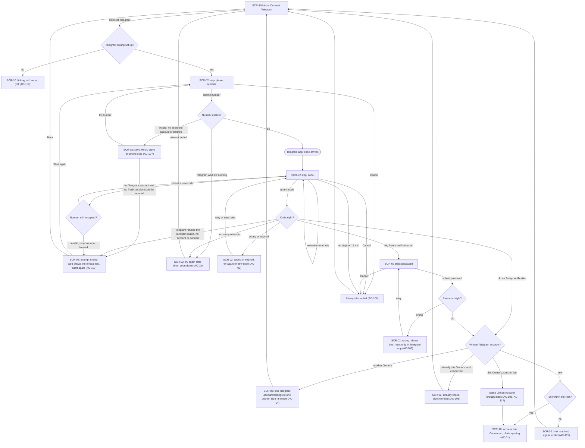
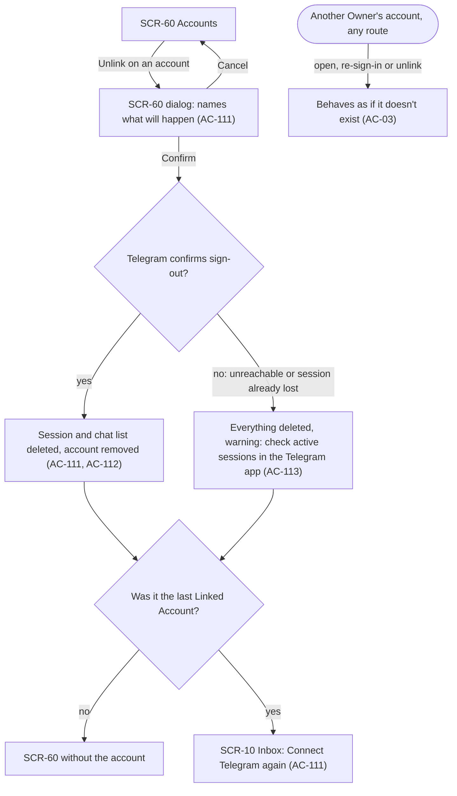
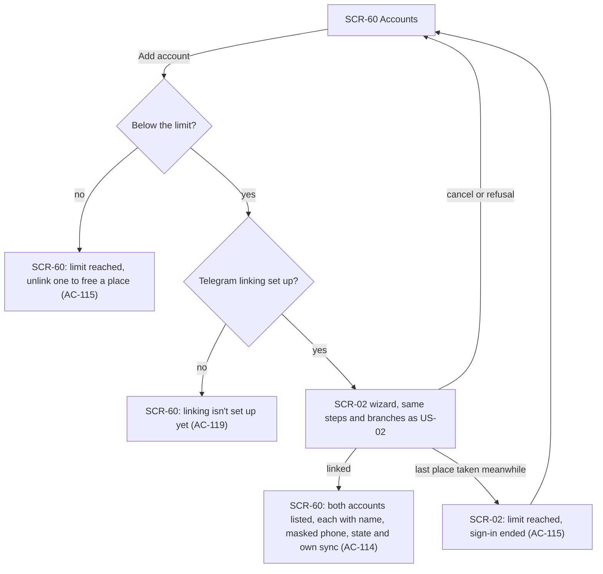
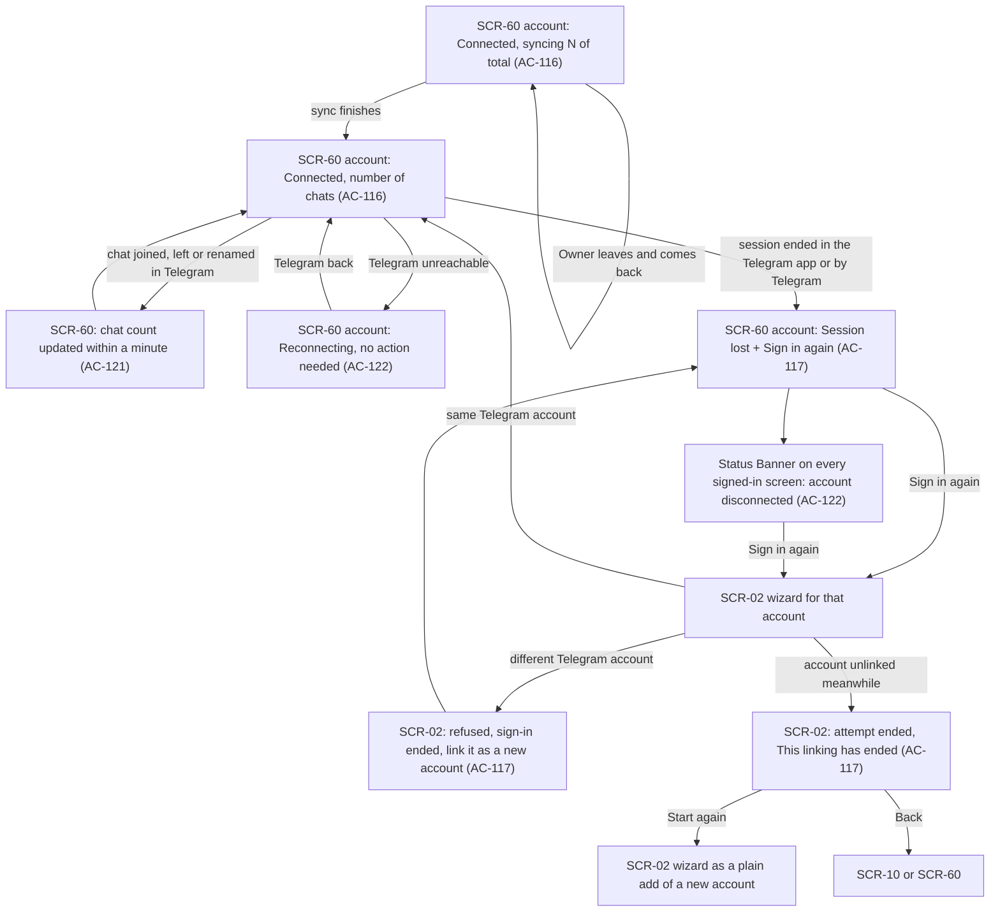
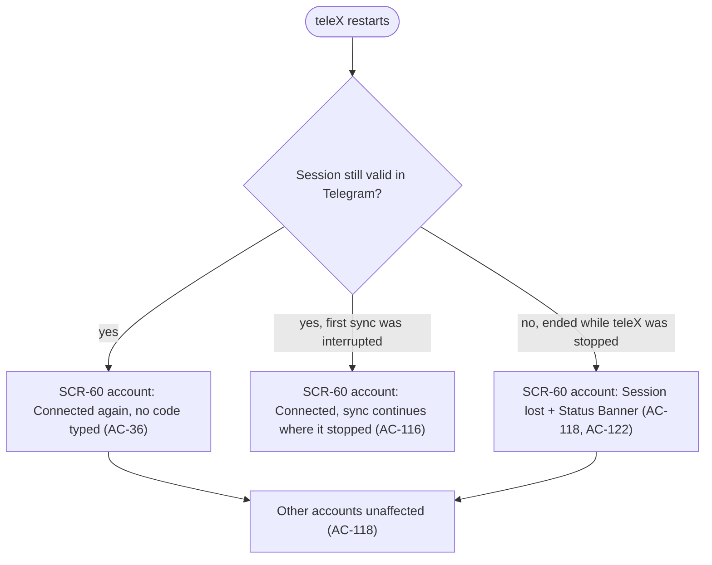
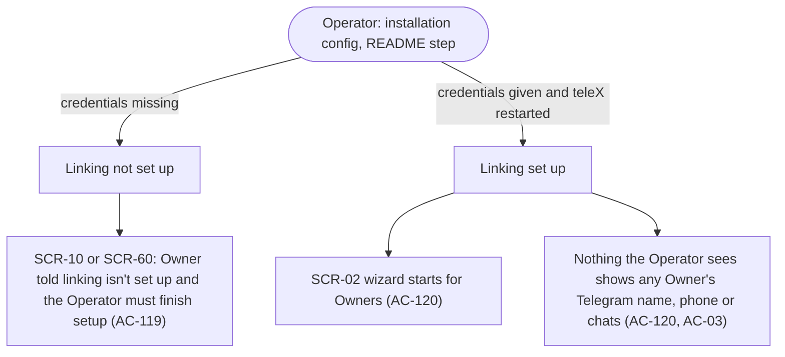

# UX flows — telegram-link

> User flows for every UI-touching §4 user story, produced by `ux-flows` (after `clarify`, before
> `design`) and read by `design` (evidence for the target-surface + UI-architecture decisions),
> `sequences` (UI-driven flows align on SCR ids), `screens` (details every inventory row) and
> `plan-tests` (the e2e-through-UI paths). **Always markdown + mermaid `flowchart`**, whatever the
> design tool — this artifact is flow-altitude, not visual design.

## Platform decisions

- **Posture:** responsive-both — per `docs/docs/design-system/README.md` ("every screen is fully responsive", breakpoints 360 / 768 / 1280) and spec §6 (360 px and 1280 px). No flow branches by device. On a phone the Owner leaves the browser for the Telegram app to read the code, so returning to a reloaded tab must land on the same wizard step (AC-109). `docs/design-system.md` doesn't exist yet.
- **Screen ids:** the product-spec ids are kept: SCR-02 Connect Telegram, SCR-60 Accounts, and SCR-10 Inbox from `platform-skeleton`. No new ids are needed.
- **The wizard is one full page with steps** (phone → code → password), not a dialog. On a phone, a dialog would be lost when the browser reloads the tab after the Owner switches to Telegram. The password step appears only for accounts with two-step verification. There is at most one open attempt per Owner, and SCR-02 always opens at that attempt's current step (AC-109).
- **Where the wizard returns:** an attempt started from the Inbox's "Connect Telegram" step returns to SCR-10. One started from SCR-60 ("Add account" or "Sign in again") returns to SCR-60. On SCR-10, the "Connect Telegram" step is replaced by a short line per Linked Account with its state and sync progress, which links to SCR-60. The chat list itself is E04.
- **Refusals that come before the wizard stay in place.** "Linking isn't set up" (AC-119) and "limit reached" (AC-115) show on the screen where the Owner chose the action, and SCR-02 doesn't open.
- **Focus follows the card on SCR-02.** When a step is replaced by an outcome card (ended, wait, refusal) or the load-failed state, focus moves to that card's heading. When the Owner leaves the card ("Start again" on the ended or wait card, "Try again" on load-failed), focus moves to the heading of the step that replaces it, so the new step is announced. On the wait card, "Back" and "Start again" are separate buttons: at 0:00, if "Back" had focus, focus moves to the card heading instead of landing on "Start again" (AC-02, AC-107, AC-109).
- **The unlink confirmation is a dialog on SCR-60** (the ordinary C-33 variant, per the spec §1 deviation), not a separate page.
- **The Status Banner is not a screen.** "Account disconnected" is a condition of the E06 Status Banner mechanism shown on every signed-in screen. It is drawn as a node without an SCR id, and its "Sign in again" action opens SCR-02 for that account.
- **Outside teleX:** the Telegram app (where the code arrives and where sessions can be ended) and the installation config (the Operator's README step) are external nodes without an SCR id.
- **Design input (not decided here):** the Accounts page shows sync progress, "Reconnecting" and "Session lost" while it is open (AC-116, AC-121, AC-122), and the Status Banner appears on any screen. Both need state changes to reach an open page without a reload. `design` decides how. Where SCR-60 sits in the E06 navigation (under Settings) is for E06 and `screens`.

## Screen inventory

| ID | Screen | Purpose | Entry | Exit |
|---|---|---|---|---|
| SCR-02 | Connect Telegram | One page with steps: phone number → code → two-step verification password. It shows the code, password and number errors, the "Try again after" wait, the "already linked" and "linked to another Owner" refusals, and Cancel | "Connect Telegram" on SCR-10; "Add account" or "Sign in again" on SCR-60; "Sign in again" in the Status Banner; a reload or another tab while an attempt is open | SCR-10 or SCR-60 (whichever started the attempt) after a successful link, a cancel, or a refusal that ends the attempt |
| SCR-10 | Inbox | The empty Inbox from E01. With no Linked Account it shows the single step "Connect Telegram". With accounts, it shows one state and sync line per account, linking to SCR-60 | every sign-in without another destination; the end of an attempt started here; the last unlink (AC-111) | SCR-02 via "Connect Telegram"; SCR-60 via an account line |
| SCR-60 | Accounts | Lists the Owner's Linked Accounts: Telegram name, masked phone, state (Connected with sync progress or chat count, Reconnecting, Session lost). It offers "Add account", "Sign in again" and Unlink with its confirmation dialog, and shows the "limit reached" and "linking isn't set up" refusals | the E06 navigation; an account line on SCR-10; the end of an attempt started here | SCR-02 via "Add account" or "Sign in again"; stays on SCR-60 after an unlink; SCR-10 after the last unlink |

## Flows

### Flow: US-02 — Link a Telegram account

The Owner chooses "Connect Telegram" on the empty Inbox. If the Operator hasn't set up linking, the Inbox says so and the wizard doesn't open (AC-119). Otherwise SCR-02 asks for the phone number. If the number is invalid, has no Telegram account or is banned, the wizard says which and stays on that step; the exception is a number with no Telegram account when no fresh Telegram session can be opened, which ends the attempt, and the ended card shows that same text with "Start again". A refusal of the number that Telegram gives later, when the code is checked or a new code is asked for, ends the attempt the same way, because the Telegram session behind it is closed (AC-107). If Telegram's wait from earlier attempts on this number is still running, it shows when to try again. Next, the code arrives in the Telegram app and the Owner types it. A wrong or expired code can be retried or a new one requested. When Telegram limits the attempts, the attempt ends with a "try again after" countdown. With two-step verification on, a password step follows: a wrong password shows the hint and explains that a reset happens only in the Telegram app. Once the sign-in succeeds, teleX checks whose Telegram account it is. Another Owner's account is refused with the one-owner rule, and the extra sign-in is ended. If the account is already this Owner's and connected, the wizard says "already linked" and ends the sign-in. If it is this Owner's and has lost its session, the same Linked Account comes back. A new account is checked against the limit again: if the last place was taken meanwhile, the sign-in is ended. Otherwise the Owner lands on the Inbox, where the "Connect Telegram" step has become the account's line with "Connected" and sync progress. Cancel, or 15 minutes without a step, discards the attempt. A reload or another tab continues the open attempt at its step (shown on the code step, where it happens most).

### Flow: US-03 — Unlink an account for good

On the Accounts page the Owner chooses Unlink on an account, and a dialog names what will happen. Cancel returns to the page. On confirm, teleX signs out of that Telegram account and deletes its session and chat list. If Telegram can't confirm the sign-out (it is unreachable, or the session was already lost), everything is still deleted and the Owner is warned to check active sessions in the Telegram app. Either way the account disappears from every list, also after a restart (AC-112). If it was the last Linked Account, the Owner goes to the Inbox, which shows "Connect Telegram" again; otherwise they stay on the Accounts page. Any attempt to reach another Owner's account or its chats, by any route, behaves as if it doesn't exist.

### Flow: US-50 — Link several accounts

From the Accounts page the Owner chooses "Add account". If they are at the limit (lost-session accounts count), the page says so and suggests unlinking one, and the wizard doesn't open. If linking isn't set up, the page says that instead. Otherwise the wizard runs exactly as in US-02, and on success the Owner returns to the Accounts page, which lists both accounts, each syncing its own chat list. If another attempt took the last place in the meantime, the wizard ends the sign-in and shows the limit. Cancel or any refusal returns to the Accounts page.

### Flow: US-51 — Know each account's state

Right after linking, the account is already "Connected" and shows its sync progress as chats synced out of the total (archived chats included). The Owner can leave and come back without stopping the sync, and at the end the account shows its number of chats. Later changes in Telegram (a joined, left or renamed chat) update that number within a minute. If Telegram can't be reached, the account shows "Reconnecting" and recovers by itself, with no banner and nothing for the Owner to do. When Telegram confirms the session has ended, the account shows "Session lost" with "Sign in again", and every signed-in screen shows the "account disconnected" Status Banner. "Sign in again", from the page or from the banner, opens the wizard for that account. The same Telegram account brings the account back with everything attached, and the banner goes away. A different account is refused, its sign-in is ended, and the Owner is told to link it as a new account (or sees the one-owner rule if it belongs to someone else). If the account was unlinked while the wizard ran (for example in another tab), the sign-in is ended and the card says "This linking has ended"; "Start again" then begins a plain add of a new account, never a refusal for a mismatch.

### Flow: US-52 — Stay connected across restarts

After a restart, every Linked Account with a valid session is connected again without the Owner typing a code. An account whose first sync was cut off continues the sync from where it stopped, without restarting the count. An account whose session Telegram ended while teleX was stopped shows "Session lost" with the Status Banner, and the other accounts are unaffected. The Owner has no step in this flow: they only see the resulting states on SCR-60 and SCR-10.

### Flow: US-53 — Enable Telegram linking

The Operator has no screen in E02: they follow the README step that gives the installation its Telegram app credentials. Until they do, an Owner who chooses "Connect Telegram" or "Add account" is told that linking isn't set up yet and that the Operator has to finish the setup. Once the credentials are in place and teleX restarts, the wizard opens normally. Nothing the Operator can see, in the config or anywhere else, shows any Owner's Telegram data.

## AC coverage

| AC | Shown by | Notes |
|---|---|---|
| AC-01 | Flow US-02 → OK | Password step only on the 2-step branch |
| AC-02 | Flow US-02 → CODEE, WAIT | WAIT ends the attempt; the same number before the time shows the remaining wait |
| AC-106 | Flow US-02 → PWE | |
| AC-107 | Flow US-02 → PHE, REFE | REFE is reached from the phone step (no fresh session), from the code step and from Send a new code; the card shows the refusal's own text. At the code step every number refusal (invalid, no account, banned) ends the attempt, as on Send a new code; none of them is a "Telegram didn't answer" |
| AC-04 | Flow US-02 → OTH | Also reachable from US-51 REF when the other account is another Owner's |
| AC-108 | Flow US-02 → DUP, REST | |
| AC-109 | Flow US-02 → CAN, reload loop on CODE | The 15-min inactivity applies at every step; drawn once |
| AC-110 | N/A: no screen change | The Linked Account simply stays on SCR-60 and SCR-10 after sign-out and the next sign-in. A Sign-in Session ending mid-wizard lands on the E01 "Session ended" page (SCR-92) and the attempt is discarded; the UI half is the Vitest cases in `ConnectTelegramPage.test.tsx` ("SCR-02 session end (AC-110)"), which drive SCR-02 to SCR-92 on a 401 `session-ended` at the attempt load and at a step submit; the backend halves are `LinkingAttemptIT` ("a Sign-in Session that ends mid-wizard discards the attempt…") and `LinkedAccountsApiIT` ("the accounts are still listed after sign-out and a new sign-in"). There is no e2e for it |
| AC-03 | Flow US-03 → NF; Flow US-53 → PRIV | |
| AC-111 | Flow US-03 → DLG, DEL, LAST | |
| AC-112 | Flow US-03 → DEL | The announcement to other parts of teleX is not a UI step; the restart half is a `sequences` concern |
| AC-113 | Flow US-03 → DELW | |
| AC-114 | Flow US-50 → BOTH | |
| AC-115 | Flow US-50 → LIMR, LIMR2; Flow US-02 → LIMR | Checked at the start and at the end |
| AC-116 | Flow US-51 → ACC, DONE; Flow US-52 → RES | |
| AC-117 | Flow US-51 → LOST, WIZ, REF, GONE | GONE is the race where the account was unlinked while the wizard ran; Start again is a plain add |
| AC-121 | Flow US-51 → UPD | |
| AC-122 | Flow US-51 → REC, BAN | |
| AC-36 | Flow US-52 → CON | |
| AC-118 | Flow US-52 → LOST, OTHER | |
| AC-119 | Flow US-02 → NS; Flow US-50 → NS; Flow US-53 → O1 | |
| AC-120 | Flow US-53 → O2, PRIV | |
