# Roadmap — teleX

> **A decomposition, not a promise.** The overall idea broken into incremental steps: what each
> step is, where it comes from, how big it is — or that nobody has looked at it yet — and in which
> order, and parallel lanes, we walk them. **No dates** (except shipped history), **no scores** —
> order is the prioritization. The *solution* for any step lives in its `docs/features/<slug>/`
> spec, not here.

## Destination

An Owner signs in without a password, links their own Telegram, and runs consented, scoped and budgeted AI helpers inside it that deliver the morning digest, catch urgent messages by meaning and turn promises into tasks — every incoming message is triaged cheaply by Jev before any LLM wakes, every visible action is approved in the web or the Owner Bot with undo, and every action is audited.

## Steps

Step ids 1–29 are the epic numbers of `docs/docs/02-epics.md` (E01–E29); 0 is the greenfield skeleton; 30–32 are fog. MVP = steps 0–26 (gate G3); 27–29 are stretch.

| # | Step | Source | Size | Status |
|---|---|---|:---:|---|
| 0 | Skeleton — 13 empty Modulith modules + `verify()`, CI, Compose with Postgres + pgvector, Flyway baseline with rollback, React build served by Spring ([`_scaffold`](features/_scaffold/)) | `docs/architecture-map.md` §Constraints & known tech-debt | S | shipped |
| 1 | Platform skeleton — Owner signs up and signs in with magic link + passkey, one-command README ([`platform-skeleton`](features/platform-skeleton/)) | `docs/docs/02-epics.md` §E01 · platform-skeleton | M | shipped |
| 2 | Telegram link — Owner links (and fully unlinks) Telegram accounts; sessions survive restart | `docs/docs/02-epics.md` §E02 · telegram-link | M | idea |
| 3 | AI consent — Owner grants, sees and revokes consent before any text reaches AI | `docs/docs/02-epics.md` §E03 · ai-consent | S | idea |
| 4 | Chat reading — chat list with folders, history with media, live updates in the web | `docs/docs/02-epics.md` §E04 · chat-reading | M | idea |
| 5 | Chat sending — reply, quote-reply and forward from the web with delivery status | `docs/docs/02-epics.md` §E05 · chat-sending | S | idea |
| 6 | App shell — responsive navigation, global status bands, design system, phone + desktop Playwright profiles | `docs/docs/02-epics.md` §E06 · app-shell-responsive | S | idea |
| 7 | Semantic search — find a message by meaning, with filters | `docs/docs/02-epics.md` §E07 · semantic-search | S | idea |
| 8 | Channel scope — Channel Sets (manual + from folders) and the private zone | `docs/docs/02-epics.md` §E08 · channel-scope | S | idea |
| 9 | Agent builder — create an agent from a template, pause / clone / delete / export / import | `docs/docs/02-epics.md` §E09 · agent-builder | M | idea |
| 10 | Model profiles — OpenRouter catalog with prices, profiles, per-slot fallback | `docs/docs/02-epics.md` §E10 · model-profiles | S | idea |
| 11 | Keyword triggers — first live agent: keyword → note in Inbox, no AI call | `docs/docs/02-epics.md` §E11 · keyword-triggers | S | idea |
| 12 | Semantic triggers — plain-language condition scored by Jev, with sensitivity and degradation | `docs/docs/02-epics.md` §E12 · semantic-triggers | M | idea |
| 13 | Review queue and «Why?» — doubtful cases go to the human, every decision explained | `docs/docs/02-epics.md` §E13 · review-queue-and-why | S | idea |
| 14 | Agent runtime — Run with tools, Scope checks, run feed and run details with cost | `docs/docs/02-epics.md` §E14 · agent-runtime | M | idea |
| 15 | Multimodal — describe photos, photo as trigger, generate images as drafts | `docs/docs/02-epics.md` §E15 · multimodal | S | idea |
| 16 | Backtest — replay an agent on the last 7 days, cost estimate, dry run | `docs/docs/02-epics.md` §E16 · backtest | S | idea |
| 17 | Owner bot — shared bot, Start binding, notes delivered to the bot | `docs/docs/02-epics.md` §E17 · owner-bot | S | idea |
| 18 | Approvals and undo — drafts approved in web or bot, TTL, 10 s undo, `act` level | `docs/docs/02-epics.md` §E18 · approvals-undo | M | idea |
| 19 | Bot commands — `/ai` one-off runs, inbox summary, pinned counter, quiet hours | `docs/docs/02-epics.md` §E19 · bot-commands | S | idea |
| 20 | Schedules and digest — per-Owner schedule, the morning digest in the bot | `docs/docs/02-epics.md` §E20 · schedules-digest | M | idea |
| 21 | Agent chains — «after another agent» trigger, parent/child runs | `docs/docs/02-epics.md` §E21 · agent-chains | S | idea |
| 22 | User tasks — promises become tasks with deadlines and bot reminders | `docs/docs/02-epics.md` §E22 · user-tasks | S | idea |
| 23 | Kill switch — stop everything from the web or `/ai stop`, resume all or some | `docs/docs/02-epics.md` §E23 · kill-switch | S | idea |
| 24 | Guardrails — inbound manipulation check, outbound check, sensitive data always to Approval | `docs/docs/02-epics.md` §E24 · guardrails | M | idea |
| 25 | Audit log — append-only journal with filters, CSV export, links to runs | `docs/docs/02-epics.md` §E25 · audit-log | S | idea |
| 26 | Operator console — users and quotas, models and system health, content-free spend | `docs/docs/02-epics.md` §E26 · operator-console | S | idea |
| 27 | Cost control — per-run / daily / monthly budgets, spend dashboard, BYOK | `docs/docs/02-epics.md` §E27 · cost-control | M | idea |
| 28 | Trigger evals — precision / recall of a condition on its reference examples | `docs/docs/02-epics.md` §E28 · trigger-evals | S | idea |
| 29 | Metrics overview — start screen with activity, spend, reliability and speed | `docs/docs/02-epics.md` §E29 · metrics-overview | M | idea |
| 30 | Agent memory between Runs → see [Not yet specified](#not-yet-specified) | `docs/docs/01-tech-spec.md` §NFR, ризики, невизначене | fog | idea |
| 31 | Voice messages → see [Not yet specified](#not-yet-specified) | `docs/docs/01-tech-spec.md` §NFR, ризики, невизначене | fog | idea |
| 32 | External MCP tools for agents → see [Not yet specified](#not-yet-specified) | `docs/docs/01-tech-spec.md` §NFR, ризики, невизначене | fog | idea |

## Not yet specified

| Area | What we'd have to learn | Blocks | How it gets sharpened |
|---|---|:---:|---|
| Agent memory between Runs (30) | Whether agents need long-lived memory about Counterparts at all, and how it is bounded (Scope, private zone, retention) | — | Spike with Spring AI chat memory during the «Brain» phase (after Agent runtime) |
| Voice messages (31) | Whether to transcribe via OpenRouter or rely on Telegram Premium transcription, and what that means for triage and consent | — | One experiment on a test account, then a decision |
| External MCP tools (32) | Whether agents get external MCP servers (calendar, Notion), and how Scope and consent extend to them | — | Recon after gate G3, if time remains |

## Out of scope

- Native mobile apps — responsive web only (D-04).
- Calls, secret chats, stories — TDLib supports them, but they are noise for this project.
- Mass mailings and any growth hacking — a direct path to an account ban.
- Agent marketplace between users — only personal and system templates.
- Operator access to chat content or a support mode — hard isolation (D-13).

## Open decisions

| # | Question | Type | Owner | Blocks |
|---|---|:---:|:---:|:---:|
| D1 | Does the TDLib JNI binding build and run on JDK 25, and can `libtdjni` ship in the app's Docker image? | prototype | agent | 2 |
| D2 | Wire the Jev fallback adapter (cheap LLM with structured output) behind the `decision` port, since Jev is early access | task | agent | 12 |
| D3 | Copy the billing decision (Operator key + optional BYOK) into the authored tech spec, replacing its «Тарифікація для multi-user» fog row | task | human | 27 |

## Decisions so far

- Stack: Kotlin + Spring Boot + Spring Modulith, PostgreSQL + pgvector, React + Tabler → [`docs/adr/0001-kotlin-spring-modulith-postgres-react-stack.md`](adr/0001-kotlin-spring-modulith-postgres-react-stack.md)
- One app, TDLib isolated in its own Gradle subproject → [`docs/adr/0002-single-app-with-isolated-tdlib-subproject.md`](adr/0002-single-app-with-isolated-tdlib-subproject.md)
- Spring Data JDBC, Flyway with rollbacks, UUIDv7 ids → [`docs/adr/0003-postgres-jdbc-flyway-uuidv7-persistence.md`](adr/0003-postgres-jdbc-flyway-uuidv7-persistence.md)
- Quartz with JDBC job store for schedules → [`docs/adr/0004-quartz-jdbc-scheduler.md`](adr/0004-quartz-jdbc-scheduler.md)
- Product decisions D-01…D-20 (shared Owner Bot, 10 s undo, draft TTL, `act` after 20 clean approvals, English UI, Tabler, WCAG 2.2 AA, Overview as start screen) → [`docs/docs/03-product-spec.md` §Рішення](docs/03-product-spec.md)
- LLM billing: the Operator's key pays by default; an Owner may connect their own OpenRouter key (BYOK) → [`docs/docs/02-epics.md` §E27 · cost-control](docs/02-epics.md) (feature 4); decided in the roadmap review, pending D3
- MVP first: stretch steps 27–29 walk only after every MVP step (gate G3) → [`docs/docs/02-epics.md` §Огляд](docs/02-epics.md)
- Edges added over the epics doc, each backed by an AC: Semantic search → Channel scope (AC-07), Keyword triggers → Agent runtime (Inbox Note), Semantic triggers → Multimodal (AC-59), App shell → Owner bot (AC-32 band), Bot commands → Kill switch (`/ai` router) → [`docs/docs/02-epics.md`](docs/02-epics.md)

## Dependency graph

```mermaid
flowchart LR
  s0["0 · skeleton"] -->|modules, CI, DB to build into| s1["1 · platform skeleton"]
  s1 -->|Owner account to link to| s2["2 · telegram link"]
  s1 -->|served app + signed-in session| s6["6 · app shell"]
  s1 -->|Owner for custom profiles| s10["10 · model profiles"]
  s1 -->|Owners to put quotas on| s26["26 · operator console"]
  s10 -->|model catalog to enable| s26
  s2 -->|consent step follows link in onboarding| s3["3 · ai consent"]
  s2 -->|Linked Account + TDLib client| s4["4 · chat reading"]
  s2 -->|binding token issued after link| s17["17 · owner bot"]
  s6 -->|global status band mechanism| s17
  s4 -->|chat screen + history| s5["5 · chat sending"]
  s4 -->|stored messages to index| s7["7 · semantic search"]
  s3 -->|index only after consent| s7
  s4 -->|chats and folders for Channel Sets| s8["8 · channel scope"]
  s7 -->|private zone deletes from index, AC-07| s8
  s8 -->|Scope check on enable| s9["9 · agent builder"]
  s3 -->|consent gate on enable| s9
  s9 -->|agents to attach conditions to| s11["11 · keyword triggers"]
  s11 -->|System 1 pipeline to extend| s12["12 · semantic triggers"]
  s12 -->|doubt band feeds the queue| s13["13 · review queue"]
  s9 -->|agent config to run| s14["14 · agent runtime"]
  s10 -->|model profile for the Run| s14
  s11 -->|Inbox Note that add_note writes| s14
  s14 -->|tools + Run cost accounting| s15["15 · multimodal"]
  s12 -->|photo triggers a semantic condition, AC-59| s15
  s12 -->|conditions to replay| s16["16 · backtest"]
  s14 -->|dry run is a full Run| s16
  s14 -->|send tools run inside Runs| s18["18 · approvals + undo"]
  s17 -->|approval buttons in the bot| s18
  s14 -->|/ai starts a Run| s19["19 · bot commands"]
  s17 -->|bound bot + webhook| s19
  s14 -->|digest is an agent Run| s20["20 · schedules + digest"]
  s17 -->|digest delivered to the bot| s20
  s20 -->|chains start from scheduled runs| s21["21 · agent chains"]
  s14 -->|create_user_task tool| s22["22 · user tasks"]
  s17 -->|reminders in the bot| s22
  s14 -->|Runs to stop| s23["23 · kill switch"]
  s17 -->|/ai stop in the bot| s23
  s19 -->|extends the /ai command router| s23
  s14 -->|Run input and output to guard| s24["24 · guardrails"]
  s14 -->|Run actions to log| s25["25 · audit log"]
  s14 -->|per-Run token cost to budget| s27["27 · cost control"]
  s13 -->|reference examples to evaluate| s28["28 · trigger evals"]
  s14 -->|runs to chart| s29["29 · metrics overview"]
  s25 -->|actions on the Owner's behalf| s29
  s27 -->|spend and budget forecast| s29
```

## Execution path

Zones: `telex/<m>` = `backend/app/src/main/kotlin/telex/<m>/`, `pages/<x>` = `frontend/src/pages/<x>/`, `components` = `frontend/src/components/`. At the time of writing no application code exists, so every zone is **(new)** until the Skeleton lands; after that, re-run `/sdd:survey` and this column can drop the markers. Lanes per wave ≤ 3 (`max_parallel_agents`). The Inbox page, the `triage` module and the bot's `/ai` router each appear in at most one lane per wave.

| Wave | Steps | Zone per step (why parallel-safe) | Unlocks |
|:---:|---|---|---|
| 1 | 0 | repo root, `backend/`, `frontend/` (new) | 1 |
| 2 | 1 | `telex/identity`, `telex/web` auth, `pages/auth` (new) | 2, 6, 10 |
| 3 | 2 ∥ 6 ∥ 10 | 2: `telex/telegram` + `backend/telegram-tdlib` + `pages/onboarding` (new) · 6: `components` shell + design-system port + Playwright config (new) · 10: `telex/llm` + `pages/models` (new) | 3, 4, 17, 26 |
| 4 | 3 ∥ 4 | 3: `telex/identity` consent + `pages/onboarding` consent step (new) · 4: `telex/messaging` history + `telex/telegram` read + `pages/chats` (new) | 5, 7 |
| 5 | 5 ∥ 7 ∥ 17 | 5: `telex/messaging` send + `pages/chats` composer (new) · 7: `telex/messaging` search index + `pages/search` (new) · 17: `telex/bot` + onboarding bot step (new) — 17 waits one wave because 3 also edits onboarding | 8; 17 feeds 18–20, 22, 23 once 14 lands |
| 6 | 8 ∥ 26 | 8: `telex/messaging` Channel Sets + private zone + `pages/scope` (new) · 26: `telex/identity` quotas + `pages/operator` (new) | 9 |
| 7 | 9 | `telex/agents` config + templates + `pages/agents` builder (new) | 11 |
| 8 | 11 | `telex/triage` pipeline + `pages/inbox` + builder «when» block (new) | 12, 14 |
| 9 | 12 ∥ 14 | 12: `telex/triage` + `telex/decision` + builder condition editor (new) · 14: `telex/agents` Run + `telex/tools` + `pages/runs` (new) | 13, 15, 16, 18–20, 22–25, 27 |
| 10 | 13 ∥ 25 ∥ 20 | 13: `telex/triage` review + `pages/inbox` Review tab + chat «Why?» panel (new) · 25: `telex/audit` + `pages/audit` (new) · 20: `telex/scheduling` + `telex/bot` digest (new) | 21, 28; 25 feeds 29 once 27 lands |
| 11 | 18 ∥ 16 ∥ 19 | 18: `telex/tasks` Approval + `telex/tools` send + `pages/inbox` Confirm tab + `telex/bot` buttons (new) · 16: builder test panel + triage replay (new) · 19: `telex/bot` `/ai` router (new) | 23 |
| 12 | 24 ∥ 22 ∥ 15 | 24: `telex/decision` guardrails + `pages/inbox` Blocked tab (new) · 22: `telex/tasks` User Task + `pages/tasks` + `telex/bot` reminders (new) · 15: `telex/tools` vision/image + `telex/llm` slots (new) | — |
| 13 | 21 ∥ 23 | 21: `telex/agents` chain trigger + run details (new) · 23: `telex/agents` pause-all + shell header button + `telex/bot` `/ai stop` (new) | — (MVP / G3 complete) |
| 14 | 27 ∥ 28 | 27: `telex/llm` budgets + BYOK + `pages/costs` (new) · 28: `telex/triage` evals + builder evals view (new) | 29 |
| 15 | 29 | `pages/overview` + read-only metrics queries (new) | — |

## Shipped

| Step | Shipped | Link |
|---|---|---|
| 0 | 2026-10-02 | PR `scaffold/skeleton` → `master` (shipped together with step 1; no separate changelog) |
| 1 | 2026-10-02 | [changelog](features/platform-skeleton/_ship/changelog.md) · PR `scaffold/skeleton` → `master` |
